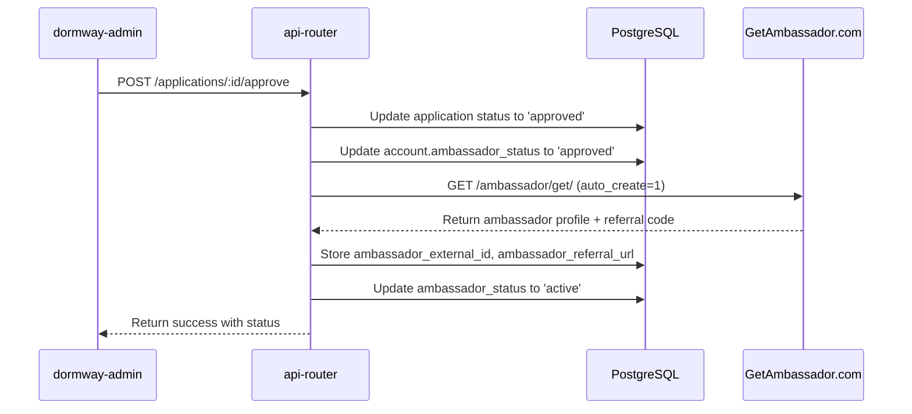

# Ambassador Integration - Implementation Status

<Note>
**Status:** ✅ **IMPLEMENTED** (January 2026)

Core integration completed including automatic ambassador sync to GetAmbassador platform, referral tracking, and commission management.
</Note>

---

## Implementation Overview

### What Was Built

The GetAmbassador.com integration provides automated referral tracking and commission management for campus ambassadors:

**Backend Services:**
- **Ambassador Client** (`services/api-router/src/services/ambassador-client.ts`): Singleton HTTP client for GetAmbassador API
  - Auto-creation support via `auto_create=1` parameter
  - Referral code extraction from memorable URLs
  - Stats synchronization and event tracking
- **Ambassador Service** (`services/api-router/src/services/ambassador.service.ts`): Business logic layer
  - Application approval workflow with automatic GetAmbassador sync
  - Retry sync mechanism for failed synchronizations
  - Campus-based ambassador queries
  - Commission tracking and analytics
- **Admin Routes** (`services/api-router/src/routes/admin/ambassador-routes.ts`): RESTful API endpoints
  - `GET /admin/ambassador/analytics` - Platform-wide metrics
  - `GET /admin/ambassador/applications` - Pending applications
  - `POST /admin/ambassador/applications/:id/approve` - Approve and sync
  - `POST /admin/ambassador/applications/:id/retry-sync` - Retry failed syncs
  - `POST /admin/ambassador/applications/:id/reject` - Reject with reason
  - `GET /admin/ambassador/by-campus/:campusId` - Ambassadors by campus
  - `GET /admin/ambassador/ambassadors` - All ambassadors with stats
  - `GET /admin/ambassador/commissions` - Commission tracking

**Frontend (dormway-admin):**
- **Ambassadors Tab in Campus Detail** (`services/dormway-admin/src/pages/growth/outreach/detail.tsx`):
  - DataGrid showing all ambassadors for a campus
  - Columns: Full Name, Email, Status, Referral ID, Joined date
  - Actions: Email ambassador, View dashboard
- **Ambassador Management Views**:
  - Application review interface
  - Bulk actions for approval/rejection
  - Sync status indicators
  - Commission tracking dashboard

### Integration Flow



**Key Implementation Details:**

1. **Auto-Creation via GET Request**: GetAmbassador's `/ambassador/get/` endpoint creates ambassadors when `auto_create=1` parameter is included (no separate POST needed)

2. **Atomic Approval Process**: Single transaction updates local DB and syncs to GetAmbassador, with status tracking throughout

3. **Error Handling**: Failed syncs stay in "approved" state with error tracking; retry mechanism available

4. **Referral Code Extraction**: Parses memorable_url (`https://blue.mbsy.co/dormway/171571724`) to extract referral code (`171571724`)

### Configuration

**Doppler Secrets:**
```bash
AMBASSADOR_API_USERNAME=dormway_username
AMBASSADOR_API_KEY=your_api_key
AMBASSADOR_CAMPAIGN_ID=your_campaign_id
AMBASSADOR_API_BASE_URL=https://api.getambassador.com
```

**Database Schema:**
```sql
-- accounts table columns for ambassador tracking
ambassador_status TEXT CHECK (ambassador_status IN ('none', 'pending', 'approved', 'active', 'rejected'))
ambassador_external_id TEXT  -- Platform ID from GetAmbassador
ambassador_referral_url TEXT -- Memorable URL for sharing
ambassador_approved_at TIMESTAMPTZ
ambassador_sync_status TEXT CHECK (ambassador_sync_status IN ('pending', 'synced', 'error'))
ambassador_sync_error TEXT
ambassador_last_sync_at TIMESTAMPTZ
```

### API Endpoints Reference

<AccordionGroup>
  <Accordion title="GET /admin/ambassador/analytics" icon="chart-simple">
    **Purpose:** Get platform-wide ambassador analytics

    **Response:**
    ```json
    {
      "success": true,
      "data": {
        "totalAmbassadors": 42,
        "totalPendingApplications": 8,
        "totalReferrals": 215,
        "totalPaidCommission": 107500,  // cents
        "totalPendingCommission": 25000, // cents
        "conversionRate": 0.35
      }
    }
    ```
  </Accordion>

  <Accordion title="POST /admin/ambassador/applications/:id/approve" icon="check">
    **Purpose:** Approve ambassador application and sync to GetAmbassador

    **Request:** `POST /admin/ambassador/applications/abc123/approve`

    **Process:**
    1. Validates application exists and is pending
    2. Updates application status to 'approved'
    3. Updates account.ambassador_status to 'approved'
    4. Calls GetAmbassador API with `auto_create=1`
    5. Stores external_id and referral_url
    6. Updates status to 'active' on success

    **Response:**
    ```json
    {
      "success": true,
      "data": {
        "status": "active",
        "externalId": "171571724",
        "referralUrl": "https://blue.mbsy.co/dormway/171571724",
        "syncStatus": "synced"
      }
    }
    ```
  </Accordion>

  <Accordion title="POST /admin/ambassador/applications/:id/retry-sync" icon="rotate">
    **Purpose:** Retry syncing approved ambassador to GetAmbassador platform

    **Use Case:** Ambassador stuck in "approved" status due to sync failure

    **Request:** `POST /admin/ambassador/applications/abc123/retry-sync`

    **Response:**
    ```json
    {
      "success": true,
      "data": {
        "status": "active",
        "syncStatus": "synced"
      }
    }
    ```
  </Accordion>

  <Accordion title="GET /admin/ambassador/by-campus/:campusId" icon="building-columns">
    **Purpose:** Get all ambassadors for a specific campus

    **Request:** `GET /admin/ambassador/by-campus/8e6db902-0450-412d-8f74-59f3700d1632?limit=50&offset=0`

    **Query Params:**
    - `limit` (optional): Max results (default: 50, max: 200)
    - `offset` (optional): Pagination offset (default: 0)

    **Response:**
    ```json
    {
      "success": true,
      "data": {
        "ambassadors": [
          {
            "id": "user-abc-123",
            "givenName": "Alex",
            "familyName": "Johnson",
            "email": "alex@umass.edu",
            "status": "active",
            "externalId": "171571724",
            "referralUrl": "https://blue.mbsy.co/dormway/171571724",
            "enrolledAt": "2026-01-15T10:30:00Z",
            "totalReferrals": 12,
            "totalEarnings": 6000  // cents
          }
        ],
        "total": 5
      }
    }
    ```
  </Accordion>
</AccordionGroup>

---

## Original Planning Context
- Goal: use Ambassador for referral tracking for campus ambassadors across web and iOS.
- Waitlist gating: the app uses Clerk allowlist/waitlist (see `services/dormway-lockedin/CLERK_WAITLIST_SETUP.md`). Clerk emits `session.denied` for non-allowed emails; we should capture those with referral/UTM params. Legacy GetWaitlist endpoints still exist for marketing/landing, but primary gating for the app is Clerk.
- Onboarding already accepts `source` and `referrer`; no Ambassador integration or IDs are stored.
- Docs scraped: base URL `https://api.getambassador.com/api/v2/{username}/{token}/json/...`; primary endpoint `/ambassador/get/` (GET, supports `auto_create=1`, metadata, groups); events via `/event/multi_record/`.

## Proposed architecture
- Server-only client in `dormway-platform` (api-router/shared service):
  - Credentials from Doppler: `AMBASSADOR_USERNAME`, `AMBASSADOR_TOKEN`.
  - Helpers: `getOrCreateAmbassador(email, opts)` wraps `/ambassador/get/`; `recordEvents(batch)` wraps `/event/multi_record/`.
  - Retry with backoff + logging; mark sandbox requests when testing (`sandbox=1`).
- Data flow:
  - When a user is marked as a campus ambassador, call `getOrCreateAmbassador` with `auto_create=1`, name, campus metadata in custom fields, and optional `add_to_group_id`.
  - Persist returned IDs/link: `ambassador_uid`, `memorable_url`, `campaign_links` on the user/ambassador profile for dashboards and share links.
  - Referral attribution on inbound:
    - Web: read `amb_uid`/`campaign_uid` params from referral links; store in first-party cookie/localStorage; forward in waitlist/signup requests via existing `referrer`/`source` fields.
    - iOS: capture params via universal link; persist locally; send on signup/onboarding API calls.
    - Clerk waitlist: add webhook for `session.denied` (and `user.created`) to record waitlist attempts with ambassador/UTM params; optionally post to `/ambassador/get/` with `auto_create=0` and `status=prospect` to seed leads.
  - Conversions: enqueue jobs to `/event/multi_record/` on milestones (signup, first schedule import, first paid action) including referred user identifiers + referring ambassador IDs and revenue/points metadata.
  - Webhooks: add verified endpoint for reward/commission updates → update internal rewards ledger, notify ambassador, expose status in dashboard.
- Fraud controls: cap rewards per device/IP/email domain, allow sandbox ambassadors for QA, and optionally manual review before payout.

## API reference (needed fields)
- Auth: path params `{username}/{token}`.
- `/ambassador/get/` (GET): query params include `email` (required), `auto_create`, `first_name`, `last_name`, `status` (`enrolled|prospect|banned|unsubscribed`), `notify` (`none|new_ambassador|campaign_access`), `add_to_group_id` / `set_groups`, address/phone, `custom1–10`, `email_new_ambassador` (default 1), `sandbox` (default 0), `deactivate_new_ambassador` (default 0).
- `/event/multi_record/`: batch events/conversions (use for signup and revenue milestones).

## Work breakdown
1) Add Ambassador client module (config, retries, typed helpers) in `dormway-platform`.
2) Schema/storage: store `ambassador_uid`, `memorable_url`, `campaign_uid` on ambassador users; add referral metadata fields to onboarding record if needed.
3) Attribution capture: front-end (marketing site/waitlist) + mobile deep link handling to pass ambassador params into existing API payloads; Clerk webhook for `session.denied` to persist waitlist attempts with referral data.
4) Event pipeline: queue + worker to post `/event/multi_record/` on milestones; ensure idempotency.
5) Webhook ingestion: verify signature, map to rewards ledger, send notifications.
6) Admin/dashboard surface: show share link, conversion counts, reward status for ambassadors.
7) QA with `sandbox=1`, then production rollout with Doppler secrets + monitoring.

## Open questions
- Precise referral link param schema (`amb_uid`, `campaign_uid`, others?) and whether to keep legacy `referrer` usage as-is.
- Which milestones count for payout (signup vs first paid action vs N actions).
- Grouping strategy in Ambassador (`add_to_group_id` for campuses?).
