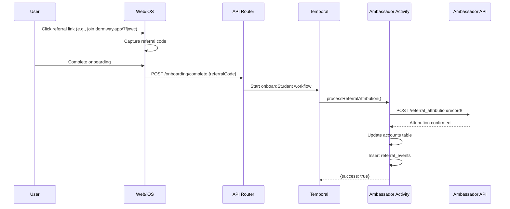

# Ambassador Platform Integration

DormWay integrates with [Ambassador](https://getambassador.com) for referral tracking and attribution. This document covers the current implementation.

## Implementation Status

| Component | Status | Notes |
|-----------|--------|-------|
| Ambassador API Client | ✅ Complete | `services/api-router/src/services/ambassador-client.ts` |
| Engine Activity | ✅ Complete | `services/engine/src/activities/ambassador.activities.ts` |
| Temporal Workflow Integration | ✅ Complete | `onboardStudent` workflow, 16th parameter |
| Web (dormway-lockedin) | ✅ Complete | Passes `referralCode` through onboarding |
| iOS | ✅ Complete | `ReferralService.swift` captures deep links |
| Admin Retrigger | ✅ Complete | Manual referral code input in admin UI |

## Architecture

### Referral Attribution Flow


```mermaid
sequenceDiagram
    participant User
    participant App as Web/iOS
    participant API as API Router
    participant Temporal
    participant Activity as Ambassador Activity
    participant Ambassador as Ambassador API

    User->>App: Click referral link (e.g., join.dormway.app/7fjnwc)
    App->>App: Capture referral code
    User->>App: Complete onboarding
    App->>API: POST /onboarding/complete {referralCode}
    API->>Temporal: Start onboardStudent workflow
    Temporal->>Activity: processReferralAttribution()
    Activity->>Ambassador: POST /referral_attribution/record/
    Ambassador-->>Activity: Attribution confirmed
    Activity->>Activity: Update accounts table
    Activity->>Activity: Insert referral_events
    Activity-->>Temporal: {success: true}
```

### Key Design Decisions

1. **Temporal Workflow**: Referral attribution runs as a Temporal activity inside `onboardStudent`, making it:
   - **Repeatable** - Temporal retries on transient failures
   - **Consistent** - All platforms use the same workflow
   - **Retriggerable** - Admin can retrigger with referral code

2. **Non-blocking Validation**: If Ambassador API validation fails, we still attempt to record the attribution. Ambassador validates the `short_code` during recording.

3. **Idempotent Operations**: All database updates use `COALESCE` to avoid overwriting existing data. Ambassador returns 409 for duplicate attributions (safe to ignore).

## Configuration

### Doppler Secrets (Required)

| Secret | Description |
|--------|-------------|
| `AMBASSADOR_API_BASE_URL` | Base URL (default: `https://getambassador.com`) |
| `AMBASSADOR_API_USERNAME` | API username for path auth |
| `AMBASSADOR_API_KEY` | API key/token for path auth |
| `AMBASSADOR_CAMPAIGN_ID` | Campaign UID for DormWay referral program |

### Config Files

- **API Router**: `services/api-router/src/config/ambassador.ts`
- **Engine**: `services/engine/src/config/ambassador.ts`

## Code Reference

### Files

| File | Purpose |
|------|---------|
| `services/engine/src/activities/ambassador.activities.ts` | Core attribution activity |
| `services/engine/src/config/ambassador.ts` | Engine config |
| `services/api-router/src/services/ambassador-client.ts` | Full Ambassador API client |
| `services/api-router/src/routes/mobile-routes.ts` | Web onboarding endpoint |
| `services/api-router/src/routes/admin/accounts-routes.ts` | Admin retrigger endpoint |
| `ios-clean/.../ReferralService.swift` | iOS deep link capture |

### Database Schema

**accounts table columns:**
- `referred_by` (UUID, FK) - User ID of referrer
- `referral_code_used` (TEXT) - The short code used
- `referred_at` (TIMESTAMPTZ) - When attribution occurred
- `ambassador_external_id` (TEXT) - Ambassador platform ID
- `ambassador_status` (TEXT) - 'active', 'pending', etc.

**referral_events table:**
- `referrer_id` - Ambassador user ID
- `referred_id` - New user ID
- `event_type` - 'onboarding_complete'
- `status` - 'synced' or 'pending'

### Activity: processReferralAttribution

```typescript
// services/engine/src/activities/ambassador.activities.ts
export async function processReferralAttribution(params: {
  userId: string;
  userEmail: string;
  firstName?: string;
  lastName?: string;
  referralCode: string;
  campusName?: string;
}): Promise<{ success: boolean; referrerId?: string; attributionUid?: number; error?: string }>
```

**Steps:**
1. Validate referral code via `/ambassador/all/` (non-blocking)
2. Find referrer in local database
3. Record attribution via `/referral_attribution/record/`
4. Update `accounts` table
5. Insert into `referral_events`

### Workflow Integration

```typescript
// services/engine/src/workflows/studentProcessor.workflow.ts
export async function onboardStudent(
  first_name, last_name, user_id, school_id,
  source?, referrer?, platform?, device?, full_name?,
  campus_name?, year?, major?, housing?, dorm_id?, dorm_name?,
  referral_code?  // 16th parameter - DORM-206
): Promise<{success: boolean, contextId?: string}>
```

## Ambassador API Reference

### Authentication

Ambassador uses path-based authentication:
```
https://api.getambassador.com/api/v2/{username}/{token}/json/{endpoint}/
```

### Endpoints Used

#### GET /ambassador/all/
Lookup ambassador by short code:
```typescript
params: { short_code: "7fjnwc" }
// Response: { ambassadors: [...] } or { response: { data: { ambassadors: [...] } } }
```

#### POST /referral_attribution/record/
Record referral attribution (parameters as query string):
```typescript
params: {
  short_code: "7fjnwc",      // Identifies the advocate
  customer_email: "user@example.com",
  customer_uid: "uuid",       // Our user ID
  customer_status: "enrolled",
  campaign_uid: "12345",
  first_name: "John",
  last_name: "Doe"
}
// Response: { response: { data: { referral_attribution: { uid, advocate, customer } } } }
```

## Platform-Specific Details

### Web (dormway-lockedin)

Referral codes are captured from URL parameters on landing pages and stored in session. On onboarding completion:

```typescript
// mobile-routes.ts validates with Zod
referralCode: z.string().max(64).regex(/^[A-Za-z0-9_-]*$/).optional()
```

### iOS

`ReferralService.swift` handles:
1. Capturing referral code from universal links (`join.dormway.app/{code}`)
2. Storing in UserDefaults
3. Passing to onboarding API

### Admin Retrigger

Admin UI at `/users` allows retriggering onboarding with optional referral code:
- Queries existing `referral_code_used` from database
- Allows override via text input
- Passes to `onboardStudent` workflow

## Testing

### Test with Referral Code

```bash
# 1. Use a known referral link
https://join.dormway.app/7fjnwc

# 2. Complete onboarding

# 3. Verify in database
SELECT referred_by, referral_code_used, referred_at
FROM accounts WHERE id = 'user-id';

# 4. Check referral_events
SELECT * FROM referral_events
WHERE referred_id = 'user-id' AND event_type = 'onboarding_complete';
```

### Admin Retrigger Test

```bash
curl -X POST "http://localhost:3001/api/admin/accounts/{userId}/retrigger-onboarding" \
  -H "Content-Type: application/json" \
  -H "X-User-Id: admin-id" \
  -H "X-User-Role: admin" \
  -d '{"referralCode": "7fjnwc"}'
```

## Related Documents

- DORM-206-Ambassador-Platform-Integration - Original spec
- [Campus Ambassador Recruitment](/docs/product/go-to-market/campus-ambassador-recruitment) - Go-to-market strategy
- Engine Workflow DAG Analysis - Temporal workflow overview

## Changelog

| Date | Change |
|------|--------|
| 2026-01-21 | Implemented referral attribution in Temporal workflow (DORM-206) |
| 2026-01-19 | Initial draft with proposed architecture |
