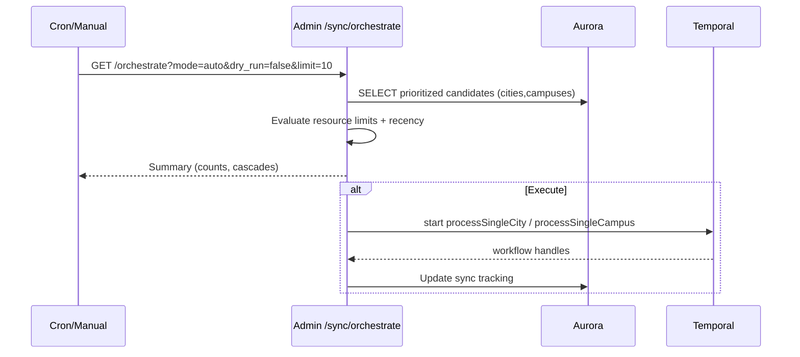
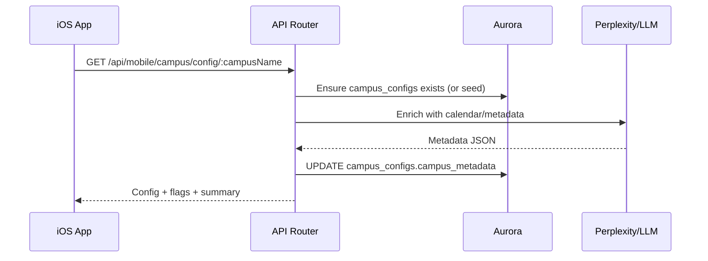
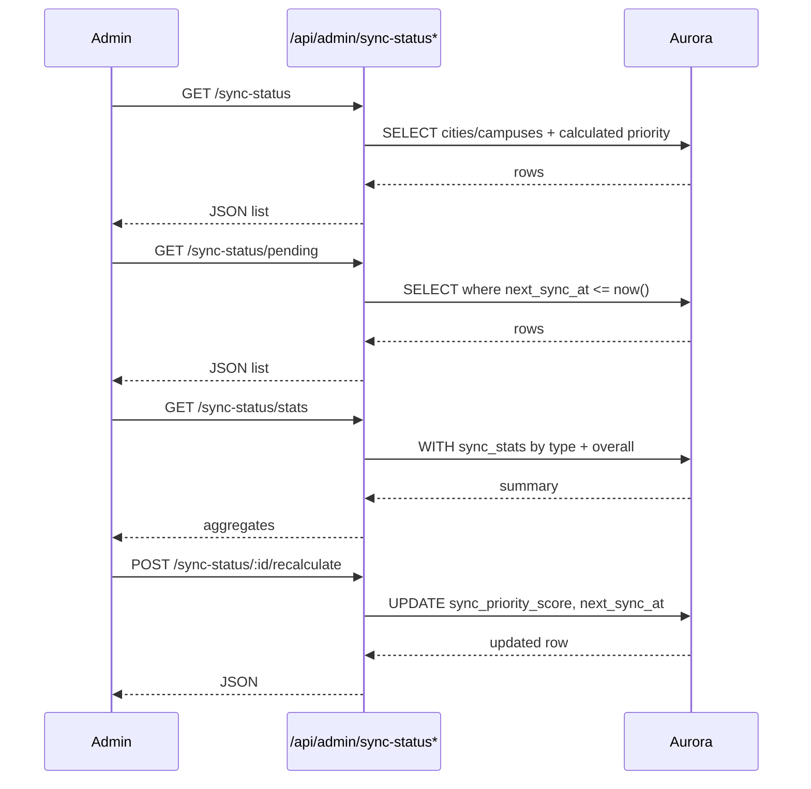
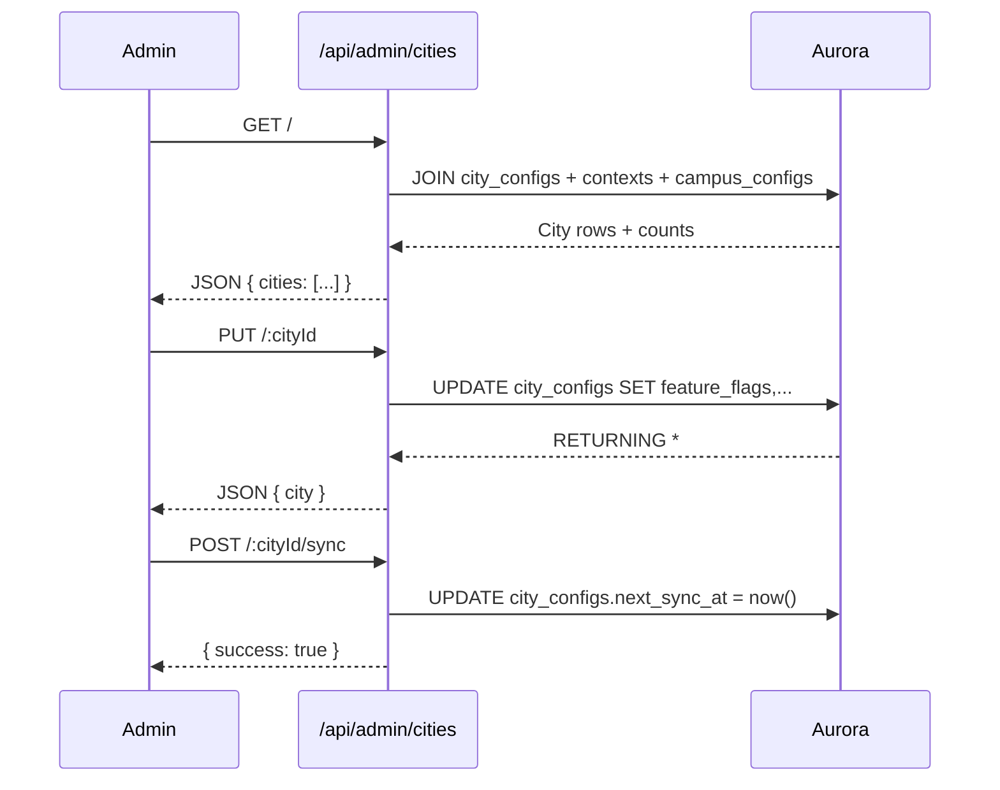
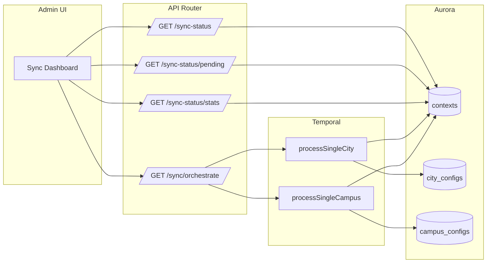
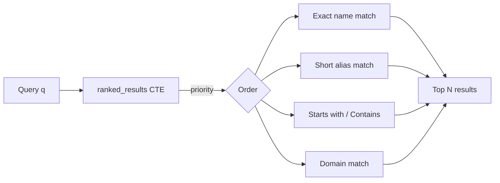

# Campus and Sync Admin APIs

Last updated: August 2025

## Overview
Admin and mobile endpoints enabling multi‑institution onboarding, configuration, and orchestration.

## Endpoints
- Admin
  - `GET /api/admin/sync/orchestrate` – Priority sync for cities/campuses (auto, dry‑run, limits)
  - `GET /api/admin/cities` and related – City registry/config ops
  - `GET /api/admin/sync/status/*` – Sync status visibility
  - `POST/PUT /api/admin/campus-config/*` – Manage `campus_configs`
- Mobile
  - `GET /api/mobile/campus/typeahead` – Campus search for onboarding
  - `GET /api/mobile/campus/config/:campusName` – Campus config snapshot for iOS UI

## Sync Orchestrator (Admin)

## Campus Metadata (Mobile + Admin)

## Sync Status Endpoints (Admin)

## Cities Management (Admin)

## Sync Status Dashboard Overview

## Typeahead (Mobile)

See also: [Multi-Institution Architecture Upgrade](/docs/engineering/technical/implementation-patterns/multi-institution-architecture-upgrade), Engineering/Technical/API/DormWay API Router.
