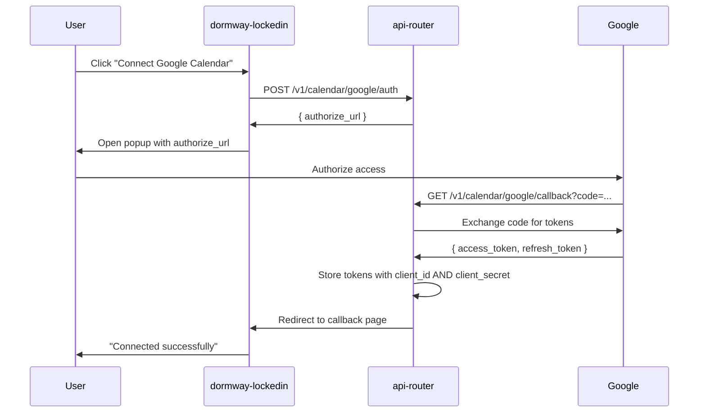
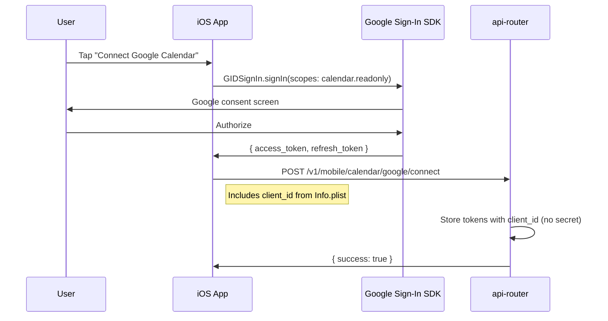

# OAuth Patterns

Reference for OAuth flows used across DormWay integrations.

## Google Calendar OAuth

DormWay supports Google Calendar integration through two different OAuth flows depending on platform.

### Flow Comparison

| Aspect | Web OAuth | Mobile OAuth (iOS) |
|--------|-----------|-------------------|
| Flow Type | Authorization Code (server-side) | PKCE (Proof Key for Code Exchange) |
| Endpoint | `POST /v1/calendar/google/auth` | In-app via Google Sign-In SDK |
| Token Storage | `POST /v1/calendar/google/callback` | `POST /v1/mobile/calendar/google/connect` |
| `client_id` | Stored | Stored |
| `client_secret` | Stored | **Not required** (PKCE doesn't use it) |
| Token Refresh | Uses both `client_id` + `client_secret` | Uses only `client_id` |

### Web OAuth Flow



**Key files:**
- `api-router/src/routes/calendar-routes.ts` - OAuth endpoints
- `api-router/src/services/google-oauth.ts` - OAuth helper
- `api-router/src/services/token-store.ts` - Token persistence

### Mobile OAuth Flow (iOS)



**Key files:**
- `ios-clean/Packages/DWServices/Sources/DWServices/GoogleCalendarService.swift`
- `api-router/src/routes/mobile-routes.ts` - `/v1/mobile/calendar/google/connect`

### Token Refresh

The engine's `fetchGoogleCalendar` activity handles token refresh:

```typescript
// Token refresh request (from engine/src/activities/student.activities.ts)
const requestBody = new URLSearchParams({
  client_id: clientId,
  refresh_token: refreshToken,
  grant_type: 'refresh_token',
});

// client_secret is OPTIONAL - only included for web OAuth
if (clientSecret) {
  requestBody.set('client_secret', clientSecret);
}
```

**Important:** Mobile OAuth (iOS) uses PKCE which doesn't require `client_secret`. The engine correctly handles this by making `client_secret` optional in the refresh flow.

### Credential Storage

Tokens are stored in the `service_credentials` table:

```sql
-- service_credentials.credentials JSONB structure
{
  "access_token": "ya29.xxx...",
  "refresh_token": "1//0xxx...",
  "client_id": "800197751951-xxx.apps.googleusercontent.com",  -- Always present
  "client_secret": "GOCSPX-xxx..."  -- Only for web OAuth, NULL for mobile
}
```

### Troubleshooting

| Error | Cause | Fix |
|-------|-------|-----|
| `unauthorized_client` | Missing or wrong `client_id` in stored credentials | Ensure iOS sends `client_id` when connecting |
| `Missing Google OAuth client_secret` | Legacy code required secret for all flows | Fixed: secret is now optional for mobile |
| Token refresh fails | Wrong client used for refresh | Verify stored `client_id` matches the OAuth client that obtained tokens |

## Canvas OAuth

See Engineering/Technical/API/Canvas/Canvas OAuth Flow for Canvas LMS OAuth patterns.

## Related

- [Calendar Integration System](/docs/engineering/technical/calendar/calendar-integration-system)
- [iOS Calendar Sync System](/docs/engineering/technical/ios/ios-calendar-sync-system)
- [README](/docs/engineering/technical/authentication/readme)
- Product/Features/5 Core User Journeys/Journey 3 - Calendar Connection
