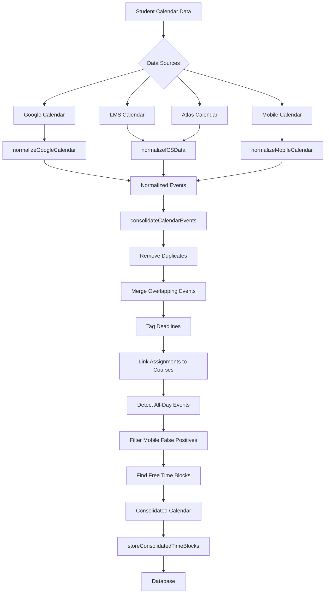

# Calendar Integration System

This document outlines the calendar integration system in the DormWay engine, which is responsible for normalizing, consolidating, and storing calendar data from various sources.

## Overview

The calendar integration system handles the synchronization of calendar data from multiple sources, normalizing it into a consistent format, consolidating overlapping events, and storing the results in a unified calendar database. This enables the application to maintain an up-to-date view of a student's schedule and find available time slots.



## Key Components

### Time Block Model

The system uses a standardized `TimeBlock` interface to represent calendar events:

```typescript
export interface TimeBlock {
  start_time: string; // ISO 8601
  end_time: string;   // ISO 8601
  label: string;
  type: 'class' | 'assignment' | 'assessment' | 'club' | 'meeting' | 'other' | 'holiday' | 'trip' | 'appointment' | 'sports' | 'concert' | 'extracurricular' | 'meal' | 'sleep' | 'travel' | 'system';
  source: 'google' | 'lms' | 'atlas' | 'mobile' | 'system';
  status: 'busy' | 'free';
  metadata?: {
    course_code?: string;
    linked_course?: string;
    location?: string;
    description?: string;
    is_deadline?: boolean;
    original_type?: string;
    uid?: string;
    notes?: string;
    is_free_time?: boolean;
    merged_events?: TimeBlock[];
    attendees?: any[];
    recurrence?: any[];
    all_day?: boolean;
    // Additional metadata fields may be added
  };
}
```

### Calendar Processing Workflow

The calendar processing is handled by the `scheduleProcessor` workflow in `studentProcessor.workflow.ts`:

```typescript
export async function scheduleProcessor(studentId: string, jobId?: string): Promise<TimeBlock[]> {
  try {
    // Fetch all calendar data in parallel
    const [googleCalendar, lmsData, atlasCalendar, mobileCalendar] = await Promise.all([
      studentActivities.fetchGoogleCalendar(studentId),
      studentActivities.fetchStudentLMSData(studentId),
      studentActivities.fetchStudentAtlasCalendar(studentId),
      studentActivities.fetchMobileCalendar(studentId)  
    ]);

    // Process calendar data through normalization and consolidation
    const normalizedEvents = await studentActivities.normalizeCalendars({
      googleCalendar,
      lmsCalendar: lmsData,
      atlasCalendar,
      mobileCalendar,
      studentId
    });
    
    const consolidatedEvents = await studentActivities.consolidateCalendarEvents(normalizedEvents, studentId);

    // Store consolidated events in the master table
    await studentActivities.storeConsolidatedTimeBlocks(studentId, consolidatedEvents);

    return consolidatedEvents;
  } catch (error) {
    // Error handling
    if (jobId) {
      await studentActivities.updateTaskStatus(
        jobId,
        'failed',
        error instanceof Error ? error.message : 'Unknown error'
      );
    }
    logger.error(`Failed to process student context for student ${studentId}:`, { error });
    throw error;
  }
}
```

## Calendar Data Normalization

### Data Sources

The system handles calendar data from four primary sources:

1. **Google Calendar** - Calendar data retrieved using the Google Calendar API via OAuth tokens
2. **LMS Calendar** - Calendar data imported from learning management systems (Canvas, Blackboard, etc.)
3. **Atlas Calendar** - Calendar data imported from the Atlas system
4. **Mobile Calendar** - Calendar data synced from the mobile device's calendar

### Authentication

Google Calendar requires OAuth authentication. DormWay supports two OAuth flows:

| Platform | OAuth Flow | Token Storage |
|----------|------------|---------------|
| Web (dormway-lockedin) | Authorization Code | Stores `client_id` + `client_secret` |
| Mobile (iOS) | PKCE | Stores `client_id` only (no secret required) |

The engine's `fetchGoogleCalendar` activity handles token refresh for both flows, automatically detecting whether `client_secret` is available.

See [OAuth Patterns](/docs/engineering/technical/authentication/oauth-patterns#google-calendar-oauth) for detailed flow diagrams and troubleshooting.

### Normalization Process

The `normalizeCalendars` function handles the normalization of calendar data from multiple sources:

```typescript
async normalizeCalendars(input: {
  googleCalendar?: any;
  lmsCalendar?: any;
  atlasCalendar?: any;
  mobileCalendar?: any;
  studentId: string;
}): Promise<TimeBlock[]>
```

Each source uses a specialized normalization function:

1. **normalizeGoogleCalendar** - Converts Google Calendar events to TimeBlock format
2. **normalizeICSData** - Converts ICS calendar data (from LMS or Atlas) to TimeBlock format
3. **normalizeMobileCalendar** - Converts mobile calendar data to TimeBlock format

## Calendar Consolidation

The `consolidateCalendarEvents` function processes normalized events through several steps:

```typescript
async consolidateCalendarEvents(events: TimeBlock[], studentId: string): Promise<TimeBlock[]>
```

The consolidation process includes:

1. **Remove Duplicates** - Uses `isSameEvent` to filter out duplicate events
2. **Merge Overlapping Events** - Combines events that overlap in time, especially from the same course
3. **Tag Deadlines** - Identifies zero-duration events as deadlines (assignments, exams, etc.)
4. **Link Assignments to Courses** - Associates assignments with their corresponding courses
5. **Detect All-Day Events** - Identifies and tags events that span an entire day
6. **Filter Mobile False Positives** - Removes false positive events from mobile calendar sync
7. **Find Free Time Blocks** - Identifies and marks blocks of free time between busy events

## Storage

The `storeConsolidatedTimeBlocks` function stores the processed events in the database:

```typescript
async storeConsolidatedTimeBlocks(studentId: string, timeBlocks: TimeBlock[]): Promise<void>
```

This function:
1. Deletes all existing time blocks for the user
2. Converts TimeBlock objects to StudentTimeBlock format for database storage
3. Inserts the new time blocks into the database

## Room for Improvement

The current calendar integration system could be enhanced in several ways:

1. **Calendar Event Deduplication** - Improve the algorithm for detecting duplicate events across different sources, especially when event details vary slightly
2. **Recurring Event Handling** - Enhance support for recurring events with exceptions and rule-based recurrence
3. **Timezone Handling** - Improve timezone management for students who travel between timezones
4. **Context-Aware Event Classification** - Leverage AI to better classify and categorize events based on contextual clues
5. **Performance Optimization** - Implement incremental updates to avoid processing the entire calendar on each sync
6. **Conflict Detection** - Add functionality to detect and flag scheduling conflicts
7. **Calendar Provider-Specific Features** - Support more provider-specific calendar features like attendee status, visibility settings, etc.
8. **Enhanced Free Time Detection** - Improve the algorithm for finding and suggesting optimal free time slots based on student preferences
9. **Data Validation and Error Handling** - Implement more robust validation and error handling for calendar data

## Conclusion

The calendar integration system provides a unified view of a student's schedule from multiple sources, enabling the application to offer better scheduling and time management features. It handles the complex task of normalizing, consolidating, and storing calendar data in a consistent format, making it available for other system components.

## 🔗 Related

- [OAuth Patterns](/docs/engineering/technical/authentication/oauth-patterns) - Google Calendar OAuth flows (web vs mobile)
- [iOS Calendar Sync System](/docs/engineering/technical/ios/ios-calendar-sync-system) - iOS-specific calendar implementation
- Product/Features/5 Core User Journeys/Journey 3 - Calendar Connection - User journey documentation
- Engineering/Technical/Calendar/Calendar Normalization System - Event normalization details
