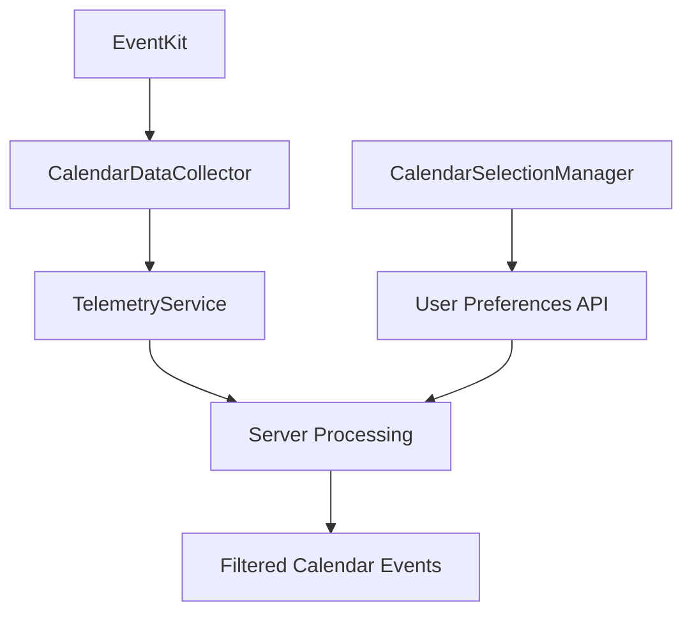

# Calendar Selection Feature

## Overview

The Calendar Selection feature allows users to choose which calendars from their device should be synchronized with DormWay. This gives users fine-grained control over what calendar data is shared and processed by the platform.

## Key Features

- **Account-Based Organization**: Calendars are grouped by their source account (iCloud, Gmail, Exchange, etc.)
- **Bulk Operations**: Enable or disable all calendars from a specific account with one tap
- **Individual Control**: Toggle individual calendars on/off as needed
- **Visual Calendar Identification**: Each calendar displays its color indicator for easy recognition
- **Sync Status**: Shows when preferences were last synchronized with the server

## Architecture

### Data Flow



### Components

#### CalendarSelectionManager
- Fetches available calendars from EventKit
- Maintains account/calendar hierarchy
- Syncs preferences with server via bulk API endpoint
- Located in: `/Core/Services/CalendarSelectionManager.swift`

#### CalendarSelectionView
- SwiftUI view presenting calendars grouped by account
- Provides toggle controls for individual calendars
- Bulk enable/disable functionality per account
- Located in: `/App/Views/Settings/CalendarSelectionView.swift`

#### CalendarDataCollector
- Modified to capture all calendars (except birthdays)
- Includes account information with each event
- Located in: `/Packages/DWDataCollection/Sources/DWDataCollection/Collectors/CalendarDataCollector.swift`

## User Interface

### Navigation
Users can access calendar selection through:
```
Settings → Integrations → Calendar Selection
```

### UI Layout
```
┌─────────────────────────────────┐
│ Select Calendars                │
│                                 │
│ ICLOUD (ICLOUD)            ⋯   │
│ ┌─────────────────────────────┐│
│ │ 🔵 Personal          [✓]   ││
│ │ 🟢 Family            [✓]   ││
│ └─────────────────────────────┘│
│                                 │
│ GMAIL (CALDAV)             ⋯   │
│ ┌─────────────────────────────┐│
│ │ 🔴 Work              [ ]   ││
│ │ 🟡 Birthdays         [✓]   ││
│ └─────────────────────────────┘│
│                                 │
│ ℹ️ Calendar Information         │
│ Selected calendars will be      │
│ included when DormWay analyzes  │
│ your schedule...                │
│                                 │
│ Last synced: 2 minutes ago      │
└─────────────────────────────────┘
```

## Implementation Details

### Account Information Tracking

Each calendar now includes detailed account information:

```swift
struct CalendarInfo: Identifiable, Codable {
    let id: String              // Calendar identifier
    let name: String            // Calendar display name
    let accountId: String       // Source account ID
    let accountName: String     // Account display name
    let accountType: String     // Account type (numeric)
    let color: String?          // Calendar color (hex)
    var isEnabled: Bool         // User preference
}
```

Account types are mapped as follows:
- "0" = Local
- "1" = Exchange
- "2" = CalDAV (includes Google)
- "3" = MobileMe
- "4" = Subscribed
- "5" = Birthdays

### Database Schema

The feature uses a hybrid preference system:

```sql
-- Generic preferences table
CREATE TABLE user_preferences (
    id UUID PRIMARY KEY,
    user_id UUID NOT NULL,
    key TEXT NOT NULL,
    value JSONB NOT NULL,
    created_at TIMESTAMPTZ DEFAULT NOW(),
    updated_at TIMESTAMPTZ DEFAULT NOW(),
    UNIQUE(user_id, key)
);

-- Specialized calendar preferences
CREATE TABLE user_calendar_preferences (
    id UUID PRIMARY KEY,
    user_id UUID NOT NULL,
    calendar_id TEXT NOT NULL,
    calendar_name TEXT NOT NULL,
    calendar_source TEXT NOT NULL,
    account_id TEXT,
    account_name TEXT,
    account_type TEXT,
    is_enabled BOOLEAN DEFAULT true,
    sync_enabled BOOLEAN DEFAULT true,
    notification_enabled BOOLEAN DEFAULT true,
    color TEXT,
    created_at TIMESTAMPTZ DEFAULT NOW(),
    updated_at TIMESTAMPTZ DEFAULT NOW(),
    UNIQUE(user_id, calendar_id)
);
```

### API Endpoints

#### Get Calendar Preferences
```
GET /v1/mobile/calendar/preferences
Authorization: Bearer {jwt_token}

Response:
{
  "preferences": [
    {
      "calendar_id": "xxx",
      "calendar_name": "Personal",
      "is_enabled": true,
      "account_id": "yyy",
      "account_name": "iCloud"
    }
  ]
}
```

#### Bulk Update Preferences
```
POST /v1/mobile/calendar/preferences/bulk
Authorization: Bearer {jwt_token}
Content-Type: application/json

{
  "calendars": [
    {
      "calendar_id": "xxx",
      "calendar_name": "Personal",
      "calendar_source": "ios",
      "account_id": "yyy",
      "account_name": "iCloud",
      "account_type": "2",
      "is_enabled": true
    }
  ]
}
```

## Privacy Considerations

- Calendar data is only collected after explicit user permission
- Users maintain full control over which calendars are shared
- Calendar preferences can be changed at any time
- Disabling a calendar stops future event collection from that source

## Performance

- Calendar preferences are cached locally for offline access
- Bulk sync reduces API calls when updating multiple calendars
- Server-side filtering prevents unnecessary data processing
- Only enabled calendars are queried during event collection

## Future Enhancements

- **Smart Suggestions**: Recommend calendars based on detected patterns
- **Calendar Categories**: Group calendars by type (work, personal, school)
- **Sync Scheduling**: Allow users to set sync frequency per calendar
- **Event Filtering**: Additional filters beyond calendar selection (e.g., event types)

## Troubleshooting

### Common Issues

1. **Calendars Not Appearing**
   - Ensure calendar permissions are granted in iOS Settings
   - Check that EventKit access is authorized
   - Verify the calendar is not hidden in the Calendar app

2. **Sync Failures**
   - Check network connectivity
   - Verify authentication token is valid
   - Ensure server endpoints are accessible

3. **Missing Account Information**
   - Some calendar types may not provide full account details
   - Subscribed calendars may show limited information

### Debug Information

Enable debug logging to see detailed calendar information:
```swift
DWLogger.debug("📅 Fetched \(calendars.count) calendars from EventKit")
```

## Related Documentation

- Data Collection Overview
- Privacy and Permissions
- API Reference

🤖 Generated with [Claude Code](https://claude.ai/code)

Co-Authored-By: Claude `<noreply@anthropic.com>`
