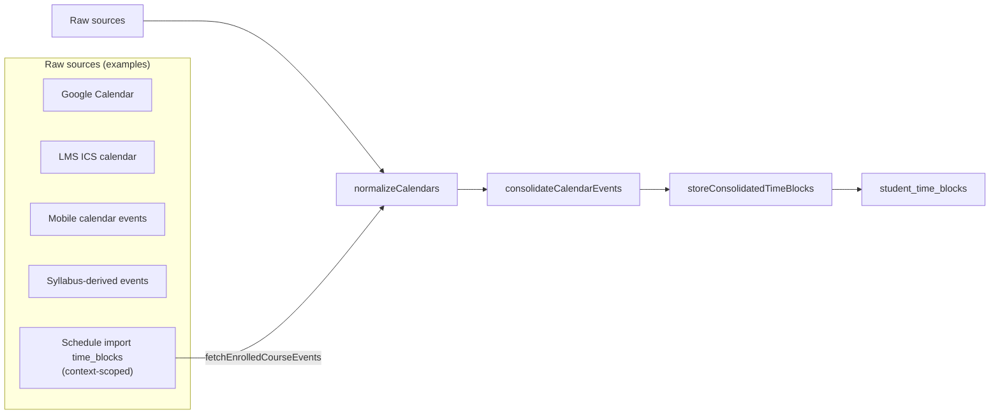
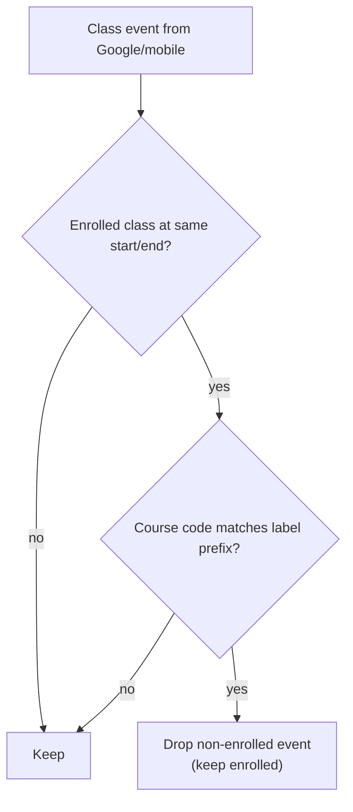

# Schedule Sources & Precedence (Current)

This document explains how DormWay’s “schedule” is assembled today from multiple inputs, and which source wins when they overlap.

It also calls out **current sharp edges** where the reconciliation pipeline can unintentionally delete events from sources it didn’t ingest.

Primary code entry points:

- Calendar reconciliation: `.repos/dormway-platform/services/engine/src/activities/student.activities.ts`
  - `normalizeCalendars`
  - `consolidateCalendarEvents`
  - `storeConsolidatedTimeBlocks`
  - `fetchEnrolledCourseEvents`
- Schedule import storage: `.repos/dormway-platform/services/engine/src/workflows/scheduleImport.workflow.ts`
  - writes course meeting blocks into `time_blocks` (context-scoped)
- Canvas deadlines: `.repos/dormway-platform/services/engine/src/activities/canvas.activities.ts` (`syncCanvasAssignments` → `normalizeAndStoreCalendarData(source='canvas')`)
- Manual course meetings: `.repos/dormway-platform/services/engine/src/activities/courseLifecycle.activities.ts` (`createTimeBlocksForCourse` → inserts `time_blocks` with `source_type='manual_course_add'`)
- Schedule removal: `.repos/dormway-platform/services/engine/src/workflows/scheduleRemoval.workflow.ts`

Related docs:

- [Schedules, Time Blocks, and Reconciliation](/docs/engineering/technical/calendar/schedules-time-blocks-and-reconciliation)
- [scheduleProcessor Workflow Deep Dive (Current)](/docs/engineering/technical/calendar/scheduleprocessor-workflow-deep-dive-current)
- [scheduleImport Workflow Deep Dive (Current)](/docs/engineering/technical/calendar/scheduleimport-workflow-deep-dive-current)
- [Canvas Term Window & Course Filtering Deep Dive (Current)](/docs/engineering/technical/canvas/canvas-term-window-course-filtering-deep-dive-current)
- [Course Drops: Downstream Effects (Current)](/docs/engineering/technical/calendar/course-drops-downstream-effects)

---

## 1) The two storage layers (quick recap)

DormWay has two “schedule-ish” tables:

1) `time_blocks` (generic, context-scoped)
   - used as an input layer, especially for schedule import
2) `student_time_blocks` (student-facing unified timeline)
   - what the dashboard/schedule UI reads

The intended pipeline is:

---

## 2) What inputs `scheduleProcessor` actually ingests today

`normalizeCalendars` can ingest these sources:

- `googleCalendar` → normalized source `"google"`
- `lmsCalendar` (ICS) → normalized source `"lms"`
- `mobileCalendar` → normalized source `"mobile"`
- `syllabusCalendar` → normalized source `"syllabus"`
- `enrolledCourseEvents` (read from `time_blocks` schedule imports + manual course adds) → normalized source `"enrolled"`

Code:

- `.repos/dormway-platform/services/engine/src/activities/student.activities.ts` (`normalizeCalendars`)

Important:

- The reconciliation pass **does not** directly read existing `student_time_blocks` and “carry forward” events from arbitrary other sources; it builds a new event set from the ingested inputs and diffs against existing rows.

---

## 3) Source precedence when two sources describe the same class

The clearest explicit precedence rule is in `consolidateCalendarEvents`:

- If an event is `type='class'` and matches an “enrolled” event at the same `start_time` + `end_time` *and* the extracted course code matches, then the non-enrolled event is dropped.

This primarily means:

- **enrolled schedule-import blocks win over Google/mobile class blocks** when they collide.

Code:

- `.repos/dormway-platform/services/engine/src/activities/student.activities.ts` (`consolidateCalendarEvents`)

Notes:

- “Course code” is extracted from the beginning of the label (e.g. `"EECS 281"`).
- If the user’s Google event label doesn’t start with a recognizable course code, it won’t be deduped.

---

## 4) How schedule import becomes “enrolled” events

Schedule import writes class meeting rows into `time_blocks` with `source_type='schedule_import'` and `context_id=course_context_id`.
Manual course adds write class meeting rows into `time_blocks` with `source_type='manual_course_add'`.

Reconciliation then queries those rows only for **enrolled** courses and normalizes them to source `"enrolled"`:

- `.repos/dormway-platform/services/engine/src/activities/student.activities.ts` (`fetchEnrolledCourseEvents`)
- `.repos/dormway-platform/services/engine/src/activities/student.activities.ts` (`normalizeCalendars` maps schedule_import → enrolled)

This is why schedule import is treated as authoritative: it is “re-labeled” as `source='enrolled'` during the merge step.

---

## 5) Sharp edge: reconciliation can delete events from sources it didn’t ingest

`storeConsolidatedTimeBlocks` does a “full diff”:

1) fetches existing `student_time_blocks` for the user
2) builds a key set for new blocks
3) deletes any existing rows whose key is not in the new set

Code:

- `.repos/dormway-platform/services/engine/src/activities/student.activities.ts` (`storeConsolidatedTimeBlocks`)

Current behavior to be aware of:

- The comparison key is based on `start_time` + `label` (and user), and it is applied across *all existing rows*, regardless of source.
- Any schedule rows present in `student_time_blocks` that are **not re-produced by the current run’s ingested inputs** can be deleted.

This can impact sources that are written to `student_time_blocks` by other pipelines, including:

- Canvas deadlines (`source='canvas'`) written by Canvas sync

If those sources are not also present in the reconciliation inputs, they are candidates for deletion on the next reconciliation run.

---

## 6) Sharp edge: in-memory de-duplication ignores `source`

Before diffing, `storeConsolidatedTimeBlocks` deduplicates new blocks using a key that also ignores `source`.

Implication:

- Two events with the same `start_time` and `label` but different `source` can collapse down to one in-memory, even though the DB uniqueness is intended to be source-aware.

This can cause silent loss of one source’s event when two sources converge on identical labels/times.

---

## 7) Recommended mental model (current behavior)

Treat `scheduleProcessor` as producing a *replacement* “authoritative set” for `student_time_blocks` based on the sources it ingests.

If you want an event source to persist across reconciliation, one of the following must be true:

- it is included in the reconciliation inputs, or
- reconciliation is changed to preserve “foreign” sources, or
- that source writes into `time_blocks` and is pulled into reconciliation explicitly.

---

## 8) Related: dropping courses changes what is considered “enrolled”

Because `fetchEnrolledCourseEvents` reads only `enrolled_in` dependencies, dropping a course can remove schedule-import blocks from the authoritative merge.

See: [Course Drops: Downstream Effects (Current)](/docs/engineering/technical/calendar/course-drops-downstream-effects)
