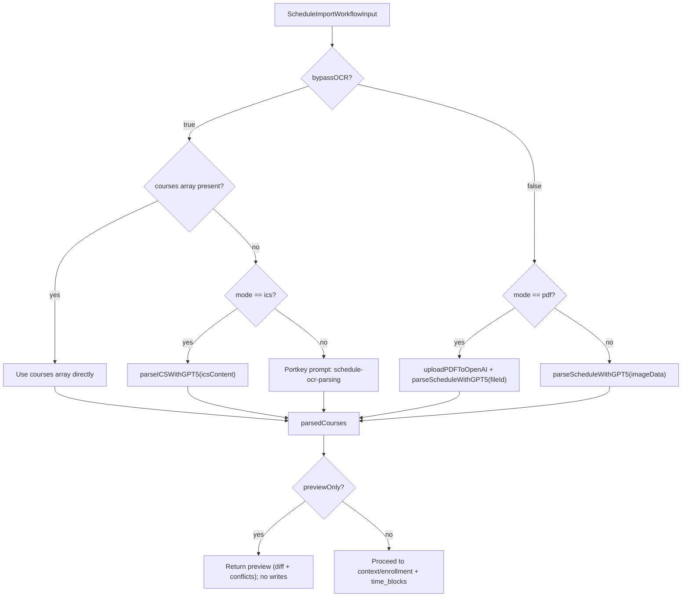
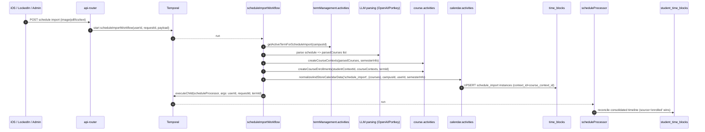
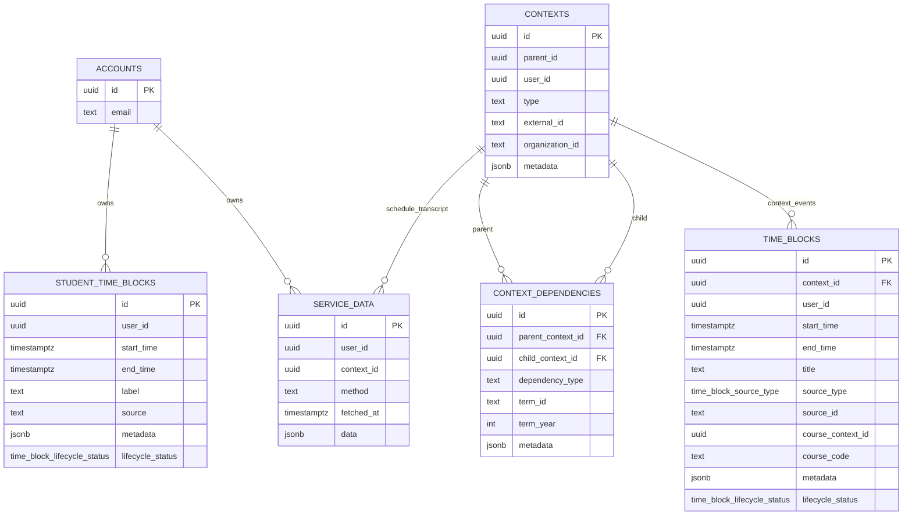

# scheduleImport Workflow Deep Dive (Current)

This document traces how DormWay’s **schedule import** currently works end-to-end: **OCR/PDF/ICS → course contexts + enrollments → `time_blocks` → triggers `scheduleProcessor`**.

Related deep dives:

- [scheduleProcessor Workflow Deep Dive (Current)](/docs/engineering/technical/calendar/scheduleprocessor-workflow-deep-dive-current)
- [Schedules, Time Blocks, and Reconciliation](/docs/engineering/technical/calendar/schedules-time-blocks-and-reconciliation)
- [Schedule Sources & Precedence (Current)](/docs/engineering/technical/calendar/schedule-sources-precedence-current)
- [Course Drops: Downstream Effects (Current)](/docs/engineering/technical/calendar/course-drops-downstream-effects)
- [How DormWay Works](/docs/engineering/architecture/how-dormway-works)

Code entry points:

- Workflow: `.repos/dormway-platform/services/engine/src/workflows/scheduleImport.workflow.ts` (`scheduleImportWorkflow`)
- Course contexts + enrollments: `.repos/dormway-platform/services/engine/src/activities/course.activities.ts` (`createCourseContexts`, `createCourseEnrollments`, `markCourseDropped`)
- Calendar normalization + time_blocks writes: `.repos/dormway-platform/services/engine/src/activities/calendar.activities.ts` (`normalizeAndStoreCalendarData`)
- Manual schedule normalization: `.repos/dormway-platform/services/engine/src/services/calendarNormalization.service.ts` (`normalizeManualCalendarData`)
- Term resolution for imports: `.repos/dormway-platform/services/engine/src/activities/termManagement.activities.ts` (`getActiveTermForScheduleImport`)

---

## 1) What schedule import does (in one sentence)

It parses a schedule (image/PDF/ICS/text), creates or matches **course contexts**, writes/upserts schedule-derived **class meeting instances** into `time_blocks` with `source_type='schedule_import'`, then triggers `scheduleProcessor` to reconcile those into `student_time_blocks`.

---

## 2) Entry points (who starts this workflow)

### 2.1 API Router (mobile + onboarding)

- Async schedule import:
  - `.repos/dormway-platform/services/api-router/src/routes/mobile-routes.ts` (`POST /calendar/import-schedule`)
- Schedule preview (no writes; returns diff + conflicts):
  - `.repos/dormway-platform/services/api-router/src/routes/mobile-routes.ts` (`POST /schedule/preview`)
- Onboarding schedule import (multipart file/text):
  - `.repos/dormway-platform/services/api-router/src/routes/mobile-routes.ts` (`POST /schedule/import`)
- “Upload courses” (bypass OCR; starts the same workflow):
  - `.repos/dormway-platform/services/api-router/src/routes/mobile-routes.ts` (`POST /calendar/upload-courses`)

### 2.2 Clerk webhook (claiming pending schedule uploads)

If a user signs up after a schedule upload happened under a “PLG account”, the Clerk webhook can claim content and trigger schedule import:

- `.repos/dormway-platform/services/api-router/src/routes/webhooks/clerk-routes.ts` (starts `scheduleImportWorkflow` for claimed content)

---

## 3) Input modes and parsing (OCR/PDF/ICS/text)

The workflow supports multiple input modes; the route you use mostly controls which fields are populated.

### 3.1 Modes (workflow input)

`ScheduleImportWorkflowInput` supports:

- `imageData` (base64 image) + `mode='image'` → vision parsing
- `pdfData` (base64 PDF) + `mode='pdf'` → OpenAI Files + Assistants parsing
- `ocrText` + `mode='text'` + `bypassOCR=true` → Portkey prompt parsing
- `ocrText` + `mode='ics'` + `bypassOCR=true` → ICS parsing prompt
- `courses[]` + `bypassOCR=true` → skip parsing and directly use structured courses
- `previewOnly=true` → compute `diff/conflicts`, then exit without DB writes

### 3.2 Parsing decision tree



### 3.3 What actually runs (current)

- Images: `.repos/dormway-platform/services/engine/src/activities/gpt5.activities.ts` (`parseScheduleWithGPT5`) uses **OpenAI Chat Completions** with `model='gpt-4o'` and `response_format: json_object`.
- PDFs: `.repos/dormway-platform/services/engine/src/activities/gpt5.activities.ts`
  - `uploadPDFToOpenAI` uses OpenAI Files API (`purpose='assistants'`)
  - `parseScheduleWithGPT5(fileId)` uses Assistants API path (`parsePDFWithAssistantsAPI`)
- ICS: `.repos/dormway-platform/services/engine/src/activities/icsParser.activities.ts` (`parseICSWithGPT5`)
  - Uses model from SystemConfig key `llm.ics_parser_model` (default `gpt-4o-mini`)
- Text OCR: `.repos/dormway-platform/services/engine/src/workflows/scheduleImport.workflow.ts`
  - Uses Portkey managed prompt `schedule-ocr-parsing` via `generatePromptCompletion`

---

## 4) Term selection for schedule import (and why it matters)

`scheduleImportWorkflow` resolves the “effective term” before writing contexts/enrollments:

- It reads the student’s campus context, then calls:
  - `.repos/dormway-platform/services/engine/src/activities/termManagement.activities.ts` (`getActiveTermForScheduleImport(campusId)`)

Key behavior:

- If `campus_configs.current_term_data.classesEndDate` is in the past, it attempts to use the **next** term from `campus_configs.academic_calendar.terms`.
- If no campus term config exists, it falls back to a month-based term guess (e.g. `fall_2025`).
- Input override: `input.termId` (if present) overrides the auto-detected term.
- Date override: `input.semesterDates.start/end` overrides campus-config dates.

This term ID is used in **two places**:

1) Enrollment metadata (`context_dependencies.term_id/term_year` and `metadata.term_id/term_year`)
2) The child reconciliation call: `executeChild('scheduleProcessor', args: [userId, requestId, effectiveTermId])`

---

## 5) Preview mode: schedule diff + conflict detection

Before making writes (or when `previewOnly=true`), the workflow:

1) Builds summaries from parsed courses (normalized course code + component keys)
2) Pulls the existing “schedule snapshot” from `getTimeBlocks(userId)` (student timeline), filtered to course-ish blocks:
   - sources: `schedule_import`, `enrolled`, and `mobile` only if it has course metadata
3) Computes a diff (`added/removed/updated/unchanged`)
4) Detects time conflicts by parsing schedule strings like `MoWe 04:00 PM - 05:30 PM`

Implementation:

- Diff utilities live inside `.repos/dormway-platform/services/engine/src/workflows/scheduleImport.workflow.ts`:
  - `buildCourseSummariesFromParsedCourses`, `buildCourseSummariesFromTimeBlocks`
  - `computeScheduleDiff`
  - `detectScheduleConflicts`

---

## 6) Course contexts and enrollments (contexts graph writes)

### 6.1 Create or match course contexts

`createCourseContexts(parsedCourses, campusId, campusOrgId, studentContext.id, semesterInfo)`:

- Finds or creates a `contexts` row of `type='course'` (under the campus context)
- Enriches metadata with:
  - course type (`scheduled` / `async` / `hybrid` / `online`)
  - schedule / location / instructor
  - `requiresTimeBlocks` flag
  - term-ish metadata from `semesterInfo`

Implementation:

- `.repos/dormway-platform/services/engine/src/activities/course.activities.ts` (`createCourseContexts`)
- Uses centralized matching: `findOrCreateCourseContext` (alias matching + fuzzy matching + optional Canvas ID dedupe)

### 6.2 Create enrollments (`context_dependencies`)

`createCourseEnrollments(studentContextId, courseContextIds, organizationId, {termId})`:

- Upserts dependencies `enrolled_in` from student context → course contexts.
- Writes term metadata:
  - `metadata.term`, `metadata.term_id`, `metadata.term_year`
  - and (newer) `term_id`, `term_year` columns when available.
- Deduplicates enrollments by **canonical course code** and may:
  - migrate `service_data` records from a duplicate course context → preferred context
  - delete the duplicate dependency
- Respects “dropped” dependencies:
  - if a course is already marked `dependency_type='dropped'`, schedule import will not re-enroll it.

Implementation:

- `.repos/dormway-platform/services/engine/src/activities/course.activities.ts` (`createCourseEnrollments`)

### 6.3 Course removals (diff-driven)

If the diff detects removed courses and they have `contextIds`, the workflow calls:

- `.repos/dormway-platform/services/engine/src/activities/course.activities.ts` (`markCourseDropped`)

This updates the dependency type to `dropped` (from `enrolled_in` or `interested_in`), with metadata including `request_id` and `dropped_source='schedule_import_diff'`.

---

## 7) Writing schedule import events to `time_blocks`

### 7.1 High-level intent

Schedule import writes “authoritative class meetings” to `time_blocks` as `source_type='schedule_import'` under each **course context**. These are then consumed by reconciliation to become `student_time_blocks` with `source='enrolled'`.

### 7.2 Normalization shape

The workflow converts `parsedCourses` into `calendarData = { courses: calendarCourses }` and calls:

- `.repos/dormway-platform/services/engine/src/activities/calendar.activities.ts`:
  - `normalizeAndStoreCalendarData('schedule_import', calendarData, campusId, userId, options)`

Key options used:

- `expandRecurring: true` (schedule import uses deterministic weekly expansion)
- `deduplicateEvents: true`
- `clearExisting: false`
- `semesterInfo: { startDate, endDate, semester, year }`
- `devTag: schedimp:<suffix>` (stored into time_blocks metadata)

### 7.3 Deterministic weekly expansion (important for stable upserts)

Schedule import normalization produces recurring meeting “templates”, then expands them into per-instance events with stable IDs:

- `.repos/dormway-platform/services/engine/src/activities/calendar.activities.ts` (`manualWeeklyExpansion`)

It sets:

- `source_id = <base>_mw_<BYDAY>_<startTimestamp>`

This is what makes per-instance upserts stable across repeated imports.

### 7.4 time_blocks mapping (where rows land)

When source is `schedule_import` and both `userId` and `contextId` are present:

- rows are written to `time_blocks` (context-scoped)
- `student_time_blocks` is **not** mirrored from schedule import anymore (we rely on reconciliation)

Implementation:

- `.repos/dormway-platform/services/engine/src/activities/calendar.activities.ts` (branch `if ((source === 'schedule_import' || source === 'ics_lms') && userId && contextId)`)

Mapping details:

- `time_blocks.context_id = event.course_context_id || campusId`
- `time_blocks.source_type = 'schedule_import'`
- `time_blocks.source_id = <stable instance id>`
- `time_blocks.course_context_id` is set (and used by reconciliation)
- `time_blocks.metadata` includes:
  - `campus_id` (the campus context id)
  - `timezone`
  - `import_request_id`
  - `transcript_id`

### 7.5 Missing-event cleanup behavior (what gets deleted vs not)

After storing, the calendar activity calls `markMissingEventsAsDeleted(source, currentEventIds, contextId, userId, syncToken)` which, in the Aurora implementation, **deletes** `time_blocks` rows for that source that are not present in the current import.

Implementation:

- Engine activity call: `.repos/dormway-platform/services/engine/src/activities/calendar.activities.ts`
- Aurora behavior: `.repos/dormway-platform/services/engine/src/services/auroraDb.ts` (`markMissingEventsAsDeleted`)

Important nuance:

- The delete query uses `(user_id = $userId OR context_id = $contextId)` with `contextId = campusId`.
- Schedule import `time_blocks` rows are typically stored with:
  - `user_id = NULL` (context-scoped)
  - `context_id = <course_context_id>`
- Therefore, cleanup only affects schedule_import rows stored at the campus context (fallback), not the common “per course context” rows.

Practically:

- Removed courses are handled primarily by **dropping the enrollment dependency** (so reconciliation stops pulling them), not by deleting historical `time_blocks`.

---

## 8) Triggering reconciliation (`scheduleProcessor` child)

At the end of a non-preview import, the workflow triggers:

```ts
executeChild('scheduleProcessor', args: [userId, requestId, effectiveTermId])
```

Implementation:

- `.repos/dormway-platform/services/engine/src/workflows/scheduleImport.workflow.ts`

This is best-effort: reconciliation errors are logged, but the schedule import still returns success.



---

## 9) Progress updates, analytics, and flags

During the workflow, `sendProgressUpdate` publishes progress payloads on:

- `channel = user:<userId>:updates`
- `type = schedule_import_progress`

On success, it tracks:

- server-side event `schedule_synced` (includes counts + conflicts + transcript id)
- user identify trait `schedule_imported=true`
- setup flag: `schedule_uploaded=true`

On failure, it tracks:

- user event `schedule_import_failed` with error metadata

Implementation:

- Workflow: `.repos/dormway-platform/services/engine/src/workflows/scheduleImport.workflow.ts`

---

## 10) Minimal ERD for schedule import



---

## 11) Practical implications (what to expect in the UI)

- Until `scheduleProcessor` runs successfully, schedule import events exist only in `time_blocks`, not in `student_time_blocks` → schedule/timeline UIs that read `student_time_blocks` can appear unchanged.
- Once reconciliation runs, “enrolled course meetings” (schedule import) typically dominate/suppress duplicate class events from other sources (Google/mobile) per consolidation rules.
  - See [scheduleProcessor Workflow Deep Dive (Current)](/docs/engineering/technical/calendar/scheduleprocessor-workflow-deep-dive-current)
