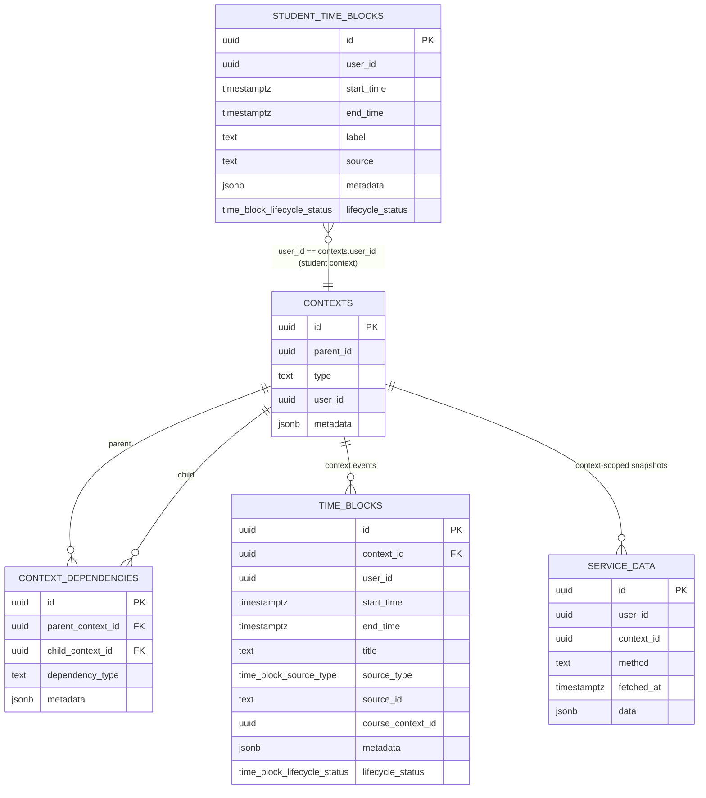
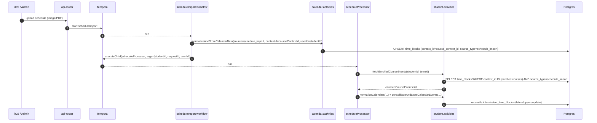
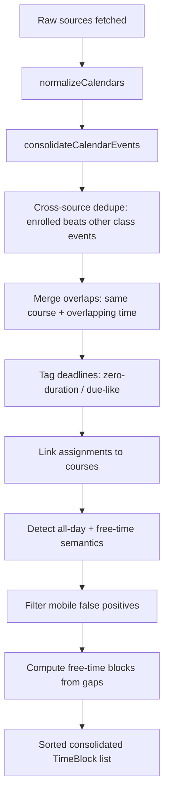
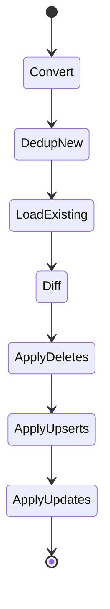

# scheduleProcessor Workflow Deep Dive (Current)

This document describes how DormWay’s **calendar reconciliation** currently works via the Temporal workflow `scheduleProcessor`, including **source priority**, **dedupe/conflict behavior**, and the **end-to-end write path** for `time_blocks` vs `student_time_blocks`.

Code entry points:

- Workflow: `.repos/dormway-platform/services/engine/src/workflows/studentProcessor.workflow.ts` (`scheduleProcessor`)
- Normalization + reconciliation write: `.repos/dormway-platform/services/engine/src/activities/student.activities.ts` (`normalizeCalendars`, `consolidateCalendarEvents`, `consolidateAndStoreCalendarEvents`, `storeConsolidatedTimeBlocks`, `fetchEnrolledCourseEvents`)
- Generic event storage (context calendars like schedule import): `.repos/dormway-platform/services/engine/src/activities/calendar.activities.ts` (`normalizeAndStoreCalendarData`)
- Generic time block query: `.repos/dormway-platform/services/engine/src/services/auroraDb.ts` (`queryTimeBlocks`)

Related overview docs:

- [Schedules, Time Blocks, and Reconciliation](/docs/engineering/technical/calendar/schedules-time-blocks-and-reconciliation)
- [Schedule Sources & Precedence (Current)](/docs/engineering/technical/calendar/schedule-sources-precedence-current)
- [Course Drops: Downstream Effects (Current)](/docs/engineering/technical/calendar/course-drops-downstream-effects)
- [How DormWay Works](/docs/engineering/architecture/how-dormway-works)
- [scheduleRemoval Workflow Deep Dive (Current)](/docs/engineering/technical/calendar/scheduleremoval-workflow-deep-dive-current)

---

## 1) What `scheduleProcessor` does (in one sentence)

It pulls **all available calendar sources** for a student, normalizes them into a common `TimeBlock` shape, applies cross-source **dedupe + consolidation**, then **diffs and reconciles** into the student-facing table `student_time_blocks` (and publishes a lightweight dashboard update).

---

## 2) Who calls it (and when)

### 2.1 StudentWatcher (automatic + manual)

- Manual signal path: `studentWatcherWorkflow` handles `trigger_calendar_sync` and runs `executeChild('scheduleProcessor', args:[studentId])`.
  - `.repos/dormway-platform/services/engine/src/workflows/studentWatcher.simplified.workflow.ts`

### 2.2 Schedule Import (post-import reconciliation)

After schedule import completes, we trigger `scheduleProcessor` with `(studentId, requestId, effectiveTermId)` so reconciliation uses the same term window:

- `.repos/dormway-platform/services/engine/src/workflows/scheduleImport.workflow.ts` (Step “Trigger calendar reconciliation after schedule import”)

---

## 3) The two “calendar storage layers” (`time_blocks` vs `student_time_blocks`)

### 3.1 `time_blocks` (generic / context-scoped, authoritative raw inputs)

`time_blocks` stores calendar events for **either** a user (`user_id`) **or** a context (`context_id`) such as a **course context**.

Today, **schedule import** stores course meeting blocks into `time_blocks` (by `context_id=course_context_id` when present), and we do **not** mirror those into `student_time_blocks`. We rely on `scheduleProcessor` to pull and consolidate them.

- Storage behavior: `.repos/dormway-platform/services/engine/src/activities/calendar.activities.ts` (branch for `source === 'schedule_import'`)
- Generic query used by `scheduleProcessor`: `.repos/dormway-platform/services/engine/src/services/auroraDb.ts` (`queryTimeBlocks`)

Lifecycle handling for `time_blocks`:

- Missing events are marked deleted via `public.mark_missing_events_as_deleted(...)` (called from calendar sync paths).
  - Function: `.repos/dormway-platform/infrastructure/docker/init-scripts/01-schema.sql` (`mark_missing_events_as_deleted`)

Uniqueness for `time_blocks` is enforced per `(source_type, source_id, user_id)` or `(source_type, source_id, context_id)` for active rows.

- Indexes: `.repos/dormway-platform/infrastructure/docker/init-scripts/01-schema.sql` (`idx_time_blocks_unique_event_user`, `idx_time_blocks_unique_event_context`)

### 3.2 `student_time_blocks` (student-facing, reconciled timeline)

`student_time_blocks` is the **student’s unified schedule** that the app uses for timeline/schedule views and as an input to planning.

`scheduleProcessor` writes here by:

1) converting consolidated `TimeBlock[]` into `StudentTimeBlock[]`
2) diffing against existing rows
3) applying delete/insert/update.

Uniqueness is intended to be **per source** (so different sources can coexist):

- Migration: `.repos/dormway-platform/infrastructure/database/migrations/085_fix_time_block_unique_constraint_source.sql`

### 3.3 Minimal ERD (tables that matter for reconciliation)

Notes:

- Enrollments are represented as `context_dependencies` rows (typically `dependency_type='enrolled_in'`) linking a student context → course contexts.
- Schedule import course meetings are `time_blocks` rows with `source_type='schedule_import'` under the **course context**.
- `student_time_blocks` is the “final schedule” materialized per student user.

---

## 4) End-to-end: schedule import → `time_blocks` → `scheduleProcessor` → `student_time_blocks`

Key translation:

- `time_blocks.source_type = 'schedule_import'` (course-context raw schedule)
- becomes `student_time_blocks.source = 'enrolled'` (authoritative class meetings) during normalization in `normalizeCalendars`.

---

## 5) Input sources (what `scheduleProcessor` pulls)

In parallel, `scheduleProcessor` fetches:

- Google Calendar: `studentActivities.fetchGoogleCalendar(studentId)`
- LMS data: `studentActivities.fetchStudentLMSData(studentId)` (Canvas ICS-derived “LMS calendar” input)
- Mobile calendar: `studentActivities.fetchMobileCalendar(studentId)` (iOS calendar ingestion)
- Syllabus events: `studentActivities.fetchSyllabusEvents(studentId)` (assignment/exam dates from syllabus processing)
- Enrolled course meetings: `studentActivities.fetchEnrolledCourseEvents(studentId, termId)` (from `time_blocks` where `source_type='schedule_import'`)

Workflow: `.repos/dormway-platform/services/engine/src/workflows/studentProcessor.workflow.ts`

---

## 6) Source priority rules (what wins when events collide)

There is one explicit “hard priority” rule in consolidation:

- **Enrolled course events win for class meetings**: if a non-enrolled `class` event has the same `(start_time,end_time)` as an `enrolled` event *and* the extracted course code matches, the non-enrolled one is dropped.
  - Implementation: `.repos/dormway-platform/services/engine/src/activities/student.activities.ts` (`consolidateCalendarEvents` cross-source dedupe block)

Practical effect:

- A Google/mobile “class” tile is suppressed if we have a schedule-import-derived course meeting for the same course/time slot.
- This is how schedule import becomes “authoritative” without directly writing to `student_time_blocks`.

---

## 7) Dedupe + conflict resolution pipeline (what happens inside consolidation)

`scheduleProcessor` uses `studentActivities.normalizeCalendars(...)` to build a single `TimeBlock[]`, then runs `studentActivities.consolidateCalendarEvents(...)`.

Concrete behaviors (current):

- **Merge overlaps**: overlapping events with the same course code in the label bracket pattern are merged and carry `metadata.merged_events`.
  - `.repos/dormway-platform/services/engine/src/activities/student.activities.ts` (`mergeOverlappingEvents`)
- **Deadline tagging**: zero-duration events or “due/exam” heuristics are marked `is_deadline`.
  - `.repos/dormway-platform/services/engine/src/activities/student.activities.ts` (`tagDeadlines`)
- **Mobile filtering**: mobile events are dropped unless they look “high signal” (course code, location, description, or not all-day).
  - `.repos/dormway-platform/services/engine/src/activities/student.activities.ts` (`filterMobileFalsePositives`)
- **Free time generation**: gaps between busy events become `status='free'` “Free Time” blocks with inferred `type` (sleep/meal/travel/other).
  - `.repos/dormway-platform/services/engine/src/activities/student.activities.ts` (`findFreeTimeBlocks`)

---

## 8) Persistence semantics (how reconciliation writes `student_time_blocks`)

After consolidation, `studentActivities.storeConsolidatedTimeBlocks(studentId, consolidatedEvents)` performs a reconciliation diff:

1) Convert `TimeBlock` → `StudentTimeBlock` and normalize times to **proper UTC** using timezone metadata.
   - `.repos/dormway-platform/services/engine/src/activities/student.activities.ts` (`ensureProperUTC`, mapping in `storeConsolidatedTimeBlocks`)
2) Deduplicate “new” blocks for stability (effectively keyed by `user_id + start_time + label` in code — **note:** this ignores `source`, even though the DB uniqueness constraint includes `source`).
3) Load existing blocks: `supabase.getTimeBlockRecords(userId)` (student-facing table).
4) Compute:
   - `toDelete`: existing keys not present in new keys (**key = `start_time + label` in code**)
   - `toInsert`: new keys not present in existing keys
   - `toUpdate`: same key but changed `end_time/status/type/source/metadata`
5) Apply:
   - delete by IDs (`deleteSpecificTimeBlocks`)
   - upsert inserts (`upsertTimeBlocks`, with fallback to individual inserts)
   - per-row updates (`updateTimeBlock`)

Implementation: `.repos/dormway-platform/services/engine/src/activities/student.activities.ts` (`storeConsolidatedTimeBlocks`)

---

## 9) The enrolled-course extraction (how `scheduleProcessor` reads `time_blocks`)

`fetchEnrolledCourseEvents(studentId, termId?)`:

1) resolves the student context (`contexts` row with `type='student'`)
2) uses the context graph to find **course contexts** the student is `enrolled_in` (optionally filtered by `metadata.term` when `termId` is provided)
3) defines a wide date window (term dates if provided; otherwise an “academic year” window)
4) for each enrolled course context:
   - query `time_blocks` by `context_id=courseContextId`, `source_type='schedule_import'`, and date window
   - trim fields and cap size (limits per course and total) to avoid large Temporal payloads

Implementation: `.repos/dormway-platform/services/engine/src/activities/student.activities.ts` (`fetchEnrolledCourseEvents`)

---

## 10) Notes / current sharp edges (worth knowing)

- `schedule_import` is **context-scoped** (`time_blocks`) and becomes **student-scoped** only after reconciliation; if `scheduleProcessor` fails or is delayed, schedule views may look stale.
  - Storage path: `.repos/dormway-platform/services/engine/src/activities/calendar.activities.ts`
  - Reconciliation path: `.repos/dormway-platform/services/engine/src/activities/student.activities.ts`
- The reconciliation diff key currently ignores `source` (it keys by `start_time + label`), even though the `student_time_blocks` unique constraint is `(user_id, start_time, label, source)`. Practically, this tends to collapse “same label/time” entries across sources and can create “source churn” when multiple sources produce identical `(start_time,label)` keys.
- The **dashboard schedule/timeline** (BFF composite) reads directly from `student_time_blocks`, so reconciliation behavior affects Home → Schedule and the Schedule tab.
  - Query: `.repos/dormway-platform/services/api-router/src/services/dashboard-aurora-service.ts` (timeline `SELECT ... FROM student_time_blocks`)
- Semester intelligence that relies on “what happened this term” (e.g., `processSemester`) also reads term-window `student_time_blocks`, so reconciliation affects semester/term views indirectly.
  - Deep dive: [processSemester Workflow Deep Dive (Current)](/docs/engineering/technical/engine/processsemester-workflow-deep-dive-current)
