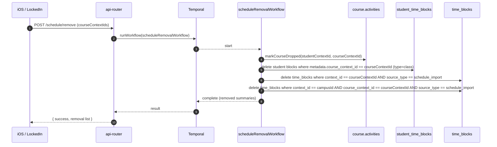
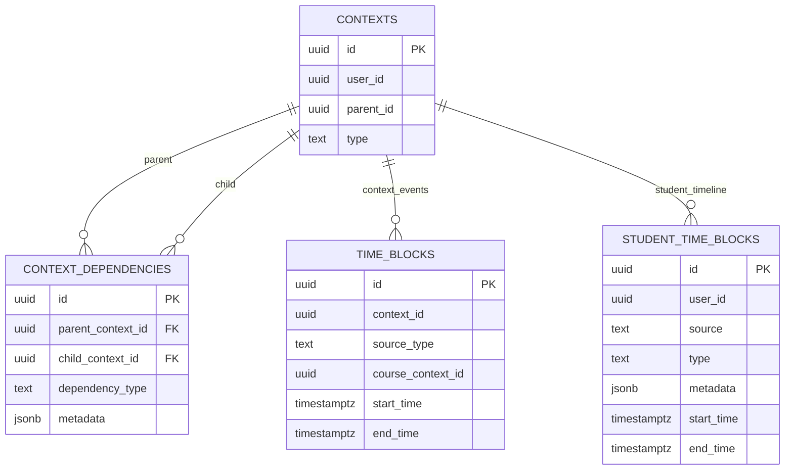

# scheduleRemoval Workflow Deep Dive (Current)

This document traces how DormWay currently removes a course from a student’s schedule: **drop enrollment intent → delete schedule-derived time blocks → (optionally) reconcile later**.

Related:

- [scheduleImport Workflow Deep Dive (Current)](/docs/engineering/technical/calendar/scheduleimport-workflow-deep-dive-current)
- [scheduleProcessor Workflow Deep Dive (Current)](/docs/engineering/technical/calendar/scheduleprocessor-workflow-deep-dive-current)
- [Schedules, Time Blocks, and Reconciliation](/docs/engineering/technical/calendar/schedules-time-blocks-and-reconciliation)
- [Schedule Sources & Precedence (Current)](/docs/engineering/technical/calendar/schedule-sources-precedence-current)
- [Course Drops: Downstream Effects (Current)](/docs/engineering/technical/calendar/course-drops-downstream-effects)

Code entry points:

- API route: `.repos/dormway-platform/services/api-router/src/routes/mobile-routes.ts` (`POST /schedule/remove`)
- Workflow: `.repos/dormway-platform/services/engine/src/workflows/scheduleRemoval.workflow.ts` (`scheduleRemovalWorkflow`)
- Drop dependency: `.repos/dormway-platform/services/engine/src/activities/course.activities.ts` (`markCourseDropped`)
- Student blocks delete: `.repos/dormway-platform/services/engine/src/activities/supabase.activities.ts` (`getTimeBlocks`, `deleteStudentTimeBlocks`)
- Generic blocks delete: `.repos/dormway-platform/services/engine/src/activities/supabase.activities.ts` (`getGenericTimeBlocks`, `deleteGenericTimeBlocks`)

---

## 1) What scheduleRemoval does (in one sentence)

It marks the course as **dropped** in the context graph, deletes matching **class** entries from `student_time_blocks`, deletes authoritative `schedule_import` entries from `time_blocks`, and reports progress/results back to the client.

---

## 2) Who calls it (and what input it takes)

`POST /schedule/remove` accepts either:

- `courseContextId` (single), or
- `courseContextIds` (array)

API starts a Temporal workflow:

- `workflowName = scheduleRemovalWorkflow`
- `taskQueue = student-worker`
- `workflowId = schedule-remove-<userId>-<timestamp>`

Implementation:

- `.repos/dormway-platform/services/api-router/src/routes/mobile-routes.ts`

Workflow input:

```ts
{ userId, requestId, courseContextIds: string[] }
```

---

## 3) End-to-end sequence (API → workflow → deletes)



---

## 4) Step-by-step behavior inside the workflow

### 4.1 Normalize the input list

`sanitizeContextIds`:

- trims strings
- removes empties
- de-dupes

### 4.2 Resolve the student + campus context

The workflow loads:

- `studentContext = getStudentContextByUserId(userId)`
- `campusId = studentContext.parent_id`
- `campusContext = getContextById(campusId)` (to derive `organizationId`)

### 4.3 Mark the course as dropped (intent)

For each `courseContextId`, it calls:

- `markCourseDropped(studentContext.id, courseContextId, organizationId, metadata)`

Metadata includes:

- `dropped_source = schedule_remove_api`
- `request_id = <requestId>`

Key semantics:

- If the student had an `enrolled_in` or `interested_in` dependency, it is promoted to `dropped`.
- If it didn’t exist, a `dropped` dependency is upserted.
- Future schedule import respects this and won’t re-enroll the dropped course (unless you explicitly undo the dropped state).

Implementation:

- `.repos/dormway-platform/services/engine/src/activities/course.activities.ts` (`markCourseDropped`)

### 4.4 Delete student-facing schedule blocks (`student_time_blocks`)

The workflow fetches all student time blocks once:

- `studentBlocks = getTimeBlocks(userId)` (this is `student_time_blocks`)

Then it deletes blocks where:

- `metadata.course_context_id == courseContextId`
- `type == 'class'`
- `source in ('enrolled', 'schedule_import', 'mobile')`

The delete is by ID:

- `deleteStudentTimeBlocks(blockIds)` → DB `DELETE FROM student_time_blocks WHERE id = ANY($1)`

Implementation:

- Workflow filter: `.repos/dormway-platform/services/engine/src/workflows/scheduleRemoval.workflow.ts`
- DB delete: `.repos/dormway-platform/services/engine/src/services/auroraDb.ts` (`deleteSpecificTimeBlocks`)

### 4.5 Delete authoritative schedule-import blocks (`time_blocks`)

The workflow deletes `time_blocks` entries from two shapes:

1) The common case (course context-scoped):

- `context_id == courseContextId`
- `source_type == schedule_import`

2) A fallback case (campus context-scoped with `course_context_id` set):

- `context_id == campusId`
- `course_context_id == courseContextId`
- `source_type == schedule_import`

Implementation:

- Query: `.repos/dormway-platform/services/engine/src/services/auroraDb.ts` (`queryTimeBlocks`)
- Delete: `.repos/dormway-platform/services/engine/src/services/auroraDb.ts` (`deleteGenericTimeBlocks`)

---

## 5) Important nuance: scheduleRemoval does NOT run scheduleProcessor

`scheduleRemovalWorkflow` does not trigger `scheduleProcessor` after deleting blocks.

Implication:

- If other sources (Google/mobile/LMS) still contain events for that course, a later `scheduleProcessor` run can reintroduce class-looking blocks (depending on how the course is detected/matched).
- The dropped dependency prevents `fetchEnrolledCourseEvents` from pulling schedule-import course meetings for that course, but it does not delete non-schedule_import events from other sources.

If you want “removal means never show again”, you typically need a policy layer (e.g., filtering by dropped courses during normalization/reconciliation).

---

## 6) Progress updates + analytics

The workflow emits progress messages:

- `type = schedule_remove_progress`
- `channel = user:<userId>:updates`

It also tracks a server-side event (same event name as schedule import, different `sync_type`):

- `trackServerSideEvent(userId, 'schedule_synced', { sync_type: 'schedule_course_removed', ... })`

Implementation:

- `.repos/dormway-platform/services/engine/src/workflows/scheduleRemoval.workflow.ts`

---

## 7) Minimal ERD (removal-relevant tables)


