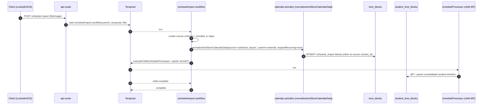
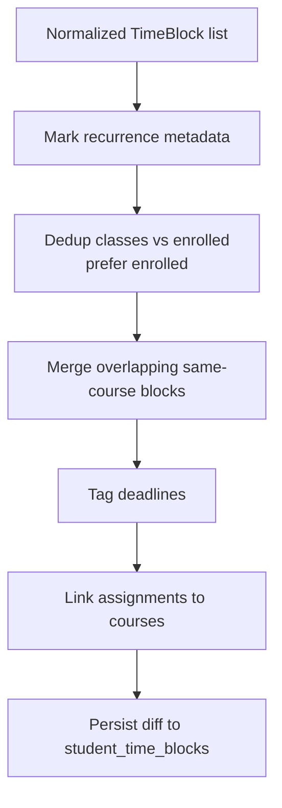
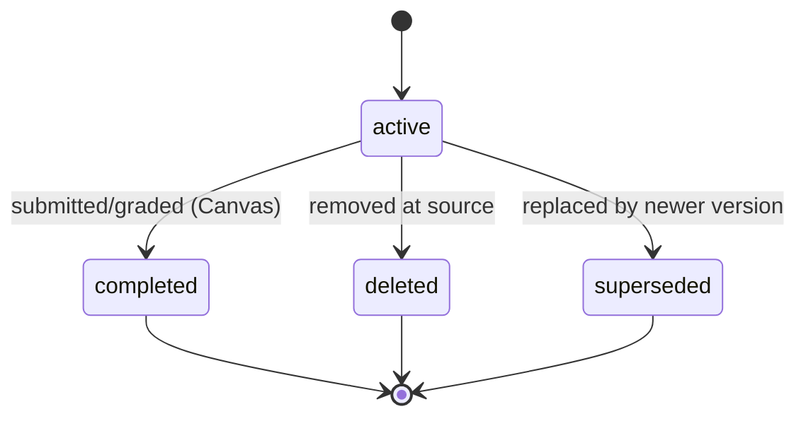

# Schedules, `time_blocks`, `student_time_blocks`, and Reconciliation

This is a deep dive into how DormWay currently represents and maintains a student’s “schedule” and timeline.

Companion to: [How DormWay Works](/docs/engineering/architecture/how-dormway-works) (section “Schedule Processing + `time_blocks` / `student_time_blocks`”).

Deep dive: [scheduleProcessor Workflow Deep Dive (Current)](/docs/engineering/technical/calendar/scheduleprocessor-workflow-deep-dive-current)

Related deep dives:

- [Schedule Sources & Precedence (Current)](/docs/engineering/technical/calendar/schedule-sources-precedence-current)
- [Schedule Preferences & Availability (Current)](/docs/engineering/technical/calendar/schedule-preferences-availability-current)
- [Course Drops: Downstream Effects (Current)](/docs/engineering/technical/calendar/course-drops-downstream-effects)
- [scheduleImport Workflow Deep Dive (Current)](/docs/engineering/technical/calendar/scheduleimport-workflow-deep-dive-current)
- [scheduleRemoval Workflow Deep Dive (Current)](/docs/engineering/technical/calendar/scheduleremoval-workflow-deep-dive-current)

---

## 0) Vocabulary (what “schedule” means in the code)

DormWay mixes a few concepts that people casually call “schedule”:

- **Raw sources**: Google Calendar, Canvas ICS, mobile calendar updates, syllabus-derived events, etc.
- **Imported class schedule** (OCR / PDF / screenshot): written into `time_blocks` as `source_type = 'schedule_import'` (often per-course context) and then treated as “authoritative class meetings”.
- **Student timeline**: the consolidated “things on your day” feed (classes, assignments, busy blocks, manual focus blocks, etc). This lives in `student_time_blocks`.

In practice:

- `time_blocks` is the *generic* event store (supports any context, including course contexts).
- `student_time_blocks` is the *student-facing timeline store* (what the schedule UI and DayPlan typically read).

---

## 1) Data Model (current)

Current schema is easiest to see in the local init schema:

- `student_time_blocks` table: `.repos/dormway-platform/infrastructure/docker/init-scripts/01-schema.sql`
- `time_blocks` table: `.repos/dormway-platform/infrastructure/docker/init-scripts/01-schema.sql`
- `v_student_calendar_events` view (derived from `time_blocks`): `.repos/dormway-platform/infrastructure/docker/init-scripts/01-schema.sql`

High-level ERD:

```mermaid
erDiagram
  ACCOUNTS ||--o{ STUDENT_TIME_BLOCKS : owns
  CONTEXTS ||--o{ TIME_BLOCKS : owns_context_events
  CONTEXTS ||--o{ CONTEXT_DEPENDENCIES : graph

  ACCOUNTS {
    uuid id PK
    string email
  }

  STUDENT_TIME_BLOCKS {
    uuid id PK
    uuid user_id FK
    timestamptz start_time
    timestamptz end_time
    text label
    enum time_block_type type
    enum time_block_status status
    text source
    jsonb metadata
    enum time_block_lifecycle_status lifecycle_status
    text sync_token
    timestamptz created_at
    timestamptz updated_at
  }

  TIME_BLOCKS {
    uuid id PK
    uuid user_id
    uuid context_id
    timestamptz start_time
    timestamptz end_time
    text title
    enum time_block_source_type source_type
    text source_id
    uuid course_context_id
    text course_code
    jsonb metadata
    enum time_block_lifecycle_status lifecycle_status
    text sync_token
    timestamptz created_at
    timestamptz updated_at
  }

  CONTEXTS {
    uuid id PK
    string type
    uuid user_id
    uuid parent_id
  }

  CONTEXT_DEPENDENCIES {
    uuid id PK
    uuid parent_context_id FK
    uuid child_context_id FK
    string dependency_type
    jsonb metadata
  }
```

### 1.1 Uniqueness and why it matters

`student_time_blocks` uniqueness is intentionally “time slot + label + source”:

- Migration: `.repos/dormway-platform/infrastructure/database/migrations/085_fix_time_block_unique_constraint_source.sql`
- Key: `(user_id, start_time, label, source)`

Implication: reconciliation *can* keep distinct entries at the same time if `source` differs, but it will overwrite (upsert) if those 4 match.

`time_blocks` uniqueness is “source identity within a user-or-context”:

- In engine migration: `.repos/dormway-platform/services/engine/migrations/create_generic_time_blocks.sql`
- Unique index: `(source_type, source_id, COALESCE(user_id, context_id))`

Implication: schedule imports and ICS syncs should be stable as long as we preserve `source_id`.

---

## 2) Two distinct pipelines (and where they write)

```mermaid
flowchart LR
  subgraph Ingest["A) Ingest raw sources (normalized)"]
    A1[CalendarNormalizationService<br/>(NormalizedCalendarEvent)] --> A2[normalizeAndStoreCalendarData]
    A2 -->|context events| TB[time_blocks]
    A2 -->|student events| STB[student_time_blocks]
    A2 -->|schedule_import<br/>when userId+contextId| TB
    A2 -->|ics_lms (LMS ICS calendar)<br/>student path writes to STB| STB
    A2 -->|canvas (assignments/deadlines)<br/>writes directly to STB| STB
  end

  subgraph Reconcile["B) Reconcile into student timeline"]
    B1[scheduleProcessor WF] --> B2[normalizeCalendars<br/>(TimeBlock)]
    B2 --> B3[consolidateAndStoreCalendarEvents]
    B3 --> STB
    TB -->|enrolled course events<br/>source_type=schedule_import| B1
  end
```

### Pipeline A: normalize + store (generic ingestion)

- Normalization interface + types: `.repos/dormway-platform/services/engine/src/services/calendarNormalization.service.ts`
- Storage entrypoint: `.repos/dormway-platform/services/engine/src/activities/calendar.activities.ts` (`normalizeAndStoreCalendarData`)

Key behavior:

- If you call `normalizeAndStoreCalendarData` with **`userId` and no `contextId`**, it writes to `student_time_blocks`.
- If you call it with **`contextId` and no `userId`**, it writes to `time_blocks`.
- If you call it with **`source = 'schedule_import'` AND both `userId` + `contextId`**, it writes *only* to `time_blocks` (no mirroring).
- If you call it with **`source = 'ics_lms'` AND both `userId` + `contextId`**, it writes to `time_blocks` and may mirror to `student_time_blocks` (used for course-linked meeting enrichment).
- If you call it with **`source = 'canvas'`** in the current Canvas sync codepaths, it writes **directly to `student_time_blocks`** (deadlines).
  - Deep dive: [Canvas Sync, Storage, and UI Surfacing (Current)](/docs/engineering/technical/canvas/canvas-sync-storage-and-ui-surfacing-current)

### Pipeline B: reconcile (scheduleProcessor)

- Workflow: `.repos/dormway-platform/services/engine/src/workflows/studentProcessor.workflow.ts` (`scheduleProcessor`)
- Normalization: `.repos/dormway-platform/services/engine/src/activities/student.activities.ts` (`normalizeCalendars`)
- Consolidation + persistence: `.repos/dormway-platform/services/engine/src/activities/student.activities.ts` (`consolidateAndStoreCalendarEvents`)

Key behavior:

- It pulls multiple sources (Google/LMS/mobile/syllabus) plus **course schedule** events from `time_blocks` (see `fetchEnrolledCourseEvents`).
- It produces a consolidated, student-friendly block list and diffs it into `student_time_blocks`.
- Important nuance: because some sources write directly to `student_time_blocks` (e.g., Canvas deadlines), reconciliation deletion semantics must avoid clobbering sources it didn’t ingest in that run (see `SE-001` / DORM-773).

---

## 3) Schedule import flow (OCR/PDF → course contexts → `time_blocks` → reconciliation)

Deep dive: [scheduleImport Workflow Deep Dive (Current)](/docs/engineering/technical/calendar/scheduleimport-workflow-deep-dive-current)
Removal deep dive: [scheduleRemoval Workflow Deep Dive (Current)](/docs/engineering/technical/calendar/scheduleremoval-workflow-deep-dive-current)

### 3.1 `scheduleImport.workflow` orchestration

- Workflow: `.repos/dormway-platform/services/engine/src/workflows/scheduleImport.workflow.ts`
- It parses the schedule, creates/links course contexts (`enrolled_in` dependencies), then calls:
  - `normalizeAndStoreCalendarData('schedule_import', ...)` to write authoritative schedule meetings into `time_blocks`
  - `executeChild('scheduleProcessor', ...)` to reconcile everything into the student timeline



### 3.2 Where the “authoritative” class meetings come from

After a schedule import, the canonical “class meetings” live in `time_blocks`:

- `source_type = 'schedule_import'`
- `context_id = <course_context_id>` (preferred) or `context_id = <campusId>` fallback
- `course_context_id` and `course_code` typically present

Then reconciliation reads those and turns them into student-facing blocks.

Fetcher:

- `.repos/dormway-platform/services/engine/src/activities/student.activities.ts` (`fetchEnrolledCourseEvents`)
  - queries `time_blocks` with `source = 'schedule_import'` and `contextId = courseContextId`
  - maps them to reconciliation `source: 'enrolled'` (explicitly documented inline)

---

## 4) Reconciliation (how `student_time_blocks` is produced)

### 4.1 Source gathering

In `scheduleProcessor`, we currently gather:

- Google events: `fetchGoogleCalendar`
- LMS events (Canvas ICS): `fetchStudentLMSData`
- Mobile calendar updates: `fetchMobileCalendar` (from `service_data` “context update” rows)
- Syllabus-derived events: `fetchSyllabusEvents`
- Enrolled course meetings: `fetchEnrolledCourseEvents` (from `time_blocks`)

Code:

- `.repos/dormway-platform/services/engine/src/workflows/studentProcessor.workflow.ts` (`scheduleProcessor`)

### 4.2 Normalization step (to a common `TimeBlock` shape)

`normalizeCalendars(...)` maps all sources to:

- `start_time`, `end_time` (ISO, UTC)
- `label`, `type`, `status`
- `source` (string union in the `TimeBlock` type)
- `metadata` (course_code, course_context_id, timezone, etc)

Code:

- `.repos/dormway-platform/services/engine/src/activities/student.activities.ts` (`normalizeCalendars`)

### 4.3 Consolidation logic (what we do to the normalized list)

Inside `consolidateAndStoreCalendarEvents`, the engine applies a series of transformations before persisting:

1) Mark recurring patterns (adds `metadata.recurrence` arrays)
2) Cross-source de-duplication: prefer `source='enrolled'` for class meetings when time slot + course code matches
3) Merge overlapping events from the same course (`mergeOverlappingEvents`)
4) Tag deadlines (`tagDeadlines`) based on zero-duration and/or keyword heuristics
5) Link assignments/assessments to courses (`linkAssignmentsToCourses`)

Code:

- `.repos/dormway-platform/services/engine/src/activities/student.activities.ts`
  - `mergeOverlappingEvents`
  - `tagDeadlines`
  - `linkAssignmentsToCourses`
  - `consolidateAndStoreCalendarEvents`



### 4.4 Persistence is a diff, not “delete all and insert all”

`consolidateAndStoreCalendarEvents` reads existing blocks, then computes:

- `toDelete` (present before, missing now)
- `toInsert` (new now)
- `toUpdate` (same identity key, but changed fields/metadata)

Then it performs batched deletes and upserts.

The DB layer methods used here (AuroraService in the engine) write to `student_time_blocks`:

- `.repos/dormway-platform/services/engine/src/services/auroraDb.ts`
  - `deleteSpecificTimeBlocks`
  - `upsertTimeBlocks`
  - `updateTimeBlock`

---

## 5) Query surface area (who reads what)

### 5.1 API Router: calendar + planner endpoints (student_time_blocks)

Student calendar/timeline endpoints read from `student_time_blocks`:

- `.repos/dormway-platform/services/api-router/src/routes/mobile-routes.ts` (`GET /calendar/events`)
  - filters to active lifecycle (`lifecycle_status` check)
  - extracts `course_context_id` / `course_code` from `metadata` for UI linking

### 5.2 Engine: “what’s next?” timeline queries

Engine helpers query `student_time_blocks` directly with `lifecycle_status='active'`:

- `.repos/dormway-platform/services/engine/src/activities/student.activities.ts` (`getStudentTimeBlocks`)

---

## 6) Timezones and “wallclock times”

The system assumes timestamps are stored as **UTC** (`timestamptz`) and converted for display in the client timezone.

Supporting work:

- Timezone consistency migration + indexes: `.repos/dormway-platform/infrastructure/database/migrations/20250820_fix_timezone_consistency.sql`
- Admin tooling to detect/fix wallclock times: `.repos/dormway-platform/services/api-router/src/routes/admin/schedule-maintenance-routes.ts`

---

## 7) Lifecycle statuses (`active`, `deleted`, `superseded`, `completed`)

Both `time_blocks` and `student_time_blocks` track lifecycle via `time_block_lifecycle_status`.

- `completed` added (Canvas submission handling): `.repos/dormway-platform/infrastructure/database/migrations/083_add_completed_lifecycle_status.sql`
- Canvas marks assignments completed based on submissions: `.repos/dormway-platform/services/engine/src/activities/canvas.activities.ts`



---

## 8) Known “sharp edges” (worth keeping in mind)

1) `student_time_blocks` is a real table in the current schema, but there is also a `v_student_calendar_events` view derived from `time_blocks`. Some older migrations created alias views; treat those as historical compatibility layers unless a query explicitly references them.
2) `schedule_import` can appear in **different ways**:
   - `time_blocks.source_type = 'schedule_import'` (authoritative meeting data)
   - `student_time_blocks` should only contain schedule-import-derived class meetings after reconciliation (typically `source='enrolled'`), but older data may include legacy mirrors.
3) Schedule/course removal currently relies on course context IDs + metadata; verify removal tooling against current `student_time_blocks.source` conventions before depending on it.
