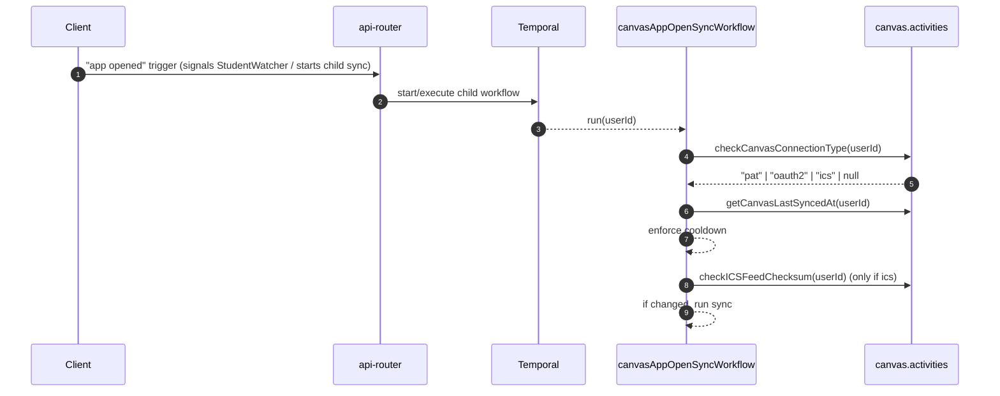
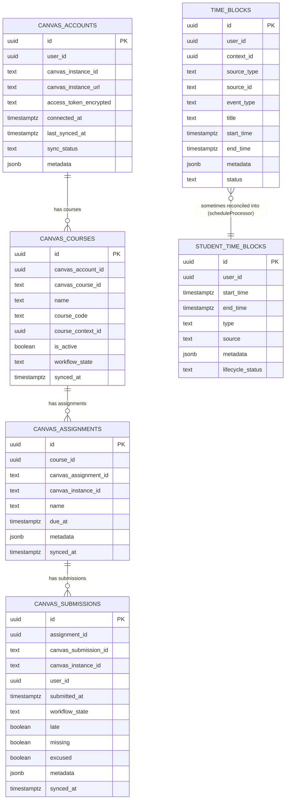
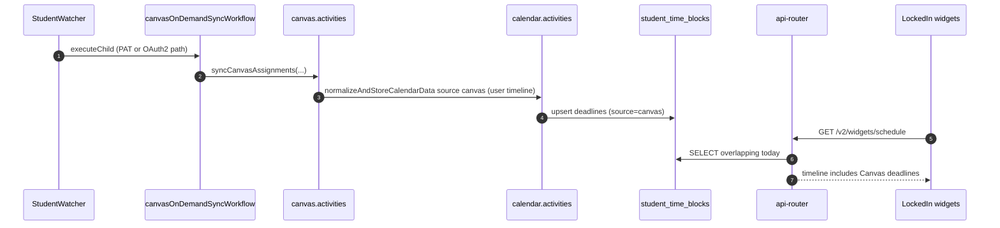

# Canvas Sync, Storage, and UI Surfacing (Current)

This document traces how Canvas data flows through DormWay today: connection types, Temporal workflows, storage tables, and where the data shows up in the UI.

Related deep dives:

- [Canvas Term Window & Course Filtering Deep Dive (Current)](/docs/engineering/technical/canvas/canvas-term-window-course-filtering-deep-dive-current)
- [scheduleProcessor Workflow Deep Dive (Current)](/docs/engineering/technical/calendar/scheduleprocessor-workflow-deep-dive-current)
- [Schedules, Time Blocks, and Reconciliation](/docs/engineering/technical/calendar/schedules-time-blocks-and-reconciliation)
- [StudentWatcher Workflow Deep Dive (Current)](/docs/engineering/technical/studentwatcher/studentwatcher-workflow-deep-dive-current)

Primary code references:

- Workflows: `.repos/dormway-platform/services/engine/src/workflows/canvasSync.workflow.ts`, `.repos/dormway-platform/services/engine/src/workflows/canvasICSSync.workflow.ts`
- Activities: `.repos/dormway-platform/services/engine/src/activities/canvas.activities.ts`, `.repos/dormway-platform/services/engine/src/activities/calendar.activities.ts`
- Dashboard composite Canvas reads: `.repos/dormway-platform/services/api-router/src/services/dashboard-aurora-service.ts`

---

## 1) Connection types (routing)

DormWay supports three Canvas “connection types”:

- `pat`: Personal Access Token (Canvas API access; no refresh token)
- `oauth2`: OAuth2 (Canvas API access; has refresh token; used for institutional flows)
- `ics`: ICS calendar feed (no Canvas API access; deadlines/meetings via calendar feed)

Routing occurs in the engine workflows via:

- `checkCanvasConnectionType(userId)` in `.repos/dormway-platform/services/engine/src/activities/canvas.activities.ts`

---

## 2) Workflows (when sync happens)

### 2.1 App-open sync (event-driven)

`canvasAppOpenSyncWorkflow(userId)` runs when the user opens the app and only syncs when:

1) the user has a Canvas connection
2) the last sync is older than the cooldown (15 minutes)
3) if `ics`: the feed changed (checksum/ETag check) before doing real work

Reference: `.repos/dormway-platform/services/engine/src/workflows/canvasSync.workflow.ts`

### 2.2 On-demand sync (pull-to-refresh)

`canvasOnDemandSyncWorkflow(userId)` is user-driven and:

- routes to `canvasICSSync` child workflow for `ics`
- routes to `fullCanvasSync` for `pat` and `oauth2`

Reference: `.repos/dormway-platform/services/engine/src/workflows/canvasSync.workflow.ts`

### 2.3 Canary (background change detection)

`canvasCanaryWorkflow(userId)` is a lightweight “monitor”:

- every 15 minutes, check for changes cheaply:
  - `pat/oauth2`: Canvas Activity Stream Summary API
  - `ics`: HEAD request (ETag/Last-Modified) with fallback checksum
- when changes detected:
  - send push notification immediately
  - queue a background sync (`canvasICSSync` or `canvasFullSyncWorkflow`)

Reference: `.repos/dormway-platform/services/engine/src/workflows/canvasSync.workflow.ts`

---

## 3) Storage model (tables)

Canvas data is persisted in a mix of “raw Canvas tables” and “schedule tables”.

Notes:

- `time_blocks` is the “raw/ingested” calendar-like event table.
- `student_time_blocks` is the reconciled, student-facing timeline used heavily by the dashboard.
- **Canvas assignment deadlines** currently write **directly to `student_time_blocks`** (PAT/OAuth2 path).
- **Canvas class meetings** (Canvas calendar events) are currently normalized under `source_type='ics_lms'` and may be written to:
  - `student_time_blocks` (student timeline)
  - and also `time_blocks` when a `course_context_id` is available (course-level enrichment)

---

## 4) PAT/OAuth2 path: full sync pipeline

### 4.1 Courses: term-window filtered

`fetchCanvasCourses(userId)`:

- resolves the student’s campus context
- resolves a term window (see [Canvas Term Window & Course Filtering Deep Dive (Current)](/docs/engineering/technical/canvas/canvas-term-window-course-filtering-deep-dive-current))
- selects “current” courses via `fetchAndSelectCurrentCourses(...)`

Reference: `.repos/dormway-platform/services/engine/src/activities/canvas.activities.ts`

### 4.2 Courses → contexts → enrollments

`syncCanvasCourses(userId, canvasAccountId, courses)`:

- normalizes `course_code` to a canonical tokenized code (e.g., `"EECS 485"`)
- calls `findOrCreateCourseContext(...)` for each course (dedupes cross-listed sections)
- calls `createCourseEnrollments(studentContextId, courseContextIds, organizationId, { termId })`

Reference: `.repos/dormway-platform/services/engine/src/activities/canvas.activities.ts`

### 4.3 Assignments + submissions

`syncCanvasAssignments(...)`:

- upserts `canvas_assignments`
- (PAT/OAuth2 only) fetches “self submission” and upserts `canvas_submissions`
- builds “deadline event inputs” and calls `calendarActivities.normalizeAndStoreCalendarData('canvas', { assignments }, userId=...)` which stores as `student_time_blocks`

Submission → timeline side effect:

- after syncing a submission, it attempts to mark the corresponding `student_time_blocks` row as `completed` by matching `metadata.source_id` to the Canvas assignment id.

Reference: `.repos/dormway-platform/services/engine/src/activities/canvas.activities.ts`

### 4.4 Class meeting times (Canvas calendar events)

`fullCanvasSync(userId)` additionally fetches Canvas calendar events (“meetings”) and normalizes them as `time_blocks` of `event_type = 'class'`, linked to `course_context_id` where possible.

Reference: `.repos/dormway-platform/services/engine/src/activities/canvas.activities.ts`

---

## 5) ICS path: feed parsing and sync

`canvasICSSync(userId)`:

1) load ICS credentials from `service_credentials` joined via `external_services.type = 'ics_lms'`
2) fetch ICS feed content
3) parse to a Canvas-like normalized representation: `{ courses, assignmentsByCourse }`
4) ensure course contexts exist (DORM-473)
5) store assignment deadlines via `calendarActs.normalizeAndStoreCalendarData('canvas', { assignments }, userId=...)` (→ `student_time_blocks`)
6) publish a lightweight Ably dashboard update and update ICS sync timestamp

Reference: `.repos/dormway-platform/services/engine/src/workflows/canvasICSSync.workflow.ts`

---

## 6) UI surfacing (what the user actually sees)

### 6.1 Dashboard composite (LockedIn V1 data)

The “dashboard composite” service queries Canvas assignments from `student_time_blocks` and enriches them with `canvas_submissions` for status (submitted/graded/late/missing).

Reference: `.repos/dormway-platform/services/api-router/src/services/dashboard-aurora-service.ts`

### 6.2 Dashboard v2 schedule widget (timeline-first)

Dashboard v2’s schedule widget queries `student_time_blocks` overlapping “today” and merges them with DayPlan events into a unified timeline.

Reference: `.repos/dormway-platform/services/api-router/src/routes/v2/widgets.routes.ts`

### 6.3 Real-time updates

Canvas workflows publish Ably events like:

- `canvas.assignments.updated`
- `canvas.grades.updated`
- `canvas.sync.complete`
- `canvas.canary.alert` (push + in-app when changes detected)

Reference: `.repos/dormway-platform/services/engine/src/activities/canvas.activities.ts`

---

## 7) Where Canvas intersects schedule reconciliation

Canvas intersects schedule reconciliation in two different ways today:

1) **Canvas deadlines** (PAT/OAuth2 assignments) are already in `student_time_blocks` (`source='canvas'`). Reconciliation must avoid deleting or clobbering them.
2) **Canvas meetings / LMS ICS calendar events** use `source_type='ics_lms'` and can land in `student_time_blocks` and (when linked to a course context) also in `time_blocks` for enrichment.

Historically, schedule reconciliation consumed more sources from `time_blocks`; the current Canvas deadlines path bypasses `time_blocks` entirely.

The schedule pipeline then:

- normalizes/dedupes and applies source priority
- writes “final student timeline” into `student_time_blocks`
- keeps lifecycle state updated (including Canvas submission → completed)

Deep dive: [scheduleProcessor Workflow Deep Dive (Current)](/docs/engineering/technical/calendar/scheduleprocessor-workflow-deep-dive-current)

