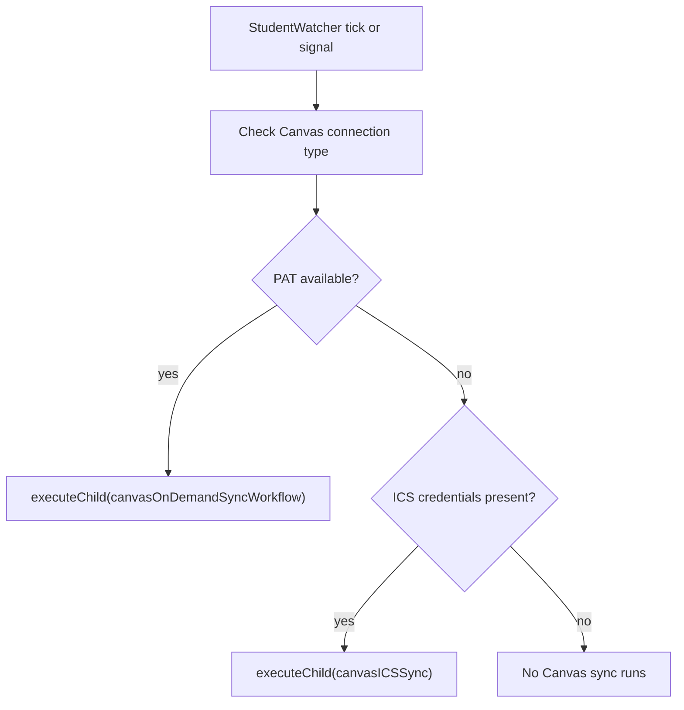
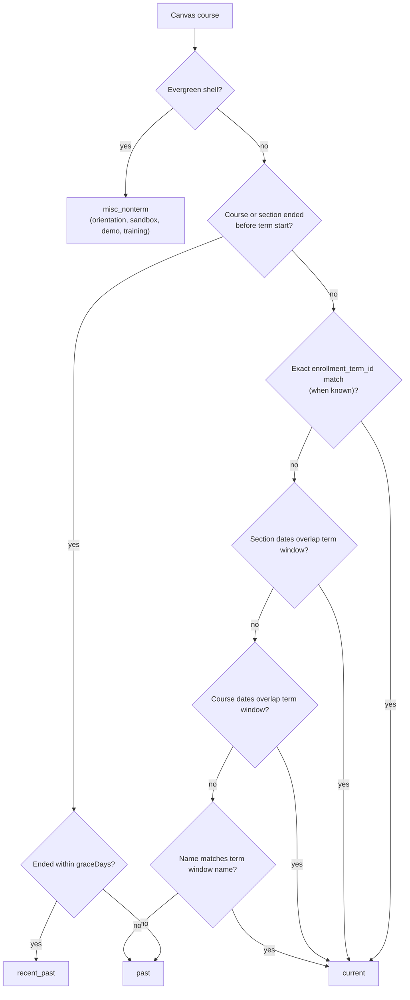
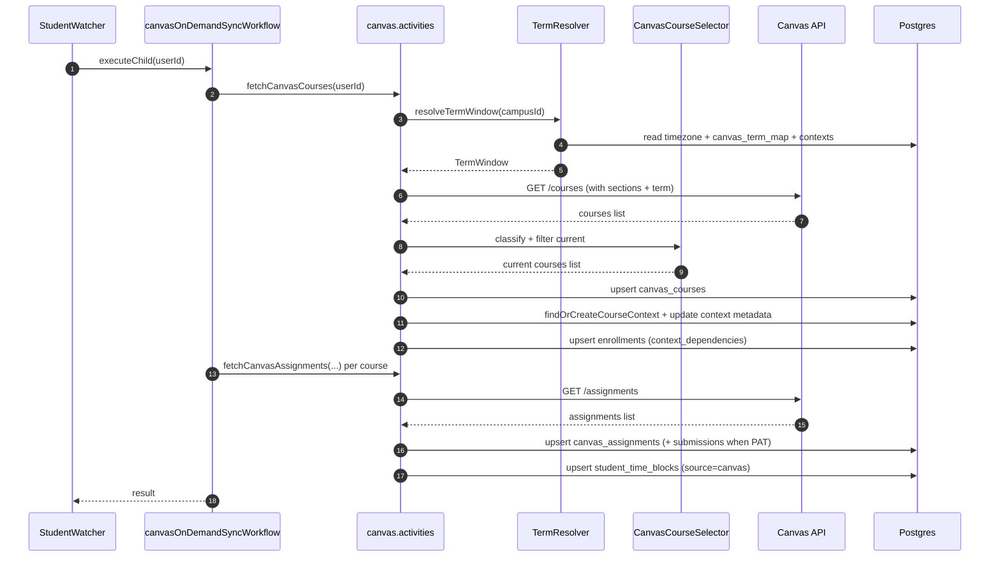
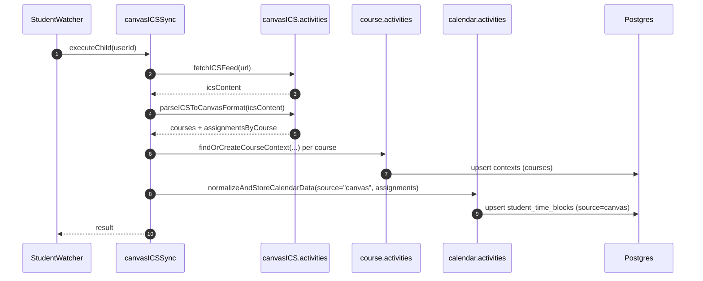

# Canvas Term Window & Course Filtering Deep Dive (Current)

This document describes how DormWay **currently** decides which Canvas courses are “in the current term”, how it syncs them, and how that interacts with:

- `campus_configs` term data (the “campus truth”)
- dashboard course filtering (API Router)
- enrollments (`context_dependencies`) and downstream schedule/semester features

Code entry points (highest signal):

- Term window resolution (Canvas-specific): `.repos/dormway-platform/services/engine/src/lib/term/TermResolver.ts` (`resolveTermWindow`)
- Course classification/filtering: `.repos/dormway-platform/services/engine/src/lib/canvas/CanvasCourseSelector.ts` (`classifyCourse`, `fetchAndSelectCurrentCourses`)
- PAT Canvas sync activities: `.repos/dormway-platform/services/engine/src/activities/canvas.activities.ts` (`fetchCanvasCourses`, `syncCanvasCourses`, `syncCanvasAssignments`)
- Canvas sync workflows: `.repos/dormway-platform/services/engine/src/workflows/canvasSync.workflow.ts`
- ICS sync workflow: `.repos/dormway-platform/services/engine/src/workflows/canvasICSSync.workflow.ts`
- StudentWatcher routing (PAT vs ICS): `.repos/dormway-platform/services/engine/src/workflows/studentWatcher.simplified.workflow.ts`

Related docs:

- [Term Management & Term Resolution Deep Dive (Current)](/docs/engineering/technical/engine/term-management-term-resolution-deep-dive-current)
- [How DormWay Works](/docs/engineering/architecture/how-dormway-works)
- [scheduleProcessor Workflow Deep Dive (Current)](/docs/engineering/technical/calendar/scheduleprocessor-workflow-deep-dive-current)

---

## 1) Two Canvas “connection types”

DormWay supports two ways of getting Canvas assignments:

1) **PAT** (Canvas Personal Access Token)
   - Uses Canvas REST API for courses + assignments + submissions.
2) **ICS** (LMS calendar feed)
   - Parses an ICS calendar feed (Canvas/Moodle/Blackboard/etc) and writes deadlines into `student_time_blocks`.

StudentWatcher chooses which sync workflow to run:

- Manual signal routing: `.repos/dormway-platform/services/engine/src/workflows/studentWatcher.simplified.workflow.ts`
- Automatic routing (stale check): `.repos/dormway-platform/services/engine/src/workflows/studentWatcher.simplified.workflow.ts`



---

## 2) The Canvas “term window” concept (Engine TermResolver)

Canvas sync uses a **Canvas-specific term window** that is *not* the same as `campus_configs.current_term_data`.

Implementation:

- `.repos/dormway-platform/services/engine/src/lib/term/TermResolver.ts` (`resolveTermWindow`)

What it does:

1) Resolves the **campus timezone** (required; fail-fast if missing).
2) Computes a **month-based semester window**:
   - Fall: Aug–Dec
   - Spring: Jan–May
   - Summer: Jun–Jul
3) Attempts to find a **Canvas `enrollment_term_id`** for that window:
   - cache lookup in `canvas_term_map` by `(campus_id, term_name)` (e.g. `"Fall 2025"`)
   - else infer “dominant” term ID from recent campus course contexts (`contexts.metadata.canvas_enrollment_term_id`)
   - then cache it back into `canvas_term_map`

DB cache table:

- `.repos/dormway-platform/infrastructure/database/migrations/20251021_canvas_term_map.sql`

```mermaid
flowchart TD
  A["resolveTermWindow(campusId)"] --> B["Load campus timezone\n(contexts.metadata OR campus_configs.campus_metadata)"]
  B --> C{"Timezone found?"}
  C -->|no| X["Throw (fail fast)"]
  C -->|yes| D["Compute month-based window\n(Fall/Spring/Summer)"]
  D --> E["Build termName\n(e.g. \"Fall 2025\")"]
  E --> F{"canvas_term_map has enrollment_term_id?"}
  F -->|yes| G["Return TermWindow\n(with canvasEnrollmentTermId)"]
  F -->|no| H["Infer dominant term id\nfrom contexts.metadata.canvas_enrollment_term_id"]
  H --> I{"Found dominant term id?"}
  I -->|yes| J["Upsert canvas_term_map"]
  J --> G
  I -->|no| K["Return TermWindow\n(without canvasEnrollmentTermId)"]
```

Key limitation (current behavior):

- Despite the file header comment, the current implementation **does not** use `campus_configs.academic_calendar.terms[]` for precise dates; it uses month-based windows.

---

## 3) Course filtering logic (CanvasCourseSelector)

Canvas course filtering is applied in the **PAT** path when fetching courses.

Implementation:

- `.repos/dormway-platform/services/engine/src/lib/canvas/CanvasCourseSelector.ts`
- constants: `.repos/dormway-platform/services/engine/src/lib/canvas/constants.ts`

### 3.1 What actually gets synced (default)

`fetchCanvasCourses(userId)` resolves a term window and fetches Canvas courses, but **only returns courses classified as `current`**:

- `.repos/dormway-platform/services/engine/src/activities/canvas.activities.ts` (`fetchCanvasCourses`)
- It calls `fetchAndSelectCurrentCourses(..., { includeRecentPast: false, graceDays: 21 })`.

### 3.2 Classification priorities (simplified decision tree)



Notes on “name matches term window name”:

- The term window name is like `"Fall 2025"`.
- Many campuses encode course codes like `"FA 2025"` or `"F25"`, which may not match `"Fall 2025"`.
- The code uses a simple regex built from the string `"Fall 2025"` (no abbreviation expansion).

---

## 4) PAT sync pipeline (end-to-end)

### 4.1 Data written by the PAT pipeline

When PAT sync runs, it typically writes:

- `canvas_courses` (course records + mapping to `course_context_id`)
- `contexts` (course context metadata fields like `canvas_enrollment_term_id`, `term_name`)
- `context_dependencies` (enrollments via `createCourseEnrollments`)
- `canvas_assignments` + `canvas_submissions`
- `student_time_blocks` (Canvas assignment deadlines via `normalizeAndStoreCalendarData(source='canvas')`)

### 4.2 Sequence diagram (PAT sync, simplified)



---

## 5) ICS sync pipeline (end-to-end)

ICS sync is a different pipeline:

- It parses an ICS feed into “Canvas-like” course and assignment objects.
- It creates course contexts when possible, so assignments can be linked to a `course_context_id`.
- It writes deadlines directly into `student_time_blocks`.

Implementation:

- `.repos/dormway-platform/services/engine/src/workflows/canvasICSSync.workflow.ts`
- `.repos/dormway-platform/services/engine/src/activities/canvasICS.activities.ts` (`parseICSToCanvasFormat`)

Important differences from PAT:

- ICS “courses” have no `enrollment_term_id`, no `start_at`, and no `end_at`.
- ICS pipeline does **not** use `resolveTermWindow` filtering; it syncs what’s present in the feed.



---

## 6) Critical mismatch: term strings written by Canvas sync vs dashboard filtering

### 6.1 What Canvas sync writes onto enrollments today

In the PAT sync pipeline, `syncCanvasCourses` chooses a “term id” for enrollments from:

- `campus_configs.current_term_data.name` (string) when present
- else defaults to `"Fall Term"`

Code:

- `.repos/dormway-platform/services/engine/src/activities/canvas.activities.ts` (`syncCanvasCourses`)
- It passes `{ termId: campusTermName }` into `createCourseEnrollments(...)`.

### 6.2 What the dashboard uses for filtering

API Router resolves “current term id” by preferring:

1) `campus_configs.current_term_data.id`
2) else `campus_configs.current_term_data.name`

Code:

- `.repos/dormway-platform/services/api-router/src/services/dashboard-aurora-service.ts` (`getCurrentTermId`)

Then dashboard course filtering compares that value to:

- `edge.metadata.term` (string equality), with a lenient fallback only for `null` terms.

Code:

- `.repos/dormway-platform/services/api-router/src/services/dashboard-aurora-service.ts` (`getStudentCourses`)

### 6.3 Why this can hide Canvas-synced courses

If `current_term_data.id` is normalized to something like `fall_2025` (common after normalization), but Canvas sync wrote `metadata.term = "Fall 2025"` onto enrollments, then:

- dashboard filtering by `termId = "fall_2025"` will **exclude** the Canvas-synced enrollments (because `term != null` and `term != termId`).

This is one of the highest-impact “term mismatch” behaviors in the current system.

---

## 7) What to double-click next (Canvas-related)

If you want to go deeper:

- How course contexts are matched/deduped (Canvas vs schedule import): `.repos/dormway-platform/services/engine/src/activities/course.activities.ts` (`findOrCreateCourseContext`)
- How `student_time_blocks` lifecycle is updated from Canvas submissions: `.repos/dormway-platform/services/engine/src/activities/canvas.activities.ts` (`syncSubmission`)
- How the dashboard renders Canvas assignments from `student_time_blocks`: `.repos/dormway-platform/services/api-router/src/services/dashboard-aurora-service.ts` (Canvas assignments query)
