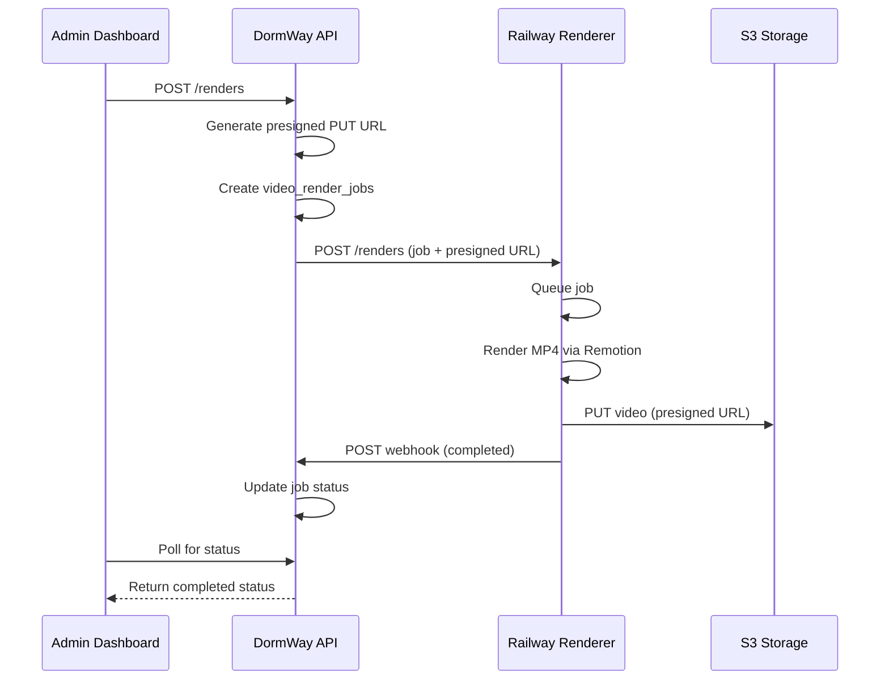

# Class Wrapped Railway Renderer

## Overview

The Class Wrapped Railway Renderer is a containerized service that generates MP4 videos from ClassWrappedData using Remotion. It runs on Railway and integrates with the DormWay API via webhooks.

**Design**: LCD terminal/sci-fi aesthetic with phosphor green on black, monospace fonts, ASCII art, and CRT scanlines.

**Video specs**: 1080x1920 (9:16 vertical), 36 seconds (1080 frames @ 30fps), ~3.3MB output.

## Architecture



## Service Location

- **Monorepo path**: `services/class-wrapped-renderer/`
- **Railway URL**: TBD after deployment
- **Port**: 3000 (internal), exposed via Railway

## API Endpoints

### Railway Renderer Service

| Endpoint | Method | Description |
|----------|--------|-------------|
| `/renders` | POST | Receive render job with presigned URL |
| `/renders/:id` | GET | Get render job status (backup for webhook) |
| `/health` | GET | Health check |

### DormWay API

| Endpoint | Method | Description |
|----------|--------|-------------|
| `/api/class-wrapped/renders` | POST | Trigger new render |
| `/api/class-wrapped/renders/:id` | GET | Get render status |
| `/api/class-wrapped/renders/:id/webhook` | POST | Webhook callback from Railway |
| `/api/class-wrapped/:contextId/video` | GET | Get video for a course |
| `/api/admin/class-wrapped/render-jobs` | GET | List all render jobs (admin) |

## Database Schema

```sql
CREATE TYPE video_render_status AS ENUM ('queued', 'rendering', 'uploading', 'completed', 'failed');

CREATE TABLE video_render_jobs (
  id UUID PRIMARY KEY,
  context_id UUID NOT NULL,
  data_hash VARCHAR(16) NOT NULL,
  status video_render_status DEFAULT 'queued',
  s3_bucket VARCHAR(255),
  s3_key VARCHAR(512),
  file_size_bytes BIGINT,
  render_duration_ms INTEGER,
  error_message TEXT,
  error_code VARCHAR(64),
  retry_count INTEGER DEFAULT 0,
  input_data JSONB NOT NULL,
  created_at TIMESTAMPTZ DEFAULT NOW(),
  started_at TIMESTAMPTZ,
  completed_at TIMESTAMPTZ,
  CONSTRAINT unique_context_datahash UNIQUE (context_id, data_hash)
);
```

## Environment Variables

### DormWay API (api-router)

| Variable | Description | Example |
|----------|-------------|---------|
| `RAILWAY_RENDERER_URL` | Railway renderer base URL | `https://class-wrapped-renderer.up.railway.app` |
| `RAILWAY_RENDERER_API_KEY` | API key for authenticating to Railway | `rk_xxx...` |
| `RAILWAY_WEBHOOK_SECRET` | Secret for validating webhook callbacks | `whs_xxx...` |
| `S3_CLASS_WRAPPED_BUCKET` | S3 bucket for video storage | `bundled-chest-jojfn1yzscy/class-wrapped` |

### Railway Renderer Service

| Variable | Description | Example |
|----------|-------------|---------|
| `PORT` | Server port | `3000` |
| `DORMWAY_API_KEY` | API key for authenticating from DormWay | `rk_xxx...` |
| `NODE_ENV` | Environment | `production` |

## S3 Storage

- **Bucket**: `bundled-chest-jojfn1yzscy/class-wrapped`
- **Key format**: `{contextId}/{dataHash}.mp4`
- **Presigned URL expiry**: 6 hours (PUT), 1 hour (GET)

## Local Development

### Start the renderer locally

```bash
cd services/class-wrapped-renderer

# Sync composition files from dormway-admin (LCD design)
./scripts/sync-compositions.sh

# Install dependencies
npm install

# Start development server
npm run dev
```

### Docker Compose

The renderer is included in `docker-compose.local-dev.yml`:

```bash
# Start all services including renderer
make dev

# Or start just the renderer
docker-compose -f infrastructure/docker/docker-compose.local-dev.yml up class-wrapped-renderer
```

### Composition Source

The LCD design components are sourced from `services/dormway-admin/src/components/class-wrapped/`:
- `ClassWrapped.tsx` - Main composition with 9 scenes
- `scenes/` - Individual scene components (Intro, Difficulty, Workload, Assignments, StressWeeks, Professor, GradePath, Tips, Outro)
- `theme.ts` - Terminal/LCD styling (colors, fonts, ASCII art helpers)
- `types/ClassWrappedData.ts` - Type definitions

The sync script copies these files to the renderer and fixes import paths for the renderer's directory structure.

### Testing locally

1. Start the renderer: `make dev`
2. Open admin dashboard: `http://localhost:3004`
3. Navigate to Class Wrapped page
4. Click play button on a course to trigger render
5. Watch the "Generated Videos" tab for progress

## Deployment to Railway

1. Connect the `services/class-wrapped-renderer` directory to Railway
2. Set environment variables in Railway dashboard
3. Railway auto-detects Dockerfile and deploys
4. Update Doppler with `RAILWAY_RENDERER_URL`

### Dockerfile Notes

- Uses `node:20-bookworm` for Chromium compatibility
- Installs Chromium dependencies for headless rendering
- Syncs composition files from `dormway-admin` LCD design during build
- Uses `ANGLE` GL backend for containerized rendering

## Webhook Flow

1. Railway renderer completes/fails render
2. POSTs to `/api/class-wrapped/renders/:id/webhook` with:
   - `status`: 'completed' | 'failed' | 'rendering' | 'uploading'
   - `fileSizeBytes`: Size of rendered video
   - `durationMs`: Render duration
   - `errorMessage`: Error details (if failed)
3. API updates `video_render_jobs` table
4. Admin dashboard polls or receives update

## Caching Strategy

- Videos are cached by `data_hash` (MD5 of ClassWrappedData)
- If syllabus data hasn't changed, existing video is returned
- `forceRerender: true` bypasses cache

## Error Handling

- Webhook failures don't fail the render
- Jobs can be retried via admin dashboard
- Failed jobs keep error details in database
- Railway logs available for debugging

## Related Files

- Migration: `infrastructure/database/migrations/20251204_create_video_render_jobs.sql`
- S3 config: `services/shared/dormway-core/src/aws/s3-config.ts`
- API routes: `services/api-router/src/routes/class-wrapped-routes.ts`
- Admin routes: `services/api-router/src/routes/admin/class-wrapped-routes.ts`
- Admin UI: `services/dormway-admin/src/pages/class-wrapped/index.tsx`
- LCD design: `services/dormway-admin/src/components/class-wrapped/`
- Renderer service: `services/class-wrapped-renderer/`

## Next Steps

1. **Temporal Integration**: Add video rendering to `processSyllabus` workflow
2. **Web Viewer**: Create share page in `dormway-lockedin` at `/class-wrapped/:contextId`
3. **Social Sharing**: Add share sheet for Snapchat, Instagram Stories, TikTok
4. **Railway Deployment**: Deploy renderer to Railway production

## Tags

#class-wrapped #video #railway #remotion #s3 #webhook
