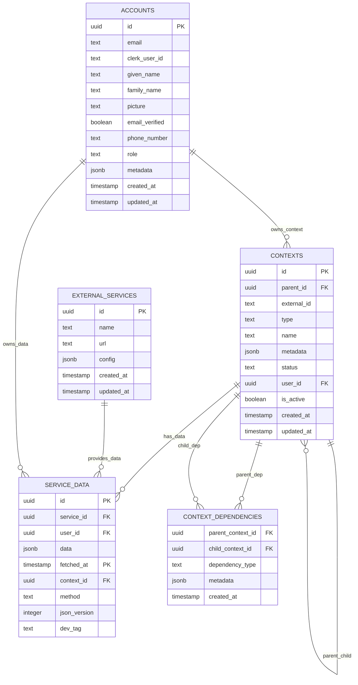

# Context System Database Schema

## Overview

The DormWay Context System uses a sophisticated database schema implemented in **Neon PostgreSQL** to store hierarchical context data, service information, and time-series data. Authentication is handled by **Clerk** with user records in the `accounts` table.

**Database**: Neon PostgreSQL (Project: `misty-queen-56829089`)
**Branches**: `production`, `development`, `development_riley`

## Database Tables

### Core Context Table

The foundation of the context system is the `contexts` table, which stores the hierarchical relationship between different types of contexts:

```sql
create table public.contexts (
  id uuid not null default extensions.uuid_generate_v4(),
  parent_id uuid null,
  external_id text not null,
  type text not null,
  metadata jsonb not null default '{}'::jsonb,
  status text not null default 'active'::text,
  user_id uuid null,
  organization_id text not null,
  created_at timestamp with time zone not null default now(),
  updated_at timestamp with time zone not null default now(),
  constraint contexts_pkey primary key (id),
  constraint contexts_external_id_organization_id_key unique (external_id, organization_id),
  constraint contexts_parent_id_fkey foreign key (parent_id) references contexts (id)
) TABLESPACE pg_default;
```

#### Indexing Strategy

```sql
create index IF not exists idx_contexts_parent_id on public.contexts using btree (parent_id) TABLESPACE pg_default;
create index IF not exists idx_contexts_type on public.contexts using btree (type) TABLESPACE pg_default;
create index IF not exists idx_contexts_external_id on public.contexts using btree (external_id) TABLESPACE pg_default;
create index IF not exists idx_contexts_user_id on public.contexts using btree (user_id) TABLESPACE pg_default;
create index IF not exists idx_contexts_org_external_id on public.contexts using btree (organization_id, external_id) TABLESPACE pg_default;
```

#### Automatic Timestamp Updates

```sql
create trigger update_contexts_updated_at BEFORE
update on contexts for EACH row
execute FUNCTION update_updated_at_column();
```

### Service Data Table

The `service_data` table stores time-series data from various services, partitioned by the timestamp for efficient querying:

```sql
create table public.service_data (
  id uuid not null default gen_random_uuid(),
  service_id uuid null,
  user_id uuid null,
  data jsonb not null,
  fetched_at timestamp with time zone not null default now(),
  context_id uuid null,
  method text null,
  json_version integer not null default 1,
  dev_tag text null,
  constraint service_data_pkey primary key (id, fetched_at),
  constraint service_data_context_id_fkey foreign key (context_id) references contexts (id),
  constraint service_data_service_id_fkey foreign key (service_id) references external_services (id),
  constraint service_data_user_id_fkey foreign key (user_id) references accounts (id)
)
partition by
  RANGE (fetched_at);
```

## Entity Relationship Diagram



> **Note**: The `accounts` table replaces the legacy `auth.users` reference. Authentication is handled by **Clerk**, and user records are stored in `accounts` with `clerk_user_id` linking to Clerk's external identity.

## Context Type Hierarchy

The `contexts` table implements a hierarchical relationship between different context types, following this pattern:

```
City Context
├── Weather Context
├── Transit Context
├── Campus Context
│   ├── Building Context
│   │   ├── Dining Context
│   │   ├── Study Space Context
│   │   └── Student Context
│   │       ├── Schedule Context
│   │       ├── Academic Context
│   │       └── Location Context
```

This hierarchy is implemented using the `parent_id` foreign key reference, enabling:
- Context inheritance
- Cascading updates
- Efficient queries of related contexts

## Time-Series Data Model

The `service_data` table uses PostgreSQL's table partitioning for efficient time-series data storage:

```sql
-- Example: Create monthly partitions
CREATE TABLE service_data_y2025m05 PARTITION OF service_data
  FOR VALUES FROM ('2025-05-01') TO ('2025-06-01');

CREATE TABLE service_data_y2025m06 PARTITION OF service_data
  FOR VALUES FROM ('2025-06-01') TO ('2025-07-01');
```

This approach provides:
- Efficient time-range queries
- Automatic partition pruning
- Simplified data retention management
- Improved insert performance for current data

## Context Type Usage

Different context types serve specific purposes in the system:

| Context Type | Description | Example Metadata |
|-------------|-------------|-----------------|
| `city` | City-level context | `{"name": "Ann Arbor", "state": "MI", "timezone": "America/Detroit"}` |
| `campus` | Campus-specific context | `{"name": "University of Michigan", "code": "umich"}` |
| `building` | Building-specific context | `{"name": "Mason Hall", "type": "academic", "location": {"lat": 42.276, "lng": -83.738}}` |
| `student` | Student-specific context | `{"studyPreference": "quiet", "commute": "walking", "year": "sophomore"}` |
| `weather` | Weather conditions | `{"condition": "sunny", "temperature": 72, "lastUpdated": "2025-05-15T14:30:00Z"}` |
| `academic` | Academic context | `{"term": "Spring 2025", "finals": false, "courses": 4}` |

## Common Query Patterns

### Creating a New Context

```sql
INSERT INTO contexts (
  external_id,
  type,
  organization_id,
  metadata,
  parent_id,
  user_id
) VALUES (
  'umich-central-campus',
  'campus',
  'dormway',
  '{"name": "University of Michigan Central Campus", "location": {"lat": 42.278, "lng": -83.738}}',
  (SELECT id FROM contexts WHERE external_id = 'ann-arbor' AND type = 'city' LIMIT 1),
  NULL
) RETURNING id;
```

### Fetching Context Hierarchy

```sql
WITH RECURSIVE context_tree AS (
  -- Base case: student context
  SELECT 
    c.id, 
    c.external_id, 
    c.type, 
    c.metadata, 
    c.parent_id,
    c.created_at,
    c.updated_at,
    0 as level
  FROM 
    contexts c
  WHERE 
    c.user_id = '550e8400-e29b-41d4-a716-446655440000' 
    AND c.type = 'student'
  
  UNION ALL
  
  -- Recursive case: get parent contexts
  SELECT 
    p.id, 
    p.external_id, 
    p.type, 
    p.metadata, 
    p.parent_id,
    p.created_at,
    p.updated_at,
    ct.level + 1
  FROM 
    contexts p
  JOIN 
    context_tree ct ON p.id = ct.parent_id
)
SELECT * FROM context_tree
ORDER BY level DESC;
```

### Getting Latest Service Data by Context

```sql
SELECT 
  sd.data, 
  sd.fetched_at,
  es.name as service_name
FROM 
  service_data sd
JOIN 
  external_services es ON sd.service_id = es.id
WHERE 
  sd.context_id = '123e4567-e89b-12d3-a456-426614174000'
  AND sd.fetched_at > (CURRENT_TIMESTAMP - INTERVAL '1 day')
ORDER BY 
  sd.fetched_at DESC
LIMIT 10;
```

### Time-Series Analysis

```sql
-- Get temperature changes over time
SELECT 
  (data->>'temperature')::numeric as temperature,
  fetched_at,
  date_trunc('hour', fetched_at) as hour_bucket
FROM 
  service_data
WHERE 
  context_id = '123e4567-e89b-12d3-a456-426614174000'
  AND method = 'weather-api'
  AND fetched_at BETWEEN '2025-05-10' AND '2025-05-15'
ORDER BY 
  fetched_at;
```

## Integration with Temporal Workflows

The Context System database integrates with Temporal workflows in the following ways:

1. **Workflow-triggered updates**: Temporal workflows read and write context data
2. **Signals for data changes**: Database triggers can signal Temporal workflows
3. **Historical processing**: Workflows can analyze historical context data

Example workflow code for context updates:

```typescript
// In cityProcessor.workflow.ts
export async function cityProcessorWorkflow(cityId: string): Promise<void> {
  // Set up initial state
  let lastWeatherUpdate = new Date(0); // Unix epoch
  let cityContext = await activities.fetchCityContext(cityId);
  
  while (true) {
    // Check if we should update weather
    const now = new Date();
    if (now.getTime() - lastWeatherUpdate.getTime() > 30 * 60 * 1000) { // 30 minutes
      // Update weather context
      const weatherData = await activities.fetchWeatherData(cityContext.metadata.location);
      await activities.updateServiceData({
        context_id: cityContext.id,
        service_id: WEATHER_SERVICE_ID,
        data: weatherData,
        method: 'openweathermap-api'
      });
      
      // Process with LLM and create/update weather context
      const enrichedWeather = await activities.processWeatherWithLLM(weatherData, cityContext);
      const weatherContextId = await activities.getOrCreateWeatherContext(cityId);
      
      await activities.updateContext(weatherContextId, {
        metadata: enrichedWeather
      });
      
      lastWeatherUpdate = now;
    }
    
    // Wait for next cycle or signal
    await workflow.sleep(5 * 60 * 1000); // 5 minutes
  }
}
```

## Security Considerations

### Row-Level Security (RLS)

RLS policies use session variables set via `SET LOCAL` within transactions:

```sql
-- Session variables set by api-router before queries
SET LOCAL app.current_user_id = 'user-uuid';
SET LOCAL app.current_role = 'authenticated';  -- or 'admin', 'demo', 'service'
SET LOCAL app.current_context_id = 'context-uuid';  -- optional

-- RLS policy example
CREATE POLICY "Users can only access their own contexts"
  ON contexts FOR SELECT
  USING (
    user_id = current_setting('app.current_user_id', true)::uuid
    OR current_setting('app.current_role', true) = 'admin'
  );
```

**Connection strings**:
- `DATABASE_URL` - Has RLS enforced, returns filtered results
- `DATABASE_URL_ADMIN` - Bypasses RLS for admin/migration operations

> **For AI Agents**: When debugging, always use `DATABASE_URL_ADMIN` to see all data. RLS will silently return empty results if user_id doesn't match.

### Data Retention

Automated cleanups for older service_data partitions:
```sql
-- Retention policy for 3 months of service data
DROP TABLE IF EXISTS service_data_2025_02;
```

### Data Protection

Sensitive data handling:
- User PII stored in `accounts` table with Clerk as identity provider
- No passwords stored locally (Clerk handles authentication)
- HIPAA mode enabled on Neon project for compliance

## Data Migration Strategy

The schema includes version tracking to manage data evolution:

1. **Schema Versioning**: 
   - The `json_version` field in `service_data` tracks schema changes
   - Enables backward-compatible reading of historical data

2. **Migration Process**:
   ```sql
   -- Example: Migrating to a new schema version
   INSERT INTO service_data (
     service_id, 
     user_id, 
     data, 
     context_id, 
     json_version
   )
   SELECT 
     service_id,
     user_id,
     jsonb_set(data, '{new_field}', '"default_value"'),
     context_id,
     2 -- New schema version
   FROM 
     service_data
   WHERE 
     json_version = 1
     AND fetched_at > (CURRENT_TIMESTAMP - INTERVAL '7 days');
   ```

## Conclusion

The Context System database schema provides a robust, flexible foundation for storing hierarchical context data, service information, and time-series data. The schema enables efficient querying, proper data retention, and seamless integration with the Temporal workflow engine.

By using PostgreSQL's advanced features like JSONB, table partitioning, and recursive CTEs, the system can efficiently store and retrieve complex context data at scale while maintaining good performance characteristics.

---

## For AI Agents

### Quick Reference

| What You Need | Where to Find It |
|---------------|------------------|
| User data | `accounts` table (NOT onboarding) |
| Student context | `contexts WHERE type = 'student' AND user_id = ?` |
| Campus for student | Join `contexts` on `parent_id` where student context |
| Course enrollments | `context_dependencies` with `dependency_type = 'enrolled_in'` |
| Service data | `service_data` (partitioned - include `fetched_at` filter) |

### Common Field Name Gotchas

| ❌ Wrong | ✅ Correct |
|----------|-----------|
| `target_context_id` | `child_context_id` |
| `source_context_id` | `parent_context_id` |
| `accounts.campus_id` | Use contexts join |
| `auth.users` | `accounts` |
| `city_registry` | `contexts WHERE type = 'city'` |

### Debug Query Pattern

```bash
# Always use DATABASE_URL_ADMIN for debugging (bypasses RLS)
doppler run -- bash -c 'psql "$DATABASE_URL_ADMIN" -c "SELECT ..."'
```

---

## Related Documents

- [Database Model & Access Patterns (Neon)](/docs/engineering/architecture/sot-database-model-access-patterns-neon) - Connection and access patterns
- [Database Table Index](/docs/engineering/technical/database/database-table-index) - Complete table inventory for AI agents
- RLS-Security-Performance-Audit - Security audit details
- ../../../Architecture/DormWay Platform Architecture - System overview
