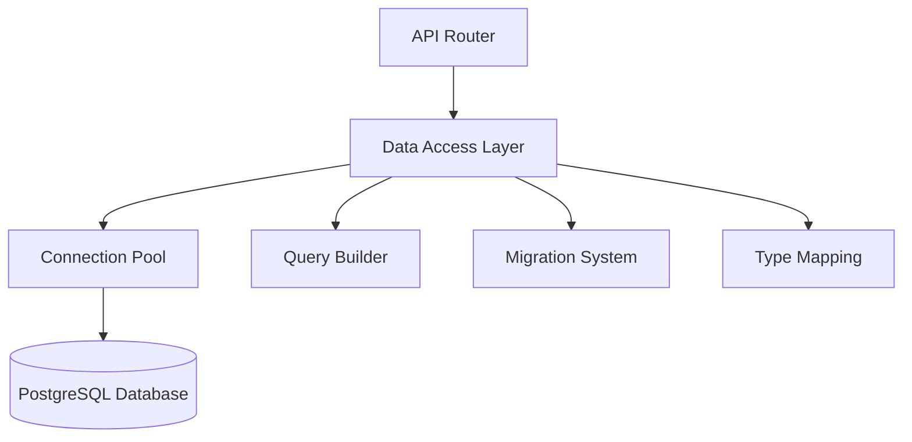

# Database Integration

---
⚠️ **MIGRATION COMPLETE** (Updated: 2025-11-25)

**Status**: CURRENT - Neon PostgreSQL is PRIMARY database
**Previous Architecture**: Supabase client-based (FULLY DEPRECATED Q3 2025) → Aurora PostgreSQL (DEPRECATED Nov 2025)
**Current Architecture**: Direct Neon PostgreSQL connections with connection pooling
**Migration Completed**: August-September 2025 (Supabase → Aurora), November 2025 (Aurora → Neon)

**For current database patterns, see**: Context System Database Schema, DASHBOARD_BFF_V1_IMPLEMENTATION
---

## Overview

The DormWay platform uses a direct database connection approach to **Neon PostgreSQL**, which replaced the previous Supabase client-based architecture (Q3 2025) and Aurora PostgreSQL (Q4 2025). This change provides more control, better performance, and increased flexibility in how data is accessed and manipulated.

**Note**: Service names like `auroraDb.ts` are legacy naming - they connect to Neon PostgreSQL via standard PostgreSQL protocol using `DATABASE_URL` from Doppler.

**Recent Performance Enhancement (June 1, 2025)**: Implemented intelligent incremental updates for time block storage, replacing inefficient delete-all + insert-all operations with Set-based diff algorithms, resulting in 80%+ reduction in database operations for typical calendar sync scenarios.

## Architecture

The database integration follows a layered architecture:



## Core Components

### Data Access Layer

The Data Access Layer (DAL) provides:

- Structured database access methods
- Transaction management
- Query optimization
- Type safety
- Error handling

### Connection Management

Efficient database connection handling:

- Connection pooling
- Connection lifecycle management
- Automatic reconnection
- Health checking
- Connection metrics

### Query Building

Secure and flexible query construction:

- Parameterized queries
- SQL injection prevention
- Dynamic query building
- Transaction support
- Complex query composition

### Migration System

Database schema management:

- Version-controlled migrations
- Migration rollback capability
- Schema validation
- Seeding capabilities
- Test data generation

## Security Features

The database integration includes:

1. **Connection Encryption**: TLS-encrypted connections
2. **Parameterized Queries**: Protection against SQL injection
3. **Role-Based Access**: Proper database role separation
4. **Row-Level Security**: Fine-grained access control
5. **Audit Logging**: Tracking of data changes
6. **Password Security**: Secure password storage

## Schema Design

The database schema is organized into functional schemas:

### Core Schemas

- **public**: Core application tables
- **auth**: Authentication and authorization
- **storage**: File storage tables
- **analytics**: Analytics and metrics
- **audit**: Audit logging

### Key Tables

Important tables in the system:

- **users**: User accounts
- **profiles**: User profiles
- **sessions**: Authentication sessions
- **service_data**: External service data
- **worker_jobs**: Background job queue
- **contexts**: Context system data

## Type Safety

The database integration provides type safety through:

- TypeScript interfaces matching database schema
- Runtime type validation
- Automated type generation from schema
- Type-safe query builders

Example type definition:
```typescript
interface User {
  id: string;
  email: string;
  created_at: Date;
  updated_at: Date;
  profile_id: string | null;
  metadata: Record<string, any>;
  last_sign_in_at: Date | null;
}
```

## ✅ Migration from Supabase (COMPLETED August-September 2025)

The migration from Supabase client to direct Aurora PostgreSQL connections was completed in Q3 2025 and involved:

1. ✅ Creating a dedicated data access layer
2. ✅ Migrating all database operations to use the new layer
3. ✅ Implementing connection pooling
4. ✅ Adding robust error handling
5. ✅ Creating type-safe interfaces
6. ✅ Testing performance and reliability

**Migration Status**: 100% complete - Supabase and Aurora are no longer in use as primary database.
**Current Database**: Neon PostgreSQL (November 2025)
**Previous Database**: Aurora PostgreSQL (AWS RDS) - Deprecated November 2025
**Connection Method**: Direct PostgreSQL connections with pg driver via `DATABASE_URL`

## Performance Considerations

The direct database connection approach improves performance through:

- Reduced latency (no API gateway in between)
- Connection pooling
- Prepared statements
- Query optimization
- Selective data fetching

## Transactions

The system supports robust transaction management:

```typescript
await dal.transaction(async (client) => {
  // Multiple operations that succeed or fail together
  await client.createUser(userData);
  await client.createProfile(profileData);
  await client.linkUserToProfile(userId, profileId);
});
```

## Development (Neon)

DormWay development uses **Neon branch databases** (no local Postgres).

1. Reset your dev branch:
   ```bash
   make sync
   ```

2. Fetch a connection string:
   ```bash
   make neon-connection
   ```

3. Run migrations (and any optional seeds) against Neon:
   ```bash
   cd .repos/dormway-platform
   make db-migrate
   # Optional: make seed-dev-dayplan (and other seed-dev-* targets)
   ```

## Monitoring and Maintenance

The database integration includes:

- Connection pool metrics
- Query performance monitoring
- Slow query logging
- Automated backups
- Health checks

## 🔗 Related

*Backlinks and related notes will appear here*
