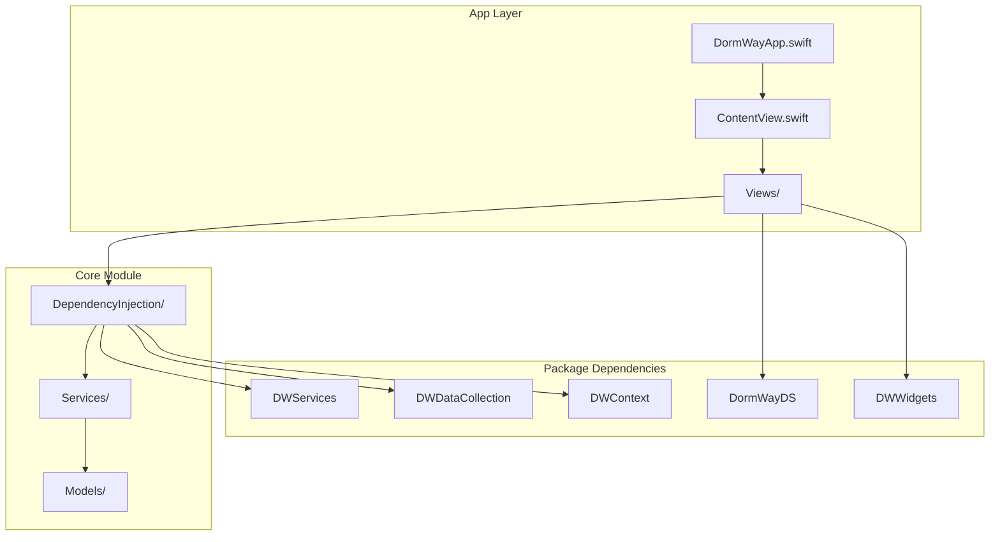
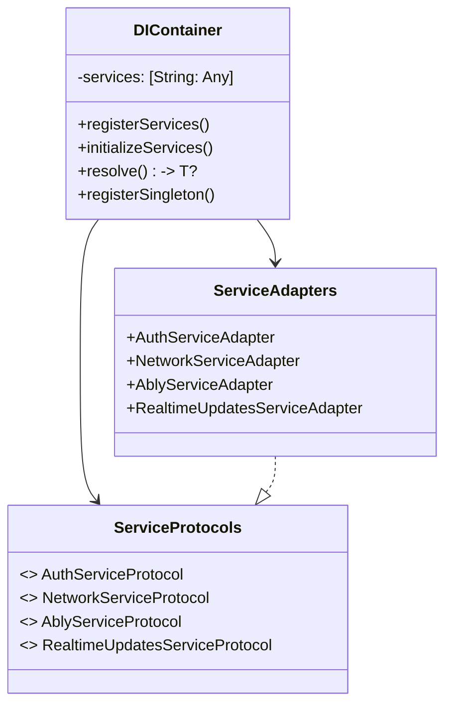
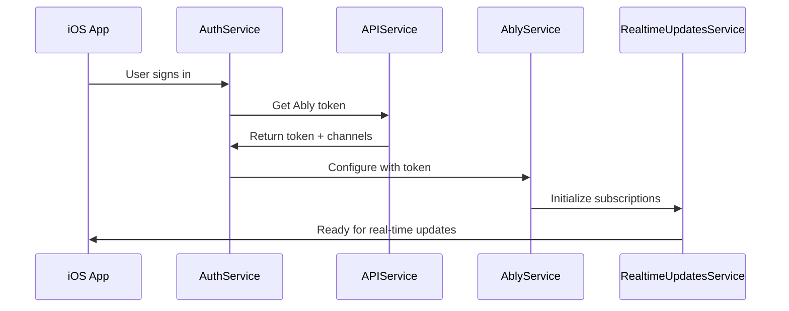
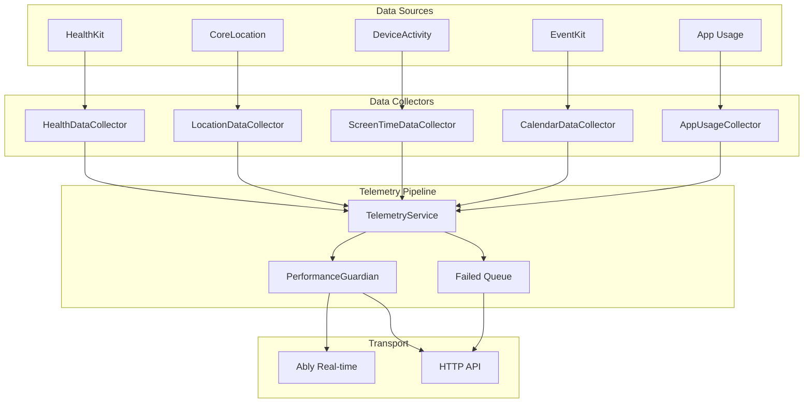

# DormWayFresh iOS Implementation Guide

**Overview**: Comprehensive implementation guide for DormWayFresh, the next-generation iOS application featuring dependency injection, real-time communication, and comprehensive data collection capabilities.

## Table of Contents

1. #project-structure|Project Structure
2. #dependency-injection-implementation|Dependency Injection Implementation
3. #real-time-communication-system|Real-time Communication System
4. #data-collection-framework|Data Collection Framework
5. #authentication-system|Authentication System
6. #ui-components-and-design-system|UI Components and Design System
7. #testing-and-debug-tools|Testing and Debug Tools
8. #performance-and-optimization|Performance and Optimization

## Project Structure

### App Architecture Overview



### Directory Structure

```
DormWayFresh/
├── App/
│   ├── DormWayApp.swift           # App entry point
│   ├── ContentView.swift          # Root view
│   ├── AppDelegate.swift          # App lifecycle
│   ├── SettingsView.swift         # Settings screen
│   └── Views/
│       ├── Auth/                  # Authentication views
│       ├── Debug/                 # Debug screens
│       ├── Onboarding/           # Onboarding flow
│       ├── Profile/              # Profile management
│       └── WelcomeView.swift     # Welcome screen
├── Core/
│   ├── DependencyInjection/
│   │   ├── Container.swift        # DI container
│   │   ├── ServiceProtocols.swift # Service protocols
│   │   └── ServiceAdapters.swift  # Service adapters
│   ├── Services/
│   │   ├── AuthService.swift      # Authentication
│   │   └── APIService.swift       # API communication
│   └── Models/
│       └── UserWidgetConfiguration.swift
└── Packages/
    ├── DWServices/               # Network & external services
    ├── DWDataCollection/         # Data collection services
    ├── DWContext/               # Context management
    ├── DormWayDS/              # Design system
    └── DWWidgets/              # Widget system
```

## Dependency Injection Implementation

### Container Architecture



### Container Implementation

```swift
@MainActor
@Observable
public final class DIContainer {
    public var services: [String: Any] = [:]
    
    public init() {
        registerServices()
        Task {
            await initializeServices()
        }
    }
    
    private func registerServices() {
        // Core services
        let authService = AuthService()
        let apiService = APIService()
        let networkService = NetworkService()
        
        // External services (from packages)
        let ablyService = AblyService()
        let realtimeService = RealtimeUpdatesService(ablyService: ablyService)
        let telemetryService = TelemetryService.shared
        
        // Register with adapters
        registerSingleton(AuthServiceProtocol.self, 
                         implementation: AuthServiceAdapter(authService))
        registerSingleton(NetworkServiceProtocol.self, 
                         implementation: NetworkServiceAdapter(networkService))
        registerSingleton(AblyServiceProtocol.self, 
                         implementation: AblyServiceAdapter(ablyService))
        registerSingleton(RealtimeUpdatesServiceProtocol.self, 
                         implementation: RealtimeUpdatesServiceAdapter(realtimeService))
        
        // Store concrete services for internal use
        services["_authService"] = authService
        services["_ablyService"] = ablyService
        services["_realtimeUpdatesService"] = realtimeService
        services["_telemetryService"] = telemetryService
    }
    
    private func initializeServices() async {
        // Initialize services that require async setup
        if let authService = services["_authService"] as? AuthService {
            await authService.initializeSession()
        }
        
        // Note: Ably initialization deferred until after authentication
    }
}
```

### Service Access Pattern

```swift
// In SwiftUI Views
struct ContentView: View {
    @EnvironmentObject var container: DIContainer
    
    private var authService: AuthServiceProtocol? {
        container.resolve(AuthServiceProtocol.self)
    }
    
    private var realtimeUpdates: RealtimeUpdatesService? {
        container.services["_realtimeUpdatesService"] as? RealtimeUpdatesService
    }
    
    var body: some View {
        // View implementation
    }
}

// App setup
@main
struct DormWayApp: App {
    @StateObject private var container = DIContainer()
    
    var body: some Scene {
        WindowGroup {
            ContentView()
                .environmentObject(container)
        }
    }
}
```

## Real-time Communication System

### Ably Service Integration



### Channel Management

```swift
@MainActor
public final class AblyService: ObservableObject {
    private var realtime: ARTRealtime?
    private var channels: [String: ARTRealtimeChannel] = [:]
    
    @Published public var isConnected = false
    @Published public var connectionState: String = "disconnected"
    
    public func configure(with token: String) async throws {
        let options = ARTClientOptions()
        options.token = token
        options.environment = "sandbox" // or "production"
        
        realtime = ARTRealtime(options: options)
        
        // Monitor connection state
        realtime?.connection.on { [weak self] stateChange in
            Task { @MainActor in
                self?.connectionState = stateChange.current.rawValue
                self?.isConnected = stateChange.current == .connected
            }
        }
        
        try await withCheckedThrowingContinuation { continuation in
            realtime?.connection.once(.connected) { _ in
                continuation.resume()
            }
            realtime?.connection.once(.failed) { stateChange in
                continuation.resume(throwing: AblyError.connectionFailed(stateChange.reason))
            }
        }
    }
    
    public func publish(channel: String, event: String, data: [String: Any]) async throws {
        guard let channel = getOrCreateChannel(channel) else {
            throw AblyError.channelNotAvailable
        }
        
        try await withCheckedThrowingContinuation { continuation in
            channel.publish(event, data: data) { error in
                if let error = error {
                    continuation.resume(throwing: error)
                } else {
                    continuation.resume()
                }
            }
        }
    }
    
    public func subscribe(to channelName: String, callback: @escaping (AblyMessage) -> Void) {
        guard let channel = getOrCreateChannel(channelName) else { return }
        
        channel.subscribe { message in
            let ablyMessage = AblyMessage(
                name: message.name,
                data: message.data,
                timestamp: message.timestamp
            )
            callback(ablyMessage)
        }
    }
}
```

### Real-time Updates Service

```swift
@MainActor
public final class RealtimeUpdatesService: ObservableObject {
    private let ablyService: AblyService
    
    @Published public var lastUserUpdate: UserUpdate?
    @Published public var lastSystemBroadcast: SystemBroadcast?
    @Published public var isListening: Bool = false
    
    private var userUpdatesChannel: String?
    private let systemBroadcastChannel = "system:broadcast"
    
    public func startListening(userId: String) async {
        let lowercaseUserId = userId.lowercased()
        userUpdatesChannel = "user:\(lowercaseUserId):updates"
        
        await setupChannelSubscriptions()
        isListening = true
    }
    
    private func setupChannelSubscriptions() async {
        // Subscribe to user-specific updates
        if let userChannel = userUpdatesChannel {
            ablyService.subscribe(to: userChannel) { [weak self] message in
                Task { @MainActor in
                    self?.handleUserUpdate(message)
                }
            }
            
            // Enter presence
            await enterPresence(on: userChannel)
        }
        
        // Subscribe to system broadcasts
        ablyService.subscribe(to: systemBroadcastChannel) { [weak self] message in
            Task { @MainActor in
                self?.handleSystemBroadcast(message)
            }
        }
    }
    
    private func handleUserUpdate(_ message: AblyMessage) {
        // Handle different update types
        switch message.name {
        case "context_update":
            // Process context update
            break
        case "widget_update":
            // Process widget update
            break
        case "notification":
            // Process notification
            break
        case "insight":
            // Process insight
            break
        default:
            DWLogger.warn("Unknown user update type: \(message.name ?? "nil")")
        }
    }
}
```

## Data Collection Framework

### Telemetry Service Architecture



### TelemetryService Implementation

```swift
@MainActor
public class TelemetryService: ObservableObject {
    public static let shared = TelemetryService()
    
    private var ablyService: AblyService?
    private var networkService: NetworkService?
    private var tokenProvider: (() async -> String?)?
    
    @Published public var isConnected = false
    @Published public var lastSyncTime: Date?
    
    private let telemetryChannel = "telemetry"
    private var failedQueue: [TelemetryEvent] = []
    
    public func configure(
        ablyService: AblyService,
        networkService: NetworkService,
        tokenProvider: @escaping () async -> String?
    ) {
        self.ablyService = ablyService
        self.networkService = networkService
        self.tokenProvider = tokenProvider
        setupAblySubscriptions()
    }
    
    public func send(_ event: TelemetryEvent) async {
        // Choose transport based on app state
        if UIApplication.shared.applicationState == .active,
           let ably = ablyService,
           ably.isConnected {
            await sendViaAbly(event)
        } else {
            await sendViaHTTP(event)
        }
    }
    
    private func sendViaAbly(_ event: TelemetryEvent) async {
        do {
            guard let ably = ablyService else {
                queueEvent(event)
                return
            }
            
            var eventDict = event.toDictionary()
            if let token = await tokenProvider?(),
               let userId = extractUserIdFromToken(token) {
                eventDict["userId"] = userId
            }
            
            try await ably.publish(
                channel: telemetryChannel,
                event: event.type.rawValue,
                data: eventDict
            )
            
            lastSyncTime = Date()
            
        } catch {
            DWLogger.error("Failed to send via Ably: \(error)")
            queueEvent(event)
        }
    }
    
    private func sendViaHTTP(_ event: TelemetryEvent) async {
        do {
            guard let network = networkService else {
                queueEvent(event)
                return
            }
            
            let response: TelemetryResponse = try await network.request(
                endpoint: "/v1/telemetry/background",
                method: "POST",
                body: event.toDictionary(),
                authType: .jwt
            )
            
            if response.success {
                lastSyncTime = Date()
            } else {
                throw NSError(domain: "Telemetry", code: 0, 
                            userInfo: [NSLocalizedDescriptionKey: "Request failed"])
            }
            
        } catch {
            DWLogger.error("Failed to send via HTTP: \(error)")
            queueEvent(event)
        }
    }
}
```

### Data Collectors

```swift
// Health Data Collector
@MainActor
public class HealthDataCollector: ObservableObject {
    private let healthStore = HKHealthStore()
    private let telemetryService = TelemetryService.shared
    
    public func requestPermissions() async throws {
        let typesToRead: Set<HKObjectType> = [
            HKObjectType.quantityType(forIdentifier: .stepCount)!,
            HKObjectType.quantityType(forIdentifier: .distanceWalkingRunning)!,
            HKObjectType.quantityType(forIdentifier: .activeEnergyBurned)!,
            HKObjectType.quantityType(forIdentifier: .heartRate)!,
            HKObjectType.categoryType(forIdentifier: .sleepAnalysis)!
        ]
        
        try await healthStore.requestAuthorization(toShare: [], read: typesToRead)
    }
    
    public func collectHealthMetrics() async {
        let metrics = HealthMetrics()
        
        // Collect step count
        metrics.stepCount = await queryStepCount()
        
        // Collect distance
        metrics.distanceWalked = await queryDistance()
        
        // Collect active calories
        metrics.activeEnergyBurned = await queryActiveCalories()
        
        // Send to telemetry
        await telemetryService.sendHealthMetrics(metrics)
    }
    
    private func queryStepCount() async -> Double? {
        guard let stepType = HKQuantityType.quantityType(forIdentifier: .stepCount) else {
            return nil
        }
        
        let calendar = Calendar.current
        let now = Date()
        let startOfDay = calendar.startOfDay(for: now)
        
        let predicate = HKQuery.predicateForSamples(
            withStart: startOfDay,
            end: now,
            options: .strictStartDate
        )
        
        return await withCheckedContinuation { continuation in
            let query = HKStatisticsQuery(
                quantityType: stepType,
                quantitySamplePredicate: predicate,
                options: .cumulativeSum
            ) { _, result, _ in
                let steps = result?.sumQuantity()?.doubleValue(for: HKUnit.count()) ?? 0
                continuation.resume(returning: steps)
            }
            
            healthStore.execute(query)
        }
    }
}

// Location Data Collector
@MainActor
public class LocationDataCollector: NSObject, ObservableObject, CLLocationManagerDelegate {
    private let locationManager = CLLocationManager()
    private let telemetryService = TelemetryService.shared
    private var campusRegions: [CLCircularRegion] = []
    
    public override init() {
        super.init()
        locationManager.delegate = self
        locationManager.desiredAccuracy = kCLLocationAccuracyBest
        locationManager.distanceFilter = 10 // meters
    }
    
    public func requestPermissions() {
        locationManager.requestAlwaysAuthorization()
    }
    
    public func startLocationTracking() {
        guard CLLocationManager.locationServicesEnabled() else { return }
        
        locationManager.startUpdatingLocation()
        locationManager.startMonitoringSignificantLocationChanges()
        
        // Set up campus geofencing
        setupCampusGeofencing()
    }
    
    public func locationManager(_ manager: CLLocationManager, didUpdateLocations locations: [CLLocation]) {
        guard let location = locations.last else { return }
        
        Task {
            await telemetryService.sendLocationUpdate(location)
        }
    }
    
    public func locationManager(_ manager: CLLocationManager, didEnterRegion region: CLRegion) {
        if let circularRegion = region as? CLCircularRegion {
            let event = TelemetryEvent(
                type: .campusEntry,
                data: [
                    "regionId": region.identifier,
                    "latitude": circularRegion.center.latitude,
                    "longitude": circularRegion.center.longitude,
                    "radius": circularRegion.radius
                ]
            )
            
            Task {
                await telemetryService.send(event)
            }
        }
    }
}
```

## Authentication System

### AuthService Implementation

```swift
@MainActor
@Observable
public final class AuthService {
    @ObservationIgnored private let supabase = SupabaseService.shared
    
    public var isAuthenticated = false
    public var currentUser: User?
    public var session: Session?
    
    public func initializeSession() async {
        do {
            session = try await supabase.session
            if let session = session {
                currentUser = session.user
                isAuthenticated = true
            }
        } catch {
            DWLogger.error("Failed to initialize session: \(error)")
        }
    }
    
    public func signInWithGoogle() async throws {
        do {
            let result = try await supabase.auth.signInWithOAuth(provider: .google)
            session = result.session
            currentUser = result.user
            isAuthenticated = session != nil
        } catch {
            throw AuthError.signInFailed(error.localizedDescription)
        }
    }
    
    public func signInWithApple() async throws {
        do {
            let result = try await supabase.auth.signInWithOAuth(provider: .apple)
            session = result.session
            currentUser = result.user
            isAuthenticated = session != nil
        } catch {
            throw AuthError.signInFailed(error.localizedDescription)
        }
    }
    
    public func signOut() async throws {
        try await supabase.auth.signOut()
        session = nil
        currentUser = nil
        isAuthenticated = false
    }
    
    public func getAccessToken() async -> String? {
        return session?.accessToken
    }
}

// Authentication Views
struct LoginView: View {
    @EnvironmentObject var container: DIContainer
    @State private var isLoading = false
    @State private var errorMessage: String?
    
    private var authService: AuthServiceProtocol? {
        container.resolve(AuthServiceProtocol.self)
    }
    
    var body: some View {
        VStack(spacing: 20) {
            // Google Sign In
            Button(action: signInWithGoogle) {
                HStack {
                    Image("google-logo")
                        .resizable()
                        .frame(width: 20, height: 20)
                    Text("Sign in with Google")
                        .fontWeight(.medium)
                }
                .frame(maxWidth: .infinity)
                .padding()
                .background(Color.white)
                .foregroundColor(.black)
                .cornerRadius(8)
                .overlay(
                    RoundedRectangle(cornerRadius: 8)
                        .stroke(Color.gray.opacity(0.3), lineWidth: 1)
                )
            }
            .disabled(isLoading)
            
            // Apple Sign In
            SignInWithAppleButton(.signIn) { request in
                request.requestedScopes = [.email, .fullName]
            } onCompletion: { result in
                handleAppleSignIn(result)
            }
            .frame(height: 50)
            .cornerRadius(8)
        }
        .padding()
    }
    
    private func signInWithGoogle() {
        isLoading = true
        errorMessage = nil
        
        Task {
            do {
                try await authService?.signInWithGoogle()
            } catch {
                errorMessage = error.localizedDescription
            }
            isLoading = false
        }
    }
    
    private func handleAppleSignIn(_ result: Result<ASAuthorization, Error>) {
        switch result {
        case .success(let authorization):
            Task {
                do {
                    try await authService?.signInWithApple()
                } catch {
                    errorMessage = error.localizedDescription
                }
            }
        case .failure(let error):
            errorMessage = error.localizedDescription
        }
    }
}
```

## UI Components and Design System

### Design System Integration

```swift
// DormWayDS Package - Typography
public struct Typography {
    public struct Heading {
        public static let h1 = Font.largeTitle.weight(.bold)
        public static let h2 = Font.title.weight(.bold)
        public static let h3 = Font.title2.weight(.semibold)
    }
    
    public struct Label {
        public static let large = Font.headline.weight(.medium)
        public static let medium = Font.subheadline.weight(.medium)
        public static let small = Font.caption.weight(.medium)
    }
    
    public struct Body {
        public static let large = Font.body
        public static let medium = Font.callout
        public static let small = Font.caption
    }
}

// Color System
public struct DormWayDesignSystem {
    public struct Color {
        public struct Semantic {
            public struct Text {
                public static let primary = SwiftUI.Color.primary
                public static let secondary = SwiftUI.Color.secondary
                public static let tertiary = SwiftUI.Color(UIColor.tertiaryLabel)
            }
            
            public struct Background {
                public static let primary = SwiftUI.Color(UIColor.systemBackground)
                public static let secondary = SwiftUI.Color(UIColor.secondarySystemBackground)
                public static let tertiary = SwiftUI.Color(UIColor.tertiarySystemBackground)
            }
        }
    }
}

// Settings View Implementation
struct SettingsView: View {
    @EnvironmentObject var container: DIContainer
    @State private var showDebugView = false
    
    private var authService: AuthServiceProtocol? {
        container.resolve(AuthServiceProtocol.self)
    }
    
    var body: some View {
        NavigationView {
            ScrollView {
                VStack(alignment: .leading, spacing: 24) {
                    // Settings Header
                    HStack {
                        Text("Settings")
                            .font(.largeTitle)
                            .fontWeight(.bold)
                            .foregroundColor(DormWayDesignSystem.Color.Semantic.Text.primary)
                        Spacer()
                        #if DEBUG
                        Button(action: { showDebugView = true }) {
                            Image(systemName: "ladybug")
                                .foregroundColor(.orange)
                                .font(.title2)
                        }
                        #endif
                    }
                    .padding(.horizontal)
                    
                    // Profile Section
                    ProfileSectionView()
                    
                    // Preferences Section
                    PreferencesSectionView()
                    
                    // About Section
                    AboutSectionView()
                    
                    // Sign Out Button
                    Button(action: signOut) {
                        Text("Sign Out")
                            .foregroundColor(.red)
                            .frame(maxWidth: .infinity)
                            .padding()
                            .background(Color.red.opacity(0.1))
                            .cornerRadius(8)
                    }
                    .padding(.horizontal)
                    .padding(.top, 20)
                }
            }
            .navigationBarHidden(true)
        }
        .sheet(isPresented: $showDebugView) {
            DebugView()
        }
    }
    
    private func signOut() {
        Task {
            try? await authService?.signOut()
        }
    }
}
```

## Testing and Debug Tools

### Debug Views

```swift
struct RealtimeUpdatesDebugView: View {
    @EnvironmentObject var container: DIContainer
    @State private var messageLog: [DebugMessage] = []
    @State private var selectedTab: DebugTab = .userUpdates
    
    private var realtimeUpdates: RealtimeUpdatesService? {
        container.services["_realtimeUpdatesService"] as? RealtimeUpdatesService
    }
    
    var body: some View {
        NavigationView {
            VStack {
                // Tab Selection
                Picker("Debug Type", selection: $selectedTab) {
                    Text("User Updates").tag(DebugTab.userUpdates)
                    Text("System Broadcasts").tag(DebugTab.systemBroadcasts)
                    Text("Connection Status").tag(DebugTab.connectionStatus)
                }
                .pickerStyle(SegmentedPickerStyle())
                .padding()
                
                // Content based on selected tab
                switch selectedTab {
                case .userUpdates:
                    UserUpdatesDebugView(realtimeUpdates: realtimeUpdates)
                case .systemBroadcasts:
                    SystemBroadcastsDebugView(realtimeUpdates: realtimeUpdates)
                case .connectionStatus:
                    ConnectionStatusDebugView()
                }
                
                Spacer()
            }
            .navigationTitle("Real-time Debug")
            .navigationBarTitleDisplayMode(.inline)
        }
    }
}

struct DebugView: View {
    @EnvironmentObject var container: DIContainer
    
    var body: some View {
        NavigationView {
            List {
                Section("Real-time Communication") {
                    NavigationLink("Ably Connection Status", destination: AblyDebugView())
                    NavigationLink("Real-time Updates", destination: RealtimeUpdatesDebugView())
                    NavigationLink("Telemetry Status", destination: TelemetryDebugView())
                }
                
                Section("Data Collection") {
                    NavigationLink("Health Data", destination: HealthDebugView())
                    NavigationLink("Location Data", destination: LocationDebugView())
                    NavigationLink("Screen Time", destination: ScreenTimeDebugView())
                }
                
                Section("Services") {
                    NavigationLink("Authentication", destination: AuthDebugView())
                    NavigationLink("Network Requests", destination: NetworkDebugView())
                    NavigationLink("Performance", destination: PerformanceDebugView())
                }
            }
            .navigationTitle("Debug Tools")
        }
    }
}
```

## Performance and Optimization

### Performance Guardian

```swift
@MainActor
public class PerformanceGuardian: ObservableObject {
    public static let shared = PerformanceGuardian()
    
    @Published public var cpuUsage: Double = 0
    @Published public var memoryUsage: Double = 0
    @Published public var isThrottled: Bool = false
    
    private let cpuThreshold: Double = 50.0 // 50% CPU
    private let memoryThreshold: Double = 0.8 // 80% memory
    
    private init() {
        startMonitoring()
    }
    
    private func startMonitoring() {
        Timer.scheduledTimer(withTimeInterval: 5.0, repeats: true) { _ in
            Task { @MainActor in
                self.updateResourceUsage()
                self.evaluateThrottling()
            }
        }
    }
    
    private func updateResourceUsage() {
        cpuUsage = getCurrentCPUUsage()
        memoryUsage = getCurrentMemoryUsage()
    }
    
    private func evaluateThrottling() {
        let shouldThrottle = cpuUsage > cpuThreshold || memoryUsage > memoryThreshold
        
        if shouldThrottle != isThrottled {
            isThrottled = shouldThrottle
            
            if isThrottled {
                DWLogger.warn("Performance guardian: Enabling throttling due to high resource usage")
                // Notify telemetry service to reduce frequency
                NotificationCenter.default.post(name: .performanceThrottleEnabled, object: nil)
            } else {
                DWLogger.info("Performance guardian: Disabling throttling")
                NotificationCenter.default.post(name: .performanceThrottleDisabled, object: nil)
            }
        }
    }
    
    public func canExecuteTask(priority: TaskPriority) -> Bool {
        if isThrottled {
            return priority == .high
        }
        return true
    }
}

// Usage in TelemetryService
extension TelemetryService {
    private func shouldSendTelemetry(priority: TaskPriority) -> Bool {
        return PerformanceGuardian.shared.canExecuteTask(priority: priority)
    }
    
    public func send(_ event: TelemetryEvent, priority: TaskPriority = .normal) async {
        guard shouldSendTelemetry(priority: priority) else {
            queueEvent(event)
            return
        }
        
        // Proceed with sending
        await sendEvent(event)
    }
}
```

### Memory Management

```swift
// Service cleanup patterns
extension DIContainer {
    public func cleanup() {
        // Stop real-time services
        if let realtimeService = services["_realtimeUpdatesService"] as? RealtimeUpdatesService {
            realtimeService.stopListening()
        }
        
        // Disconnect Ably
        if let ablyService = services["_ablyService"] as? AblyService {
            ablyService.disconnect()
        }
        
        // Clear caches
        services.removeAll()
    }
}

// App lifecycle handling
extension DormWayApp {
    private func setupAppLifecycleHandlers() {
        NotificationCenter.default.addObserver(
            forName: UIApplication.didEnterBackgroundNotification,
            object: nil,
            queue: .main
        ) { _ in
            // Reduce telemetry frequency
            Task {
                await TelemetryService.shared.enterBackgroundMode()
            }
        }
        
        NotificationCenter.default.addObserver(
            forName: UIApplication.willEnterForegroundNotification,
            object: nil,
            queue: .main
        ) { _ in
            // Resume normal telemetry
            Task {
                await TelemetryService.shared.enterForegroundMode()
            }
        }
    }
}
```

## Related Documentation

- [DormWayFresh Architecture](/docs/engineering/architecture/dormwayfresh-ios-architecture)
- [Ably Relay Architecture](/docs/engineering/architecture/ably-relay-service-architecture)
- API Router Real-time Enhancements
- iOS Authentication System
