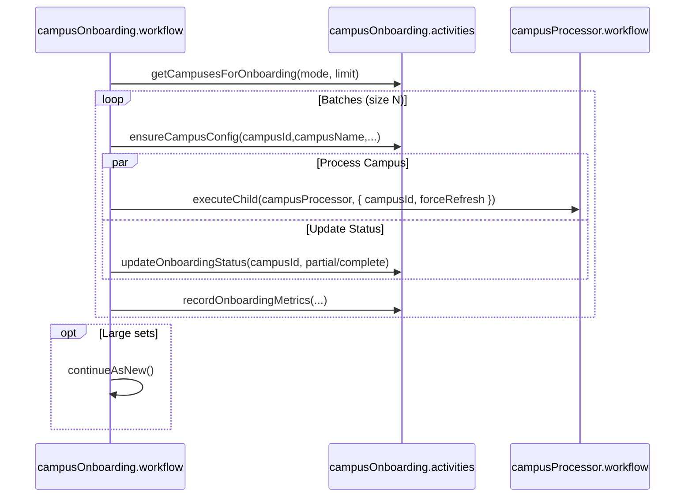
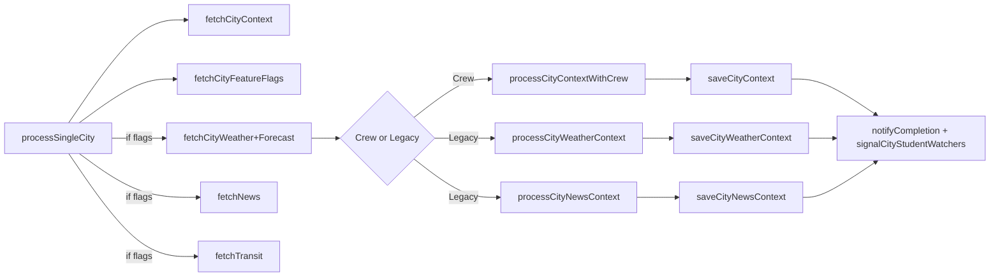
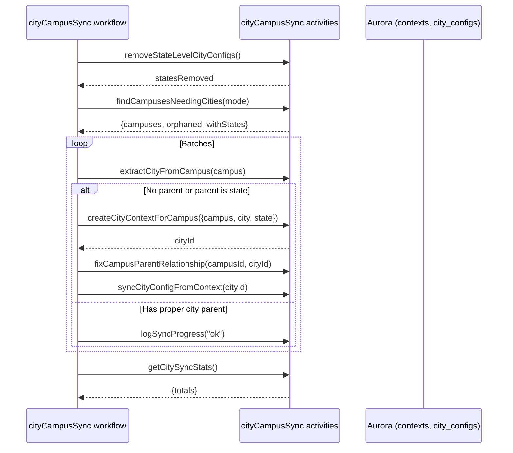
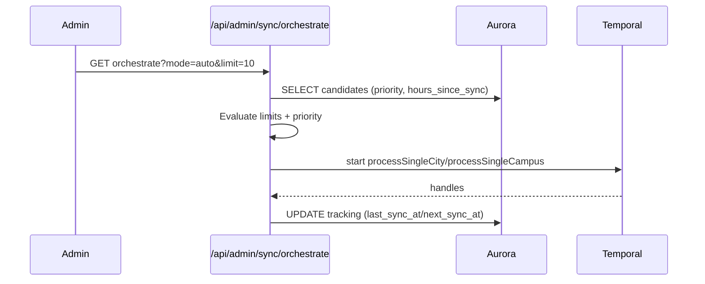

# Campus Onboarding and Sync Workflows

Last updated: 2025-12-03

## Campus Onboarding


## City Processing


## City→Campus Relationship Sync (cityCampusSync.workflow)


## Campus Processor (campusProcessor.workflow)
```mermaid
flowchart TD
  A[Start] --> B[fetchCampusDetails]
  B --> C[getCampusWorkflowConfig]
  C -->|missing| D[ensureCampusConfig]
  C --> E{hasCustomWorkflow?}
  E -->|Yes| F[executeChild(custom workflow)]
  F --> G[save custom data to service_data]
  E -->|No| H[processCampusEvents]
  H --> I[saveCampusEventsContext]
  H --> J[processParkingLots]
  J --> K[saveParkingContext]
  I & K & G --> L[updateTaskStatus]
  L --> M[End]
```

## Orchestrated Syncs


See also: [Multi-Institution Architecture Upgrade](/docs/engineering/technical/implementation-patterns/multi-institution-architecture-upgrade), Engineering/Technical/Engine/Engine Workflow DAG Analysis.
