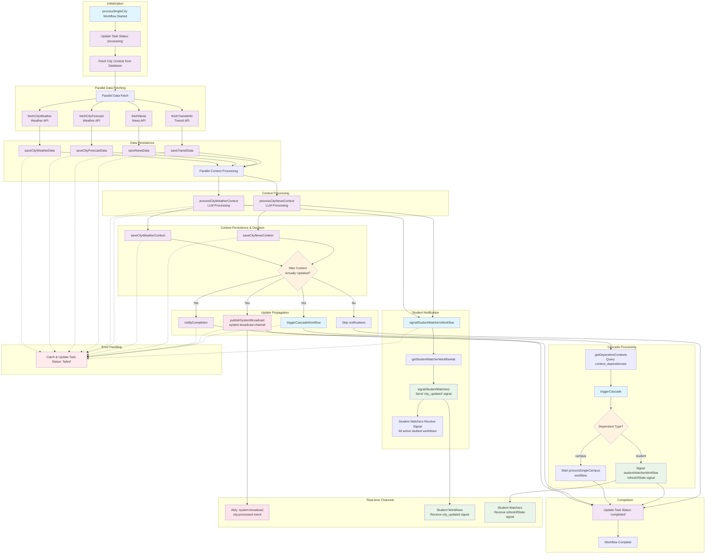
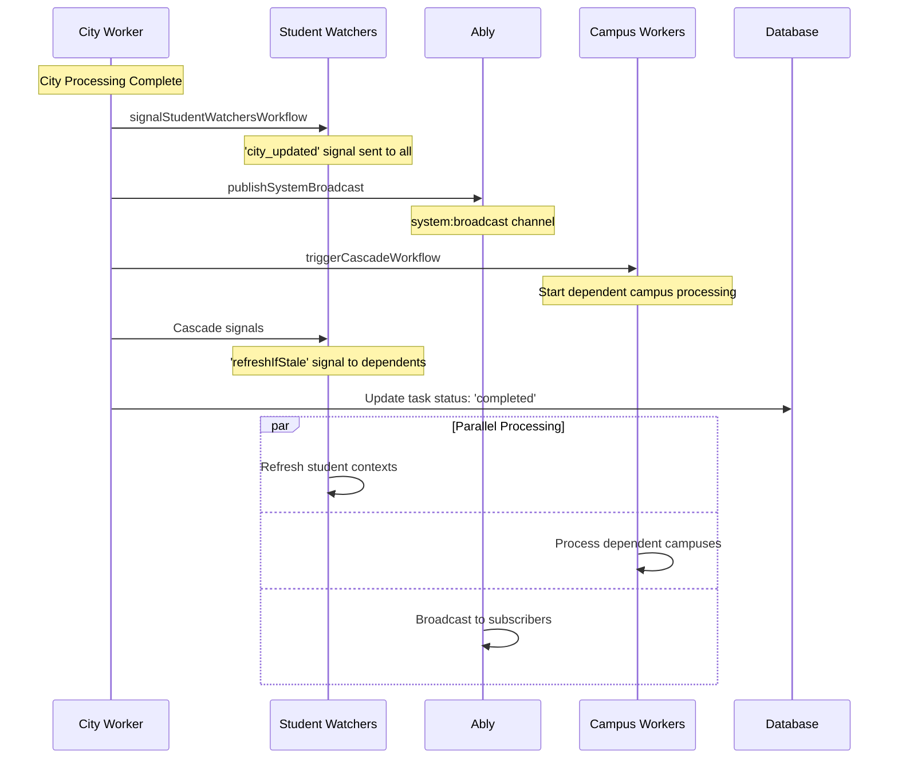

# City Processing DAG Flow

**Overview**: This document describes the complete Directed Acyclic Graph (DAG) flow when a city processing workflow is initiated in the DormWay Temporal engine, including all data flows, signals, and real-time communications. Verify workflow names in `services/engine/src/workflows/cityProcessor.workflow.ts` and related activities before reuse; names drift over time.

## Flow Trigger Points

City processing can be initiated in several ways:

1. **Scheduled Updates**: `scheduledCityUpdates` workflow runs every hour for all cities in an organization
2. **Manual Trigger**: Direct invocation of `processSingleCity` workflow
3. **API Trigger**: Via the API Router when city data needs refresh
4. **Cascade Trigger**: From other context updates that depend on city data

## Complete DAG Flow



## Detailed Flow Breakdown

### Phase 1: Initialization & Data Fetching

**Workflow Start**:
- **Trigger**: `processSingleCity(cityId, jobId?)` 
- **Task Queue**: `city-worker`
- **Worker**: City Worker with `cityActivities` + `ablyActivities`

**Data Fetching (Parallel)**:
```typescript
const [weatherData, forecastData, newsData, transitData] = await Promise.all([
  cityActivities.fetchCityWeather(cityId, cityMetadata),
  cityActivities.fetchCityForecast(cityId, cityMetadata), 
  cityActivities.fetchNews(cityId, cityMetadata),
  cityActivities.fetchTransitInfo(cityId, cityMetadata)
]);
```

**External APIs Called**:
- Weather API (current conditions)
- Weather API (forecast data)
- News API (city/state news)
- Transit API (public transportation)

### Phase 2: Data Persistence

**Raw Data Storage**:
```typescript
await cityActivities.saveCityForecastData(cityId, forecastData);
await cityActivities.saveCityWeatherData(cityId, weatherData);
const parsedTransitData = await cityActivities.saveTransitData(cityId, transitData);
const parsedNewsData = await cityActivities.saveNewsData(cityId, newsData);
```

**Database Tables Updated**:
- `city_weather_data` - Current weather conditions
- `city_forecast_data` - Weather forecasts
- `city_news_data` - News articles for the city
- `city_transit_data` - Public transportation information

### Phase 3: LLM Context Processing

**Parallel Context Generation**:
```typescript
const [weatherContextData, newsContextData] = await Promise.all([
  cityActivities.processCityWeatherContext(cityId, cityInfo, weatherData, forecastData),
  cityActivities.processCityNewsContext(cityId, cityInfo, parsedNewsData)
]);
```

**LLM Processing**:
- **Weather Context**: Combines current weather + forecast into actionable insights
- **News Context**: Processes news articles into relevant campus/student information
- **Models Used**: Configured LLM providers (e.g., OpenAI, Anthropic)
- **Output**: Structured JSON context data for downstream consumption

### Phase 4: Student Notification

**Signal Distribution**:
```typescript
await executeChild('signalStudentWatchersWorkflow', {
  workflowId: `signal-student-watchers-${cityId}-${Date.now()}`,
  taskQueue: taskQueues.student,
  args: ['city_updated', cityId, weatherContextData, newsContextData]
});
```

**Student Watcher Workflow Actions**:
1. **Query**: `getStudentWatcherWorkflowIds()` - Fetch all active student workflows
2. **Signal**: Send `city_updated` signal to all student watchers
3. **Payload**: Includes `cityId`, `weatherContextData`, `newsContextData`
4. **Result**: Student workflows can refresh their context with new city data

### Phase 5: Context Persistence & Decision Point

**Context Storage**:
```typescript
const wasWeatherContextUpdated = await cityActivities.saveCityWeatherContext(cityId, weatherContextData);
const wasNewsContextUpdated = await cityActivities.saveCityNewsContext(cityId, newsContextData);
```

**Database Tables Updated**:
- `contexts` table - City weather and news context records
- Hash-based deduplication prevents unnecessary updates

**Decision Logic**:
```typescript
if (wasWeatherContextUpdated || wasNewsContextUpdated) {
  // Proceed with notifications and cascades
} else {
  // Skip notifications - no actual changes
}
```

### Phase 6: System Broadcasting

**System-Wide Notification**:
```typescript
await ablyActivities.publishSystemBroadcast('city.processed', {
  contextId: cityId,
  contextType: 'city',
  name: cityContext.metadata.name,
  metadata: {
    weatherUpdated: wasWeatherContextUpdated,
    newsUpdated: wasNewsContextUpdated,
    state: cityContext.metadata.state,
    location: cityContext.metadata.location
  }
});
```

**Ably Channel**: `city:{cityId}` (e.g., `city:city_ann_arbor_mi`)
**Event Type**: `city.processed`
**Subscribers**: Services/apps subscribed to specific city updates
**Use Cases**: 
- City-specific real-time dashboards
- Location-based user notifications
- Reduced channel overhead by scoping to city

### Phase 7: Cascade Triggering

**Dependency Resolution**:
```typescript
await executeChild('triggerCascadeWorkflow', {
  workflowId: `cascade-from-city-${cityId}-${Date.now()}`,
  taskQueue: taskQueues.triggerCascade,
  args: ['city', cityId]
});
```

**Cascade Workflow Actions**:

1. **Query Dependencies**: 
   ```sql
   SELECT target_context_id, dependency_type 
   FROM context_dependencies 
   WHERE source_context_id = cityId
   ```

2. **Trigger Dependent Workflows**:
   - **Campus Contexts**: Start `processSingleCampus` workflows
   - **Student Contexts**: Signal `studentWatcherWorkflow` with `refreshIfStale`

3. **Workflow Spawning**:
   ```typescript
   // For campus dependencies
   await client.start('processSingleCampus', {
     workflowId: `campus-context-${depId}-${Date.now()}`,
     taskQueue: config.taskQueues.campus,
     args: [depId]
   });
   
   // For student dependencies  
   await client.signalWithStart('studentWatcherWorkflow', {
     workflowId: `student-watcher-${depId}`,
     taskQueue: config.taskQueues.student,
     signal: 'refreshIfStale',
     signalArgs: [true],
     args: [depId]
   });
   ```

## Real-time Communication Flows

### Ably Channels Used

1. **System Broadcast**: `system:broadcast`
   - **Event**: `city.processed`
   - **Payload**: City metadata + processing status
   - **Consumers**: System monitoring, admin dashboards

2. **Student Signals**: Direct Temporal workflow signals
   - **Signal**: `city_updated` 
   - **Target**: All active `studentWatcherWorkflow` instances
   - **Payload**: City ID + processed context data

3. **Cascade Signals**: Direct Temporal workflow signals
   - **Signal**: `refreshIfStale`
   - **Target**: Dependent student watcher workflows
   - **Purpose**: Trigger context refresh with new city data

### Signal Propagation Timeline



## Performance Characteristics

### Parallel Execution Points

1. **Data Fetching**: Weather, forecast, news, transit (4 parallel API calls)
2. **Context Processing**: Weather context + news context (2 parallel LLM calls)
3. **Post-Processing**: Student signals + system broadcast + cascade trigger (3 parallel operations)

### Scaling Considerations

- **API Rate Limits**: External weather/news APIs may have rate limits
- **LLM Processing**: Context generation can be CPU/time intensive
- **Database Connections**: Multiple parallel writes require connection pooling
- **Student Count**: Signal propagation scales with number of active student workflows

### Typical Execution Times

- **Data Fetching**: 2-5 seconds (depending on API latency)
- **LLM Processing**: 3-10 seconds (depending on context complexity)
- **Database Operations**: 100-500ms per operation
- **Signal Propagation**: 100-200ms per workflow
- **Total Workflow Time**: 10-30 seconds for typical city

## Error Handling & Recovery

### Activity-Level Retries

All activities have built-in retry policies:
```typescript
const defaultActivityOptions = {
  startToCloseTimeout: '1 minute',
  retry: {
    maximumAttempts: 3,
  },
};
```

### Failure Scenarios

1. **API Failures**: Weather/news APIs unavailable
   - **Recovery**: Retry with exponential backoff
   - **Fallback**: Skip processing for that data type

2. **LLM Processing Failures**: Context generation fails
   - **Recovery**: Retry with different model/parameters
   - **Fallback**: Use cached context or skip updates

3. **Database Failures**: Unable to save context
   - **Recovery**: Retry database operations
   - **Fallback**: Mark task as failed, no cascade

4. **Signal Failures**: Unable to notify dependents
   - **Recovery**: Continue workflow, log warnings
   - **Impact**: Some students may have stale context

### Task Status Tracking

Throughout the workflow, task status is updated:
- **Start**: `'processing'`
- **Success**: `'completed'`
- **Failure**: `'failed'` with error message

## Dependencies & Context Relationships

### Database Schema Relationships

```sql
-- City context depends on organization
contexts (city) → organizations

-- Campus contexts depend on city contexts  
context_dependencies: campus.source → city.target

-- Student contexts depend on campus contexts
context_dependencies: student.source → campus.target

-- Therefore: city updates cascade to campus → student
```

### Cascade Trigger Matrix

| Source Context | Dependent Type | Action Taken |
|---------------|---------------|--------------|
| City | Campus | Start `processSingleCampus` workflow |
| City | Student | Signal `refreshIfStale` to student watcher |
| Campus | Student | Signal `refreshIfStale` to student watcher |
| Student | None | No cascade (leaf node) |

## Monitoring & Observability

### Key Metrics to Monitor

1. **Workflow Success Rate**: Percentage of city processing workflows that complete successfully
2. **Processing Duration**: Time from start to completion for city workflows
3. **API Response Times**: External API latency for weather/news/transit
4. **LLM Processing Time**: Time spent in context generation
5. **Cascade Fan-out**: Number of dependent workflows triggered
6. **Signal Delivery Rate**: Percentage of student signals successfully delivered

### Logging Points

- Workflow start/completion
- Each API call with response times
- LLM processing duration and token usage
- Context save operations and hash comparisons
- Signal delivery attempts and results
- Error conditions with full context

### Alerts to Configure

- City processing failure rate > 5%
- Average processing time > 45 seconds
- External API failure rate > 10%
- Signal delivery failure rate > 10%
- Context save failure rate > 1%

## Related Documentation

- Campus Processing DAG Flow
- Student Context Processing
- Temporal Architecture Overview
- Ably Real-time Communication
- [Context Dependencies Schema](/docs/engineering/architecture/sot-context-system)
