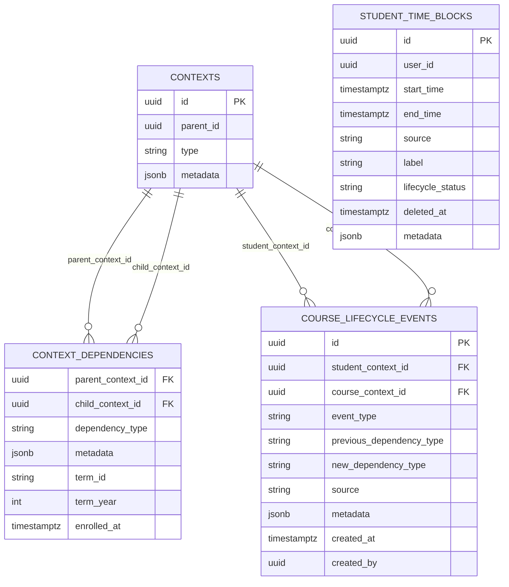
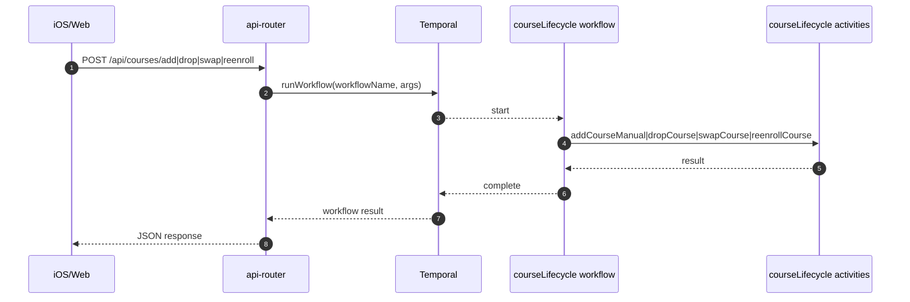
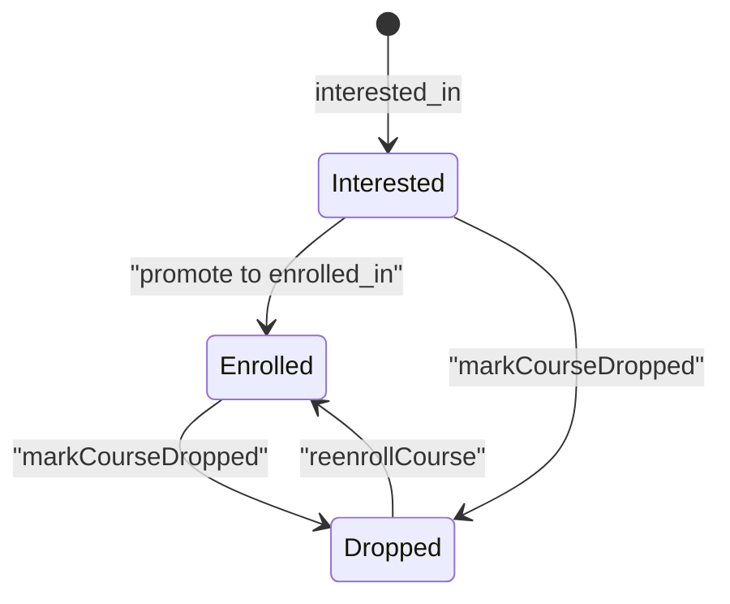
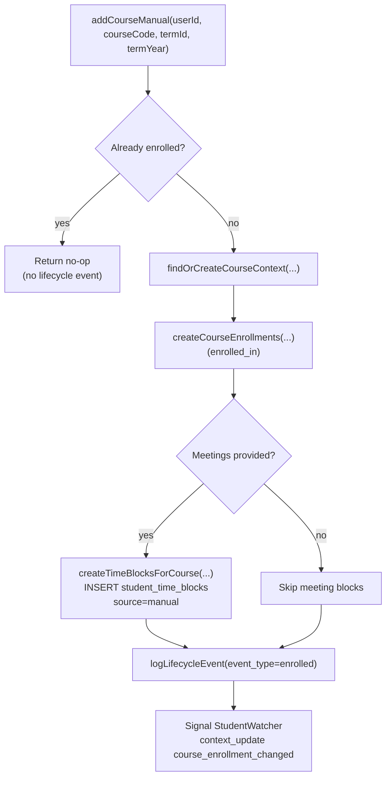
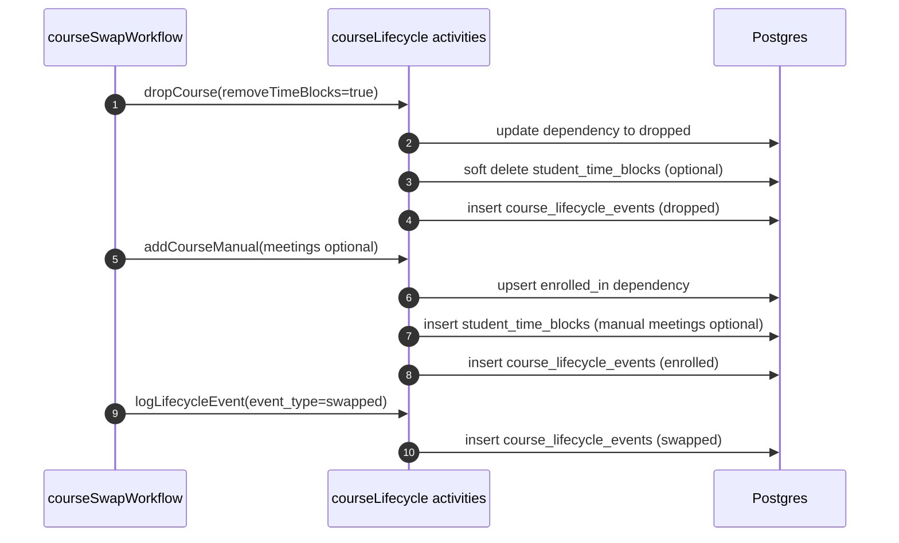
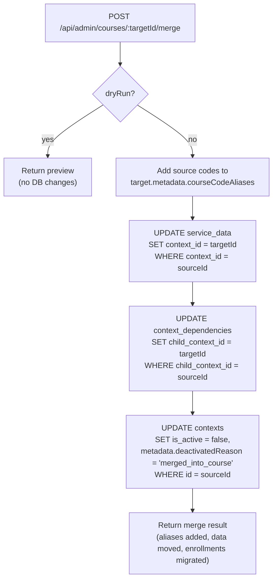

# Course Lifecycle (Add/Drop/Swap) Deep Dive (Current)

This document describes how DormWay **currently** handles manual course lifecycle operations:

- add a course
- drop a course
- swap courses (drop + add)
- re-enroll in a dropped course

It focuses on **what gets written** to:

- `contexts` (course contexts)
- `context_dependencies` (enrollment edges)
- `course_lifecycle_events` (audit trail)
- `student_time_blocks` (class meetings + assignment deadlines)

Code entry points (highest signal):

- API routes: `.repos/dormway-platform/services/api-router/src/routes/course-lifecycle-routes.ts`
- Workflows: `.repos/dormway-platform/services/engine/src/workflows/courseLifecycle.workflow.ts`
- Activities: `.repos/dormway-platform/services/engine/src/activities/courseLifecycle.activities.ts`
- Enrollment “drop” primitive: `.repos/dormway-platform/services/engine/src/activities/course.activities.ts` (`markCourseDropped`)
- Enrollment-aware time block deletion/restore: `.repos/dormway-platform/services/engine/src/services/enrollment-aware-deletion.ts`
- DB schema + helper function: `.repos/dormway-platform/infrastructure/database/migrations/20251208_course_lifecycle_events.sql`

Related docs:

- [Term Management & Term Resolution Deep Dive (Current)](/docs/engineering/technical/engine/term-management-term-resolution-deep-dive-current)
- [Schedules, Time Blocks, and Reconciliation](/docs/engineering/technical/calendar/schedules-time-blocks-and-reconciliation)
- [scheduleProcessor Workflow Deep Dive (Current)](/docs/engineering/technical/calendar/scheduleprocessor-workflow-deep-dive-current)
- [Course Drops: Downstream Effects (Current)](/docs/engineering/technical/calendar/course-drops-downstream-effects)
- [StudentWatcher Workflow Deep Dive (Current)](/docs/engineering/technical/studentwatcher/studentwatcher-workflow-deep-dive-current)

---

## 1) Core model (what “course lifecycle” means in DormWay)

DormWay models a student’s “courses” via the **context graph**:

- A **course context** is a `contexts` row with `type='course'`.
- A student is “enrolled” (or “dropped”, etc.) via an edge in `context_dependencies`:
  - `parent_context_id = student_context_id`
  - `child_context_id = course_context_id`
  - `dependency_type` encodes the relationship state.

Course lifecycle adds:

- an audit trail row in `course_lifecycle_events` for add/drop/swap/etc.
- optional schedule cleanup/restore in `student_time_blocks` for drops and re-enrolls.

### Minimal ERD (tables used directly by the flows)



---

## 2) Workflow entry points (HTTP → Temporal)

API Router exposes endpoints that start Temporal workflows:

- `POST /api/courses/add` → `courseAddWorkflow`
- `POST /api/courses/drop` → `courseDropWorkflow`
- `POST /api/courses/swap` → `courseSwapWorkflow`
- `POST /api/courses/reenroll` → `courseReenrollWorkflow`

Implementation:

- `.repos/dormway-platform/services/api-router/src/routes/course-lifecycle-routes.ts`

High-level sequence:



---

## 3) Enrollment dependency “states” (as used by lifecycle code)

These are the states the lifecycle paths actively check or mutate:

- `enrolled_in` (primary “active enrollment”)
- `interested_in` (can be promoted to enrolled)
- `dropped` (explicitly dropped; should not be re-enrolled automatically)

Other states exist and are used elsewhere (term transitions, history, etc):

- `completed`, `has_taken`, `provisional_enrollment` (not the focus of this doc)

State transitions used here (simplified):



---

## 4) Add course (manual)

### 4.1 What it does

`courseAddWorkflow` calls `addCourseManual`, which:

1) checks idempotency (already enrolled by exact courseCode + campus)
2) finds/creates the course context (centralized matching)
3) upserts an `enrolled_in` dependency with term metadata
4) optionally creates **class meeting blocks** in `student_time_blocks` (source=`manual`)
5) logs a `course_lifecycle_events` row (`event_type='enrolled'`)
6) signals StudentWatcher that enrollment changed (context update cascade)

Code:

- Workflow: `.repos/dormway-platform/services/engine/src/workflows/courseLifecycle.workflow.ts` (`courseAddWorkflow`)
- Activity: `.repos/dormway-platform/services/engine/src/activities/courseLifecycle.activities.ts` (`addCourseManual`)

### 4.2 Idempotency behavior (important)

`addCourseManual` short-circuits if the student is already enrolled in a matching course context:

- It queries `contexts.metadata.courseCode == courseCode` scoped by `campusContextId`, then joins `context_dependencies` for `dependency_type='enrolled_in'`.
- If found, it returns success **without** creating a new lifecycle event (it returns `lifecycleEventId=''`).

Implication:

- You can have a successful “add” request with no audit trail row if it was a no-op.

### 4.3 What gets written (DB)



### 4.4 Meeting blocks (manual schedule) are written to `time_blocks` for reconciliation

If the request includes a meetings list (or legacy `schedule`), `addCourseManual` calls:

- `.repos/dormway-platform/services/engine/src/activities/courseLifecycle.activities.ts` (`createTimeBlocksForCourse`)

Behavior:

- Resolves term date range via `resolveSemesterDates(campusContextId, termId)`:
  - priority: `campus_configs.academic_calendar` → `contexts.metadata` legacy → parse `{season}_{year}` → 16-week fallback
- Resolves timezone via `getCampusTimezone(campusContextId)`:
  - priority: `campus_configs.campus_metadata.timezone` → `contexts.metadata` → infer from state → default `America/New_York`
- Expands weekly recurrence into individual instances (UTC-safe) via `expandWeeklyRecurrence`
- Batch inserts into `time_blocks` with:
  - `source_type = 'manual_course_add'`
  - `event_type = 'class'`
  - `metadata.course_context_id`, `metadata.course_code`, `metadata.meeting_type`

Uniqueness:

- `ON CONFLICT (user_id, start_time, label, source)` updates the existing row.

Important interaction:

- Manual class blocks now flow through `time_blocks → scheduleProcessor → student_time_blocks` so they follow the same dedupe/precedence rules as schedule imports.

---

## 5) Drop course

### 5.1 What it does

`courseDropWorkflow` calls `dropCourse`, which:

1) loads current enrollment dependency state (`enrolled_in` or `interested_in`)
2) marks the course as dropped (`dependency_type='dropped'`) using the shared primitive `markCourseDropped`
3) optionally soft-deletes student time blocks for that course (`student_time_blocks`)
4) logs a `course_lifecycle_events` row (`event_type='dropped'`)
5) signals StudentWatcher (context update cascade)

Code:

- Workflow: `.repos/dormway-platform/services/engine/src/workflows/courseLifecycle.workflow.ts` (`courseDropWorkflow`)
- Activity: `.repos/dormway-platform/services/engine/src/activities/courseLifecycle.activities.ts` (`dropCourse`)
- Shared primitive: `.repos/dormway-platform/services/engine/src/activities/course.activities.ts` (`markCourseDropped`)

### 5.2 Idempotency behavior

`dropCourse` returns a success no-op if:

- there is a `dropped` dependency edge, and
- there is no current `enrolled_in` or `interested_in` edge

Like add, this returns `lifecycleEventId=''` for the idempotent no-op case.

### 5.3 Enrollment update semantics (`markCourseDropped`)

`markCourseDropped` attempts:

1) promote `enrolled_in` → `dropped`
2) else promote `interested_in` → `dropped`
3) else upsert a new `dropped` dependency edge

It writes drop metadata including:

- `archived=true`, `archived_at`, `dropped_at`
- `dropped_source` (defaults to `schedule_import` if omitted)
- `intentional_drop` is set when `dropped_source === 'manual'`

That last flag is used elsewhere as a guardrail to avoid re-enrolling a user into a course they explicitly dropped.

### 5.4 Optional schedule cleanup (soft delete)

If `removeTimeBlocks=true`, drop calls:

- `.repos/dormway-platform/services/engine/src/services/enrollment-aware-deletion.ts` (`cleanupDroppedCourseEvents`)

Behavior:

- `UPDATE student_time_blocks SET lifecycle_status='deleted', deleted_at=NOW() ...`
- matches rows where `metadata.course_context_id == droppedCourseContextId`
- adds `metadata.drop_reason = 'course_dropped'` and timestamps

---

## 6) Swap courses

`courseSwapWorkflow` calls `swapCourse`, which:

1) drops the old course (with `removeTimeBlocks=true`)
2) adds the new course (optionally with meetings + section)
3) logs an additional lifecycle event `event_type='swapped'`

Net effect:

- You may see multiple lifecycle events for one swap action:
  - `dropped` (old course)
  - `enrolled` (new course)
  - `swapped` (new course; with metadata linking old→new)

Code:

- `.repos/dormway-platform/services/engine/src/activities/courseLifecycle.activities.ts` (`swapCourse`)



---

## 7) Re-enroll (undo a drop)

`reenrollCourse`:

1) checks if an `enrolled_in` edge already exists; if so, it deletes any stale `dropped` edge
2) else updates the `dropped` edge back to `enrolled_in` and sets:
   - `term_id`, `term_year`, `enrolled_at=NOW()`
   - metadata includes `reenrolled=true`, `reenrolled_by`, timestamps
3) restores dropped time blocks:
   - flips `student_time_blocks.lifecycle_status` from `deleted` back to `active` for the course
4) logs a lifecycle event with `event_type='unarchived'` (used here to represent re-enrollment)

Code:

- `.repos/dormway-platform/services/engine/src/activities/courseLifecycle.activities.ts` (`reenrollCourse`)
- `.repos/dormway-platform/services/engine/src/services/enrollment-aware-deletion.ts` (`restoreDroppedCourseEvents`)

---

## 8) Term tagging in lifecycle flows (what gets written)

Add, swap, and reenroll all carry term inputs (`termId`, `termYear`).

Current behavior by path:

- Manual add:
  - calls `createCourseEnrollments(..., { termId, termYear, section })`
  - which upserts dependency metadata with `term`, `term_id`, `term_year`
  - and the DB layer extracts `term_id`/`term_year` columns from metadata on upsert.
- Re-enroll:
  - directly updates the `context_dependencies.term_id` and `term_year` columns (and adds metadata mirrors).
- Drop:
  - does not change term columns; it changes `dependency_type` to `dropped` and adds “drop metadata”.

Term selection consistency matters because other parts of the system filter enrollments by:

- `edge.metadata.term` (dashboard)
- `context_dependencies.term_id/term_year` (DormWay Core term aggregation)

See: [Term Management & Term Resolution Deep Dive (Current)](/docs/engineering/technical/engine/term-management-term-resolution-deep-dive-current)

---

## 9) Merge courses (admin operation) - DORM-874

### 9.1 Problem statement

When students upload syllabi AND import their schedule via ICS, the system can create duplicate courses:
- ICS import creates courses with synthetic codes (e.g., `CS 201`, `LANG 101`)
- Syllabus upload creates courses with extracted codes (e.g., `CMSC 14200`, `HUM 17100`)

These often refer to the same course but aren't automatically linked, creating "orphan" courses (courses with syllabus data but no schedule data).

### 9.2 What it does

The course merge operation (admin-only) consolidates duplicate courses:

1. **Add aliases**: Source course codes are added to target's `metadata.courseCodeAliases`
2. **Move service data**: All `service_data` records (syllabi, braingains) transferred to target course
3. **Migrate enrollments**: `context_dependencies` edges moved from source to target
4. **Deactivate source**: Source course marked `is_active=false` with `metadata.deactivatedReason='merged_into_course'`

### 9.3 API endpoints

Code entry point: `.repos/dormway-platform/services/api-router/src/routes/admin/course-maintenance-routes.ts`

**Orphan detection:**
```
GET /api/admin/courses/orphans
```
Returns courses with syllabus data but no schedule data (time blocks from ICS import).

**Merge candidates (auto-suggest):**
```
GET /api/admin/courses/:courseId/merge-candidates
```
Finds potential targets based on same campus, similar name (trigram > 0.3), similar code.

**Manual search:**
```
GET /api/admin/courses/:courseId/search-merge-targets?q=<query>
```
Search any course on same campus when auto-suggestions don't match.

**Execute merge:**
```
POST /api/admin/courses/:targetCourseId/merge
Body: {
  sourceCourseId: string,
  addAliases?: boolean,      // default: true
  moveServiceData?: boolean, // default: true
  deactivateSource?: boolean, // default: true
  dryRun?: boolean           // preview mode
}
```

### 9.4 What gets written (DB)



### 9.5 Admin UI

- **OrphanCoursesTab**: Lists orphan courses with "Find Merge Target" button
- **CourseMergeDialog**: Two-tab interface for Suggested matches and manual Search
- Preview shows what will be transferred before confirmation

Code:
- `.repos/dormway-platform/services/dormway-admin/src/pages/courses/OrphanCoursesTab.tsx`
- `.repos/dormway-platform/services/dormway-admin/src/pages/courses/CourseMergeDialog.tsx`

### 9.6 Related: ICS parser course name fix

The ICS parser prompt was updated to ensure synthetic course codes don't replace actual course names:

```
CRITICAL: course_name MUST ALWAYS be the full SUMMARY text from the ICS event,
even when generating a synthetic course_code. NEVER use the synthetic code as the course_name.
```

Code: `.repos/dormway-platform/services/engine/src/prompts/icsScheduleParser.ts`
