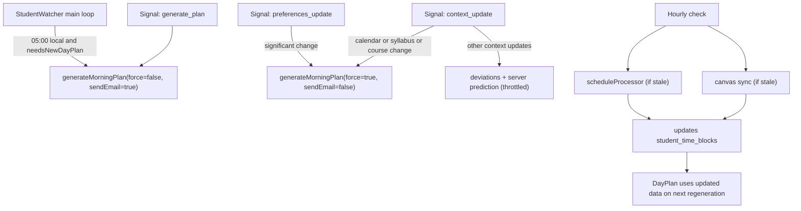
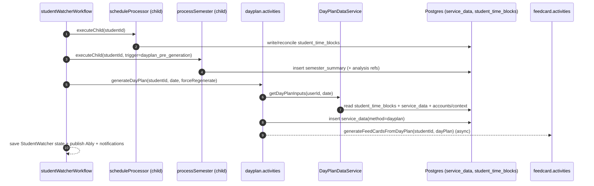

# DayPlan & Semester Summary Generation Deep Dive (Current)

This doc explains **what causes DayPlan regeneration**, **how “semester summary” is generated**, and **the orchestration/priority rules** that determine what runs first (and what gets skipped).

Related:

- [How DormWay Works](/docs/engineering/architecture/how-dormway-works)
- [StudentWatcher Workflow Deep Dive (Current)](/docs/engineering/technical/studentwatcher/studentwatcher-workflow-deep-dive-current)
- [processSemester Workflow Deep Dive (Current)](/docs/engineering/technical/engine/processsemester-workflow-deep-dive-current)
- [Schedules, Time Blocks, and Reconciliation](/docs/engineering/technical/calendar/schedules-time-blocks-and-reconciliation)

Primary code references (current):

- StudentWatcher orchestrator: `.repos/dormway-platform/services/engine/src/workflows/studentWatcher.simplified.workflow.ts`
- Schedule reconciliation workflow: `.repos/dormway-platform/services/engine/src/workflows/studentProcessor.workflow.ts` (`scheduleProcessor`)
- DayPlan generation activity: `.repos/dormway-platform/services/engine/src/activities/dayplan.activities.ts` (`generateDayPlan`)
- DayPlan input assembler (core): `.repos/dormway-platform/services/shared/dormway-core/src/domains/day-plan-data/day-plan-data.service.ts` (`DayPlanDataService.getDayPlanInputs`)
- Semester orchestration workflow: `.repos/dormway-platform/services/engine/src/workflows/semesterProcessor.workflow.ts` (`processSemester`)
- Semester summary writer + analysis prompts: `.repos/dormway-platform/services/engine/src/activities/semester.activities.ts` (`writeSemesterSummary`, `runSemesterWorkloadAnalysis`, etc.)

---

## 1) Mental model (what “generation” actually means)

There are two distinct “daily intelligence artifacts” that get recomputed:

1) **DayPlan** (per-user, per-day)
   - Stored as `service_data(method='dayplan', user_id=<studentId>)`
   - Used by: morning email/push, “Task Bank” aggregation, and downstream feed cards.

2) **semester_summary** (per-user, per-term)
   - Stored as `service_data(method='semester_summary', context_id=<studentContextId>, user_id=<studentId>)`
   - Used by: academic widgets (semester view), and as “semester insights” injected into DayPlan generation.

Key coupling: **StudentWatcher runs `processSemester` before generating a DayPlan** so that DayPlan can include fresh semester insights.

---

## 2) Triggers (what causes regeneration)

DayPlan generation is primarily controlled by **StudentWatcher** and can be triggered by:

### 2.1 Scheduled triggers inside StudentWatcher

- **05:00 user local time** (only when the plan is missing or for a new day)
  - Generates the day’s plan and attempts notifications (email/push based on prefs).
- **Hourly-ish auto sync checks**
  - `scheduleProcessor` runs when calendar reconciliation is stale (default: 6h).
  - Canvas sync runs when stale (default: 6h) via PAT or ICS.
  - Important nuance: these syncs **update underlying data** but do **not** automatically regenerate DayPlan.
- **00:00 user local time**
  - Workflow runs `continueAsNew` (Temporal best practice) to keep history bounded.

### 2.2 Manual triggers (signals and admin actions)

- `generate_plan` signal
  - Used by admin endpoints and “manual regenerate” paths.
  - Can set `forceRegenerate` and `sendEmail`.
  - API Router admin entry: `.repos/dormway-platform/services/api-router/src/routes/admin/dayplan-admin-actions.ts`

### 2.3 Data-driven triggers (context_update)

StudentWatcher receives `context_update` signals from other workflows (notably syllabus + course lifecycle), and applies “heavy” actions only for specific update types:

- **Calendar update** (triggers DayPlan regeneration)
  - `update.type === 'calendar'` OR `update.data.originalEventType === 'calendar_data_updated'` OR `calendar.sync`
- **Syllabus events** (triggers DayPlan regeneration)
  - `update.type === 'syllabus_added' | 'syllabus_update'`
- **Course enrollment/lifecycle changes** (triggers DayPlan regeneration)
  - Emitted by course lifecycle workflows via `notifyStudentWatcherContextUpdate`
- **Everything else**
  - No regeneration; instead the update is used for deviation detection and/or server-mode context prediction (throttled).



---

## 3) Orchestration + priority (what runs first)

When StudentWatcher decides to generate/regenerate a plan, it calls `generateMorningPlan(...)`. The **happy-path ordering** is:

1) (Best-effort) capture a **server-mode context prediction**
2) Run `scheduleProcessor` (calendar reconciliation)
3) Run `processSemester` (term intelligence + write `semester_summary`)
4) Run `dayPlanActivities.generateDayPlan` (LLM-based plan creation)
5) Persist workflow state, publish Ably updates, optionally send notifications
6) Fire-and-forget: generate Home Feed cards from the plan



### 3.1 Concurrency / dedupe rules (important)

StudentWatcher uses two mechanisms to limit thrash:

- `isPlanGenerationInProgress` (in-memory lock inside the workflow)
  - If a regeneration is already running, additional triggers are skipped (no queue).
- Cooldown check (persisted):
  - In `generateMorningPlan`, if `lastPlanGeneration` is very recent and `forceRegenerate=false`, it returns the existing plan and **skips scheduleProcessor + processSemester**.
  - Current implementation uses ~2 minutes of cooldown (despite older “5 minute” wording in logs).

Practical implication: “regenerate” triggers are **best-effort**, not guaranteed to run for every incoming event.

---

## 4) Data dependencies (what each step reads/writes)

### 4.1 scheduleProcessor (calendar reconciliation)

Orchestrator: `.repos/dormway-platform/services/engine/src/workflows/studentProcessor.workflow.ts` (`scheduleProcessor`)

Reads (high level):

- External calendars (Google, mobile, LMS/ICS) via activities
- Enrolled course events (from `time_blocks` / enrollments)
- Syllabus-derived events (stored as `service_data(method='fetch_syllabus_events')`)

Writes:

- `student_time_blocks` (the student’s unified timeline)
- Publishes an Ably “schedule_reconciliation_complete” dashboard update

### 4.2 processSemester (semester summary generation)

Orchestrator: `.repos/dormway-platform/services/engine/src/workflows/semesterProcessor.workflow.ts` (`processSemester`)

Reads (high level):

- Student context + campus config (term resolution)
- Enrollments (`context_dependencies`, `dependency_type='enrolled_in'`, with optional `term_id/term_year`)
- Processed syllabi (`service_data(method='processed_syllabus_crew' ...)`)
- Schedule evidence / time blocks in the term window (from assembled prompt variables + normalized course data)
- Optional extra inputs (e.g. `term_dates`, external calendars)

Writes:

- Several intermediate analysis artifacts as `service_data` (e.g. workload/conflict/planner)
- `service_data(method='semester_summary', context_id=<studentContextId>, user_id=<studentId>)`

### 4.3 DayPlan generation

Orchestrator: `.repos/dormway-platform/services/engine/src/activities/dayplan.activities.ts` (`generateDayPlan`)

Inputs come from `DayPlanDataService`:

- `student_time_blocks` (schedule blocks for the day; timezone-aware filtering)
- `student_time_blocks` assignments (type=`assignment`, next ~7 days)
- `service_data` calendar events (type=`calendar_event`)
- `accounts.metadata.preferences` + PreferencesService (dayplan prefs, notification prefs)
- Campus + city context from `service_data` + config (via `CampusService` / `CityService`)
- Weather data (via `DayPlanDataService.getWeatherForStudent`)

Additional engine-only inputs:

- `semester_summary` (loaded as “semester insights” and filtered to relevant courses)
- Recent context prediction + deviations (when present)

Writes:

- `service_data(method='dayplan', user_id=<studentId>)` (one row per generation/update)
- Non-blocking: feed card regeneration from DayPlan output

---

## 5) What to do when you need “fresh plan now”

If you need DayPlan to reflect newly-synced data immediately:

- send `generate_plan` with `forceRegenerate=true` (and `sendEmail=false` unless explicitly wanted)
- or trigger one of the context update types that StudentWatcher treats as a “regen” event (calendar/syllabus/course change)

For debugging, the admin endpoints under `.repos/dormway-platform/services/api-router/src/routes/admin/dayplan-admin-actions.ts` are the fastest way to force a regeneration.

---

## 6) Travel context handling

**Added 2025-12-26**: DayPlan generation now properly handles travel scenarios.

### How travel is detected

Travel context flows from dormway-core's `detectTravelContext()` through the V2 DayPlan path:

1. **Context prediction enrichment** (dormway-core): `Student.getContextPrediction()` adds `travel` field with:
   - `isTraveling: boolean`
   - `distanceFromCampusMiles: number`
   - `currentLocationName: string` (e.g., "West Hills")
   - `travelWeather: { temperature, feels_like, humidity, wind_speed }`

2. **DayPlan data assembly**: `recentContext.rawContextPrediction.travel` is passed to `V2RawInput.travel`

3. **Weather override**: When `travel.isTraveling && travel.travelWeather`, the DayPlan prompt uses travel weather instead of campus weather

### Prompt modifications when traveling

The `buildDayPlanPrompt()` function applies these changes when user is traveling:

1. **Travel Context Section** (added at top):
```markdown
## Travel Context
You are currently TRAVELING away from your home campus.
- Current location: {location} ({distance} miles from campus)
- Travel weather: {temp}°F (feels like {feelsLike}°F)
- Humidity: {humidity}%
- Wind: {windSpeed} mph
```

2. **Campus/City Context labeled as HOME**:
```markdown
## Campus & City Context (HOME - You are currently traveling)
```

3. **Home city weather skipped**: Travel weather is shown instead

4. **City news/widgets skipped**: Not relevant when traveling

5. **Travel Considerations Section** (added at end):
```markdown
## Travel Day Considerations
Since you're traveling, focus on:
- Flexible timing for activities
- Local weather conditions at your current location
- Travel-friendly recommendations
```

### V1 vs V2 code paths

**Critical**: Travel data MUST be passed in the V2 path (the primary path).

- **V2 path** (`DAYPLAN_V2_ENABLED=true`, default): `travel: travelData` added to `V2RawInput`
- **V1 path** (deprecated fallback): Already had `travel: travelData`

See: [TravelDetectionService](/docs/engineering/technical/dormway-core/domain-services/traveldetectionservice) for travel detection implementation details
