# iOS to Temporal Signals Catalog

## Overview

This document provides a comprehensive catalog of all signals sent from the iOS app to Temporal workflows, specifically the Student Watcher workflow. These signals focus on system-level events that are captured and transmitted for server-side processing.

**Recent Updates (June 2025)**:
- Implemented incremental signal enablement strategy
- Added standard signal definitions to engine
- Fixed signal initialization issue in iOS app
- Removed all context interpretation signals (now server-side LLM driven)

## Signal Architecture

### Signal Flow
1. **System Event**: iOS detects system-level change (calendar, health, location, etc.)
2. **Signal Service**: `StudentWatcherSignalService` captures and processes the event
3. **Workflow Service**: `StudentWatcherWorkflowService` sends signal to Temporal
4. **Temporal**: `studentWatcher.workflow.ts` receives and handles the signal
5. **Server Processing**: LLM and context processing happens server-side

### Key Design Principles
- **System-Level Only**: iOS only sends raw system events, not interpreted context
- **Incremental Enablement**: Signals can be enabled/disabled individually as needed
- **Debouncing**: Built-in throttling to prevent signal spam
- **Offline Resilience**: Failed signals are queued and retried

### Core Services
- **StudentWatcherSignalService**: Central hub for signal detection and processing
- **StudentWatcherWorkflowService**: Manages Temporal workflow communication
- **TemporalService**: Low-level API for Temporal operations

## Bidirectional Signal Flow

### Overview

The DormWay platform uses bidirectional signaling between the iOS app and the studentWatcher workflow. The app sends system-level events to Temporal, which processes them and can trigger push notifications back to the app for context updates and user engagement.

### Typical User Day Timeline

```mermaid
gantt
    title Signal Flow Throughout a Typical Student Day
    dateFormat HH:mm
    axisFormat %H:%M
    
    section Morning
    App Launch Signal           :done, 07:00, 1m
    Health Data Update         :done, 07:15, 1m
    Context Refresh Push       :active, 07:30, 1m
    Calendar Sync             :done, 07:45, 1m
    
    section Commute
    Location Change           :done, 08:00, 1m
    Building Arrival         :done, 08:15, 1m
    Class Reminder Push      :active, 08:25, 1m
    Focus Mode Start         :done, 08:30, 1m
    
    section Classes
    Calendar Event          :done, 09:00, 1m
    Screen Time Update      :done, 10:30, 1m
    Context Update Push     :active, 11:00, 1m
    Location Change        :done, 12:00, 1m
    
    section Afternoon
    Dining Suggestion Push  :active, 12:30, 1m
    Calendar Update        :done, 13:00, 1m
    Focus Mode End         :done, 14:00, 1m
    Assignment Alert Push   :active, 15:00, 1m
    
    section Evening
    Location Change        :done, 17:00, 1m
    Study Space Push       :active, 18:00, 1m
    Health Update         :done, 19:00, 1m
    App Background        :done, 22:00, 1m
    Daily Summary Push    :active, 22:30, 1m
```



### Signal Flow Diagram


### App → studentWatcher Signals

These signals are sent from the iOS app to the studentWatcher workflow when system-level events occur:

| Signal | Trigger | Workflow Action | Frequency |
|--------|---------|-----------------|-----------|
| `app_launched` | App opens/foregrounds | Sync state, check for updates | 5-10x/day |
| `app_backgrounded` | App goes to background | Save state, queue updates | 5-10x/day |
| `calendar_event_added` | New calendar event | Process schedule changes | 2-5x/day |
| `calendar_event_modified` | Event time/location change | Recompute conflicts | 1-3x/day |
| `location_changed` | Significant location change | Update context, check buildings | 10-20x/day |
| `health_data_updated` | New health metrics | Update wellness context | 2-4x/day |
| `screen_time_snapshot` | App usage data | Track digital wellness | Every 30 min |
| `focus_session_started` | Focus mode activated | Suppress non-urgent notifications | 2-3x/day |
| `focus_session_ended` | Focus mode deactivated | Resume normal notifications | 2-3x/day |

### studentWatcher → App Signals (Push Notifications)

These are push notifications sent from the studentWatcher to the iOS app based on context analysis:

| Push Type | Trigger Condition | Payload | Frequency |
|-----------|------------------|---------|-----------|
| **Context Refresh** | Every 30 min or significant change | Updated dashboard data | 10-15x/day |
| **Weather Alert** | Significant weather change | Temperature, conditions | 1-3x/day |
| **Class Reminder** | 15 min before class | Location, materials needed | 3-5x/day |
| **Schedule Conflict** | New conflict detected | Conflicting items | As needed |
| **Assignment Alert** | Upcoming deadline | Assignment details, time left | 1-3x/day |
| **Dining Suggestion** | Meal time + location | Wait times, menu highlights | 2-3x/day |
| **Study Space** | In academic building after hours | Quiet areas, availability | 1-2x/day |
| **Daily Summary** | End of day (10pm) | Stats, tomorrow preview | 1x/day |
| **Wellness Nudge** | Extended screen/study time | Break suggestions | 1-2x/day |

### Silent Push Notifications

Used for background data refresh without user alerts:

```swift
// Silent push for context update
{
  "aps": {
    "content-available": 1,
    "priority": 5
  },
  "data": {
    "type": "context_refresh",
    "context_id": "ctx_123",
    "timestamp": 1234567890
  }
}
```

### Signal Processing Rules

1. **Batching**: Multiple signals within 5 seconds are batched together
2. **Priority**: Calendar and location signals have highest priority
3. **Throttling**: Same signal type limited to once per minute (except location)
4. **Context-Aware**: Push notifications respect focus mode and sleep schedule
5. **Offline Queue**: Signals queued when offline, sent on reconnection

## Signal Types Enum

```swift
enum SignalType: String {
    case calendarEventAdded = "calendar_event_added"
    case calendarEventRemoved = "calendar_event_removed"
    case calendarEventModified = "calendar_event_modified"
    case healthDataUpdated = "health_data_updated"
    case screenTimeSnapshot = "screen_time_snapshot"
    case focusSessionStarted = "focus_session_started"
    case focusSessionEnded = "focus_session_ended"
    case locationChanged = "location_changed"
    case significantLocationChange = "significant_location_change"
    case appLaunched = "app_launched"
    case appBackgrounded = "app_backgrounded"
    case uiInteraction = "ui_interaction"
    case goalCompleted = "goal_completed"
    case userPreferenceChanged = "user_preference_changed"
    case syncRequested = "sync_requested"
    case customSignal = "custom_signal"
}
```

## Detailed Signal Catalog

### 1. App Lifecycle Signals

#### app_launched
- **Trigger**: App launch, foreground transition
- **Throttling**: Once per app launch (deduped via `launchSignalSent` flag)
- **Data Payload**:
  ```json
  {
    "state": "launched" | "foregrounded",
    "timestamp": 1234567890.0
  }
  ```
- **Purpose**: Track app usage patterns, initialize user session

#### app_backgrounded
- **Trigger**: App enters background
- **Throttling**: None
- **Data Payload**:
  ```json
  {
    "state": "backgrounded",
    "timestamp": 1234567890.0
  }
  ```
- **Purpose**: Save state, pause activities, track session duration

### 2. Location Signals

#### location_changed
- **Trigger**: Regular location updates
- **Throttling**: Handled by iOS LocationManager
- **Handler**: Logged only, no immediate action
- **Data Payload**:
  ```json
  {
    "latitude": 42.2780,
    "longitude": -83.7382,
    "timestamp": 1234567890.0
  }
  ```
- **Purpose**: Location tracking for analytics

#### significant_location_change (Custom Signal)
- **Trigger**: User moves >500 meters AND 5 minutes have passed
- **Throttling**: Distance (500m) and time (5 min) based debounce
- **Handler**: Triggers `processSingleStudent` workflow
- **Data Payload**:
  ```json
  {
    "custom_signal_name": "significant_location_change",
    "latitude": 42.2780,
    "longitude": -83.7382,
    "context_type": "campus",
    "context_name": "Columbia University",
    "accuracy": 10.0,
    "altitude": 200.0,
    "timestamp": 1234567890.0
  }
  ```
- **Purpose**: Major location changes for context updates

### 3. Calendar Signals

#### calendar_event_added
- **Trigger**: New event added to calendar (EventKit)
- **Throttling**: 2-second throttle (via NotificationCenter)
- **Handler**: Triggers `processSingleStudent` workflow
- **Data Payload**: Event details
- **Purpose**: Schedule awareness, context refresh

#### calendar_event_removed
- **Trigger**: Event removed from calendar
- **Throttling**: 2-second throttle
- **Handler**: Triggers `processSingleStudent` workflow
- **Data Payload**: Event ID
- **Purpose**: Schedule updates, context refresh

#### calendar_event_modified
- **Trigger**: Calendar event modified
- **Throttling**: 2-second throttle
- **Handler**: Triggers `processSingleStudent` workflow
- **Data Payload**: Updated event details
- **Purpose**: Schedule synchronization, context refresh

### 4. Focus Mode Signals

#### focus_session_started
- **Trigger**: Focus mode activated (app or system)
- **Throttling**: None
- **Handler**: Logged for analytics
- **Data Payload**:
  ```json
  {
    "duration_minutes": 25,
    "session_type": "study",
    "is_system_focus": false,
    "timestamp": 1234567890.0
  }
  ```
- **Purpose**: Productivity tracking

#### focus_session_ended
- **Trigger**: Focus mode deactivated
- **Throttling**: None
- **Handler**: Logged for analytics
- **Data Payload**:
  ```json
  {
    "actual_duration_seconds": 1500,
    "completed": true,
    "timestamp": 1234567890.0
  }
  ```
- **Purpose**: Focus session analytics

### 5. Health & Activity Signals

#### health_data_updated
- **Trigger**: HealthKit data sync completion
- **Throttling**: 10-30 seconds
- **Handler**: Logged for analytics
- **Data Payload**:
  ```json
  {
    "updated_types": ["steps", "heart_rate"],
    "sync_success": true,
    "timestamp": 1234567890.0
  }
  ```
- **Purpose**: Wellness tracking, long-term patterns

#### screen_time_snapshot
- **Trigger**: Device activity extension reports
- **Throttling**: 3-5 seconds
- **Handler**: Logged for analytics
- **Data Payload**:
  ```json
  {
    "has_data": true,
    "timestamp": 1234567890.0
  }
  ```
- **Purpose**: Digital wellness insights

### 7. User Interaction Signals

#### ui_interaction
- **Trigger**: Significant UI interactions
- **Throttling**: None (selective sending)
- **Data Payload**:
  ```json
  {
    "element_type": "dashboard_card",
    "action": "tap",
    "interaction_time": 1234567890.0
  }
  ```
- **Purpose**: UX analytics

#### goal_completed
- **Trigger**: User completes a goal
- **Throttling**: None
- **Data Payload**:
  ```json
  {
    "goal_id": "study_goal_123",
    "goal_type": "study",
    "completion_time": 1234567890.0
  }
  ```
- **Purpose**: Goal tracking, achievements

#### user_preference_changed
- **Trigger**: User changes app preferences
- **Throttling**: None
- **Data Payload**:
  ```json
  {
    "preference_category": "notifications",
    "changes": {
      "study_reminders": true,
      "wellness_nudges": false
    },
    "change_time": 1234567890.0
  }
  ```
- **Purpose**: Preference synchronization

### 8. System Signals

#### sync_requested
- **Trigger**: Manual sync request
- **Throttling**: None
- **Data Payload**: Sync parameters
- **Purpose**: Force data synchronization

#### custom_signal
- **Trigger**: Various custom events
- **Throttling**: Varies by signal type
- **Data Payload**: 
  ```json
  {
    "custom_signal_name": "signal_name",
    "timestamp": 1234567890.0,
    // Additional custom data
  }
  ```
- **Purpose**: Extensible signal system

## Removed Signals (Now Server-Side)

These signals were removed as they involve context interpretation that's now handled by server-side LLM processing:

- **context_type_changed**: Academic/weekend/break transitions
- **campus_status_changed**: Campus geofence events
- **building_status_changed**: Building detection
- **class_status_changed**: Class schedule interpretation
- **weather_changed**: Weather condition changes
- **academic_status_change**: Deadline/exam tracking

The raw data (location, calendar, etc.) is still sent, but interpretation happens server-side.

## Throttling & Debouncing Logic

### Context Oscillation Prevention
- Detects rapid context switches (e.g., Unknown ↔ Weekend)
- 5-minute cooldown after oscillation detected
- Requires 3 consistent detections for context change
- Special handling for calendar-verified contexts (e.g., actual weekend)

### Weather Signal Debouncing
- 30-minute minimum interval between weather signals
- Temperature change threshold: 2°C
- Stores last signal time in UserDefaults

### Location Signal Throttling
- Distance-based: 100-meter movement threshold
- No time-based throttling

### Screen Time Throttling
- Main updates: 5-second throttle
- Device activity reports: 3-second throttle

## Implementation Details

### iOS Side

**Key Files**:
- `/App/Services/User/StudentWatcherSignalService.swift` - Main signal service
- `/App/Services/Temporal/StudentWatcherWorkflowService.swift` - Temporal integration
- `/App/Services/Temporal/TemporalService.swift` - Low-level Temporal API
- `/App/Core/AppInitializationManager.swift` - Service initialization

**Critical Fix (June 2025)**:
```swift
// In AppInitializationManager.swift - ensures service starts
_ = ServiceCoordinator.shared.studentWatcherSignalService
```

### Engine Side

**File**: `/engine/src/workflows/studentWatcher.workflow.ts`

**Signal Definitions**:
```typescript
export const calendarEventAddedSignal = defineSignal<[any]>('calendar_event_added');
export const healthDataUpdatedSignal = defineSignal<[any]>('health_data_updated');
export const screenTimeSnapshotSignal = defineSignal<[any]>('screen_time_snapshot');
export const focusSessionStartedSignal = defineSignal<[any]>('focus_session_started');
export const focusSessionEndedSignal = defineSignal<[any]>('focus_session_ended');
export const locationChangedSignal = defineSignal<[any]>('location_changed');
export const appLaunchedSignal = defineSignal<[any]>('app_launched');
export const appBackgroundedSignal = defineSignal<[any]>('app_backgrounded');
```

### Signal Processing Pipeline

1. **Detection Layer**
   - System frameworks: EventKit, HealthKit, CoreLocation, UIApplication
   - Custom observers: NotificationCenter publishers

2. **Processing Layer**
   - **StudentWatcherSignalService**: Central signal hub
   - Debouncing logic for location changes
   - Throttling via Combine operators

3. **Delivery Layer**
   - **StudentWatcherWorkflowService**: Workflow lifecycle management
   - **TemporalService**: API calls to Temporal
   - Retry logic: 2 retries with 0.5s delay
   - Pending signal queue for offline/failed signals

## Error Handling & Recovery

### Failed Signal Handling
1. Immediate retry (up to 2 attempts)
2. Store in pending signals queue
3. Limit queue to 20 most recent signals
4. Process pending signals on workflow reconnection

### Workflow Recovery
1. Device-based workflow fallback when user ID unavailable
2. Automatic migration to user-based workflow on authentication
3. Workflow existence checking before signal sending
4. Automatic workflow initialization on first signal

## Testing

### Manual Testing
```bash
# Use the test script
./test-signals.sh

# Or send individual signals via curl
curl -X POST http://localhost:4000/temporal/workflow/$WORKFLOW_ID/signal \
  -H "Content-Type: application/json" \
  -H "x-device-key: test-device-key" \
  -d '{
    "signalName": "calendar_event_added",
    "args": [{"event_id": "test-123"}]
  }'
```

### Debug View
In iOS app: Settings → Debug → Signal Debug → Send test signals

### Monitoring
- Comprehensive logging with DWLogger
- Engine logs show signal reception
- Check workflow status via Temporal UI

## Best Practices

1. **System-Level Only**: Send raw events, not interpretations
2. **Always include timestamp** in signal payload
3. **Use appropriate throttling** to prevent battery drain
4. **Test initialization** - ensure service starts on app launch
5. **Monitor signal delivery** via engine logs
6. **Use custom_signal** for extensibility

## Future Considerations

1. **Battery Optimization**: Further throttling for battery life
2. **Signal Batching**: Batch multiple signals for efficiency
3. **Priority Signals**: Critical signals get priority delivery
4. **Offline Queue Enhancement**: Better persistence for offline signals
5. **Signal Analytics**: Dashboard for monitoring signal health

## Related Documentation
- iOS Database Writes Inventory
- Student Watcher Workflow
- Customer.io Integration
