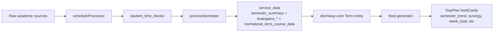
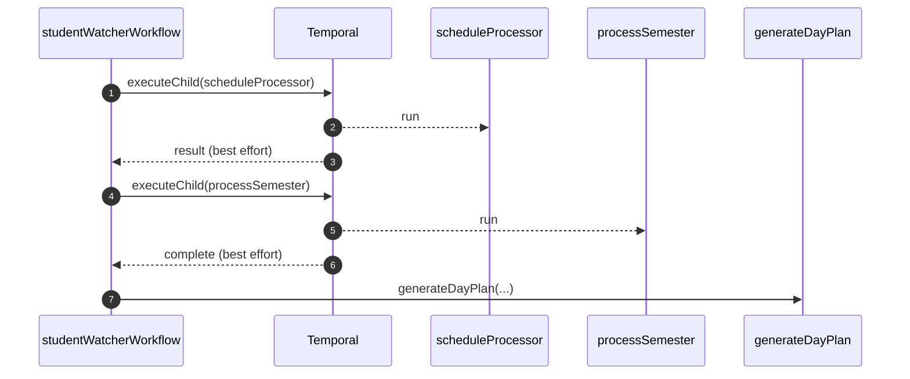
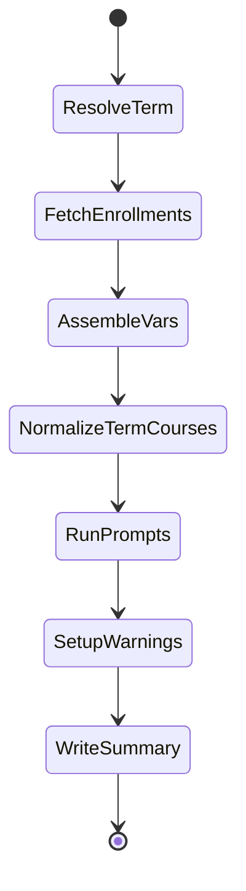
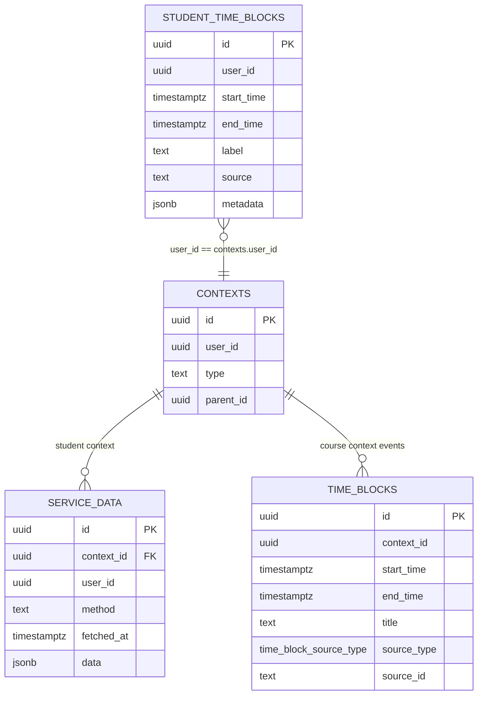
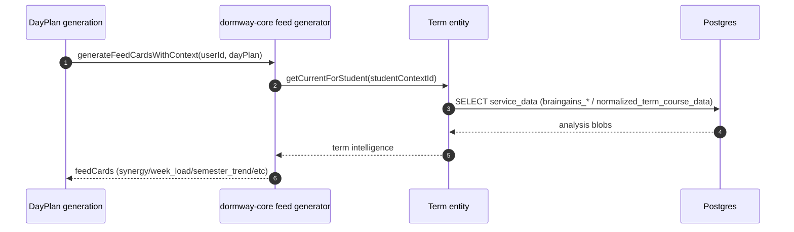

# processSemester Workflow Deep Dive (Current)

This document describes how DormWay currently computes **term/semester intelligence**, where the results are persisted, and how they surface in **DayPlan feed cards** and other UI surfaces.

Primary goals of `processSemester` today:

- produce **BrainGains term intelligence** (workload analysis, conflict detection, cross-course insights, semester planner)
- produce a durable **`semester_summary`** and **`normalized_term_course_data`** in `service_data`
- provide “term intelligence” inputs used by **DormWay Core** (feed card generation)

Key code entry points:

- Workflow: `.repos/dormway-platform/services/engine/src/workflows/semesterProcessor.workflow.ts` (`processSemester`)
- Activities: `.repos/dormway-platform/services/engine/src/activities/semester.activities.ts`
- StudentWatcher caller: `.repos/dormway-platform/services/engine/src/workflows/studentWatcher.simplified.workflow.ts` (runs `scheduleProcessor` → `processSemester` before DayPlan generation)
- API triggers/reads:
  - `.repos/dormway-platform/services/api-router/src/routes/semester-routes.ts` (`/semester/process`, `/semester/aggregate`)
  - `.repos/dormway-platform/services/api-router/src/routes/v2/terms.routes.ts` (`POST /v2/terms/process`)
- DormWay Core consumption (feed cards):
  - `.repos/dormway-platform/services/shared/dormway-core/src/entities/term/term.entity.ts`
  - `.repos/dormway-platform/services/shared/dormway-core/src/domains/feed/generator.ts`

Related docs:

- [Schedules, Time Blocks, and Reconciliation](/docs/engineering/technical/calendar/schedules-time-blocks-and-reconciliation)
- [scheduleProcessor Workflow Deep Dive (Current)](/docs/engineering/technical/calendar/scheduleprocessor-workflow-deep-dive-current)
- [Term Management & Term Resolution Deep Dive (Current)](/docs/engineering/technical/engine/term-management-term-resolution-deep-dive-current)
- [StudentWatcher Workflow Deep Dive (Current)](/docs/engineering/technical/studentwatcher/studentwatcher-workflow-deep-dive-current)
- [How DormWay Works](/docs/engineering/architecture/how-dormway-works)

---

## 1) High-level system picture

Notes:

- `scheduleProcessor` is the “calendar reconciliation” workflow that materializes the student’s unified schedule into `student_time_blocks`.
- `processSemester` consumes that unified schedule and emits term intelligence into `service_data`.

---

## 2) Triggers: who starts `processSemester`

### 2.1 StudentWatcher (pre-DayPlan generation)

During `generateMorningPlan`, the StudentWatcher runs:

1) `executeChild('scheduleProcessor', ...)` (best effort)
2) `executeChild('processSemester', ...)` (best effort)
3) DayPlan generation

Code: `.repos/dormway-platform/services/engine/src/workflows/studentWatcher.simplified.workflow.ts`

### 2.2 API Router (manual trigger)

There are two primary “kickoff” entrypoints:

- `POST /semester/process` (legacy-ish route): `.repos/dormway-platform/services/api-router/src/routes/semester-routes.ts`
- `POST /v2/terms/process` (v2 route): `.repos/dormway-platform/services/api-router/src/routes/v2/terms.routes.ts`

Both start a new Temporal workflow execution named `processSemester` with args `[userId, term, year, inputs]`.

### 2.3 Engine cascade activity

The engine exposes a “cascade” activity that can start `processSemester` for `(studentId, term, year)`:

- `.repos/dormway-platform/services/engine/src/activities/triggerCascade.activities.ts` (`triggerSemesterWorkflow`)

---

## 3) What `processSemester` actually does (current steps)

Workflow code: `.repos/dormway-platform/services/engine/src/workflows/semesterProcessor.workflow.ts`

### 3.1 Term resolution (“Current” → campus term)

If `term`/`year` are missing or `term='Current'`, the workflow tries to resolve the student’s current term from campus config:

- `.repos/dormway-platform/services/engine/src/activities/semester.activities.ts` (`resolveCurrentTermForStudent`)

If resolution fails, it continues with fallback defaults.

### 3.2 Course enrollments

It fetches “current-term enrolled courses”:

- `.repos/dormway-platform/services/engine/src/activities/semester.activities.ts` (`getEnrolledCourses(userId, term, year)`)

This is ultimately driven by `contexts` + `context_dependencies` (“enrolled_in” edges).

### 3.3 Schedule + syllabus evidence → prompt variables

`assemblePromptVariables(...)` is where `processSemester` consumes schedule information.

Key behavior:

- It fetches **scoped `student_time_blocks`** for the term window:
  - `.repos/dormway-platform/services/engine/src/activities/semester.activities.ts` (`assemblePromptVariables` calls `supabase.getStudentTimeBlocks(userId, ..., termStartISO, termEndISO)`)
- It derives a “sample-week” schedule grid from those class blocks for planning prompts.

This means:

- the semester pipeline treats **`student_time_blocks` as the authoritative student schedule** (which is why `scheduleProcessor` timing matters).

### 3.4 Normalization & reconciliation for term intelligence

`normalizeTermCourseData(...)` builds a consolidated per-course “term dataset” (assignments + key dates + meeting evidence) and persists it:

- `.repos/dormway-platform/services/engine/src/activities/semester.activities.ts`
  - reads **course-context `time_blocks`** (generic) in the term window
  - reads **student-specific `student_time_blocks`** for assignment-like types (Canvas / student-level)
  - persists `service_data.method='normalized_term_course_data'`

This is the main place where `time_blocks` and `student_time_blocks` are intentionally combined.

---

## 4) Persistence: where outputs land (DB)

All semester intelligence is persisted in `service_data` scoped to the **student context** (`contexts.type='student'`, `contexts.user_id = userId`).

Written methods (non-exhaustive):

- `semester_summary` (enriched summary payload)
- `normalized_term_course_data`
- `braingains_semester_workload_analysis`
- `braingains_schedule_conflict_detection`
- `braingains_cross_course_insights`
- `braingains_semester_planning`
- `braingains_early_warnings`

---

## 5) Consumption: how “semester view” data shows up today

There are multiple “surfaces” that people call “Semester View”; they currently pull data from different places.

### 5.1 DayPlan feed cards (DormWay Core)

DormWay Core’s feed generator pulls term intelligence via the Term entity:

- `.repos/dormway-platform/services/shared/dormway-core/src/entities/term/term.entity.ts`
  - `getBrainGainsWorkloadAnalysis()` reads `service_data.method='braingains_semester_workload_analysis'`
  - `getCrossCourseInsights()` reads `service_data.method='braingains_cross_course_insights'`
  - `getNormalizedCourseData()` reads `service_data.method='normalized_term_course_data'` (filtered by term/year)

Then feed cards are generated:

- `.repos/dormway-platform/services/shared/dormway-core/src/domains/feed/generator.ts` (`generateFeedCardsWithContext`)

Important current limitation:

- `CardType.SemesterTrend` and `CardType.SemesterGraph` exist in DormWay Core, but the current implementations do not populate the bar-by-bar metadata keys the iOS UI expects (`bar1Height`, etc.). iOS will render those cards “empty” unless another mapping layer adds those fields.
  - iOS expects bars in `.repos/ios-clean/App/Views/Feed/Components/FeedCardBodyView.swift` (`extractWorkloadBarsData`)
  - card creation today: `.repos/dormway-platform/services/shared/dormway-core/src/domains/feed/generator.ts` (`createSemesterTrendCard`, `createSemesterGraphCard`)

### 5.2 API Router semester aggregation (explicit reads)

`GET /semester/aggregate` returns a merged payload of the latest semester-related `service_data` methods and also injects Canvas assignment deadlines from `student_time_blocks`:

- `.repos/dormway-platform/services/api-router/src/routes/semester-routes.ts`

This route is the most “direct” way to read the outputs of `processSemester`.

Current note:

- No direct usage of `/semester/*` or `/v2/terms/*` was found in `.repos/ios-clean` via string search; the iOS app may not be calling these endpoints yet.

### 5.3 Dashboard composite (Syllabus widget / workload widgets)

The iOS Syllabus widget and in-app dashboard use:

- iOS: `.repos/ios-clean/Packages/DWServices/Sources/DWServices/DashboardService.swift` (`GET /dashboard/v1/composite`)
- Widget: `.repos/ios-clean/Packages/DWWidgets/Sources/DWWidgets/Widgets/SyllabusWidget.swift` (same endpoint)

The `syllabus` widget in dashboard composite is built from `complete.courses` (course contexts + processed syllabus outputs), not from `semester_summary`:

- `.repos/dormway-platform/services/api-router/src/services/dashboard-composite-transformer.ts` (`buildSyllabusWidget`)
- `.repos/dormway-platform/services/api-router/src/services/dashboard-aurora-service.ts` (`getCompleteDashboardData` course/syllabus assembly)

---

## 6) The “schedule dependency” (why `scheduleProcessor` matters here)

`processSemester` uses **`student_time_blocks`** as its primary schedule evidence (term-window scoped). That schedule is produced by `scheduleProcessor`.

When `student_time_blocks` are sparse, `writeSemesterSummary(...)` contains a fallback that merges course-context `time_blocks` (schedule import) into its internal cadence calculations:

- `.repos/dormway-platform/services/engine/src/activities/semester.activities.ts` (`writeSemesterSummary`, “merge master time_blocks fallback”)

This fallback helps, but the intended steady-state is:

- `scheduleProcessor` converges everything into `student_time_blocks`
- `processSemester` reads from `student_time_blocks` and produces term intelligence.
