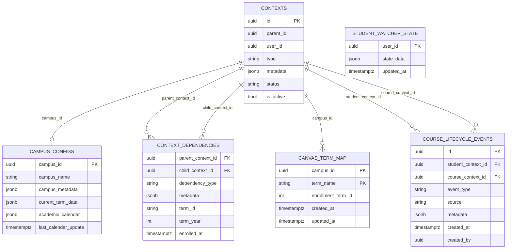
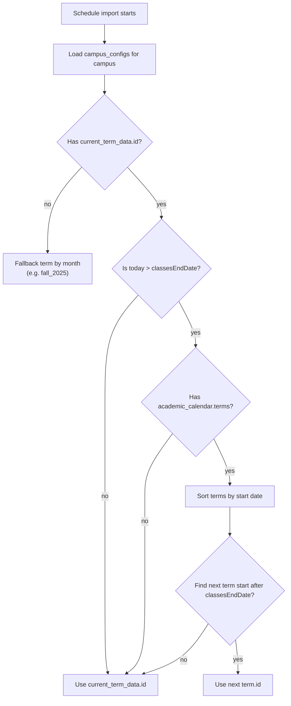
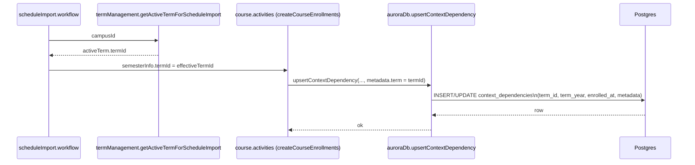
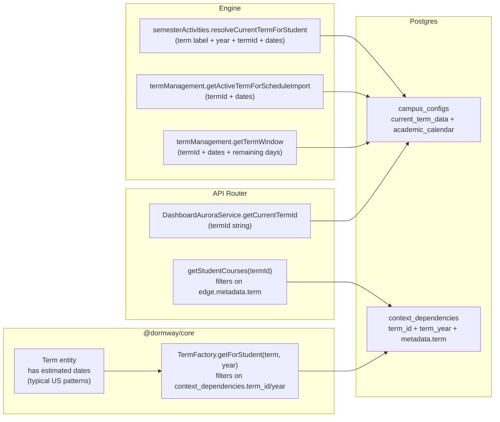
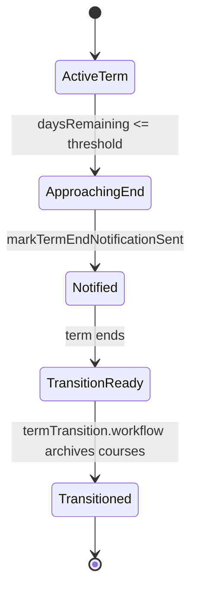

# Term Management & Term Resolution Deep Dive (Current)

This document describes how DormWay **currently** models and resolves “the current term” across the system, including:

- how campuses get term dates (`campus_configs`)
- how term IDs are normalized (migration + DB function)
- how enrollments are tagged with term metadata + columns (`context_dependencies`)
- how term is resolved in **Engine**, **API Router**, and `@dormway/core`
- how term transitions + term-end notifications work

If anything here conflicts with production behavior, treat the referenced code paths as the source of truth and update this doc accordingly.

Code entry points (highest signal):

- Campus term ingestion: `.repos/dormway-platform/services/engine/src/activities/campusEnrichment.activities.ts` (`fetchCampusTermDates`)
- Term selection for schedule import: `.repos/dormway-platform/services/engine/src/activities/termManagement.activities.ts` (`getActiveTermForScheduleImport`)
- Term window + term-end tracking: `.repos/dormway-platform/services/engine/src/activities/termManagement.activities.ts` (`getTermWindow`, `hasTermEndNotificationBeenSent`, `markTermEndNotificationSent`)
- “Current term” for semester features: `.repos/dormway-platform/services/engine/src/activities/semester.activities.ts` (`resolveCurrentTermForStudent`)
- Dashboard term filtering: `.repos/dormway-platform/services/api-router/src/services/dashboard-aurora-service.ts` (`getCurrentTermId`, `getStudentCourses`)
- `@dormway/core` term aggregation: `.repos/dormway-platform/services/shared/dormway-core/src/entities/term/term.factory.ts` (`TermFactory`)
- Term transitions: `.repos/dormway-platform/services/engine/src/workflows/termTransition.workflow.ts`
- Canvas term window (separate concept): `.repos/dormway-platform/services/engine/src/lib/term/TermResolver.ts`

Related docs:

- [How DormWay Works](/docs/engineering/architecture/how-dormway-works)
- [scheduleImport Workflow Deep Dive (Current)](/docs/engineering/technical/calendar/scheduleimport-workflow-deep-dive-current)
- [processSemester Workflow Deep Dive (Current)](/docs/engineering/technical/engine/processsemester-workflow-deep-dive-current)
- [Term Transition & Smart Notifications Deep Dive (Current)](/docs/engineering/technical/engine/term-transition-smart-notifications-deep-dive-current)

---

## 1) The important “term” concepts (as implemented)

DormWay has **multiple term concepts** in play:

1) **Campus term configuration** (authoritative “calendar-like” term dates)
   - Stored in `campus_configs.current_term_data` + `campus_configs.academic_calendar` (JSON).
2) **Enrollment term tagging** (“which courses are in which term for this student”)
   - Stored on edges in `context_dependencies`:
     - columns: `term_id`, `term_year`, `enrolled_at`
     - metadata: `metadata.term`, `metadata.term_id`, `metadata.term_year` (legacy/duplicative keys)
3) **Dashboard term filtering** (API Router)
   - Resolves a term ID string and filters course enrollments by `edge.metadata.term` (lenient for null).
4) **`@dormway/core` Term entity** (aggregate built from enrollments)
   - Queries `context_dependencies.term_id`/`term_year` and uses a **term name + year** API (e.g. `("Fall", 2025)`).
5) **Canvas sync “term window”** (Engine lib)
   - Uses month-based windows (Fall/Spring/Summer) + caches Canvas enrollment term IDs in `canvas_term_map`.

These are not perfectly aligned today; this doc calls out the mismatch points explicitly.

---

## 2) Where term data lives (DB model)

### 2.1 Minimal ERD (term-relevant tables)



### 2.2 “Canonical” campus term fields

`campus_configs` stores:

- `current_term_data` (a JSON object for “the current term”)
- `academic_calendar` (a JSON object with `terms[]`, plus optional `keyDates[]`, `breaks[]`)

The Engine populates these via an LLM-backed enrichment prompt:

- `.repos/dormway-platform/services/engine/src/activities/campusEnrichment.activities.ts` (`fetchCampusTermDates`)

### 2.3 How campus term data gets automatically updated

Campus academic calendars and current term data are refreshed through an **automatic prioritized enrichment workflow**.

#### Automatic Enrichment Orchestration

**Primary workflow:** `enrichCampusesPrioritized(limit = 100)`
- **Location:** `.repos/dormway-platform/services/engine/src/workflows/campusProcessor.workflow.ts` (line 839)
- **Scheduling:** Triggered periodically (exact schedule TBD - investigate Temporal schedule definitions)
- **Execution:** Processes in batches of 5 campuses with 5-second delays between batches

**Campus selection activity:** `getCampusesForEnrichment(limit)`
- **Location:** `.repos/dormway-platform/services/engine/src/activities/campus.activities.ts` (line 1922)

#### Selection Criteria

Campuses are eligible for enrichment if:
1. **Active:** `campus_ctx.is_active = true`
2. **Stale:** Last enriched 7+ days ago (configured via `CAMPUS_ENRICHMENT_WINDOW_DAYS`, default 7)
3. **Prioritized:** Ranked by priority score, top 100 selected

#### Priority Scoring Formula

```sql
priority_score =
  (account_count_active × 800) +     -- Active students (onboarding_status = 'completed')
  (student_count × 250) +            -- Total student contexts
  (course_count × 400) +             -- Course contexts
  CASE
    WHEN housing_capacity > 0 THEN 600
    WHEN campus is online_only THEN 150
    ELSE 350
  END +
  (enrollment_total × 0.02) +
  LEAST(days_since_last_enrichment, 45) × 60  -- Staleness bonus (capped at 45 days)
```

**Impact on selection:**
- Campus with 100 active students: **~80,000+ points**
- Campus with 0 students: **~600-1,000 points**

This ensures campuses with students are kept current, while empty campuses are rarely enriched.

#### Automatic Current Term Detection

When `fetchCampusTermDates` runs, it:
1. Fetches the full academic calendar from Perplexity AI
2. **Automatically determines the current term** by date comparison:

```typescript
const currentDate = new Date();
const currentTerm = parsed.academicCalendar?.terms?.find((term: any) => {
  const start = new Date(term.startDate);
  const end = new Date(term.endDate);
  return currentDate >= start && currentDate <= end;  // 🔑 Date-based selection
}) || parsed.academicCalendar?.terms?.[0];  // Fallback to first term
```

3. Updates both:
   - `campus_configs.current_term_data` (single term object)
   - `campus_configs.academic_calendar` (full year with all terms)

This means **no manual intervention is required** for term transitions. The system automatically updates `current_term_data` when enrichment runs and finds today's date falls into a new term.

#### Code Reference

Full implementation:
- `.repos/dormway-platform/services/engine/src/activities/campusEnrichment.activities.ts` (lines 1019-1026 for current term detection)

---

## 3) How term IDs get normalized (and what that means)

DormWay runs a normalization migration that:

- creates a Postgres function `normalize_term_id(term_data jsonb)` and
- updates `campus_configs.current_term_data.id` and `campus_configs.academic_calendar.terms[].id`
- also normalizes `context_dependencies.metadata.term` for some dependency types

Migration:

- `.repos/dormway-platform/infrastructure/database/migrations/086_normalize_term_ids.sql`

Important behaviors in this migration:

- **Target format**: `{season}_{year}` (e.g. `fall_2025`, `winter_2026`).
- If it cannot extract a season or year, it returns the original JSON unchanged.
- It updates `context_dependencies.metadata.term` (not the `term_id` column).

This matters because **API Router course filtering** uses `edge.metadata.term`, while `@dormway/core` TermFactory uses `context_dependencies.term_id` + `term_year`.

---

## 4) How enrollments get tagged with term (schedule import path)

Schedule import picks a term ID, creates course contexts, and upserts enrollments with term metadata.

### 4.1 Term selection for schedule import

Workflow:

- `.repos/dormway-platform/services/engine/src/workflows/scheduleImport.workflow.ts`

Key steps:

- Uses `getActiveTermForScheduleImport(campusId)` to pick the “effective” term.
- Falls back to a hard-coded default `fall_2025` if nothing is resolved.

Activity used:

- `.repos/dormway-platform/services/engine/src/activities/termManagement.activities.ts` (`getActiveTermForScheduleImport`)

Decision logic (simplified):



### 4.2 Enrollment write semantics (metadata + columns)

The schedule import activities upsert enrollments and include term keys in the dependency metadata:

- `.repos/dormway-platform/services/engine/src/activities/course.activities.ts` (`createCourseEnrollments`)

The Aurora DB implementation extracts term fields from metadata and writes to columns:

- `.repos/dormway-platform/services/engine/src/services/auroraDb.ts` (`upsertContextDependency`)

Current extraction logic:

- `term_id` column uses `metadata.term_id || metadata.term`
- `term_year` column uses `metadata.term_year` (often omitted by schedule import today)
- `enrolled_at` uses `metadata.enrolled_at || metadata.enrollmentDate`

Sequence (simplified):



---

## 5) “Current term” resolution (Engine vs API Router vs `@dormway/core`)

### 5.1 Engine: `semesterActivities.resolveCurrentTermForStudent`

Engine resolves the current term by:

1) finding the student context for a user (via Supabase adapter)
2) reading the campus config for the student’s campus
3) prioritizing `current_term_data`, then falling back to `academic_calendar.terms[]`

Code:

- `.repos/dormway-platform/services/engine/src/activities/semester.activities.ts` (`resolveCurrentTermForStudent`)

Important details:

- It returns both:
  - a **human term label** (e.g. `"Fall"`) + `year` (number)
  - plus optional `termId` (`current_term_data.id`) and `termDates` (start/end)
- The “human term” is parsed from a string match for `(spring|summer|fall|winter)` in the term name/id.

### 5.2 Engine: `termManagement.getTermWindow` (campus-level)

`getTermWindow(campusId)` returns:

- `termId`, `termName`, `termYear`, start/end dates, timezone, daysRemaining, isActive

If `current_term_data` is missing, it uses month-based defaults.

Code:

- `.repos/dormway-platform/services/engine/src/activities/termManagement.activities.ts` (`getTermWindow`)

### 5.3 API Router: dashboard `getCurrentTermId` + course filtering

The dashboard resolves the campus current term ID and uses it to filter student courses:

- Term resolution: `.repos/dormway-platform/services/api-router/src/services/dashboard-aurora-service.ts` (`getCurrentTermId`)
- Filtering: `.repos/dormway-platform/services/api-router/src/services/dashboard-aurora-service.ts` (`getStudentCourses`)

Important details:

- `getCurrentTermId` prefers `campus_configs.current_term_data.id`, then `current_term_data.name`.
- `getStudentCourses` filters by `edge.metadata.term` equality to that termId.
- **Lenient behavior**: courses with `term == null` pass through even when filtering (legacy behavior).
- **Non-lenient behavior**: if a course has `term != null` but in a different string format, it will be excluded.

### 5.4 `@dormway/core`: TermFactory (aggregate)

`@dormway/core` models a “Term” as an aggregate over enrollments:

- `.repos/dormway-platform/services/shared/dormway-core/src/entities/term/term.factory.ts` (`TermFactory.getForStudent`, `getAllForStudent`)

Important details:

- `getForStudent(studentContextId, term, year)` queries enrollments where:
  - `cd.term_id ILIKE %term% OR cd.term_id IS NULL`
  - `cd.term_year = year OR cd.term_year IS NULL`
- This means missing `term_year` reduces the ability to separate terms by year.

### 5.5 Comparison flowchart (who uses what)



---

## 6) Term transition + term-end notification tracking

### 6.1 Term end “approaching” and notifications

Term end is computed using `getTermWindow` and a configurable warning threshold:

- `.repos/dormway-platform/services/engine/src/activities/termManagement.activities.ts` (`isTermEndApproaching`)
  - config: `term.end_warning_days` (default `14`)

Term end notifications are tracked in `student_watcher_state.state_data.term_notifications`:

- `.repos/dormway-platform/services/engine/src/activities/termManagement.activities.ts` (`hasTermEndNotificationBeenSent`, `markTermEndNotificationSent`)

State machine (simplified):



### 6.2 Term transition workflow

The term transition workflow:

1) archives courses from the ending term (dependency type change)
2) detects year-long sequences
3) emits progress updates (used as notifications)

Code:

- `.repos/dormway-platform/services/engine/src/workflows/termTransition.workflow.ts`
- `.repos/dormway-platform/services/engine/src/activities/termManagement.activities.ts` (`archiveTermCourses`, `detectYearLongSequences`)

Lifecycle event logging + term columns:

- `.repos/dormway-platform/infrastructure/database/migrations/20251208_course_lifecycle_events.sql`
  - function: `log_course_lifecycle_event(...)`
  - adds columns: `context_dependencies.term_id`, `term_year`, `enrolled_at`

---

## 7) Canvas sync term window (separate from campus_configs)

Canvas course sync uses a separate term-window mechanism:

- `.repos/dormway-platform/services/engine/src/lib/term/TermResolver.ts` (`resolveTermWindow`)

Deep dive: [Canvas Term Window & Course Filtering Deep Dive (Current)](/docs/engineering/technical/canvas/canvas-term-window-course-filtering-deep-dive-current)

Important details:

- It resolves timezone from `contexts.metadata` or `campus_configs.campus_metadata`.
- It computes semester windows from month-based defaults (Fall/Spring/Summer).
- It tries to infer/caches a Canvas `enrollment_term_id` into `canvas_term_map`.
- Despite the header comment, the current implementation does **not** read `campus_configs.academic_calendar.terms` for precise campus dates.

DB cache table:

- `.repos/dormway-platform/infrastructure/database/migrations/20251021_canvas_term_map.sql`

---

## 8) Current mismatch points (high impact)

1) **Multiple sources of “current term”**:
   - Engine uses `campus_configs.current_term_data` (and sometimes academic_calendar).
   - API Router uses the same but filters by `edge.metadata.term`.
   - `@dormway/core` uses `context_dependencies.term_id` + `term_year`.
   - Canvas sync uses a month-based term window.
2) **Term format drift**:
   - Old values like `fall2025` exist (see `.repos/dormway-platform/infrastructure/database/migrations/085_backfill_enrollment_term.sql`).
   - Normalization favors `fall_2025`, but filtering paths rely on strict string equality in some places.
3) **Schedule import likely omits `term_year`**:
   - `getActiveTermForScheduleImport` returns `termYear`, but schedule import currently only passes `termId` into `createCourseEnrollments`.
4) **Notification tracking uses dynamic JSON path construction**:
   - `jsonb_set(..., '{term_notifications, ${termId}}', ...)` assumes term IDs are safe as JSON path tokens.
5) **`scheduledCampusUpdates` workflow may be broken**:
   - Workflow exists at `.repos/dormway-platform/services/engine/src/workflows/campusProcessor.workflow.ts` (line 892)
   - Calls `fetchCampuses(organizationId)` which returns empty array in SupabaseAdapter
   - Warning: `'fetchCampuses not implemented in Aurora adapter'`
   - **Actual campus enrichment** uses `enrichCampusesPrioritized` workflow (documented in section 2.3)
   - Status of `scheduledCampusUpdates` is unclear - investigate whether this is deprecated or needs implementation

---

## 9) What to double-click next (term-related)

If term management is still confusing after this, the next highest-signal “double clicks” are:

- Canvas filtering + TermResolver integration: `.repos/dormway-platform/services/engine/src/activities/canvas.activities.ts` (uses `resolveTermWindow`)
- Term-aware course lifecycle (add/drop) semantics: `.repos/dormway-platform/services/engine/src/activities/courseLifecycle.activities.ts`
- Dashboard term filtering contract (what clients expect): `.repos/dormway-platform/services/api-router/src/services/dashboard-aurora-service.ts` (`getStudentCourses`)
