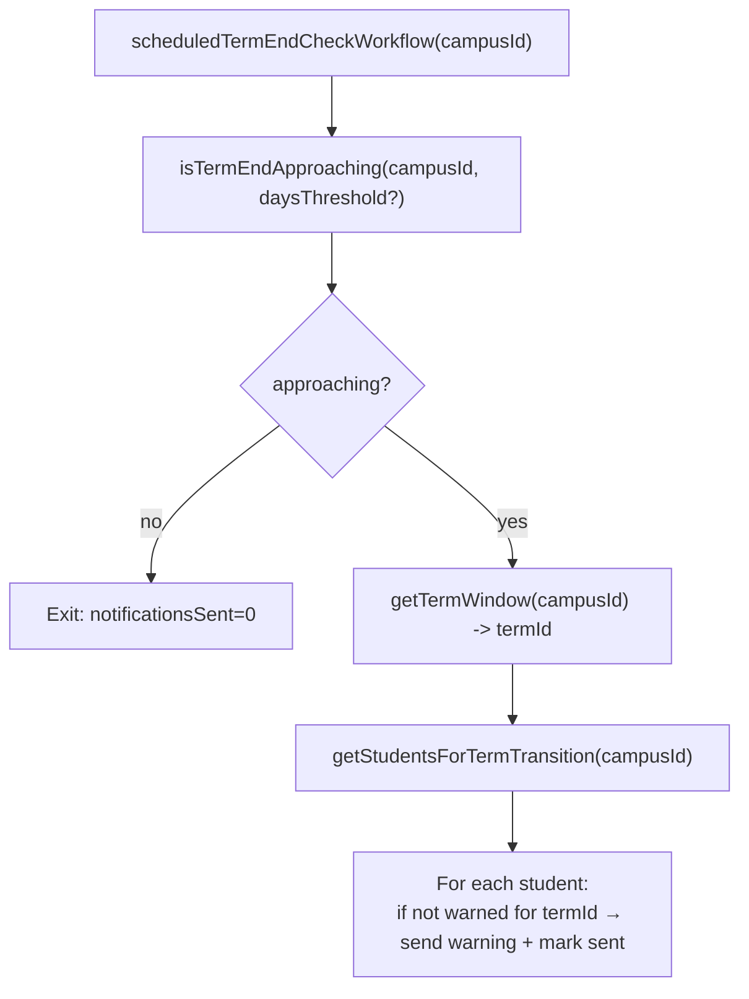
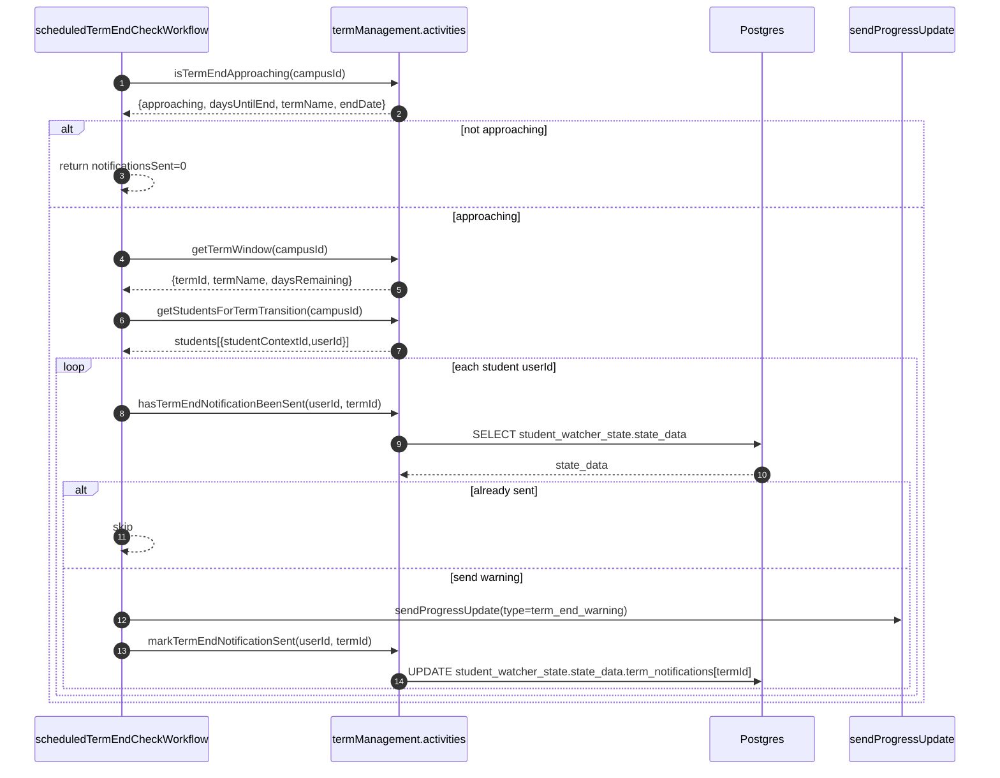
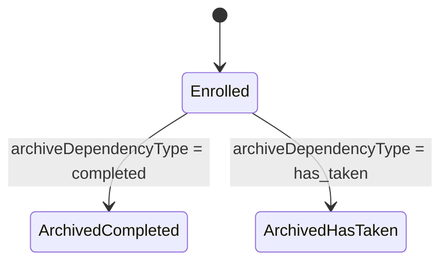
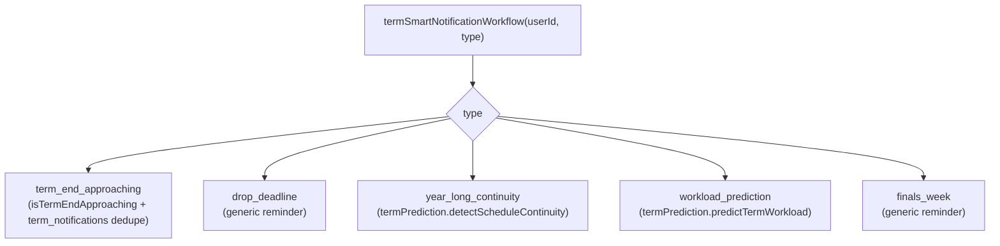

# Term Transition & Smart Notifications Deep Dive (Current)

This document describes how DormWay **currently** handles:

- term-end detection (“term is ending soon”)
- term-end warnings (deduped per user + term)
- term transitions (archiving courses from the ending term)
- predictive/“smart” term notifications (term end, drop deadline, finals, workload prediction)

It focuses on **what runs when**, **where state is stored**, and **what gets written** to the context graph and student timeline.

Code entry points (highest signal):

- Workflows: `.repos/dormway-platform/services/engine/src/workflows/termTransition.workflow.ts`
  - `scheduledTermEndCheckWorkflow`
  - `termTransitionWorkflow`
  - `campusTermTransitionWorkflow`
- Smart notification workflows: `.repos/dormway-platform/services/engine/src/workflows/termSmartNotifications.workflow.ts`
  - `termSmartNotificationWorkflow`
  - `batchTermSmartNotificationWorkflow`
- Term management activities: `.repos/dormway-platform/services/engine/src/activities/termManagement.activities.ts`
  - `getTermWindow`, `isTermEndApproaching`
  - `archiveTermCourses`, `detectYearLongSequences`
  - `hasTermEndNotificationBeenSent`, `markTermEndNotificationSent`

Related docs:

- [Term Management & Term Resolution Deep Dive (Current)](/docs/engineering/technical/engine/term-management-term-resolution-deep-dive-current)
- [How DormWay Works](/docs/engineering/architecture/how-dormway-works)
- [Course Lifecycle (Add-Drop-Swap) Deep Dive (Current)](/docs/engineering/technical/engine/course-lifecycle-add-drop-swap-deep-dive-current)
- [StudentWatcher Workflow Deep Dive (Current)](/docs/engineering/technical/studentwatcher/studentwatcher-workflow-deep-dive-current)

---

## 1) What “term transition” does (in one sentence)

When a term ends, DormWay can:

- change a student’s enrollment edges from `enrolled_in` → `completed` or `has_taken`, and
- notify the student that it’s time to upload the next term schedule,
- while tracking “already notified” state to avoid spamming.

---

## 2) Term-end warning + transition: the three workflows

### 2.1 `scheduledTermEndCheckWorkflow` (campus-wide term end warning)

Purpose:

- For a campus, check if term end is approaching.
- If yes, message all students who have not been warned yet.
- Mark each user as warned for the current term ID.

Code:

- `.repos/dormway-platform/services/engine/src/workflows/termTransition.workflow.ts` (`scheduledTermEndCheckWorkflow`)

### 2.2 `termTransitionWorkflow` (single student transition)

Purpose:

- For a single user, archive term courses + detect year-long sequences + send a “next schedule” prompt.

Code:

- `.repos/dormway-platform/services/engine/src/workflows/termTransition.workflow.ts` (`termTransitionWorkflow`)

### 2.3 `campusTermTransitionWorkflow` (batch archive, optional notify)

Purpose:

- For a campus, archive everyone in batches (default batch size 10).
- Optionally send each student a “next schedule” prompt.

Code:

- `.repos/dormway-platform/services/engine/src/workflows/termTransition.workflow.ts` (`campusTermTransitionWorkflow`)

---

## 3) Where “already warned” state is stored

Term-end warnings are deduped using `student_watcher_state.state_data.term_notifications`.

Activities:

- `.repos/dormway-platform/services/engine/src/activities/termManagement.activities.ts`
  - `hasTermEndNotificationBeenSent(userId, termId)`
  - `markTermEndNotificationSent(userId, termId)`

Mechanism:

- `hasTermEndNotificationBeenSent` reads `student_watcher_state.state_data->>'term_notifications'`, parses it as JSON, and checks:
  - `notifications[termId]?.term_end_sent === true`
- `markTermEndNotificationSent` uses `jsonb_set` to set:
  - `state_data.term_notifications[termId] = { term_end_sent: true, sent_at: ISO }`

Important note:

- This means dedupe is keyed on the **term ID string** coming from `getTermWindow().termId`.

---

## 4) Term-end detection logic (campus-level)

Term end detection is computed via:

- `.repos/dormway-platform/services/engine/src/activities/termManagement.activities.ts` (`isTermEndApproaching`)

Inputs:

- `campusId`
- optional `daysThreshold` (else config `term.end_warning_days`, default 14)

Data source:

- `getTermWindow(campusId)` (prefers `campus_configs.current_term_data`, else month-based fallback)

Decision:

- `approaching = (daysRemaining != null) && (daysRemaining <= threshold)`

---

## 5) Warning workflow: end-to-end sequence

---

## 6) Term transition (single student): what it changes

`termTransitionWorkflow` does:

1) `archiveTermCourses(studentContextId, fromTerm.id, newDependencyType)`
2) `detectYearLongSequences(studentContextId)` (used to inform carry-forward)
3) progress updates (used as a user-facing “notification”)

Code:

- `.repos/dormway-platform/services/engine/src/workflows/termTransition.workflow.ts` (`termTransitionWorkflow`)

Archiving behavior:

- `archiveTermCourses` changes the dependency type from `enrolled_in` to:
  - `completed` (default) or
  - `has_taken`

This is conceptually similar to “dropping”, but semantically it’s an end-of-term archival, not a user intent.

---

## 7) Campus-wide transition: batching behavior

`campusTermTransitionWorkflow`:

- calls `getStudentsForTermTransition(campusId)`
- loops in batches (`batchSize` default 10)
- archives each student’s term courses
- optionally sends the “upload next term schedule” prompt

Important characteristics:

- This workflow does not currently record “notification sent” dedupe state (it sends `term_transition_complete` progress updates directly).
- It sets `createdBy: 'system'` for archive events.

---

## 8) Smart notifications (separate from transitions)

The “smart notification” workflows are not the same as the scheduled term-end check:

- `termSmartNotificationWorkflow` handles a single user + type.
- `batchTermSmartNotificationWorkflow` loops through a campus and invokes `termSmartNotificationWorkflow` for each student.

Implementation:

- `.repos/dormway-platform/services/engine/src/workflows/termSmartNotifications.workflow.ts`

Notification types (current):

- `term_end_approaching` (deduped using `term_notifications`)
- `drop_deadline` (currently generic; no dedupe logic)
- `year_long_continuity` (uses term prediction activity; no dedupe logic)
- `workload_prediction` (uses term prediction activity; no dedupe logic)
- `finals_week` (generic; no dedupe logic)

---

## 9) What to watch for (current mismatch points)

1) **Term ID string consistency is critical** for warning dedupe (`term_notifications[termId]`).
2) `campusTermTransitionWorkflow` can notify without recording dedupe state.
3) “Drop deadline” notifications are not yet driven by `academic_calendar.keyDates` (the code comments note this).
