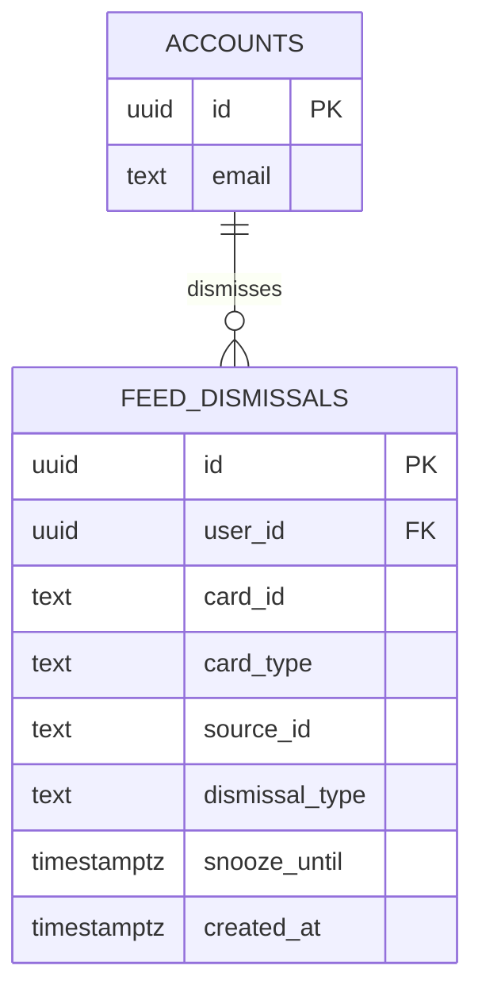
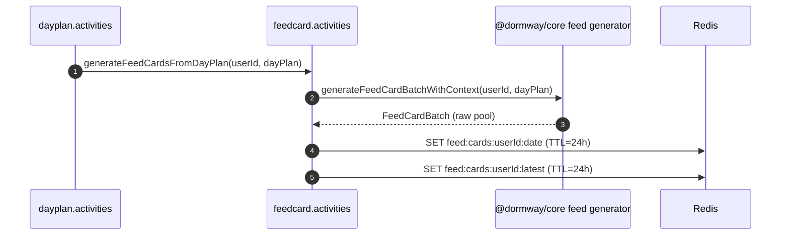
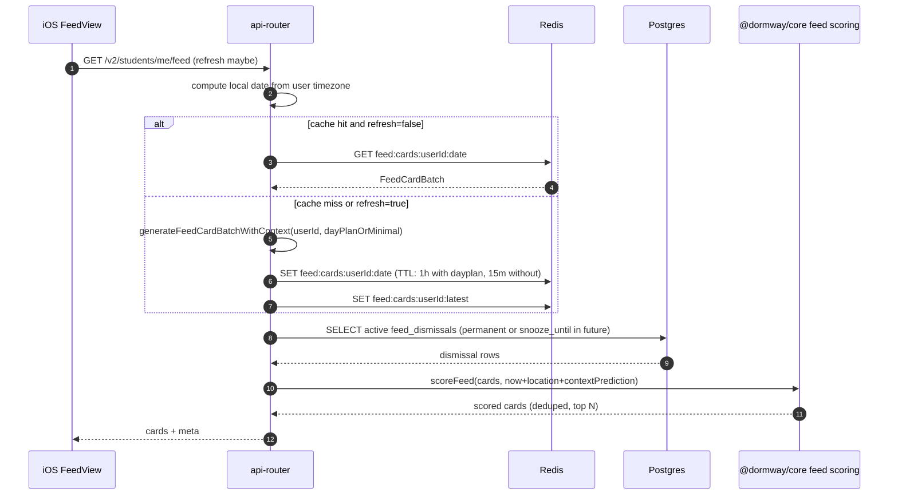
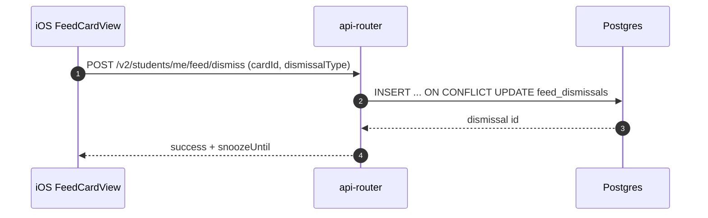
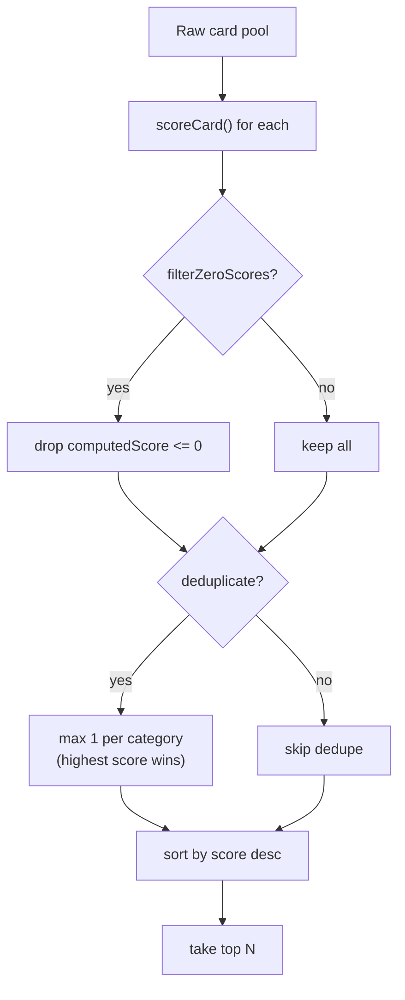

# Home Feed System Deep Dive (Current)

This document traces how the **Home Feed** works *as implemented today*: how cards are generated (Engine + `@dormway/core`), how they’re cached (Redis), how they’re served (API Router), and how they’re rendered + dismissed (iOS).

Related docs:

- [How DormWay Works](/docs/engineering/architecture/how-dormway-works)
- [StudentWatcher Workflow Deep Dive (Current)](/docs/engineering/technical/studentwatcher/studentwatcher-workflow-deep-dive-current)
- DORM-761 Home Feed System (plan/history; not canonical for current behavior)
- [Sharp Edges Tracker (Current)](/docs/engineering/architecture/sharp-edges-tracker-current)

Primary code references:

- Card types + scoring + generator (shared): `.repos/dormway-platform/services/shared/dormway-core/src/domains/feed/types.ts`, `.repos/dormway-platform/services/shared/dormway-core/src/domains/feed/scoring.ts`, `.repos/dormway-platform/services/shared/dormway-core/src/domains/feed/generator.ts`
- Redis keys: `.repos/dormway-platform/services/shared/dormway-core/src/adapters/cache/cache-key-builder.ts` (`FeedKeys`)
- Engine card generation + caching: `.repos/dormway-platform/services/engine/src/activities/feedcard.activities.ts`
- API Router (canonical feed endpoint): `.repos/dormway-platform/services/api-router/src/routes/v2/students.routes.ts` (`GET /students/me/feed`, `POST /students/me/feed/dismiss`)
- DB schema: `.repos/dormway-platform/infrastructure/database/migrations/20251217_add_feed_dismissals.sql`
- iOS client: `.repos/ios-clean/Packages/DWServices/Sources/DWServices/Feed/FeedService.swift`, `.repos/ios-clean/App/Views/Feed/FeedView.swift`

---

## 1) What the Home Feed is (in practice)

The Home Feed is a **small ranked set of cards** (typically 1–5) returned by the backend, where:

- generation happens from multiple sources (DayPlan + campus + city + term + student intelligence)
- persistence/caching happens as a “raw card pool” in Redis for a given user + date
- request-time behavior filters dismissals and scores cards based on time/location/context state

The feed never returns empty: on failure or no data, it returns a **fallback** card (AcePrompt-style).

### 1.1 Copy + scannability rules (current UX)

- **Title = the thing.** Short noun/action; no framing.
- **Subtitle = the context.** One line that answers "why now" or "what changed."
- **No AI voice.** Avoid "I noticed", "It looks like", "Based on", "I can help".
- **Length caps.** Titles <= 64 chars; subtitles <= 72 chars (truncate with "...").
- **Details live in reveal.** Longer explanations belong in `revealContent`, not subtitles.
- **Source-first cleanup.** City + AI cards strip AI-style lead-ins at generation time.

Enforcement points:

- Generator copy normalization: `.repos/dormway-platform/services/shared/dormway-core/src/domains/feed/generator.ts`
- iOS scannability: `.repos/ios-clean/App/Views/Feed/FeedCardView.swift` (1-line subtitle)
- iOS keyline context: `.repos/ios-clean/App/Views/Feed/FeedCardView.swift` (uses metadata: `courseName`, `courseCode`, `location`)

---

## 2) Data model (Redis + Postgres)

### 2.1 Redis: card pool cache

Cards are cached per user per local date:

- `FeedKeys.cards(userId, date)` → `feed:cards:<userId>:<YYYY-MM-DD>`
- `FeedKeys.cardsLatest(userId)` → `feed:cards:<userId>:latest`

TTL defaults (core constants):

- card pool: 24h
- latest pointer: 24h

Reference: `.repos/dormway-platform/services/shared/dormway-core/src/adapters/cache/cache-key-builder.ts`

### 2.2 Postgres: dismissals and snoozes

Dismissals are stored in `feed_dismissals`:

- permanent dismiss: `dismissal_type='permanent'`
- snoozes: `dismissal_type in ('snooze_1h','snooze_4h','snooze_tomorrow')` with `snooze_until`

Reference: `.repos/dormway-platform/infrastructure/database/migrations/20251217_add_feed_dismissals.sql`

---

## 3) Generation pipeline (Engine)

### 3.1 When cards are generated

Cards can be generated in three ways:

1) **DayPlan generation path**: after a DayPlan is created/updated, Engine regenerates the cached feed pool.
   - `.repos/dormway-platform/services/engine/src/activities/dayplan.activities.ts` (`updateDayPlan` calls `generateFeedCardsFromDayPlan`)
2) **StudentWatcher signal**: admin (or tooling) signals `generate_feed_cards`, which generates from the current DayPlan.
   - `.repos/dormway-platform/services/engine/src/workflows/studentWatcher.simplified.workflow.ts` (signal handler)
3) **Request-time generation** (API Router): on cache miss, API Router generates a pool on demand (see section 4).

### 3.2 What the generator does

Engine uses `@dormway/core`’s centralized orchestrator:

- `generateFeedCardBatchWithContext(userId, dayPlanData)` fetches:
  - campus data (alerts/news/dining/logistics)
  - city data (context/transit/weather-ish, depending on config)
  - term data (synergies/workload/peaks)
  - student intelligence (study spots)
- and returns a `FeedCardBatch` with all candidate cards for the day.

Engine stores that batch to Redis.

Reference: `.repos/dormway-platform/services/engine/src/activities/feedcard.activities.ts`

---

## 4) Serving pipeline (API Router)

### 4.1 Canonical endpoint

Canonical read:

- `GET /api/v2/students/me/feed`

Dismiss/snooze:

- `POST /api/v2/students/me/feed/dismiss`

Reference: `.repos/dormway-platform/services/api-router/src/routes/v2/students.routes.ts`

There is also an older `/feed` router mounted at `/feed` with similar logic, but it is explicitly marked “use /v2/students/me/feed instead”.

Reference: `.repos/dormway-platform/services/api-router/src/routes/feed-routes.ts`, `.repos/dormway-platform/services/api-router/src/routes/index.ts`

### 4.2 Request-time flow (read)

At request time, API Router:

1) resolves user timezone (via `Student.getTimezone()`) and computes **today** in that timezone
2) loads the raw pool from Redis
3) on cache miss (or `refresh=true`), generates on-demand via `@dormway/core` and overwrites Redis
4) loads active dismissals from `feed_dismissals`
5) filters dismissed/snoozed cards
6) derives a context state:
   - `context=` query param override, else uses `student.getContextPrediction()`
   - if any `on_break` card exists in the pool, it forces context to `on_break`
7) scores via `scoreFeed(...)`, optionally deduping categories and filtering zero-score cards
8) returns top N cards (`limit` param default 5)

### 4.3 Request-time flow (dismiss)

`POST /v2/students/me/feed/dismiss` upserts `feed_dismissals` (per user+card_id) and sets `snooze_until` based on dismissal type.

---

## 5) Scoring + deduplication (shared in `@dormway/core`)

The scoring pipeline is:

- compute `computedScore` per card:
  - basePriority × timeFactor × locationBoost × urgencyBoost × contextModifier
- optionally filter score==0 cards
- optionally dedupe by `category` (max 1 card per category)
- take top N

Reference: `.repos/dormway-platform/services/shared/dormway-core/src/domains/feed/scoring.ts` (`scoreFeed`)

Context prediction nuance:

- scoring supports a `contextPrediction` object with confidence + alternative states
- suppressed card types can be driven to score 0 under `on_break` and `sleeping`

---

## 6) iOS consumption (DormWayFresh)

iOS uses:

- `DWServices.FeedService` to fetch cards from `GET /api/v2/students/me/feed` and to dismiss via `POST /api/v2/students/me/feed/dismiss`.
- `FeedView` to render a “For You” card list and allow pull-to-refresh.

Key files:

- `.repos/ios-clean/Packages/DWServices/Sources/DWServices/Feed/FeedService.swift`
- `.repos/ios-clean/App/Views/Feed/FeedView.swift`
- `.repos/ios-clean/Packages/DWServices/Sources/DWServices/Feed/FeedModels.swift` (Swift type mirror)

Important nuance (current behavior):

- `FeedService` currently always includes `refresh=true` in the feed endpoint, which forces the backend to skip Redis reads and regenerate on-demand each time.
  - This is likely correctness-driven (avoid stale cards) but defeats most caching benefits.

---

## 7) Resolved sharp edges (feed-specific)

See [Sharp Edges Tracker (Current)](/docs/engineering/architecture/sharp-edges-tracker-current). Previously tracked feed-related issues have been resolved:

- ~~`feed` invalidation resource exists server-side but isn't handled by LockedIn's invalidation mapping~~: **Resolved** (SE-010/DORM-785) - LockedIn now properly handles `feed` invalidation signals.
- iOS `refresh=true` behavior: This remains intentional for correctness (avoiding stale cards) and is not considered a sharp edge.
- ~~OnBreak card shows duplicate text when expanded~~: **Resolved** (PR #711, 2026-01-05) - `revealContent` was initialized with the same message as `subtitle`, causing duplicate text display. Fixed: `revealContent` now only contains date info ("Classes Resume: X", "Break Ends: Y"), not the subtitle message.
- ~~Multiple card types show duplicate text when expanded~~: **Resolved** (PR #712, 2026-01-05) - Comprehensive audit found 11 card types where `subtitle` text was repeated in `revealContent`. All fixed to follow the pattern: **revealContent must only contain NEW information not already in subtitle**. Cards fixed: LocalOpportunity, DayConditions, MorningBriefing, PortfolioOpportunity, SynergyHighImpact, EveningReview, WeatherChange, CommunityPulse, TrafficAlert, TransitionAlert.
