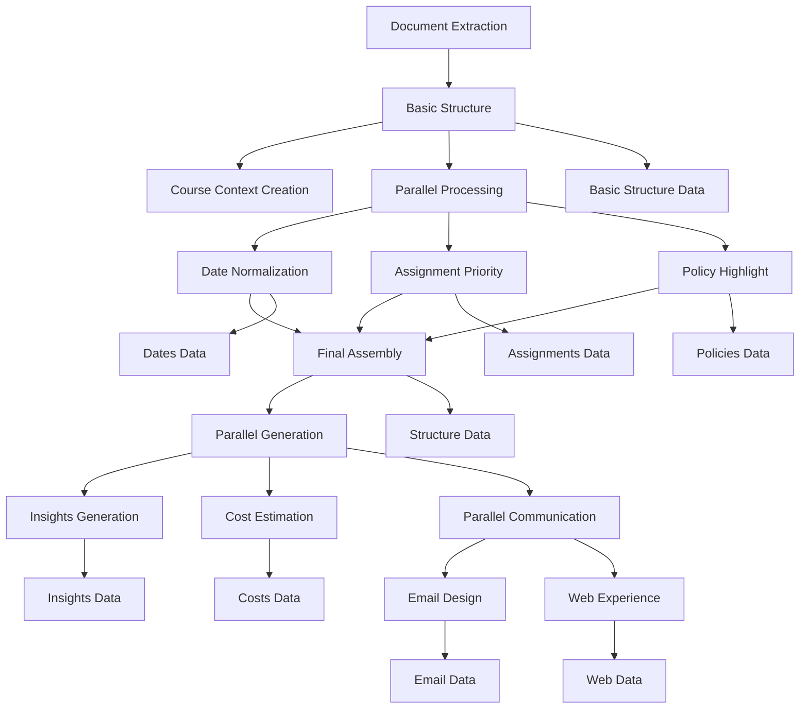

# BrainGains Service Data Methods Reference

## Overview

The BrainGains syllabus processing pipeline stores each processing step as individual service_data records for maximum granularity and traceability. This document lists all the service_data methods used in the BrainGains workflow.

## Service Data Methods

| Method | Description | Processing Step | Data Content |
|--------|-------------|-----------------|--------------|
| `braingains_basic_structure` | Initial syllabus structure extraction | Step 3a | Course info, instructor, basic schedule, policies |
| `braingains_normalized_dates` | Academic date normalization to ISO-8601 | Step 3c (parallel) | Normalized important dates, semester context |
| `braingains_prioritized_assignments` | Assignment scoring and prioritization | Step 3c (parallel) | Prioritized assignments with impact scores |
| `braingains_highlighted_policies` | Important policy identification | Step 3c (parallel) | Categorized and highlighted course policies |
| `braingains_syllabus_structure` | Final assembled JSON structure | Step 3d | Complete unified syllabus JSON |
| `braingains_syllabus_insights` | Workload and semester analysis | Step 3e (parallel) | Weekly workload, peak periods, insights |
| `braingains_course_costs` | Textbook and material cost estimation | Step 3e (parallel) | Cost breakdown, money-saving tips |
| `braingains_email_design` | Student email template generation | Step 3f (parallel) | Email template with visualizations |
| `braingains_web_experience` | Interactive web experience specification | Step 3f (parallel) | Web interface design and components |

## Processing Flow



## Data Storage Pattern

All BrainGains service_data records follow this pattern:

```typescript
{
  context_id: courseContextId,     // Course context (not user-specific)
  user_id: null,                   // Campus-wide resource
  data: brainGainsResult,          // PortKey prompt response
  method: 'braingains_[step_name]', // Step identifier
  fetched_at: new Date().toISOString()
}
```

## Error Handling

- **JSON Parsing Failures**: Fallback responses with structured error data
- **PortKey Timeouts**: Retry logic with exponential backoff
- **Processing Failures**: Individual step failures don't halt entire pipeline
- **Fallback Tracking**: Metadata indicates when fallbacks were used

## Query Examples

### Get Complete Syllabus Processing Results
```sql
SELECT method, data, fetched_at 
FROM service_data 
WHERE context_id = '[course_context_id]' 
  AND method LIKE 'braingains_%'
ORDER BY fetched_at;
```

### Get Final Syllabus Structure
```sql
SELECT data 
FROM service_data 
WHERE context_id = '[course_context_id]' 
  AND method = 'braingains_syllabus_structure';
```

### Check for Fallback Usage
```sql
SELECT method, data->>'error' as error_type
FROM service_data 
WHERE context_id = '[course_context_id]' 
  AND method LIKE 'braingains_%'
  AND data ? 'error';
```

## Vector Store Integration

BrainGains insights are also stored as searchable embeddings:
- **Chunk Index Range**: 1000+ (separate from raw text chunks 0-999)
- **Chunk Types**: course_overview, grading_policy, workload_analysis, etc.
- **Search Integration**: Enables cross-syllabus semantic queries

## Related Documentation

- 🔨 BrainGains PortKey Prompts Specification
- Syllabus Processing Architecture
- Service Data Schema
- Vector Store Integration
