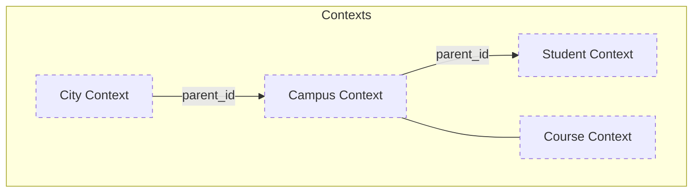
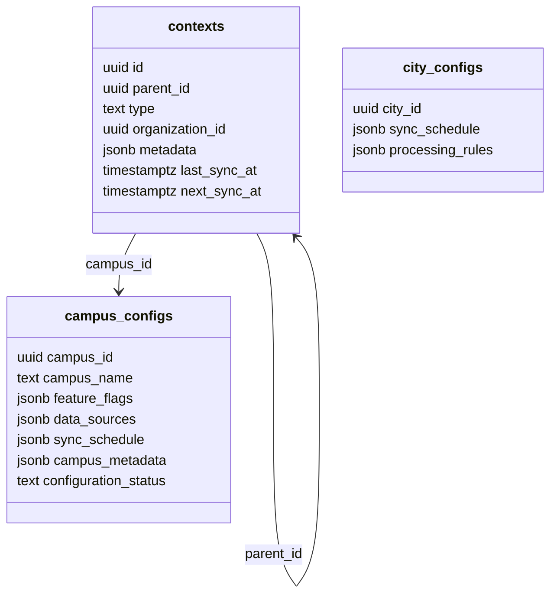
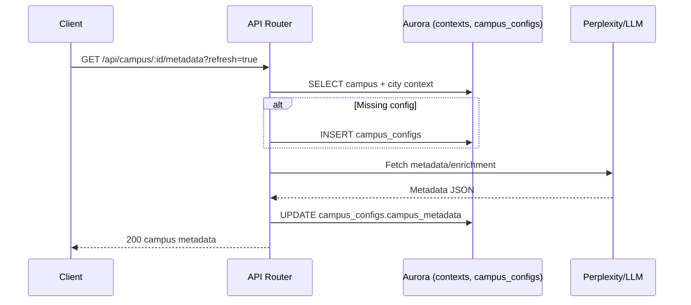
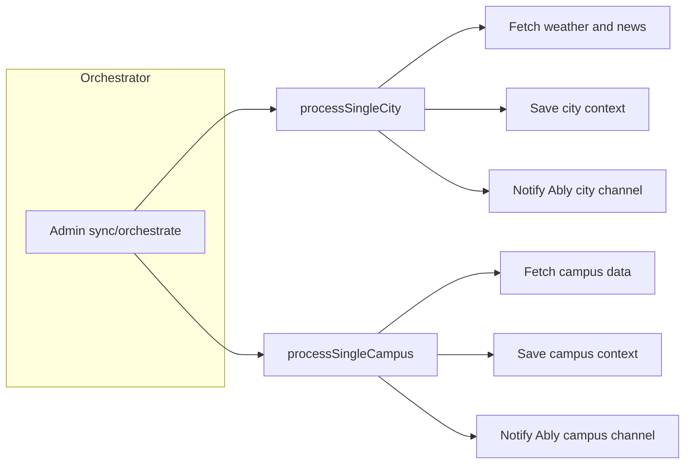
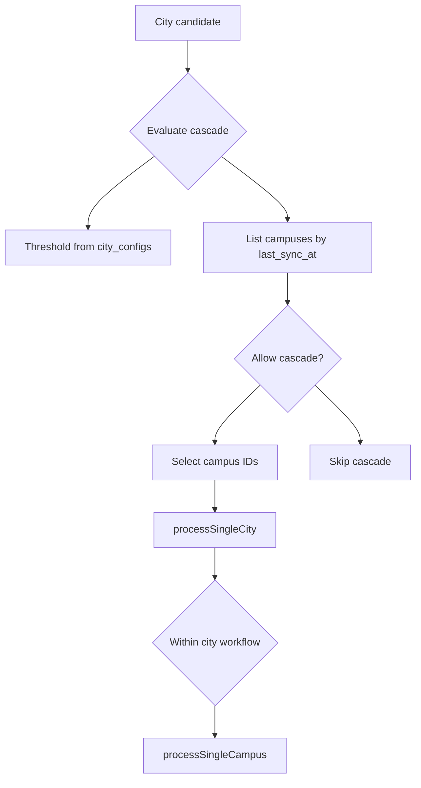
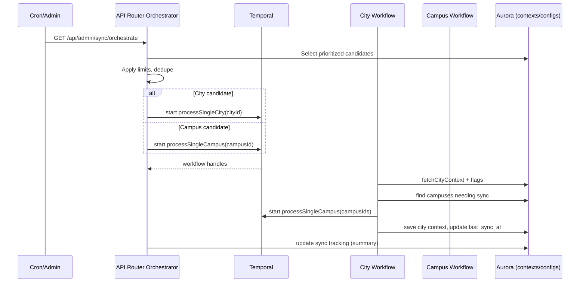

# Multi‑Institution Architecture Upgrade

Last updated: August 2025

## Overview
DormWay now supports multiple cities and campuses beyond University of Michigan. The platform generalizes context, routing, and processing so data and workflows apply per city/campus and organization.

## Domain Model Changes
- Context hierarchy: `city → campus → student/course` stored in `contexts` with `type` and `parent_id`.
- Multitenancy: `contexts.organization_id` scopes data by organization; queries accept/resolve org where relevant.
- Campus registry: canonical campus metadata (name, city/state, lat/lon) used for onboarding and LLM enrichment.

## API Router Updates
- Campus endpoints: `GET /api/campus/:campus_id/housing`, `GET /api/campus/search`, `GET /api/campus/:campus_id/metadata`.
- Campus config service: centralized source of truth for campus feature flags and metadata enrichment.
- City linkage: helpers create/find a `city` context for a campus and set `parent_id` appropriately.
- Geolocation support: IP lookup can suggest nearby campus; routing accepts `campusId`/`cityId` in request/claims.

## Engine Updates
- City and campus DAGs: batch workflows process per city/campus; see [City Processing DAG Flow](/docs/engineering/technical/engine/city-processing-dag-flow) and Engineering/Technical/Engine/Campus Processing DAG Flow.
- Real‑time channels: Ably topics use scoped names `city:{cityId}` and `campus:{campusId}` for fan‑out.
- Weather/news/context: activities fetch and generate context per city/campus and publish updates accordingly.

### City→Campus Cascade

### Orchestrator vs City Workflow (Swimlane)

## Data & Security
- Schema: `contexts(type, parent_id, organization_id, external_id, metadata, …)` is the backbone for city/campus/student.
- RLS: Supabase policies enforced per user and table; organization scoping applied where applicable.
- Backfill/migration: campus contexts are created on‑demand from registry on first use.

## Backward Compatibility
- Default campus fallback (UMich) remains for unknown users and is being phased out as campus detection improves.
- Endpoint shapes remain stable; new optional `campusId`/`cityId` fields enable scoped behavior.

## Developer Notes
- Adding a new campus: ensure registry entry exists, then hit metadata endpoint to seed contexts; adjust feature flags via campus config service.
- Observability: logs and events include `contextType` and `contextId`; verify Ably channel names when testing.
- See also: Engineering/Technical/API/DormWay API Router, Engineering/Technical/Engine/Engine Workflow DAG Analysis.

## Known Work-in-Progress
- Remove remaining UMich-specific heuristics in event/location processing where noted in code.
- Complete migration of legacy records to include `organization_id` and correct parent `city`.

## Code Touchpoints
- `services/api-router/src/services/campus-config-service.ts`
- `services/api-router/src/routes/campus-routes.ts`
- `services/api-router/src/services/ip-geolocation-service.ts`
- `services/engine/src/activities/city.activities.ts`
- `services/engine/src/services/auroraDb.ts` (contexts, organization_id)
- `services/engine/src/services/ably-publisher.ts` (channel naming)
