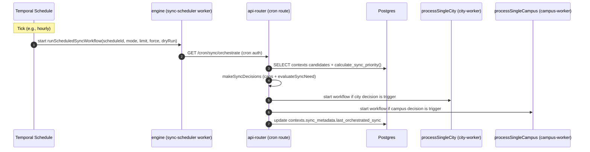
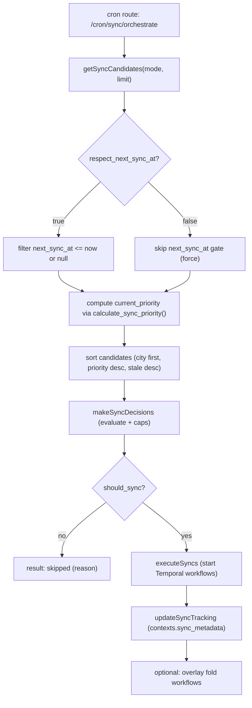
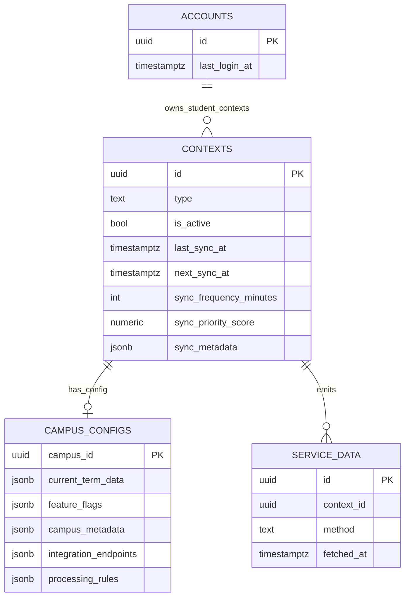

# Sync Orchestration & Priority (Current)

This document “double clicks” on how DormWay currently decides **what to sync**, **when**, and **in what order**, across:

- **Temporal Schedules (engine)** → triggers orchestration ticks
- **API Router orchestrator** → chooses city/campus candidates and starts workflows
- **Postgres sync functions** → compute priority + next run timestamps

Related docs:

- [How DormWay Works](/docs/engineering/architecture/how-dormway-works) (overview section 6.1)

---

## 1) The big picture

DormWay has two orchestration layers:

1) **Temporal Schedule** starts a tiny workflow (`runScheduledSyncWorkflow`) that makes an HTTP call to API Router.
2) **API Router sync orchestrator** runs a DB query, applies resource caps, and starts **city/campus processing workflows** with idempotent workflow IDs.

---

## 2) Temporal scheduling (engine)

### 2.1 Where schedules come from

At engine startup, schedules are provisioned if:

- `SYNC_SCHEDULES_ENABLED == 'true'`

Code:

- Engine boot: `.repos/dormway-platform/services/engine/src/index.ts`
- Schedule defs: `.repos/dormway-platform/services/engine/src/schedules/syncOrchestratorSchedules.ts`

### 2.2 Current schedules (IDs are important)

These schedule IDs are forwarded downstream as `schedule_id`:

- `sync-hourly-smart` (every 1h): `mode=auto`, `limit=10`, `force=false`
- `sync-city-4h` (every 4h): `mode=cities_only`, `limit=20`, `force=false`
- `sync-daily-force` (daily at 04:00): `mode=auto`, `limit=5`, `force=true`
- `sync-term-data-enrichment` (daily at 05:00): `mode=campuses_missing_term_data`, `limit=20`, `force=true`

### 2.3 Overlap/catchup behavior (important guardrails)

Schedules are provisioned with:

- `overlap = SKIP` (if a previous run is still executing, the next tick is skipped)
- `catchupWindow = 5 minutes` (missed ticks older than 5 minutes won’t backfill)

---

## 3) The engine → API Router bridge (syncScheduler)

The scheduled workflow is intentionally tiny:

- Workflow: `.repos/dormway-platform/services/engine/src/workflows/syncOrchestratorSchedule.workflow.ts` (`runScheduledSyncWorkflow`)
- Activity: `.repos/dormway-platform/services/engine/src/activities/syncScheduler.activities.ts` (`triggerSyncOrchestration`)

It calls:

- `GET ${API_ROUTER}/cron/sync/orchestrate?...`

Auth:

- Uses `Authorization: Bearer ${API_KEY}`
- API Router uses `cronAuthMiddleware`: `.repos/dormway-platform/services/api-router/src/middleware/cron-auth.ts`

---

## 4) API Router orchestrator (candidate selection + decisions)

### 4.1 Entrypoints

Automated:

- Route: `.repos/dormway-platform/services/api-router/src/routes/cron-routes.ts` (`GET /cron/sync/orchestrate`)

Manual/admin:

- Route: `.repos/dormway-platform/services/api-router/src/routes/admin/sync-orchestrator.ts` (`GET /api/admin/sync/orchestrate`)

Both route paths ultimately call the same service functions (cron uses the shared service directly):

- `.repos/dormway-platform/services/api-router/src/services/sync-orchestrator-service.ts`

### 4.2 Modes

`mode` controls which contexts are eligible:

- `auto` / `all`: `contexts.type in ('city','campus')`
- `cities_only`: `contexts.type='city'`
- `campuses_only`: `contexts.type='campus'`
- `campuses_missing_term_data`: campuses where `campus_configs.current_term_data` is missing/empty

### 4.3 Eligibility gate

In `getSyncCandidates(...)`, candidates must satisfy:

- `contexts.is_active = true`
- `calculate_sync_priority(context_id) >= min_priority_score` (default `150`)
- If `respect_next_sync_at=true` (default), also:
  - `next_sync_at IS NULL OR next_sync_at <= NOW()`

The `force=true` query param flips `respect_next_sync_at` off:

- Cron route: `.repos/dormway-platform/services/api-router/src/routes/cron-routes.ts`
  - `respect_next_sync_at = (force !== 'true')`

Then candidates are sorted:

1) Cities before campuses (type precedence)
2) Higher `current_priority` first
3) More stale first (`hours_since_sync`)

### 4.4 Decision logic and resource caps

After candidates are selected:

- `evaluateSyncNeed(candidate)` chooses `immediate / high / normal / low / skip`
- `makeSyncDecisions(...)` enforces caps:
  - `max_concurrent_cities=2`
  - `max_concurrent_campuses=5`

Current decision thresholds (as implemented in `evaluateSyncNeed`):

- If `last_sync_at` is null: trigger (`immediate`)
- If `student_count > 100` and `hours_since_sync > 48`: trigger (`high`)
- If `priority_score >= 150`: trigger (`normal`, or `high` when `priority_score >= 200`)
- If `hours_since_sync > 72`: trigger (`low`)
- Else: skip

---

## 5) What workflows get started (and why duplicates are rare)

When a candidate is approved for syncing, `executeSyncs(...)` starts:

- City: workflow `processSingleCity` on task queue `city-worker`
  - `workflowId = city-sync-<cityId>`
  - Implementation: `.repos/dormway-platform/services/engine/src/workflows/cityProcessor.workflow.ts`
- Campus: workflow `processSingleCampus` on task queue `campus-worker`
  - `workflowId = campus-sync-<campusId>`
  - Implementation: `.repos/dormway-platform/services/engine/src/workflows/campusProcessor.workflow.ts`

The idempotent workflow ID pattern means repeated orchestrator runs do not spam duplicates for the same city/campus while a prior run is still “open” in Temporal.

Practical nuance: starting a workflow with an existing workflow ID that is still running typically throws an “already started” error; the orchestrator catches and reports that in its result list.

Code:

- `.repos/dormway-platform/services/api-router/src/services/sync-orchestrator-service.ts` (`executeSyncs`)

---

## 6) Cascading behavior (current reality)

There are two “cascade” concepts in the repo:

### 6.1 City -> campus cascade (disabled)

City processing explicitly does not cascade to campuses right now to avoid infinite loops:

- `.repos/dormway-platform/services/engine/src/workflows/cityProcessor.workflow.ts` (comment: cascade disabled)

### 6.2 Campus -> city enrichment (enabled as-needed)

Campus processing may trigger parent city enrichment when it detects missing/stale city datasets:

- `.repos/dormway-platform/services/engine/src/workflows/campusProcessor.workflow.ts`
  - checks staleness via `cityActivities.isCityStale(cityId)`
  - starts `processSingleCity` with `workflowId = city-sync-<cityId>` in background for stale/missing data

Net effect:

- The orchestrator does not “fan out” a city sync into campus syncs.
- Campuses can still pull city freshness forward indirectly.

---

## 7) Database functions that drive priority + schedule

### 7.1 `calculate_sync_priority(uuid)` (priority score)

Orchestrator SQL calls `calculate_sync_priority(c.id)` to compute `current_priority`.

Latest definition in repo:

- `.repos/dormway-platform/infrastructure/database/migrations/20251017_canvas_priority_boost.sql`

High-signal inputs in the current function:

- Context type (`campus` vs `city`)
- Staleness (`hours_since_sync`)
- Student population and activity (`accounts.last_login_at`)
- Recent `service_data` activity
- “Growth potential” signals (syllabi uploaded, courses created, recent enrichment, housing data)
- Canvas enablement bonuses for campuses

### 7.2 `calculate_next_sync_time(uuid)` (next run timestamp)

Computes next sync timestamp based on priority buckets and type base frequency:

- Defined in: `.repos/dormway-platform/infrastructure/database/migrations/20250912_add_sync_tracking.sql`

### 7.3 `mark_sync_completed(uuid)` (tracking update)

City/campus workflows call:

- `SELECT mark_sync_completed(<contextId>)`

This updates:

- `contexts.last_sync_at = NOW()`
- `contexts.next_sync_at = calculate_next_sync_time(context_id)`
- `contexts.sync_priority_score = calculate_sync_priority(context_id)`

Used by:

- `.repos/dormway-platform/services/engine/src/activities/city.activities.ts` (`markSyncCompleted`)
- `.repos/dormway-platform/services/engine/src/activities/campus.activities.ts` (`markSyncCompleted`)

---

## 8) Overlay folding is part of orchestration

After sync orchestration (non-dry-run), the cron route also triggers syllabus overlay folding:

- Candidate query: `.repos/dormway-platform/services/api-router/src/services/sync-orchestrator-service.ts` (`getOverlayFoldCandidates`)
- Workflow trigger: `.repos/dormway-platform/services/api-router/src/services/sync-orchestrator-service.ts` (`triggerOverlayFoldWorkflows`)
  - idempotent workflow id: `fold-syllabus-<contextId>`

This is a separate “maintenance” lane that often runs alongside sync ticks.

Note: the admin orchestrator route gates overlay folding more narrowly (e.g., hourly + manual), while the cron route triggers overlay folding whenever the orchestration endpoint runs (unless `dry_run=true`).

---

## 9) Minimal data model (sync fields only)

