# DormWay iOS App Architecture

## Overview

The DormWay iOS app is built using SwiftUI and follows a modern, scalable architecture pattern with **Product-Led Growth (PLG)** at its core. This document outlines the key architectural components, patterns, and guidelines used in the app.

> **⚠️ CRITICAL: Auth System**
> - **Primary Auth**: Clerk (via `ClerkServiceProtocol`)
> - **NOT** Supabase or Auth0 - any legacy references are outdated
> - **Database**: Aurora/Neon PostgreSQL (not Supabase)

**Latest Major Updates**:
- **January 4, 2026**: **Navigation IA Refactor** - Unified 5-tab navigation (Today/Tasks/Schedule/Courses/Library), Settings as sheet via profile button, unified widget system with CollapsibleWidgetContainer, UniversalCourseCard design unification
- **December 28, 2025**: iOS 26 Platform Features - App Intents (Siri + Apple Intelligence), Live Activities (Dynamic Island), Control Center Widgets, AlarmKit (class alarms)
- **May 25-26, 2025**: Complete transformation to PLG-focused architecture with Zero State Dashboard, BFF integration, production-ready Settings system, and compelling "Holy Shit!" user moments
- **June 1, 2025**: Complete calendar sync system with session-based authentication, StudentWatcher signaling integration, and optimized app boot sequence

### Key Architectural Highlights
- **Unified Navigation IA** - 5-tab navigation (Today/Tasks/Schedule/Courses/Library) with Settings as sheet
- **Unified Widget System** - CollapsibleWidgetContainer, UpNextCard, WidgetStackView for cross-platform consistency
- **UniversalCourseCard** - Dark glassmorphic styling with mesh gradients across iPhone and iPad
- **iOS 26 Platform Features** - App Intents, Live Activities, Control Center Widgets, AlarmKit
- **PLG-First Dashboard** with dramatic headlines, weather infographics, and smart campus intelligence
- **Zero State Experience** delivering immediate value before authentication
- **BFF (Backend for Frontend)** integration with optimized data pipeline
- **Production-Ready Settings** with real service integrations (Canvas LMS, Health, Google Calendar)
- **Enhanced DashboardUI Package** with +531 lines of PLG components
- **Session-Based Calendar Sync** with multi-trigger authentication and StudentWatcher integration
- **Temporal Signaling System** for real-time server communication and time block processing
- **Optimized App Boot Sequence** with intelligent sync deduplication and background processing

Note: The Dashboard UI (home screen and widget management) is provided by a separate Swift Package named `DashboardUI` (located under `ios/DashboardUI`), enabling independent versioning and rapid PLG experimentation.

### Package & Extension Structure

```
ios-clean/
├── App/
│   └── AppIntents/                    # Siri + Apple Intelligence
│       ├── DormWayShortcuts.swift
│       └── Intents/
├── Packages/
│   ├── DWServices/
│   │   └── Alarms/                    # AlarmKit implementation
│   └── DWWidgetKit/
│       └── LiveActivity/              # Live Activity attributes + service
└── DormWayWidgets/                    # Widget Extension
    ├── ControlWidgets/                # iOS 18 Control Center
    └── LiveActivity/                  # Dynamic Island UI
```

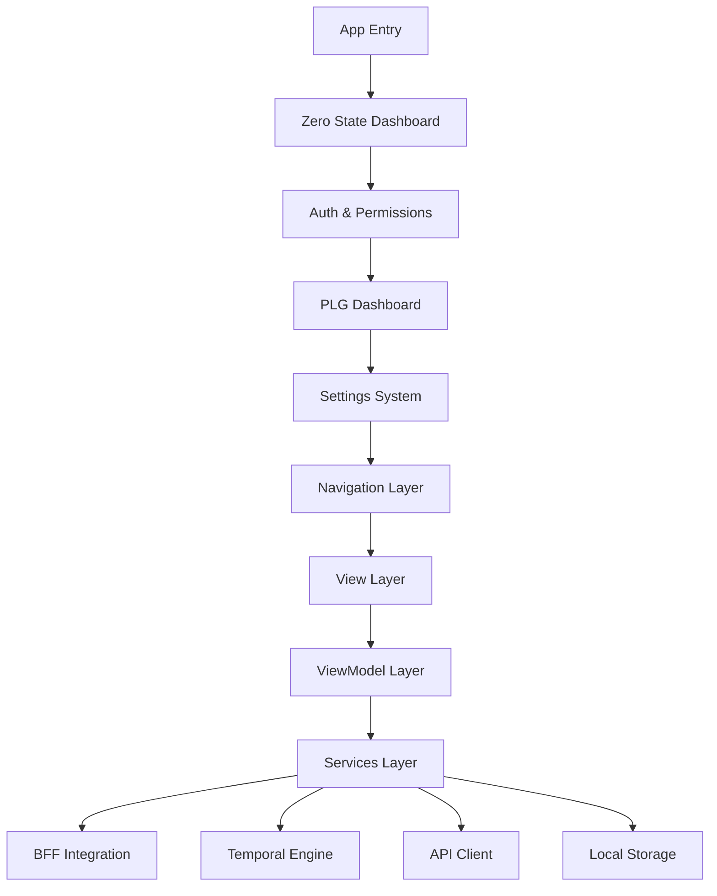

## PLG-First Architecture (May 2025)

### Zero State Dashboard Implementation

The iOS app now features a **Zero State Dashboard** that delivers immediate value before user authentication, implementing core PLG principles:

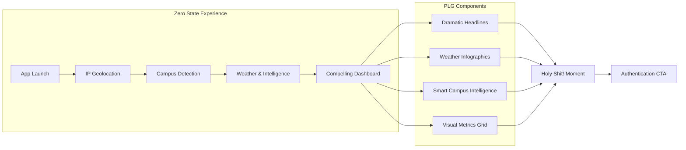

### BFF (Backend for Frontend) Integration

**Enhanced Data Pipeline** with optimized mobile-first responses:

```swift
// BFF Integration Layer
class DashboardBFFService {
    func fetchDashboardData() async throws -> BFFDashboardResponse {
        // Optimized mobile payload with:
        // - Temperature conversion (Celsius → Fahrenheit)
        // - Urgency detection and color coding
        // - Enhanced weather bulletin with outfit recommendations
        // - Smart campus intelligence with actionable insights
    }
}
```

### DashboardUI Package Architecture

The `DashboardUI` Swift Package provides the PLG dashboard implementation:

```
DashboardUI/
├── Sources/
│   ├── DashboardUI/
│   │   ├── Views/
│   │   │   ├── DWDashboardMainCard.swift    (+531 lines PLG components)
│   │   │   ├── WeatherInfographics.swift    (Beautiful weather displays)
│   │   │   ├── PLGHeadlineView.swift        (Dramatic headlines)
│   │   │   └── SmartInsightSection.swift    (Campus intelligence)
│   │   ├── Models/
│   │   │   ├── BFFDashboardResponse.swift   (BFF integration models)
│   │   │   └── PLGDashboardItem.swift       (PLG-optimized items)
│   │   └── Services/
│   │       └── DashboardContext.swift       (Service integration)
└── Package.swift
```

### PLG Dashboard Features

#### 🎯 Dramatic PLG Headlines
```swift
private func extractPLGHeadline() -> String {
    // Critical emergency alerts with dramatic styling
    if let alert = findCriticalAlert() {
        return "🚨 CRITICAL TRANSIT ALERT"
    }
    
    // Perfect weather conditions
    if isPerfectWeather() {
        return "🌤️ Perfect Campus Weather!"
    }
    
    // High activity periods  
    if isHighActivityPeriod() {
        return "🔥 Campus is Buzzing!"
    }
    
    return "🎓 Smart Campus Assistant"
}
```

#### 🌤️ Weather Infographics System
- **Large temperature displays** with color-coding (blue→cyan→green→orange→red)
- **Weather condition grids** showing walking, biking, driving accessibility
- **"What to Wear" recommendations** from enhanced weather bulletin
- **"Feels like" descriptors** (Freezing, Cool, Pleasant, Warm, Hot)

#### 📊 Visual Metrics Grid
- **Primary urgency metrics** with color-coded backgrounds (SUSPENDED, 90%, etc.)
- **Secondary metric pills** for temperature and activity count
- **Progressive disclosure** from high-level metrics to detailed insights

#### 🧠 Smart Campus Intelligence
- **Purple-themed insight section** with brain icon
- **Context-aware recommendations** with actionable advice
- **Real explanations** from enhanced engine processing

## iOS 26 Platform Features (December 2025)

DormWay implements iOS 26 platform features for Apple Feature consideration and enhanced user experience.

### Implementation Status

| Feature | Status | Location |
|---------|--------|----------|
| **App Intents** | ✅ Complete | `App/AppIntents/` |
| **Live Activities** | ✅ Complete | `DWWidgetKit/LiveActivity/` + `DormWayWidgets/LiveActivity/` |
| **Control Center** | ✅ Complete | `DormWayWidgets/ControlWidgets/` |
| **AlarmKit** | ✅ Complete | `DWServices/Alarms/` |
| **Foundation Models** | ⏳ Planned | On-device AI with local cache |
| **PencilKit** | ⏳ Planned | iPad note-taking canvas |

### App Intents (Siri + Apple Intelligence)

App Intents enable Siri voice commands, Shortcuts app integration, and Apple Intelligence orchestration.

**Implemented Intents:**
```
App/AppIntents/
├── DormWayShortcuts.swift      # AppShortcutsProvider with Siri phrases
└── Intents/
    ├── GetNextClassIntent.swift     # "What's my next class?"
    ├── GetScheduleIntent.swift      # "What's my schedule today?"
    ├── GetCurrentTermIntent.swift   # "What week of the semester?"
    ├── OpenScheduleIntent.swift     # Opens Schedule tab
    ├── OpenTasksIntent.swift        # Opens Tasks tab
    └── OpenAceChatIntent.swift      # Opens Ace assistant
```

**Siri Phrases:**
- "What's my next class in DormWay"
- "What's my schedule today"
- "What week is it in DormWay"

### Live Activities (Dynamic Island)

Live Activities show class countdown on Lock Screen and Dynamic Island during lectures.

**Architecture:**
```
DWWidgetKit/LiveActivity/
├── ClassCountdownAttributes.swift   # ActivityAttributes definition
└── LiveActivityService.swift        # Lifecycle management + push token

DormWayWidgets/LiveActivity/
└── ClassCountdownLiveActivity.swift # Lock Screen + Dynamic Island UI
```

**Features:**
- Push-based updates from backend (APNs `liveactivity` push type)
- Countdown timer with course code, location, minutes remaining
- Dynamic Island compact, expanded, and minimal views
- Automatic dismissal when class starts

**Backend Integration:**
- `POST /api/live-activity/register` - Register activity push token
- `DELETE /api/live-activity/:activityId` - Unregister on dismissal
- APNs service extended with `sendLiveActivityUpdate()` method

### Control Center Widgets (iOS 18)

Quick-access buttons from iOS Control Center.

**Implemented Widgets:**
```
DormWayWidgets/ControlWidgets/
├── NextClassControlWidget.swift    # Shows next class info
├── AskAceControlWidget.swift       # Opens Ace assistant
├── ScheduleControlWidget.swift     # Opens Schedule tab
└── TasksControlWidget.swift        # Opens Tasks tab
```

### AlarmKit (Class Alarms)

Time-sensitive alarms that break through Do Not Disturb and Focus modes.

**Architecture:**
```
DWServices/Alarms/
├── AlarmTypes.swift           # ClassAlarm, DeadlineAlarm, StudyTimer, AlarmSyncResult
├── AlarmPreferences.swift     # Per-course alarm enable/disable with UserDefaults
├── AlarmService.swift         # UNUserNotificationCenter scheduling
└── index.swift                # Public exports
```

**Features:**
- Class reminder alarms (15 min before class)
- Per-course alarm preferences with toggle UI
- Alarm toggle on Term tab course cards
- Alarm settings section on CourseDetailScreen
- Integration with ScheduleViewModel refresh cycle

**UI Integration:**
- `TermTabView.swift` - Bell icon toggle on each course card
- `CourseDetailScreen.swift` - "Alarm Settings" section with class/deadline toggles
- `ScheduleViewModel.swift` - `syncClassAlarms()` called on data refresh

### Specification Reference

Full implementation details: iOS 26 Platform Features Spec

---

## Production-Ready Settings System (May 2025)

### Complete Settings Transformation

The Settings system has been transformed from placeholder implementation to fully functional, production-ready feature:

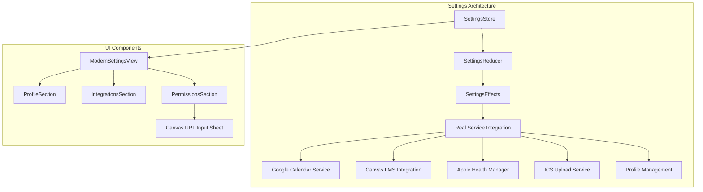

### Key Settings Features

#### **Real Service Integration**
```swift
// Google Calendar Integration
GoogleCalendarService.shared.authenticate()

// Canvas LMS with URL Input Sheet
CanvasURLInputSheet(
    canvasURL: $canvasURL,
    onSave: {
        store.send(.integrations(.submitIntegrationData(.canvasLMS, data: ["url": canvasURL])))
    }
)

// Apple Health with All Data Types
HealthManager.shared.requestAuthorization() // Now checks 7 health data types

// Profile with Database Persistence  
UserProfileManager.shared.updateProfile() // Multi-layer caching with Aurora/Neon
```

#### **Professional Status UI**
- **Consistent status capsules** with uniform widths and professional styling
- **Real permission detection** across all 5 permission types
- **Color-coded status indicators** (Connected/Not Connected)
- **Simplified status text** for clean, readable interface

#### **TCA-Inspired Architecture**
```swift
// Store-based state management
class SettingsStore: ObservableObject {
    @Published var state: SettingsState
    
    func send(_ action: SettingsAction) {
        let effects = SettingsReducer.reduce(&state, action)
        SettingsEffects.run(effects, send: send)
    }
}

// Canvas LMS State Management
enum SettingsAction {
    case integrations(IntegrationsAction)
    case overlays(OverlayAction)
}

enum IntegrationsAction {
    case connectIntegration(IntegrationType)
    case submitIntegrationData(IntegrationType, data: [String: Any])
}
```

## Application Launch Sequence

The diagram below shows what happens from the moment iOS starts the app process to the point where either the main **TabView** _or_ the **LoginView** is rendered.

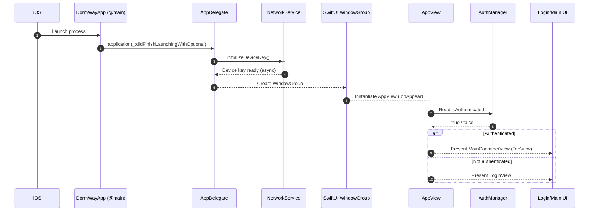

Highlights:

1. `NetworkService.initializeDeviceKey()` is **fire‑and‑forget** and does not block UI creation.
2. `AppView` centrally synchronises its local state (`AuthViewModel`) with `AuthManager`, ensuring a single source‑of‑truth.
3. Subsequent events such as `AuthStateDidChange` or `appInitializationComplete` are delivered via `NotificationCenter` and update the UI reactively.

---

## Authentication and Permissions

### Authentication Flow
- **Primary Auth Provider**: Clerk (not Supabase/Auth0)
- Implements secure authentication using Keychain
- Handles app reinstallation detection
- Manages user session persistence via `ClerkServiceProtocol`
- Coordinates with service initialization
- Supports Apple Sign-In and Google Sign-In
- Includes school selection as part of the onboarding process
- Features value proposition carousel before signup
- Robust campus ID management with multi-level fallbacks
- Comprehensive JWT token handling and authentication state synchronization

For detailed documentation, see:
- iOS Authentication System
- iOS Onboarding Flow
- iOS Login Flow Updates

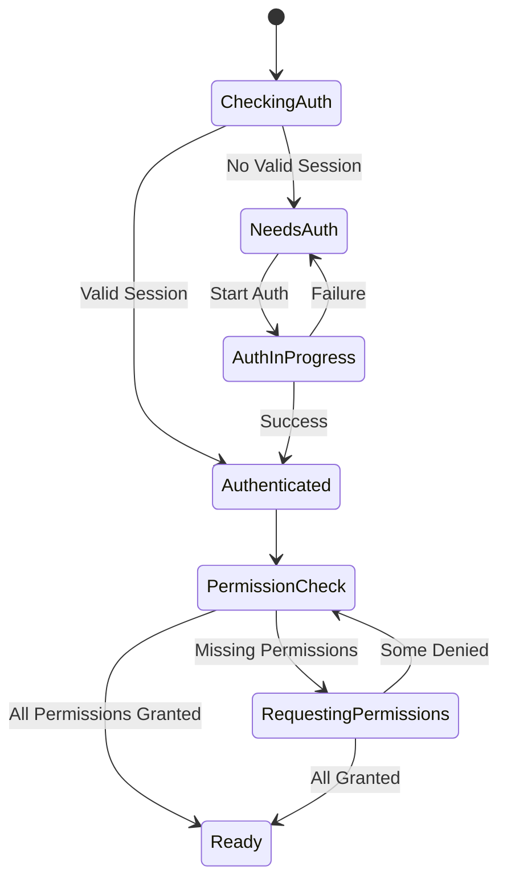

### Detailed Login Sequence

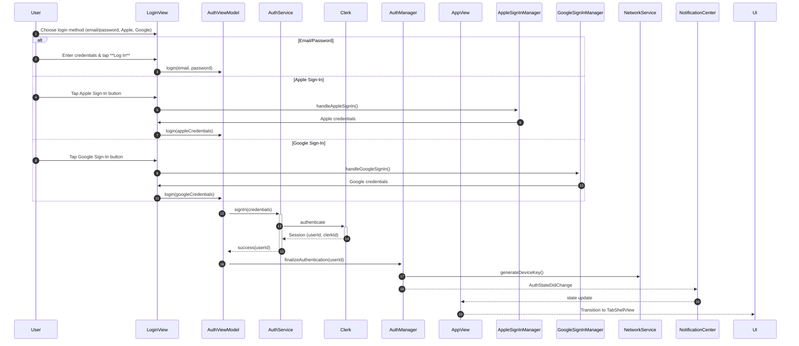

### Detailed Registration Sequence

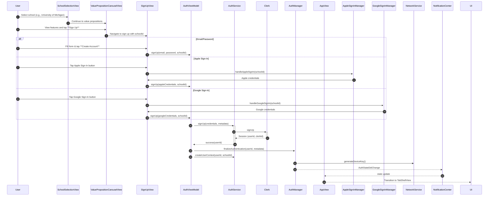

Both flows converge on `AuthManager.finalizeAuthentication`, ensuring that **all dependent services** (device key generation, profile loading, analytics, etc.) are initialised _before_ the rest of the application responds to the authenticated state.


```swift
@MainActor
@Observable
public class AuthService: AuthServiceProtocol {
    public enum AuthState: Equatable {
        case unknown, unauthenticated, authenticating, authenticated, refreshing, failed(String)
    }

    public private(set) var authState: AuthState = .unknown
    private var clerkService: ClerkServiceProtocol? // Primary auth provider

    public func restoreSession() async { /* Clerk session restoration */ }
    public func signIn(credentials: Credentials) async throws { /* Clerk sign in */ }
    public func signOut() async { /* Clerk sign out */ }
}
```

### Permission Management
- Progressive permission request sequence:
  1. Push Notifications
  2. Calendar Access
  3. Location Services
  4. Health Data
  5. Screen Time
- Coordinated service initialization
- Proper state management

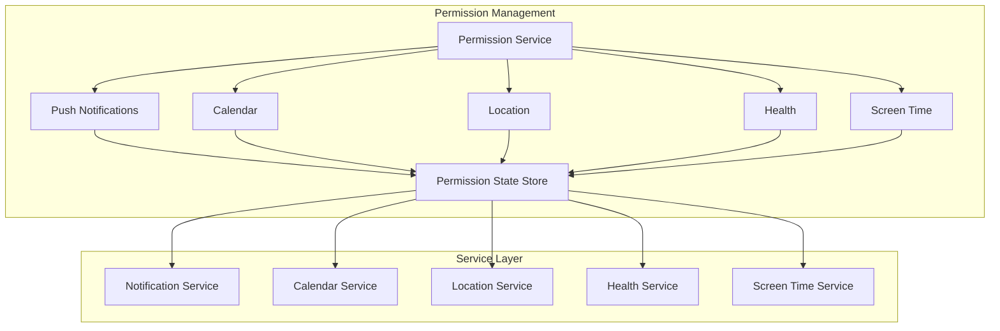

```swift
struct PermissionStep {
    let title: String
    let description: String
    let buttonText: String
    let action: () async -> Bool
}
```

### Service Initialization

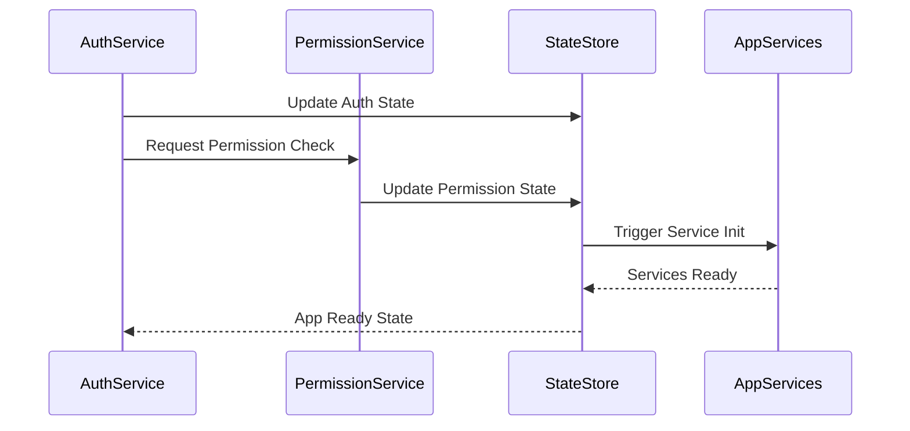

- Post-authentication service coordination
- Parallel task execution
- Proper dependency management
- Enhanced error handling

## Core Architecture Components

### Context System
- Provides intelligent context awareness across the app
- Detects user location, activity, and schedule context
- Adapts UI and behavior based on current context
- Integrates with backend via StudentWatcherSignalService
- Supports ML training with comprehensive context data dumps (June 2025)

For detailed documentation, see:
- iOS Context System

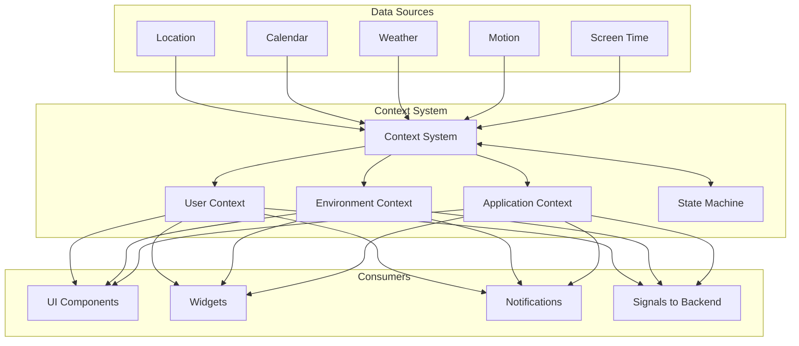

### Navigation Structure (Updated January 2026)

The iOS app implements the unified Navigation IA with 5 tabs and Settings as a sheet.

- Uses SwiftUI's native navigation with `NavigationStack` per tab
- Implements deep linking support via URL schemes and App Intents
- Settings accessed via top-right profile button (not a tab)
- `TabRegistry` manages per-tab navigation paths

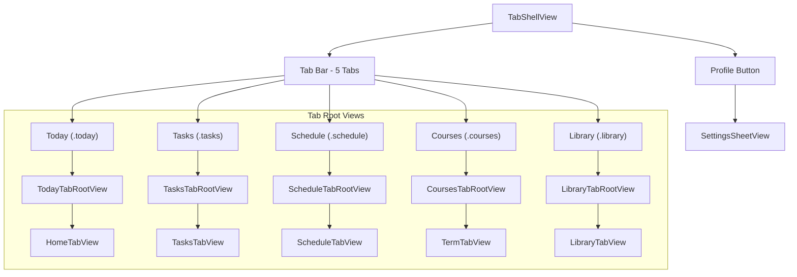

**Current Tab Structure** (January 2026 - Navigation IA Refactor):
| Tab | AppTab Enum | View | Purpose |
|-----|-------------|------|---------|
| Today | `.today` | `HomeTabView` | Dashboard with unified widgets |
| Tasks | `.tasks` | `TasksTabView` | Task management |
| Schedule | `.schedule` | `ScheduleTabView` | Day/week calendar view |
| Courses | `.courses` | `TermTabView` | Course cards with UniversalCourseCard |
| Library | `.library` | `LibraryTabView` | Files/Notes with segmented picker |

**Settings Access:**
- Profile button (person.crop.circle icon) in top-right toolbar
- Opens `SettingsSheetView` as a sheet presentation
- Environment binding `showSettingsSheet` passed through view hierarchy

### View Models
- Implements MVVM pattern with SwiftUI
- Uses `@Published` properties for reactive updates
- Handles business logic and data transformation
- Manages state using Redux-inspired state containers

```swift
class TaskViewModel: ObservableObject {
    @Published var tasks: [Task] = []
    @Published var isLoading = false
    private let taskService: TaskServiceProtocol
    
    // Implementation details...
}
```

### Services Layer
- Abstracts business logic from view models
- Handles data operations and transformations
- Manages API communication and caching
- Implements dependency injection
- Coordinates permissions and authentication

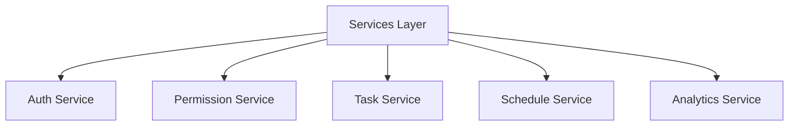

### Temporal Engine
- Manages time-based operations and scheduling
- Handles calendar integrations
- Processes recurring tasks and reminders
- Implements efficient caching for temporal data

### Design System
- Custom SwiftUI components library
- Consistent typography and color schemes
- Adaptive layouts for different screen sizes
- Dark mode support
- Accessibility features

## Features

### Core Features
1. Schedule Management
   - Calendar integration
   - Class schedule display
   - Assignment tracking
   
2. Task Organization
   - Priority-based sorting
   - Due date management
   - Category organization
   
3. Social Integration
   - Study group coordination
   - Event sharing
   - Campus community features

### Performance Optimizations
- Lazy loading of views and data
- Efficient caching strategies
- Background fetch optimization
- Memory management best practices

## Development Guidelines

### Code Organization
```
DormWay/
├── App/
│   ├── AppDelegate.swift
│   └── SceneDelegate.swift
├── Auth/
│   ├── AuthenticationService.swift
│   ├── PermissionService.swift
│   └── OnboardingFlow/
├── Features/
│   ├── Schedule/
│   ├── Tasks/
│   ├── Social/
│   └── Settings/
├── Core/
│   ├── Services/
│   ├── Models/
│   └── Utils/
└── UI/
    ├── Components/
    └── Resources/
```

### Best Practices
1. Use SwiftUI previews for rapid development
2. Implement unit tests for business logic
3. Follow SOLID principles
4. Use dependency injection
5. Document public interfaces
6. Handle permissions and authentication properly
7. Implement proper cleanup on reinstallation

## API Endpoints

The iOS app communicates with the DormWay API Router using **v2 endpoints**. All requests go through Zuplo (port 9000) with JWT authentication.

> **⚠️ CRITICAL**: The app uses `/api/v2/...` endpoints (not v1). Any v1 references are legacy.

### Student Endpoints (Primary)

```
/api/v2/students/me/context         GET    Student context (campus, schedule summary)
/api/v2/students/me/dayplan         GET    AI-generated day plan
/api/v2/students/me/current-term    GET    Current term info + progress
/api/v2/students/me/terms           GET    All terms
/api/v2/students/me/term-calendar   GET    Term calendar with key dates
/api/v2/students/me/courses         GET    Enrolled courses
/api/v2/students/me/next-action     GET    Next recommended action
/api/v2/students/me/preferences     GET/PUT User preferences
/api/v2/students/me/setup-status    GET    Onboarding completion status
```

### Schedule Endpoints

```
/api/v2/students/me/time-blocks              GET/POST     Time blocks (classes, events)
/api/v2/students/me/time-blocks/:id          PATCH/DELETE Single time block
/api/v2/students/me/deadlines                GET          Assignment deadlines
```

### Tasks Endpoints

```
/api/v2/students/me/tasks           GET/POST     Tasks list / create
/api/v2/students/me/tasks/:id       PATCH/DELETE Update / delete task
```

### Widget Endpoints (Dashboard)

```
/api/v2/widgets/schedule    GET    Schedule widget data
/api/v2/widgets/tasks       GET    Tasks widget data
/api/v2/widgets/academic    GET    Academic progress data
/api/v2/widgets/campus      GET    Campus activity data
```

### Feed & Activity

```
/api/v2/students/me/feed            GET     Activity feed items
/api/v2/students/me/feed/dismiss    POST    Dismiss feed item
```

### Course & Syllabus

```
/api/v2/courses/:courseId       GET     Course details
/api/v2/syllabi                 GET     Syllabus data (query: courseId, full)
/api/v2/syllabi/upload          POST    Upload syllabus document
```

### Term Data

```
/api/v2/students/me/current-term/workload    GET    Current term workload analysis
/api/v2/students/me/current-term/warnings    GET    Current term warnings
/api/v2/students/me/terms/:termId            GET    Specific term details
/api/v2/students/me/terms/:termId/workload   GET    Specific term workload
/api/v2/students/me/terms/:termId/warnings   GET    Specific term warnings
```

### Other Endpoints (non-v2)

```
/api/search/chat/start              POST   Ace chat conversation start (Ably streaming)
/api/push/register                  POST   Register push token
/api/push/unregister                POST   Unregister push token
/api/campus/:id/metadata            GET    Campus metadata
/api/campus/by-code/:code/metadata  GET    Campus metadata by code
/api/campus/:id/housing             GET    Campus housing info
/api/mobile/onboarding/complete     POST   Complete onboarding flow
/api/live-activity/register         POST   Register Live Activity push token
/api/live-activity/:activityId      DELETE Unregister Live Activity
```

### Service Implementation

Endpoints are called via `NetworkService` in `DWServices`:

```swift
// Example from MeService.swift
let response: StudentContextResponse = try await networkService.request(
    endpoint: "/api/v2/students/me/context",
    method: .get
)

// Example from TasksService.swift
let tasks: TasksResponse = try await networkService.request(
    endpoint: "/api/v2/students/me/tasks",
    method: .get
)
```

### Response Types

Key response models are defined in `DWServices`:
- `StudentContextResponse` - Student context with campus, schedule summary
- `DayPlanResponse` - AI-generated day plan
- `CurrentTermResponse` - Term info with progress metrics
- `TimeBlocksResponse` - Schedule time blocks
- `TasksResponse` - Tasks with deadlines
- `FeedResponse` - Activity feed items

## Future Improvements

1. Enhanced Offline Support
   - Improved data synchronization
   - Conflict resolution
   - Background updates

2. Performance Optimizations
   - Reduced memory footprint
   - Faster startup time
   - Optimized network calls

3. Feature Additions
   - Advanced study planning
   - AI-powered recommendations
   - Enhanced social features

## Version History

- **v4.1.0 (Current - January 2026)** - **NAVIGATION IA REFACTOR**: Unified 5-tab navigation (Today/Tasks/Schedule/Courses/Library), Settings as sheet via profile button, unified widget system (CollapsibleWidgetContainer, UpNextCard, WidgetStackView), UniversalCourseCard with dark glassmorphic styling, LibraryTabView with Files/Notes toggle
- **v4.0.0 (December 2025)** - **iOS 26 PLATFORM FEATURES**: App Intents (Siri + Apple Intelligence), Live Activities (Dynamic Island class countdown), Control Center Widgets, AlarmKit (class alarms with per-course preferences)
- **v3.0.0 (May 2025)** - **MAJOR PLG TRANSFORMATION**: Zero State Dashboard with +531 lines PLG components, BFF integration, production-ready Settings system with real service integrations (Canvas LMS, Health, Google Calendar), enhanced DashboardUI package, and compelling "Holy Shit!" user moments
- v2.3.0 - Complete onboarding flow with school selection, value proposition carousel, and backend integration
- v2.2.0 - Added Apple Sign-In and improved authentication system
- v2.1.0 - Enhanced authentication and permissions flow
- v2.0.0 - Major update with AI integration
- v1.2.0 (Beta) - Additional social features
- v1.1.0 (Beta) - Enhanced stability and performance
- v1.0.0 (Alpha) - Initial release with core features

## Related Documentation

For detailed implementation information, see:

### iOS 26 Platform Features
- iOS 26 Platform Features Spec - Full spec for App Intents, Live Activities, Control Center, AlarmKit, Foundation Models, PencilKit

### PLG & Dashboard
- iOS Dashboard UI Integration - Complete PLG dashboard implementation details
- iOS Dashboard BFF Integration - BFF data pipeline integration

### Settings & Integrations  
- iOS Settings & Profile UI - Production-ready Settings system
- iOS Permissions Screen - Comprehensive permission handling
- [iOS Google Calendar Auth](/docs/engineering/technical/ios/ios-calendar-sync-system) - Google Calendar integration
- iOS ICS Uploader - ICS file upload functionality

### Architecture & Auth
- iOS Authentication System - Authentication and security
- iOS Build Guide - Build process and deployment
- iOS Context System - Intelligent context awareness
