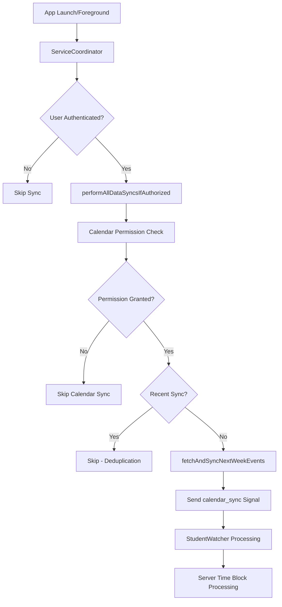

# iOS Calendar Sync System

**Latest Update (June 1, 2025)**: Complete overhaul of calendar sync system with session-based authentication, multi-trigger synchronization, and real-time server communication via StudentWatcher signaling.

## Overview

The iOS calendar sync system provides comprehensive calendar integration with:
- **Session-Based Authentication**: Validates user sessions before sync operations
- **Multi-Source Integration**: Google Calendar, Canvas LMS, ICS uploads, and mobile calendar
- **Real-Time Processing**: Temporal server communication for time block processing
- **Intelligent Deduplication**: 10-second cooldown prevents excessive sync operations
- **Background Sync**: App lifecycle and background task integration

## Architecture



## Session-Based Sync Implementation

### ServiceCoordinator Integration

**File**: `App/Core/ServiceCoordinator.swift`

```swift
func performAllDataSyncsIfAuthorized(source: String) async {
    guard canPerformDataSync() else { return }
    
    await performHealthSyncIfPermissionsGranted()
    await performScreenTimeSyncIfPermissionsGranted() 
    await performContextSyncIfAuthorized()
    await performCalendarSyncIfPermissionsGranted() // NEW: Calendar sync integration
}

private func canPerformDataSync() -> Bool {
    guard authManager.isAuthenticated else {
        DWLogger.debug("Skipping data sync - user not authenticated")
        return false
    }
    
    guard authManager.userId != nil else {
        DWLogger.debug("Skipping data sync - no user ID available")
        return false
    }
    
    return true
}
```

### Calendar Sync with Temporal Signaling

```swift
func performCalendarSyncIfPermissionsGranted() async {
    guard canPerformDataSync() else { return }
    
    let status = await calendarService.checkCalendarPermission()
    guard status == .authorized else { return }
    
    guard shouldPerformSync(type: "calendar") else { return }
    
    do {
        try await calendarService.fetchAndSyncNextWeekEvents()
        
        // Send success signal to StudentWatcher for server processing
        await StudentWatcherSignalService.shared.sendCustomSignal(
            name: "calendar_sync",
            data: [
                "timestamp": Date().timeIntervalSince1970,
                "source": "ios_calendar_service",
                "sync_type": "next_week_events",
                "success": true
            ]
        )
        
    } catch {
        // Send error signal to StudentWatcher
        await StudentWatcherSignalService.shared.sendCustomSignal(
            name: "calendar_sync",
            data: [
                "timestamp": Date().timeIntervalSince1970,
                "source": "ios_calendar_service",
                "error": error.localizedDescription,
                "success": false
            ]
        )
    }
}
```

## Multi-Trigger Sync System

### App Lifecycle Integration

**File**: `App/Core/DormWayApp.swift`

The calendar sync system integrates with multiple app lifecycle events:

#### 1. App Launch Sync
```swift
// AppDelegate.didFinishLaunchingWithOptions
TaskAsync {
    await ServiceCoordinator.shared.performAllDataSyncsIfAuthorized(source: "app_launch")
}
```

#### 2. App Foregrounding Sync
```swift
// AppDelegate.applicationDidBecomeActive
TaskAsync {
    await ServiceCoordinator.shared.performAllDataSyncsIfAuthorized(source: "app_foreground")
}
```

#### 3. SwiftUI Scene Monitoring
```swift
.onChange(of: scenePhase) { oldPhase, newPhase in
    switch newPhase {
    case .active:
        TaskAsync {
            await services.performAllDataSyncsIfAuthorized(source: "swiftui_scene_active")
        }
    }
}
```

#### 4. Background Task Integration
```swift
func handleCalendarBackgroundTask(_ task: BGAppRefreshTask) {
    let fetchOperation = BlockOperation {
        TaskAsync {
            do {
                try await ServiceCoordinator.shared.calendarService.fetchAndSyncNextWeekEvents()
                await sendCalendarSyncSignal(success: true, source: "background_task")
            } catch {
                await sendCalendarSyncSignal(success: false, error: error, source: "background_task")
            }
        }
    }
}
```

## Deduplication System

### Intelligent Sync Throttling

**Implementation**: 10-second deduplication window prevents excessive sync operations:

```swift
private func shouldPerformSync(type: String) -> Bool {
    let lastSyncKey = "last_\(type)_sync"
    let lastSync = UserDefaults.standard.double(forKey: lastSyncKey)
    let now = Date().timeIntervalSince1970
    
    // 10-second deduplication window
    guard now - lastSync > 10 else {
        DWLogger.debug("Skipping \(type) sync - too recent (within 10 seconds)")
        return false
    }
    
    UserDefaults.standard.set(now, forKey: lastSyncKey)
    return true
}
```

## StudentWatcher Signal Integration

### Real-Time Server Communication

**File**: `App/Services/Background/StudentWatcherSignalService.swift`

```swift
class StudentWatcherSignalService {
    static let shared = StudentWatcherSignalService()
    
    func sendCustomSignal(name: String, data: [String: Any]) async {
        guard let userId = authManager.userId else { return }
        
        let signalData: [String: Any] = [
            "custom_signal_name": name,
            "user_id": userId,
            "timestamp": Date().timeIntervalSince1970,
            "data": data
        ]
        
        do {
            // Send signal to Temporal StudentWatcher workflow
            try await temporalClient.signalWorkflow(
                workflowId: "student-watcher-\(userId)",
                signalName: "custom_signal",
                signalData: [signalData]
            )
            
            DWLogger.info("Successfully sent \(name) signal to StudentWatcher")
        } catch {
            DWLogger.error("Failed to send \(name) signal:", error)
        }
    }
}
```

## Google Calendar Authentication

### Enhanced OAuth Flow

**File**: `App/Services/Calendar/CalendarService.swift`

```swift
import GoogleSignIn
import EventKit

class CalendarService {
    func authenticateGoogleCalendar() async throws {
        guard let windowScene = UIApplication.shared.connectedScenes.first as? UIWindowScene,
              let rootViewController = windowScene.windows.first?.rootViewController else {
            throw CalendarError.noViewController
        }
        
        let config = GIDConfiguration(clientID: config.google.iosClientId)
        GIDSignIn.sharedInstance.configuration = config
        
        let result = try await GIDSignIn.sharedInstance.signIn(withPresenting: rootViewController)
        
        // Store tokens securely in Supabase
        await storeGoogleCalendarCredentials(
            accessToken: result.user.accessToken.tokenString,
            refreshToken: result.user.refreshToken.tokenString,
            expiresIn: result.user.accessToken.expirationDate
        )
        
        DWLogger.info("Google Calendar authentication successful")
    }
    
    func checkCalendarPermission() async -> EKAuthorizationStatus {
        if #available(iOS 17.0, *) {
            return EKEventStore.authorizationStatus(for: .event)
        } else {
            return EKEventStore.authorizationStatus(for: .event)
        }
    }
}
```

## Integration with Server-Side Processing

### Time Block Processing Flow

1. **iOS Calendar Sync**: Fetches calendar events from multiple sources
2. **Signal Transmission**: Sends `calendar_sync` signal to StudentWatcher workflow
3. **Server Processing**: Temporal engine processes time blocks with debouncing
4. **Database Storage**: Optimized incremental updates to `student_time_blocks` table
5. **User Notification**: Success/error notifications sent back to iOS

### Real-Time Updates

The system ensures real-time synchronization between iOS calendar changes and server-side time block processing:

```swift
// After successful calendar sync
await StudentWatcherSignalService.shared.sendCustomSignal(
    name: "calendar_sync",
    data: [
        "sync_type": "calendar_events",
        "events_count": fetchedEvents.count,
        "last_sync_time": lastSyncTime.timeIntervalSince1970,
        "calendar_sources": ["google", "mobile", "ics"]
    ]
)
```

## Performance Optimizations

### Sync Efficiency

- **Session Validation**: No sync operations before user authentication
- **Permission Checking**: Validates calendar access before attempting sync
- **Deduplication Logic**: 10-second cooldown prevents excessive API calls
- **Background Processing**: Non-blocking sync operations
- **Error Recovery**: Failed syncs don't block other operations

### Battery Optimization

- **Intelligent Scheduling**: Only sync when necessary
- **Background Limits**: Respects iOS background processing limits
- **Efficient APIs**: Uses optimized calendar APIs for minimal battery impact

## Future Enhancements

### Planned Improvements

1. **Adaptive Sync Frequency**: Dynamic sync intervals based on user activity
2. **Offline Support**: Cache calendar data for offline access
3. **Conflict Resolution**: Handle conflicts between calendar sources
4. **Batch Operations**: Group multiple sync operations for efficiency

### Integration Roadmap

1. **Canvas LMS Integration**: Direct calendar feed integration
2. **Outlook Calendar**: Microsoft calendar support
3. **iCloud Calendar**: Enhanced native calendar integration
4. **Third-Party Apps**: Integration with popular calendar applications

## Related Documentation

- iOS Calendar Sync Implementation
- Server-Side Time Block Processing
- Engine Performance Optimization
