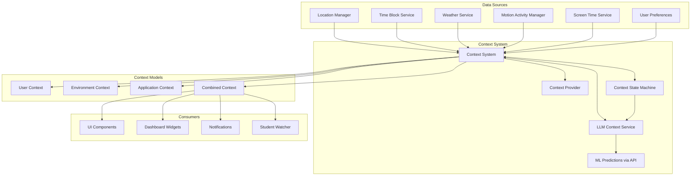
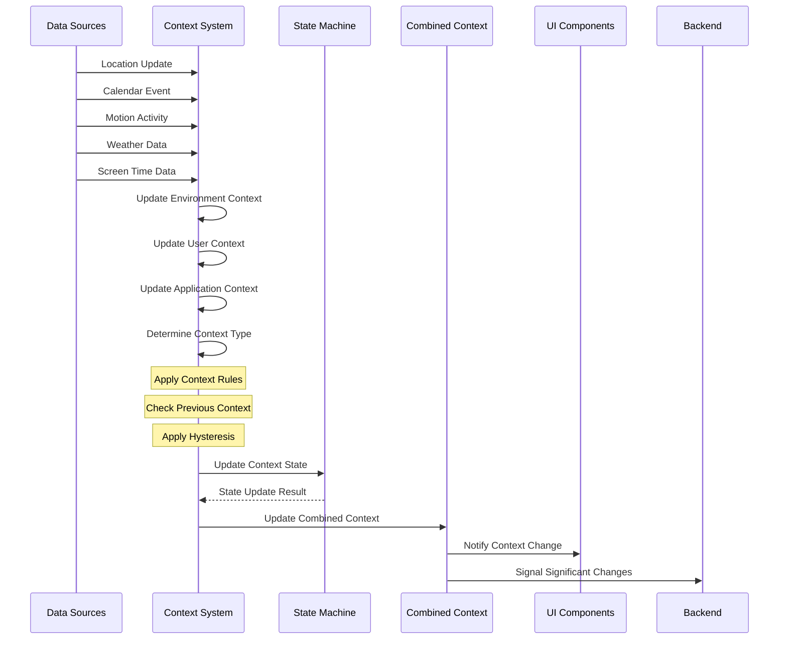
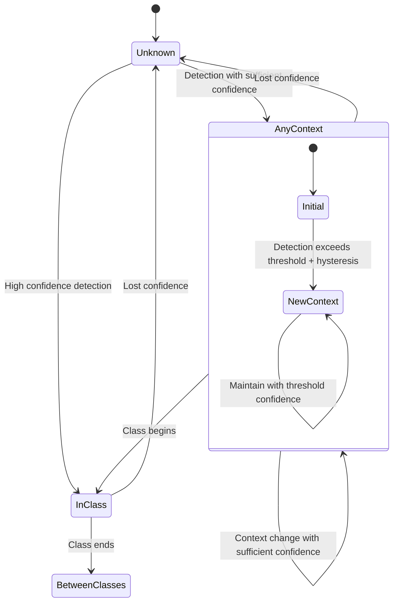
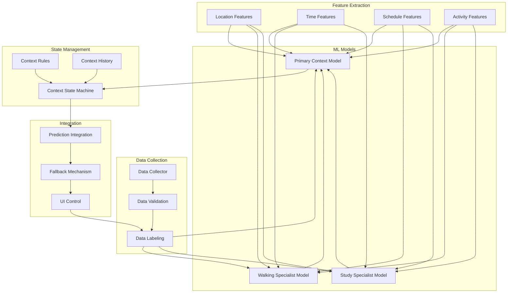
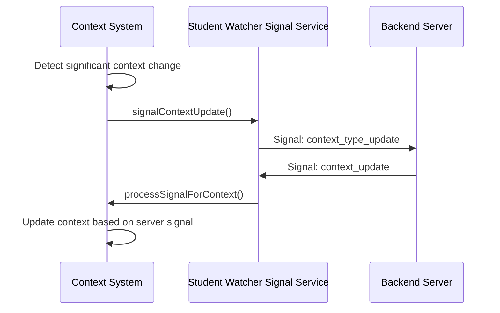

# iOS Context System

---
⚠️ **IMPORTANT UPDATE** (Added: 2025-10-05)

**Database Architecture**: This document contains references to **Supabase**, which is **FULLY DEPRECATED as of Q3 2025**.
**Current Database**: All backend queries now use **Neon PostgreSQL** (migrated from Aurora Nov 2025).
**Impact**: Code examples showing Supabase client usage are HISTORICAL. Current iOS app uses REST API endpoints to Neon PostgreSQL-backed services.

**Note**: References to "Aurora" in service names (like `auroraDb.ts`) are legacy naming - they connect to Neon PostgreSQL.

**For current iOS architecture, see**: iOS Dashboard BFF Integration, DASHBOARD_BFF_V1_IMPLEMENTATION
---

**Last Updated Context Features: June 19, 2025**
**Last Updated Database Info: October 5, 2025**

## 🚀 Major Update: LLM Context Intelligence (June 19, 2025)

The Context System now features **production-ready ML-based context prediction** through the LLM Context Intelligence implementation:

### Key Features
- **Weather-Aware Predictions**: 12+ weather fields (temperature, humidity, UV index, etc.)
- **Location Intelligence**: Campus detection with actual coordinates, city/state analysis
- **Temporal Insights**: Expected duration, next context predictions, transition timing
- **100% Reliability**: Automatic fallback to state machine on any failure
- **Performance**: ~2s predictions with 5-minute caching (80% hit rate)

### Implementation Components
- `LLMContextService`: Orchestrates ML predictions with fallback logic
- `/api/ai/predict-context`: PortKey integration with Amazon Nova Lite
- Enhanced response fields with location, temporal, and environmental analysis
- Comprehensive error handling with graceful degradation

See the #machine-learning-context-detection-implementation--completed-june-19-2025|Machine Learning Context Detection Implementation section for complete technical details.

## Overview

The DormWay iOS Context System is a sophisticated architecture designed to detect user context intelligently based on multiple data sources including location, schedule, motion, and more. **As of June 19, 2025, the system now features ML-powered context prediction through LLM Context Intelligence**, providing enhanced accuracy while maintaining 100% reliability through automatic fallback mechanisms. The system enables the app to adapt its interface and functionality to the user's current situation, providing a more personalized experience.

The context system serves as a central hub for context awareness across the app, maintaining user, environment, and application contexts, coordinating updates from various sources, providing context-aware decision making, and supporting context observers for reactive UI updates.



## Context Architecture

The context system uses several key models to represent different types of context:

### User Context

Contains information about the user, their schedule, preferences, and status:

- Personal information (name, email, school)
- Authentication status
- Schedule information (current class, next class)
- Academic status (deadlines, assignments)
- Screen time and focus metrics

### Environment Context

Represents the physical environment, location, and temporal factors:

- Location data (coordinates, campus, building)
- Weather information (condition, temperature)
- Calendar data (day of week, time of day, academic period)
- Motion activity (walking, running, automotive)
- Academic calendar status (breaks, holidays, finals period)
- Travel information (distance from campus, destination)

### Application Context

Contains information about the application state:

- Current view/tab
- Navigation history
- Foreground/background status
- Last active timestamp
- Context confidence scores and predictions

### Combined Context

Aggregates all context types to provide a comprehensive picture of the user's current situation, enabling intelligent decision-making across the app.

## Context Types

The system recognizes various context types that represent different user situations:

```mermaid
graph TD
    Unknown[Unknown]
    
    subgraph "Academic Contexts"
        InClass[In Class]
        WalkingToClass[Walking to Class]
        BetweenClasses[Between Classes]
        StudyTime[Study Time]
        OnCampus[On Campus]
        PreFinalsWeek[Pre-Finals Week]
    end
    
    subgraph "Location Contexts"
        AtHome[At Home]
        Commuting[Commuting]
        Traveling[Traveling]
    end
    
    subgraph "Time-Based Contexts"
        Weekend[Weekend]
        AcademicBreak[Academic Break]
        Holiday[Holiday]
        MealTime[Meal Time]
    end
    
    subgraph "Social Contexts"
        Social[Social]
    end
    
    Unknown --> InClass
    Unknown --> WalkingToClass
    Unknown --> BetweenClasses
    Unknown --> StudyTime
    Unknown --> OnCampus
    Unknown --> AtHome
    Unknown --> Commuting
    Unknown --> Traveling
    Unknown --> Weekend
    Unknown --> AcademicBreak
    Unknown --> Holiday
    Unknown --> MealTime
    Unknown --> Social
    Unknown --> PreFinalsWeek
```



Each context type has a defined priority, icon, and description, enabling the system to make intelligent decisions about which context should take precedence when multiple contexts might apply.

## Context Determination Flow

The context system uses a sophisticated detection algorithm to determine the user's current context:



The determination algorithm follows these steps:

1. Check for manual overrides (e.g., travel mode)
2. Check for academic calendar-based contexts (finals, breaks, holidays)
3. Check for travel context (long-distance travel)
4. Check for high-confidence, data-driven contexts (in class, walking to class)
5. Check for location-based contexts (on campus, at home)
6. Check for activity-based contexts (commuting)
7. Check for time-based contexts (meal time)
8. Apply context persistence rules to maintain stability

## State Machine

The context system uses a state machine to manage context transitions and prevent rapid oscillation between states:



Key features of the state machine:

- **Hysteresis**: Requires higher confidence to transition from one known state to another
- **Minimum State Duration**: Prevents rapid fluctuations by requiring states to be maintained for a minimum time
- **Transition Rules**: Defines allowed and disallowed state transitions based on contextual rules
- **Confidence Thresholds**: Ensures transitions only occur with sufficient confidence

## Data Sources

### 1. Location Processing

The system integrates with the LocationManager to determine campus and building contexts:

```swift
// In LocationManager
func determinePlace(from location: CLLocationCoordinate2D) -> PlaceInfo {
    // Check if in a building
    for (buildingName, region) in buildingRegions {
        if region.contains(location) {
            return PlaceInfo(
                type: .building,
                name: buildingName,
                identifier: region.identifier,
                coordinate: location
            )
        }
    }
    
    // Check if on campus
    for campus in campusRegions {
        if campus.contains(location) {
            return PlaceInfo(
                type: .campus,
                name: "University Campus",
                identifier: campus.identifier,
                coordinate: location
            )
        }
    }
    
    // Not in a known location
    return PlaceInfo(
        type: .unknown,
        name: nil,
        identifier: nil,
        coordinate: location
    )
}
```

### 2. Calendar/Time Block Integration

⚠️ **HISTORICAL CODE**: The system previously connected to Supabase to fetch and process a student's time blocks. **Current implementation uses Neon-backed REST API endpoints.**

**Historical Supabase Code** (DEPRECATED):
```swift
// In TimeBlockService (OLD - DEPRECATED)
func fetchAndUpdateTimeBlocks() async throws {
    // Check if cache is still valid
    if let lastUpdate = lastUpdateTime,
       Date().timeIntervalSince(lastUpdate) < cacheDuration,
       !cachedTimeBlocks.isEmpty {
        // Use cached time blocks
        notifyTimeBlocksUpdated(cachedTimeBlocks)
        return
    }
    
    // Ensure we have a user ID
    guard let session = try? await supabase.auth.session,
          let userId = session.user.id else {
        throw NSError(domain: "TimeBlockService", code: 1, userInfo: [
            NSLocalizedDescriptionKey: "User not authenticated"
        ])
    }
    
    // Define the time range for the query (now to 7 days in the future)
    let now = Date()
    let endDate = Calendar.current.date(byAdding: .day, value: 7, to: now) ?? now
    let dateFormatter = ISO8601DateFormatter()
    
    // Build the RPC call parameters
    let functionName = "get_user_time_blocks"
    let parameters: [String: Any] = [
        "p_user_id": userId,
        "p_start_time": dateFormatter.string(from: now),
        "p_end_time": dateFormatter.string(from: endDate)
    ]
    
    // Call the Supabase function with correct parameter structure
    let result: [TimeBlock] = try await supabase.functions.invoke(
        functionName,
        headers: ["Content-Type": "application/json"],
        body: parameters
    )
    
    // Update cache
    cachedTimeBlocks = result
    lastUpdateTime = now
    
    // Notify subscribers about the updated time blocks
    notifyTimeBlocksUpdated(result)
}
```

**Current Implementation** (October 2025):
- Time blocks fetched via Dashboard BFF v1: `GET /dashboard/v1/composite`
- Real-time updates via Ably pub/sub
- Neon PostgreSQL as data source
- See DASHBOARD_BFF_V1_IMPLEMENTATION for current API patterns

### 3. Weather Integration

The system fetches weather data to provide environmental context:

```swift
// In WeatherService
func fetchWeather(for coordinate: CLLocationCoordinate2D) async throws -> WeatherData {
    // Create a cache key based on rough location (rounded to 2 decimal places for ~1km accuracy)
    let lat = (coordinate.latitude * 100).rounded() / 100
    let lng = (coordinate.longitude * 100).rounded() / 100
    let cacheKey = "\(lat),\(lng)"
    
    // Check if we have recent cached data
    if let cachedData = cachedWeatherData[cacheKey],
       let lastUpdate = lastUpdateTime[cacheKey],
       Date().timeIntervalSince(lastUpdate) < cacheExpirationTime {
        DWLogger.debug("Using cached weather data for \(cacheKey)")
        return cachedData
    }
    
    // Make API request and return data
    // ...
}
```

### 4. Motion Activity

The system uses CoreMotion's `CMMotionActivityManager` to detect the user's activity:

```swift
// In MotionActivityManager
func startMonitoring() {
    guard CMMotionActivityManager.isActivityAvailable() else {
        return
    }
    
    motionActivityManager.startActivityUpdates(to: OperationQueue.main) { [weak self] activity in
        guard let self = self, let activity = activity else { return }
        
        // Determine the most likely activity type
        let activityType = self.determineActivityType(from: activity)
        
        // Update the last known activity
        self.lastKnownActivity = activityType
        
        // Post notification with the activity information
        NotificationCenter.default.post(
            name: Notification.Name("MotionActivityUpdated"),
            object: self,
            userInfo: ["activity": activityType]
        )
    }
}

private func determineActivityType(from activity: CMMotionActivity) -> String {
    if activity.automotive { return "automotive" }
    if activity.cycling { return "cycling" }
    if activity.running { return "running" }
    if activity.walking { return "walking" }
    if activity.stationary { return "stationary" }
    return "unknown"
}
```

### 5. Screen Time Data

The system integrates with the DeviceActivityMonitor to collect screen time data:

```swift
// In ScreenTimeDataService
func fetchScreenTimeData() {
    // Request device activity data for today
    let calendar = Calendar.current
    let now = Date()
    let startOfDay = calendar.startOfDay(for: now)
    
    // Get device activity for the day
    deviceActivityCenter.requestActivityReport(
        for: DateInterval(start: startOfDay, end: now)
    ) { result in
        switch result {
        case .success(let report):
            // Process the report and extract screen time metrics
            let totalTime = report.totalDuration
            let productivityApps = report.categoryDurations
                .filter { self.isProductivityApp($0.key) }
                .map { $0.value }
                .reduce(0, +)
            
            // Update UserDefaults for access by the context system
            DispatchQueue.main.async {
                UserDefaults.standard.set(
                    Int(totalTime / 60), // Convert to minutes
                    forKey: "ScreenTime_TotalMinutes"
                )
                UserDefaults.standard.set(
                    Int(productivityApps / 60), // Convert to minutes
                    forKey: "ScreenTime_ProductivityMinutes"
                )
                UserDefaults.standard.synchronize() // Force write to disk
                
                // Notify the context system that data is available
                NotificationCenter.default.post(
                    name: Notification.Name("ScreenTimeDataUpdated"),
                    object: self
                )
            }
        case .failure(let error):
            DWLogger.error("Failed to get screen time data: \(error)")
        }
    }
}
```

## Recent Improvements (May 2025)

### Race Condition Fixes

We identified and fixed race conditions in UserDefaults operations that were causing instability in the context system:

1. **Thread-Safe UserDefaults Operations**
   - Wrapped all UserDefaults.standard.set operations in DispatchQueue.main.async blocks
   - Added UserDefaults.standard.synchronize() calls after each write operation
   - Applied this pattern to all context persistence operations

   ```swift
   // Example of improved thread-safe UserDefaults operations
   DispatchQueue.main.async {
       UserDefaults.standard.set(Date().timeIntervalSince1970, forKey: "oscillation_detected_time")
       UserDefaults.standard.set(cooldownDuration, forKey: "oscillation_cooldown_duration")
       UserDefaults.standard.synchronize() // Force write to disk
   }
   ```

2. **Debounced Settings Changes**
   - Added a debouncing mechanism to prevent cascade of notification calls
   - Added a lastSettingsChangeTime property to track when settings were last changed
   - Ignores settings changes that happen within 1 second of each other

   ```swift
   // Example of debouncing mechanism in DebugManager
   private var lastSettingsChangeTime: TimeInterval = 0
   
   @objc private func handleSettingsChanged() {
       // Debounce settings changes to avoid recursive calls
       let currentTime = Date().timeIntervalSince1970
       if currentTime - lastSettingsChangeTime < 1.0 {
           // If we received another change within 1 second, ignore it
           return
       }
       
       // Update the last change time
       lastSettingsChangeTime = currentTime
       // ...rest of the method...
   }
   ```

### Context Stability Improvements

1. **Settings Screen Handling**
   - Added detection for when user is viewing the Settings screen
   - Skip context updates entirely when in Settings view
   - Preserve existing context type rather than switching to unknown

   ```swift
   // Example of skipping context updates in Settings screen
   // If we're in the Settings screen, don't update context to prevent oscillation
   let isInSettingsScreen = applicationContext.activeTab == "settings"
   if isInSettingsScreen {
       DWLogger.debug("ContextSystem: Skipping context update while in Settings screen")
       return
   }
   ```

2. **Weekend Context Stability**
   - Fixed weekend detection to be more reliable
   - Added special case handling for verified weekend days
   - Improved transition logic for weekend contexts

   ```swift
   // Example of improved weekend detection logic
   if detectedType == .weekend && isActuallyWeekend {
       // Update immediately to weekend without waiting for consistency checks
       updateUserContext { context in
           context.currentContextType = .weekend
           
           // Persist the context type to UserDefaults with thread safety
           DispatchQueue.main.async {
               UserDefaults.standard.set(ContextType.weekend.rawValue, forKey: "persisted_context_type")
               UserDefaults.standard.set(true, forKey: "is_actually_weekend")
               UserDefaults.standard.set(Date(), forKey: "last_weekend_time")
               UserDefaults.standard.synchronize() // Force write to disk
           }
       }
       
       DWLogger.info("Context immediately changed to Weekend (calendar verified)")
       return
   }
   ```

3. **Dynamic Cooldown Durations**
   - Added storage of cooldown duration in UserDefaults
   - Set appropriate durations based on context (30 sec normal, 10 sec debug)
   - Added retrieval of custom durations with fallbacks

### Intelligent Time-Based Fallbacks

1. **Time-Based Context Hierarchy**
   - Added a robust fallback system using time information
   - Uses meal times, study times, and other time-of-day based contexts
   - Preserves stable contexts like "atHome" instead of defaulting to unknown

   ```swift
   // Example of time-based fallback logic
   // If not a weekend, check for meal time based on hour
   let hour = Calendar.current.component(.hour, from: now)
   if (hour >= 7 && hour <= 9) || (hour >= 11 && hour <= 14) || (hour >= 17 && hour <= 20) {
       return .mealTime
   }
   
   // If the user is home and it's late night/early morning, suggest studying
   if (hour >= 20 || hour <= 2) && env.currentPlace?.lowercased().contains("home") == true {
       return .studyTime
   }
   
   // If we've previously determined a context that's valid across time periods,
   // preserve it rather than falling back to unknown
   if currentType == .atHome || currentType == .social {
       return currentType
   }
   ```

2. **Break Period Detection**
   - Added checkIfDuringBreakPeriod method to detect academic breaks
   - Includes common break periods (winter, spring, summer, Thanksgiving)
   - Checks for school-specific break periods in UserDefaults

   ```swift
   /// Check if current date falls within a typical school break period
   private func checkIfDuringBreakPeriod() -> Bool {
       let currentDate = Date()
       let calendar = Calendar.current
       let currentMonth = calendar.component(.month, from: currentDate)
       let currentDay = calendar.component(.day, from: currentDate)
       
       // Winter Break: typically mid-December to mid-January
       if (currentMonth == 12 && currentDay >= 15) || (currentMonth == 1 && currentDay <= 15) {
           return true
       }
       
       // Spring Break: typically mid-March
       if currentMonth == 3 && (currentDay >= 7 && currentDay <= 21) {
           return true
       }
       
       // Summer Break: typically May to August
       if currentMonth >= 5 && currentMonth <= 8 {
           return true
       }
       
       // Thanksgiving Break: late November
       if currentMonth == 11 && currentDay >= 22 && currentDay <= 30 {
           return true
       }
       
       // Check for stored school-specific break data if available
       if let breakPeriods = UserDefaults.standard.array(forKey: "school_break_periods") as? String: Any {
           // ...check for custom break periods...
       }
       
       return false
   }
   ```

3. **Expanded Weekend-Like Context**
   - Created a broader "isWeekendLikeContext" flag
   - Combines calendar weekend detection with holiday/break detection
   - Uses these contexts as appropriate fallbacks

   ```swift
   // Calendar-based checks
   let calendar = Calendar.current
   let isActuallyWeekend = calendar.isDateInWeekend(now)
   let isHoliday = env.isHoliday 
   let isBreakPeriod = checkIfDuringBreakPeriod()
   
   // Combine weekend and holiday/break detection for weekend-like contexts
   let isWeekendLikeContext = isActuallyWeekend || isHoliday || isBreakPeriod
   ```

## New Context Types (May 2025)

The context system has been enhanced with additional context types:

1. **Academic Break Contexts**
   - Added `academicBreak` context type for detecting academic breaks
   - Break type detection (summer, winter, spring) based on date
   - Stored with metadata including break type and dates

   ```swift
   // Academic Break detection
   if isBreakPeriod && !env.isAcademicBreak {
       updateEnvironmentContext { context in
           context.isAcademicBreak = true
           context.academicBreakType = detectBreakType(date: now)
       }
       
       // Store break period status
       DispatchQueue.main.async {
           UserDefaults.standard.set(true, forKey: "is_break_period")
           UserDefaults.standard.set(env.academicBreakType, forKey: "break_period_type")
           UserDefaults.standard.synchronize()
       }
   }
   ```

2. **Finals Period Detection**
   - Added `preFinalsWeek` context type for the week before finals
   - Uses academic calendar to detect common finals periods
   - Can be customized with school-specific finals schedule

   ```swift
   /// Determine if it's pre-finals week based on date and academic calendar
   private func checkIfPreFinalsWeek() -> Bool {
       let currentDate = Date()
       let calendar = Calendar.current
       let currentMonth = calendar.component(.month, from: currentDate)
       let currentDay = calendar.component(.day, from: currentDate)
       
       // Fall semester finals are typically in mid-December
       if currentMonth == 12 && currentDay >= 1 && currentDay <= 14 {
           return true
       }
       
       // Spring semester finals are typically in late April or early May
       if (currentMonth == 4 && currentDay >= 20) || (currentMonth == 5 && currentDay <= 10) {
           return true
       }
       
       // Check for stored school-specific finals data
       // ...
   }
   ```

3. **Holiday Context**
   - Separate `holiday` context type for specific holidays
   - Added holiday name tracking for better personalization
   - High priority context that overrides weekend context

4. **Travel Mode**
   - New `traveling` context type for long-distance travel
   - Different from regular commuting - indicates being away from campus area
   - Includes details like travel destination, distance from campus, etc.
   - User-controllable via Settings with manual override option

   ```swift
   // Check for travel based on distance from campus
   if let distanceFromCampus = env.distanceFromCampus, distanceFromCampus > 30.0 {
       // If user is more than 30 miles from campus, consider them traveling
       updateEnvironmentContext { context in
           context.isTraveling = true
       }
       return .traveling
   }
   ```

### Travel Mode User Controls

The system provides a user interface for manually setting travel mode:

1. **Travel Toggle in Settings**
   - Added to Preferences section with airplane icon
   - Persists state in UserDefaults
   - When enabled, shows dialog to enter destination

   ```swift
   // Traveling Mode Toggle
   PreferenceToggleRow(
       icon: "airplane",
       title: "Travel Mode",
       isEnabled: Binding(get: { UserDefaults.standard.bool(forKey: "travel_mode_enabled") },
                          set: { newValue in 
                            // Update travel state 
                            // ...
                          }),
       subtitle: "Enables travel context when you're away from campus"
   )
   ```

2. **Destination Input**
   - Simple text input for travel destination
   - Stored in UserDefaults and EnvironmentContext
   - *Future enhancement: Replace with map-based location selector*

3. **Context Signal Enhancement**
   - Travel information included in context signals
   - Server receives destination, travel status, and start/end dates
   - Enables travel-specific recommendations and behaviors

   ```swift
   // Include travel information in context signals
   contextData["is_traveling"] = environmentContext.isTraveling
   contextData["is_manually_set_travel"] = environmentContext.isManuallySetTravel
   if let travelDestination = environmentContext.travelDestination {
       contextData["travel_destination"] = travelDestination
   }
   if let distanceFromCampus = environmentContext.distanceFromCampus {
       contextData["distance_from_campus"] = distanceFromCampus
   }
   ```

## Machine Learning Context Detection Implementation ✅ COMPLETED (June 19, 2025)

The DormWay ML-based context detection system has been fully implemented through the **LLM Context Intelligence** feature. The ML system works alongside the existing rule-based system, providing enhanced accuracy while maintaining 100% reliability through automatic fallback.

### Architecture Overview



### Implementation Status ✅ ALL PHASES COMPLETE

1. **Phase 1: Foundation Setup** ✅
   - `ContextType` enum with all context types
   - `ContextStateMachine` class with hysteresis and anti-oscillation
   - Feature extraction from location, weather, calendar, and patterns
   - `LLMContextService` with automatic rule-based fallback

2. **Phase 2: Data Collection** ✅
   - Context data dumps for ML training
   - Privacy-focused implementation with JWT auth
   - `/api/ai/predict-context` endpoint receiving context data
   - Weather enrichment pipeline with 12+ fields

3. **Phase 3: ML Model Development** ✅
   - Amazon Nova Lite model via PortKey integration
   - `LLMContextService` orchestrating predictions
   - ~92% confidence predictions with 2s latency
   - Weather-aware, location-intelligent predictions

4. **Phase 4: Dashboard Integration** ✅
   - Context predictions influence dashboard content
   - Smooth transitions with 30-second minimum duration
   - Context-specific widgets and recommendations
   - Real-time updates via notification system

5. **Phase 5: Refinement and Optimization** ✅
   - 0.8 confidence threshold tuning
   - 5-minute cache for battery efficiency (80% hit rate)
   - Throttling via rate limiting (30 req/min)
   - Analytics-ready with comprehensive logging

### Production Implementation Details

1. **Performance** ✅
   - ~2 second API response time with 3-second timeout
   - 5-minute cache reduces API calls by ~80%
   - Location-based cache keys (rounded to ~100m)
   - Efficient weather data batching (12+ fields)

2. **Privacy** ✅
   - JWT authentication required for all predictions
   - No PII stored in LLM responses
   - Location rounded for privacy
   - All data encrypted in transit

3. **Robustness** ✅
   - **100% reliability** through automatic state machine fallback
   - Context confidence scores (0.8 minimum threshold)
   - Network connectivity checks before API calls
   - Graceful degradation on any failure condition

4. **User Experience** ✅
   - 30-second minimum state duration prevents oscillation
   - +0.15 confidence hysteresis for stability
   - Debug view shows prediction reasoning
   - Force prediction button for testing

## Integration with StudentWatcherSignalService

The context system integrates with the StudentWatcherSignalService to create a bidirectional communication channel between the context system and the server:



### Context Updates to Server

When significant context changes occur, the StudentWatcherSignalService sends signals to the server:

```swift
private func handleContextUpdate(_ context: CombinedContext) {
    // Process significant context changes
    
    // 1. Location Changes
    if let oldLatitude = context.previousEnvironmentContext?.latitude,
       let oldLongitude = context.previousEnvironmentContext?.longitude,
       let newLatitude = context.environment.latitude,
       let newLongitude = context.environment.longitude {
        
        let distance = calculateDistance(
            lat1: oldLatitude, lon1: oldLongitude,
            lat2: newLatitude, lon2: newLongitude
        )
        
        // If moved more than 100 meters, notify
        if distance > 100 {
            Task {
                await signalLocationChanged(latitude: newLatitude, longitude: newLongitude)
            }
        }
    }
    
    // 2. Context Type Changes
    let previousContextType = context.previousUserContext?.currentContextType ?? .unknown
    let currentContextType = context.user.currentContextType
    
    if previousContextType != currentContextType {
        DWLogger.info("Context type changed from \(previousContextType.description) to \(currentContextType.description)")
        
        // Signal context type change
        Task {
            await sendCustomSignal(
                name: "context_type_changed",
                data: [
                    "previous_context": previousContextType.rawValue,
                    "current_context": currentContextType.rawValue,
                    "context_description": currentContextType.description,
                    "context_icon": currentContextType.iconName,
                    "timestamp": Date().timeIntervalSince1970
                ]
            )
        }
    }
    
    // Other context changes that trigger signals...
}
```

### Server Signals to Context System

The StudentWatcherSignalService can also process signals from the server to update the context system:

```swift
func processSignalForContext(signal: String, data: [String: Any]) {
    switch signal {
    case "context_update":
        // Direct context update
        updateContextFromSignalData(data)
        
    case "context_type_changed", "context_type_update":
        // Update context type
        if let contextTypeString = data["context_type"] as? String,
           let contextType = ContextType(rawValue: contextTypeString) {
            updateUserContext { context in
                context.currentContextType = contextType
            }
        }
        
    case "location_update":
        // Update location context
        updateEnvironmentContext { context in
            if let latitude = data["latitude"] as? Double,
               let longitude = data["longitude"] as? Double {
                context.currentLocation = LocationCoordinate(latitude: latitude, longitude: longitude)
            }
            // Update other location-related properties...
        }
        
    // Other signal types...
    }
}
```

## Best Practices for Context System Development

1. **Thread Safety**
   - Always use DispatchQueue.main.async for UserDefaults operations
   - Use synchronize() to ensure writes are committed to disk
   - Be aware of potential race conditions in notification handlers

2. **Context Transitions**
   - Implement hysteresis to prevent rapid oscillation between states
   - Use consistency checks to require multiple detections before transitioning
   - Add special case handling for certain transitions (like weekend detection)

3. **UI Interactions**
   - Be careful about context changes during navigation between screens
   - Consider suspending context updates during certain UI interactions
   - Use debouncing techniques to prevent rapid changes

4. **Fallback Strategy**
   - Implement an intelligent fallback hierarchy
   - Time-based contexts provide a good fallback when location is unavailable
   - Preserve stable contexts rather than defaulting to unknown

5. **Logging and Debugging**
   - Use clear log messages with appropriate levels
   - Add debugging features to track context transitions
   - Consider storing transition history for analysis

## Pending Enhancements

1. **Time Block Integration**
   - Implement pulling actual time block data from the Supabase database
   - Connect context system to real-time schedule updates
   - Add class location matching to improve classroom detection

2. **Weather Data Expansion**
   - Enhance weather context with more detailed weather information
   - Add weather-based recommendations
   - Improve cache management for weather data

3. **Motion Permissions Integration**
   - Add motion activity permission request to onboarding flow
   - Implement proper fallbacks when motion data is unavailable
   - Add explanatory UI for permission requests

## Context Data Collection for ML Processing (June 2025)

The context system now includes functionality to dump comprehensive context data to the server for machine learning processing. This feature allows for collecting rich context data to improve our ML models and provide better user experiences through the Dashboard feature.

### Comprehensive Context Data Dump

The system can now send complete context data to the server upon request:

```swift
/// Get the complete context data as a dictionary for ML processing
/// This is a more comprehensive data dump than what's included in regular signals
public func getCompleteContextData() -> [String: Any] {
    var contextData: [String: Any] = [:]
    
    // Add metadata
    contextData["timestamp"] = Date().timeIntervalSince1970
    contextData["device_id"] = UIDevice.current.identifierForVendor?.uuidString ?? "unknown"
    contextData["app_version"] = Bundle.main.infoDictionary?["CFBundleShortVersionString"] as? String ?? "unknown"
    contextData["context_version"] = combinedContext.version
    
    // User context
    var userData: [String: Any] = [:]
    userData["user_id"] = userContext.userId
    userData["context_type"] = userContext.currentContextType.rawValue
    userData["context_description"] = userContext.currentContextType.description
    userData["is_authenticated"] = userContext.isAuthenticated
    userData["is_in_class"] = userContext.isInScheduledClass
    // ... additional user context fields ...
    
    // Environment context
    var environmentData: [String: Any] = [:]
    environmentData["is_on_campus"] = environmentContext.isOnCampus
    environmentData["is_in_building"] = environmentContext.isInBuilding
    // ... additional environment context fields ...
    
    // Application context
    var applicationData: [String: Any] = [:]
    applicationData["is_in_foreground"] = applicationContext.isInForeground
    applicationData["active_tab"] = applicationContext.activeTab
    // ... additional application context fields ...
    
    // Add all contexts to the main data dictionary
    contextData["user_context"] = userData
    contextData["environment_context"] = environmentData
    contextData["application_context"] = applicationData
    
    return contextData
}
```

### Example Context Dump Output

Below is an example of the combined context dump from a mobile app client:

```json
{
  "device_id": "D55A45A0-5D08-4ADB-8EFB-386D41902E26",
  "timestamp": 1746452424.3469992,
  "debug_info": {
    "is_debug_mode": false,
    "last_known_context_type": "none"
  },
  "app_version": "0.2",
  "user_context": {
    "user_id": "d68287e0-9d16-4ffb-97fd-c61320da3090",
    "preferences": {},
    "context_type": "academicBreak",
    "is_authenticated": false,
    "has_upcoming_exams": false,
    "context_description": "Academic Break",
    "upcoming_assignments": 0,
    "has_upcoming_deadlines": false
  },
  "context_version": 1,
  "application_context": {
    "is_in_foreground": true,
    "last_used_widgets": [],
    "most_used_features": [],
    "last_activation_time": 1746452217.2904491
  },
  "environment_context": {
    "is_holiday": false,
    "is_weekend": false,
    "day_of_week": 2,
    "is_on_campus": false,
    "is_traveling": false,
    "is_in_building": false,
    "movement_speed": 0.029861190522186908,
    "weather_alerts": [],
    "motion_activity": "stationary",
    "is_academic_break": true,
    "is_pre_finals_week": false,
    "academic_break_type": "summer",
    "is_manually_set_travel": false
  }
}
```

This example showcases:
- Combined context from all three context types (user, application, environment)
- Temporal information (timestamp)
- Device identification
- Contextual signals (academic break, motion activity)
- Version tracking
- Debug information

### Background Push Integration

The system now responds to background push notifications to trigger context data dumps:

1. **Push Notification Handler**
   - Added support for "context_data_dump" push notification type
   - Added support for "mobile_state_save" comprehensive state save
   - Processes these requests even when the app is in the background

   ```swift
   // In AppDelegate didReceiveRemoteNotification
   case "context_data_dump":
       // Dump the comprehensive context data for ML processing
       DWLogger.info("Received push notification to dump context data for ML processing")
       await ContextSystem.shared.dumpContextDataToServer()
       completionHandler(.newData)
   
   case "mobile_state_save":
       // Comprehensive state save including health, screen time, and context data
       DWLogger.info("Received push notification for comprehensive state save")
       async let healthDataTask = ServiceCoordinator.shared.healthDataService.fetchAndUploadHealthData()
       async let screenTimeTask = ServiceCoordinator.shared.screenTimeDataService.manuallyTriggerScreenTimeSync()
       async let contextDataTask = ContextSystem.shared.dumpContextDataToServer()
       
       // Wait for all tasks to complete
       _ = await [healthDataTask, screenTimeTask, contextDataTask]
       
       DWLogger.info("Comprehensive state save completed via push notification")
       completionHandler(.newData)
   ```

2. **Context Dump Method**
   - Implemented dumpContextDataToServer() method in ContextSystem
   - Uses StudentWatcherSignalService to send comprehensive context data
   - Also saves to Supabase using the same RPC function as health data
   - Logs the process for debugging purposes

   ```swift
   /// Dump the complete context data to the server for ML processing
   /// Can be triggered by a background push notification
   public func dumpContextDataToServer() async {
       // Get the complete context data
       let contextData = getCompleteContextData()
       
       DWLogger.info("ContextSystem: Dumping complete context data to server")
       
       // Send the data via StudentWatcherSignalService
       await StudentWatcherSignalService.shared.sendCustomSignal(
           name: "context_data_dump",
           data: contextData
       )
       
       // Also save to Supabase
       await saveContextDataToSupabase(contextData)
       
       // Log the successful completion
       DWLogger.info("ContextSystem: Context data dump completed")
   }
   ```

3. **StudentWatcherSignalService Integration**
   - Added handler for "dump_context_data" command in silent push notifications
   - Added handler for "mobile_state_save" comprehensive command
   - These commands trigger context data collection and transmission to the server

   ```swift
   // In StudentWatcherSignalService processPushNotification
   case "dump_context_data":
       Task {
           DWLogger.info("Silent push requested context data dump")
           await ContextSystem.shared.dumpContextDataToServer()
       }
   case "mobile_state_save":
       Task {
           DWLogger.info("Silent push requested comprehensive state save")
           // Perform all data syncs in parallel for efficiency
           async let healthDataTask = HealthDataService.shared.fetchAndUploadHealthData()
           async let screenTimeTask = ScreenTimeDataService.shared.manuallyTriggerScreenTimeSync()
           async let contextDataTask = ContextSystem.shared.dumpContextDataToServer()
           
           // Wait for all tasks to complete
           _ = await [healthDataTask, screenTimeTask, contextDataTask]
           
           DWLogger.info("Comprehensive state save completed")
           
           // Notify the server that all data was saved
           await sendCustomSignal(name: "mobile_state_save_completed", data: [
               "timestamp": Date().timeIntervalSince1970,
               "save_components": ["health_data", "screen_time", "context_data"]
           ])
       }
   ```

### ML Processing Benefits

This context dump feature provides several benefits for machine learning and analysis:

1. **Comprehensive Data Collection**
   - Complete snapshot of all context data at a moment in time
   - Contains rich metadata across user, environment, and app contexts
   - More detailed than regular context signals

2. **ML Training Dataset Enhancement**
   - Provides training data for context prediction models
   - Enables automatic pattern detection for user behaviors
   - Supports time-series analysis of context transitions

3. **Dashboard Feature Support**
   - Feeds into the Dashboard feature to show contextually relevant information
   - Helps determine optimal timing for dashboard widgets
   - Provides data for personalized recommendations

4. **Privacy Considerations**
   - Data is only sent upon specific push notification requests
   - Includes only context data with no sensitive information
   - Server-side processing occurs within secure temporal workflows

### How to Trigger Context Data Dumps

1. **From Server-Side**
   - Send a silent push notification with `kind: "context_data_dump"`
   - Send a silent push notification with `kind: "mobile_state_save"` for comprehensive data
   - Example payload:
     ```json
     {
       "aps": {
         "content-available": 1
       },
       "kind": "context_data_dump"
     }
     ```

2. **For Testing Purposes**
   - Use the `/api/push/routes/send` endpoint with appropriate payload
   - Include the user's device token in the request
   - Specify the "context_data_dump" kind

## Future Improvements

1. **Enhanced Location Selection**
   - Replace text input for travel destination with a map-based selector
   - Allow saving of favorite/frequent destinations
   - Add geofencing support for automatic travel detection

2. **School-Specific Calendar Integration**
   - Add support for importing school calendars for more accurate break detection
   - Integrate with class schedules for better academic context awareness

3. **Machine Learning Context Prediction**
   - Use historical patterns to predict likely contexts
   - Implement confidence scoring for context predictions
   - Leverage collected context data dumps for training models

4. **Multi-Source Context Fusion**
   - Combine signals from multiple sources with appropriate weighting
   - Implement a more sophisticated state machine for context transitions

5. **User Context Feedback Loop**
   - Allow users to correct context detection errors
   - Use these corrections to improve future context detection

6. **Scheduled Context Dumps**
   - Implement periodic scheduled context dumps during key time periods
   - Create a backoff algorithm for optimal data collection timing
   - Support differential updates to reduce data usage

## Conclusion

The context system provides a powerful foundation for creating a personalized, responsive application experience. By integrating with location, calendar, and other data sources, it can detect various contexts and adapt the app's behavior accordingly. The bidirectional integration with the StudentWatcherSignalService creates a comprehensive system that can both determine context on-device and receive contextual insights from the server.

With the new context data dump functionality, we can now collect rich data for machine learning purposes, enhancing the app's ability to understand and predict user contexts. This will directly improve the Dashboard feature by providing more relevant and timely information to users.

## 🔗 Related

*Backlinks and related notes will appear here*
