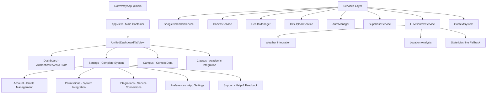

# iOS Mobile Documentation

## Overview

DormWay's iOS application is built with modern SwiftUI architecture featuring LLM-powered context intelligence, comprehensive settings management, and real-time data synchronization through a unified dashboard system.

## Current vs Target vs Legacy

- Current (DormWayFresh): Home, Schedule, Tasks, Term, Me.
- Legacy naming in docs/widgets: home, campus, me.
- Target Student OS naming: Home, Schedule, Tasks, Term/Courses, Profile.

## Quick Links

- **[DormWayFresh Implementation](/docs/engineering/architecture/dormwayfresh-ios-architecture)** - Next-gen iOS architecture with dependency injection
- **[iOS Widget Integration Guide](/docs/engineering/technical/ios/ios-widget-integration-guide)** - AI-powered widget implementation guide
- **Real-time Signal Flows** - Visual telemetry and dashboard update flows
- **Context System Updates** - LLM Context Intelligence implementation
- **[Temporal Signals Catalog](/docs/engineering/technical/engine/ios-to-temporal-signals-catalog)** - Complete iOS to Temporal signal reference

## Section Contents

### Architecture & Implementation
Core iOS architecture patterns and implementation guides

- **iOS Architecture Overview** - High-level architecture patterns and app structure
- **[DormWayFresh Implementation](/docs/engineering/architecture/dormwayfresh-ios-architecture)** - Next-generation iOS with dependency injection
- **Real-time Signal Flows** - Comprehensive visual guide to telemetry signals

### Core Features
Essential app functionality and user flows

#### Authentication
- **Authentication System** - Login flows, signup, and social authentication
- **Login Flow Updates** - Recent authentication flow improvements
- **[Google Calendar Auth](/docs/engineering/technical/ios/ios-calendar-sync-system)** - Google Calendar service integration

#### Onboarding & Setup
- **Onboarding Flow** - School selection and value proposition
- **Permissions Screen** - All 5 permission types with system integration
- **ICS Uploader** - ICS file upload and calendar integration
- **Calendar Selection** - User-controlled calendar synchronization

#### UI & Dashboard
- **Dashboard UI Integration** - Dashboard components and BFF integration
- **Dashboard BFF Integration** - Backend-for-Frontend data integration
- **Settings & Profile UI** - Complete Settings system with real services
- **Context Cards UI Design** - Visual design for context-sensitive cards

### Widgets
AI-powered widget system and integration

- **[iOS Widget Integration Guide](/docs/engineering/technical/ios/ios-widget-integration-guide)** - Complete guide to AI-powered widgets
- **Widget System Architecture** - Comprehensive widget system documentation
- **iOS Widget Data Format** - Widget data specifications and formats

### System Integration
Platform features and service integrations

- **Push Notifications** - Push notification implementation
- **Context System Updates** - LLM Context Intelligence implementation
- **Screen Time Upload** - Screen Time data collection and upload

### Data & Telemetry
Data flow and telemetry architecture

- **[Temporal Signals Catalog](/docs/engineering/technical/engine/ios-to-temporal-signals-catalog)** - Comprehensive catalog of iOS to Temporal signals
- **Telemetry and Data Flow** - Complete telemetry architecture
- **Database Writes Inventory** - Inventory of all database operations
- **Mock Data Inventory** - Critical inventory of mock data to replace before launch

### Development
Build guides and development tools

- **iOS Build Guide** - Build instructions and environment setup

## Architecture Overview



## Recent Major Achievements

### LLM Context Intelligence (June 19, 2025)
Revolutionary context detection system enhancing the existing state machine with ML predictions:
- **LLMContextService**: Orchestrates predictions with automatic state machine fallback
- **Weather Integration**: 12+ weather fields for context-aware predictions
- **Enhanced Responses**: Location analysis, temporal insights, environmental factors
- **100% Reliability**: Comprehensive fallback ensures context always available
- **Performance**: 5-minute cache, ~2s predictions, 80% cache hit rate

### Settings System Transformation (May 26, 2025)
Complete overhaul of the iOS Settings system to production-ready functionality:
- **Account Management**: Tap-to-edit profile with database persistence
- **Permissions Management**: All 5 permission types with real system integration  
- **Integration Services**: Real service implementations replacing placeholders
- **Professional UI**: Consistent status capsules and design system integration

### Widget System Implementation (July 2025)
AI-powered widget framework for dynamic dashboard content:
- **Widget Integration**: Complete iOS implementation guide
- **AI Selection**: Smart widget prioritization based on context
- **Extensible Architecture**: Plugin-based widget registry

## Technical Highlights

### LLM Context Intelligence Architecture
Advanced ML-powered context detection with guaranteed reliability:
```swift
// LLM Service with Automatic Fallback
LLMContextService.predictContext() → API Call → PortKey → Amazon Nova Lite
                                  ↓ (on failure)
                        State Machine Fallback → Time-based Rules
                                  ↓
                        ContextType (100% guaranteed)
```

### Settings Store Architecture
Modern store-based pattern with comprehensive functionality:
```swift
// Settings Store Pattern
SettingsStore → SettingsReducer → SettingsEffects → Real Services
    ↓
AccountState, PermissionsState, IntegrationsState, PreferencesState
    ↓
SwiftUI Views with proper state binding and effects
```

### Widget Integration Pattern
```swift
// Widget rendering pipeline
WidgetData → WidgetRegistry → WidgetView → SwiftUI Rendering
    ↓
AI Selection → Priority Sorting → Context Filtering
    ↓
Dynamic Dashboard Content
```

## Getting Started

For new developers, start with the iOS Architecture Overview to understand the app structure, then review [DormWayFresh Implementation](/docs/engineering/architecture/dormwayfresh-ios-architecture) for the modern architecture patterns. The [iOS Widget Integration Guide](/docs/engineering/technical/ios/ios-widget-integration-guide) guide covers the latest AI-powered features.

## Related Sections

- |Backend Services - API integration and service documentation
- |AI & Intelligence - Widget AI and context intelligence systems
- |Architecture - Platform-wide architecture patterns
