# iOS Onboarding Flow

This document describes the complete onboarding flow in the DormWay iOS app, including **Zero State Dashboard**, PLG-driven school selection, value proposition carousel, and enhanced backend integration.

**Latest Update (May 25-26, 2025)**: Complete transformation to PLG-first onboarding with Zero State Dashboard delivering immediate value before authentication, compelling user experiences, and enhanced backend workflows.

## Overview

The DormWay onboarding flow now implements **Product-Led Growth (PLG)** principles with immediate value delivery:

### **PLG Onboarding Journey**
1. **Zero State Dashboard** - Immediate campus intelligence without authentication
2. **Compelling PLG Experience** - "Holy Shit!" moments drive authentication desire
3. **School Selection** - Enhanced campus-aware selection process
4. **Value Proposition Carousel** - Personalized feature showcase
5. **Streamlined Authentication** - Reduced friction with social sign-in
6. **Enhanced Context Creation** - Comprehensive backend integration with BFF


## PLG Zero State Experience (May 2025)

### **Immediate Value Delivery**

The app now delivers compelling experiences before authentication:

```mermaid
sequenceDiagram
    autonumber
    participant User
    participant App as iOS App
    participant Geo as IP Geolocation
    participant BFF as Dashboard BFF
    participant Engine as Temporal Engine
    
    User->>App: Launch app
    App->>Geo: Get IP-based location
    Geo-->>App: Campus detection (e.g., University of Michigan)
    App->>BFF: Fetch zero-state dashboard
    BFF->>Engine: Get campus intelligence
    Engine-->>BFF: Weather + activity data
    BFF-->>App: PLG dashboard response
    App-->>User: "🌤️ Perfect Campus Weather!" + intelligence
    User->>App: Impressed → wants to authenticate
```



### **Zero State Dashboard Features**

#### **🎯 Dramatic PLG Headlines**
```swift
// Zero State PLG Headline Generation
private func generateZeroStateHeadline(campus: Campus, weather: WeatherData) -> String {
    // Perfect weather conditions
    if weather.isPerfectWeather() {
        return "🌤️ Perfect Weather at \(campus.name)!"
    }
    
    // High activity periods
    if campus.isHighActivityPeriod() {
        return "🔥 \(campus.name) is Buzzing!"
    }
    
    // Weather alerts
    if weather.hasAlert() {
        return "⚠️ Campus Weather Alert"
    }
    
    return "🎓 Smart Campus Intelligence"
}
```

#### **🌤️ Campus Weather Intelligence**
- **IP-based campus detection** with automatic location intelligence
- **Compelling weather displays** with temperature, conditions, and outfit recommendations
- **Activity accessibility** showing walking, biking, driving conditions
- **Real-time campus insights** creating immediate "Holy Shit!" moments

#### **📊 Live Campus Metrics**
- **Activity count displays** showing current campus engagement
- **Parking intelligence** with urgency-coded availability
- **Smart recommendations** based on current conditions
- **Visual metrics grid** with professional styling

## Enhanced Onboarding Components (May 2025)

### Zero State Dashboard Component

**Primary PLG entry point** delivering immediate value:

```swift
struct ZeroStateDashboardView: View {
    @StateObject private var viewModel = ZeroStateDashboardViewModel()
    
    var body: some View {
        DashboardView(
            provider: ZeroStateDashboardProvider(context: viewModel.context),
            context: viewModel.context
        ) { item in
            // Handle zero-state interactions
            viewModel.handleZeroStateInteraction(item)
        }
        .onAppear {
            Task {
                await viewModel.loadZeroStateData()
            }
        }
    }
}
```

Key features:
- **IP-based campus detection** with automatic geolocation
- **Compelling PLG dashboard** with dramatic headlines and weather intelligence
- **Smart authentication CTAs** that appear after user engagement
- **Seamless transition** to full onboarding when user is ready

### Enhanced SchoolSelectionView

**Campus-aware school selection** with PLG enhancement:

- **Pre-populated with detected campus** from zero state experience
- **Enhanced visual design** with campus-specific imagery and branding
- **Contextual messaging** based on zero state engagement
- **Improved school search** and selection interface
- **Campus-specific value propositions** integrated into selection

Key implementation updates:
```swift
// Enhanced school selection with PLG context
struct SchoolSelectionView: View {
    @State private var detectedCampus: Campus?
    @State private var zeroStateEngagement: Bool = false
    
    var body: some View {
        VStack {
            if let campus = detectedCampus {
                // Pre-populate with detected campus
                CampusConfirmationCard(campus: campus)
            } else {
                // Traditional school selection
                SchoolSelectionGrid()
            }
        }
        .onAppear {
            loadDetectedCampus()
        }
    }
}
```

Enhanced features:
- **Campus detection integration** from zero state
- **Contextual confirmation** for detected campuses
- **Improved visual design** with material effects and animations
- **Enhanced persistence** with UserDefaults and campus context

### Enhanced ValuePropositionCarouselView

**Contextual feature showcase** personalized from PLG experience:

#### **PLG-Enhanced Value Propositions**
- **"Your AI Campus Companion"** - Now shows real campus intelligence examples
- **"Smart Weather & Activity Intelligence"** - Features actual weather data and recommendations
- **"Campus Connections & Intelligence"** - Displays real parking and activity insights
- **"Personalized Study Tools"** - Enhanced with Canvas LMS and calendar integration demos
- **"Everything You Need"** - Comprehensive dashboard preview with BFF integration

#### **Contextual Personalization**
```swift
struct ContextualValuePropositionSlide: View {
    let campus: Campus
    let weatherData: WeatherData?
    let proposition: ValueProposition
    
    var body: some View {
        VStack {
            // Show real data examples from PLG experience
            if proposition == .campusIntelligence, let weather = weatherData {
                LiveWeatherExample(weather: weather, campus: campus)
            } else {
                StandardPropositionContent(proposition: proposition)
            }
        }
    }
}
```

Enhanced implementation features:
- **Real data integration** from zero state PLG experience
- **Campus-specific examples** showing actual intelligence and recommendations
- **Dynamic content** based on current weather and campus conditions
- **Improved visual design** with material effects and professional styling
- **Enhanced CTAs** with contextual authentication prompts

### Enhanced Authentication Integration

**Streamlined authentication** with PLG context and reduced friction:

#### **PLG-Driven Authentication**
- **Context-aware CTAs** appearing after compelling zero state engagement
- **Pre-populated campus selection** from IP detection and PLG experience
- **Reduced friction signup** with enhanced social sign-in integration
- **Contextual messaging** referencing specific PLG moments that impressed the user

#### **Enhanced Social Sign-In**
```swift
// Enhanced authentication with PLG context
struct PLGAuthenticationView: View {
    let plgContext: PLGEngagementContext
    let campus: Campus
    
    var body: some View {
        VStack {
            // Reference specific PLG engagement
            PLGCallbackMessage(context: plgContext)
            
            // Enhanced social sign-in with campus context
            SocialSignInSection(campus: campus)
            
            // Traditional email signup
            EmailSignUpSection(prefilledCampus: campus)
        }
    }
}
```

Authentication enhancements:
- **Google Sign-In optimization** with production-ready configuration
- **Apple Sign-In integration** with enhanced user experience
- **Campus context preservation** throughout authentication flow
- **PLG engagement tracking** for conversion optimization

## Enhanced Backend Integration (May 2025)

### PLG-Enhanced Temporal Workflows

**Comprehensive backend integration** with PLG context and BFF optimization:


### Enhanced onboardStudent Workflow (May 2025)

**Comprehensive PLG-enhanced onboarding** with BFF integration and enhanced context processing:

#### **PLG-Enhanced Workflow Parameters**
```swift
struct EnhancedOnboardingRequest {
    let userId: String
    let schoolId: String
    let firstName: String
    let lastName: String
    let provider: String                    // "email", "apple", "google"
    let plgEngagementData: PLGEngagement    // Zero state interaction data
    let campusDetection: CampusInfo         // IP-based campus intelligence
    let deviceContext: DeviceInfo           // Enhanced device and platform data
    let onboardingSource: OnboardingSource  // Zero state, direct, referral
}
```

#### **Enhanced Onboarding Process**
1. **PLG Context Integration** - Stores zero state engagement data for personalization
2. **Enhanced User Metadata** - Creates comprehensive user profile with PLG insights
3. **BFF Dashboard Setup** - Configures optimized mobile dashboard integration
4. **Context Engine Initialization** - Sets up enhanced context processing with campus intelligence
5. **Student Watcher Enhancement** - Starts enhanced monitoring with PLG optimization signals
6. **Personalized Welcome** - Sends campus-specific welcome notification with PLG context

#### **BFF Integration Setup**
```swift
// Enhanced BFF setup during onboarding
struct BFFOnboardingSetup {
    let userId: String
    let campusId: String
    let preferredDashboardConfig: DashboardConfig
    let plgOptimizationSignals: [PLGSignal]
    
    func configureBFFIntegration() async {
        // Setup optimized mobile-first data pipeline
        // Configure PLG dashboard preferences
        // Initialize campus-specific intelligence
        // Setup personalized content delivery
    }
}
```

### Enhanced studentWatcher Workflow (May 2025)

**PLG-optimized long-running workflow** with enhanced intelligence and BFF integration:

#### **Enhanced Monitoring Capabilities**
- **PLG-optimized context processing** with personalized dashboard intelligence
- **BFF-integrated data pipeline** for mobile-first content delivery
- **Enhanced campus intelligence** with real-time activity and weather processing
- **Smart notification delivery** with PLG engagement optimization
- **Advanced signal handling** for Settings integrations (Canvas LMS, Google Calendar, Health)

#### **PLG Intelligence Integration**
```swift
// Enhanced student watcher with PLG optimization
struct PLGStudentWatcher {
    let userId: String
    let plgProfile: PLGEngagementProfile
    let campusContext: CampusIntelligence
    
    func processEnhancedContext() async {
        // PLG-optimized context processing
        // Enhanced campus intelligence generation
        // BFF-optimized mobile content preparation
        // Smart engagement signal processing
    }
}
```

## Enhanced Implementation Details (May 2025)

### PLG Context Storage and Management

**Comprehensive PLG engagement tracking** with enhanced persistence:

```swift
// Enhanced PLG context storage
struct PLGEngagementTracker {
    @AppStorage("plgEngagementData") private var engagementData: Data?
    @AppStorage("detectedCampusId") private var detectedCampusId: String = ""
    @AppStorage("zeroStateInteractions") private var interactionCount: Int = 0
    
    func storePLGEngagement(_ engagement: PLGEngagement) {
        // Store comprehensive PLG engagement data
        // Track zero state interactions and "Holy Shit!" moments
        // Preserve campus detection and intelligence context
    }
}
```

### Enhanced User Context Creation

**BFF-integrated context creation** with comprehensive PLG data:

```swift
// Enhanced user context service with PLG integration
struct EnhancedUserContextService {
    static let shared = EnhancedUserContextService()
    
    func createEnhancedUserContext(
        userId: String,
        firstName: String,
        lastName: String,
        schoolId: String,
        provider: String,
        plgEngagement: PLGEngagement,
        campusDetection: CampusInfo
    ) async throws {
        // Create comprehensive user context with PLG data
        // Setup BFF integration for optimized mobile experience
        // Initialize enhanced campus intelligence processing
        // Configure personalized dashboard preferences
        
        let request = EnhancedOnboardingRequest(
            userId: userId,
            schoolId: schoolId,
            firstName: firstName,
            lastName: lastName,
            provider: provider,
            plgEngagementData: plgEngagement,
            campusDetection: campusDetection,
            deviceContext: DeviceInfo.current,
            onboardingSource: .zeroState
        )
        
        try await TemporalClient.shared.startOnboardingWorkflow(request)
    }
}
```

### BFF Dashboard Integration

**Mobile-optimized dashboard setup** during onboarding:

```swift
// BFF dashboard configuration during onboarding
struct BFFDashboardIntegration {
    func setupPostOnboarding(userId: String, plgContext: PLGEngagement) async {
        // Configure personalized dashboard based on PLG engagement
        // Setup mobile-optimized data pipeline
        // Initialize campus-specific intelligence
        // Configure push notification preferences
        
        let config = DashboardConfig(
            userId: userId,
            campusId: plgContext.detectedCampus.id,
            plgOptimizations: plgContext.optimizationSignals,
            mobileOptimized: true
        )
        
        await BFFService.shared.configureDashboard(config)
    }
}
```

## Testing the Enhanced PLG Onboarding Flow (May 2025)

### **Complete PLG Flow Testing**

To test the enhanced PLG-first onboarding experience:

#### **1. Zero State Testing**
1. **Fresh install** - Clear app data/reinstall the app
2. **Launch app** - Verify Zero State Dashboard appears immediately
3. **PLG engagement** - Interact with compelling weather and campus intelligence
4. **"Holy Shit!" moments** - Verify dramatic headlines and smart insights appear
5. **Authentication desire** - Confirm PLG experience drives desire to authenticate

#### **2. Enhanced Onboarding Testing**
6. **Campus pre-population** - Verify detected campus appears in school selection
7. **Contextual value props** - Confirm carousel shows real campus data examples
8. **Streamlined auth** - Test enhanced social sign-in with campus context
9. **BFF integration** - Verify dashboard transitions to personalized, authenticated view
10. **Welcome notification** - Confirm campus-specific welcome notification delivery

#### **3. Backend Integration Testing**
11. **PLG data storage** - Verify engagement data persists in backend
12. **Enhanced context** - Confirm comprehensive user context creation
13. **Student watcher** - Verify enhanced monitoring workflow starts
14. **BFF dashboard** - Confirm optimized mobile dashboard configuration

### **PLG Conversion Metrics**

Track these key PLG onboarding metrics:
- **Zero State Engagement Time** - How long users interact before authentication
- **PLG Moment Effectiveness** - Which "Holy Shit!" moments drive conversion
- **Campus Detection Accuracy** - IP geolocation success rate
- **Authentication Conversion** - Zero state → authenticated user rate
- **Onboarding Completion** - End-to-end success metrics

## Future PLG Enhancements

### **Enhanced Zero State Features**
- **Multiple campus support** with intelligent detection and selection
- **Real-time campus events** integration for immediate engagement
- **Weather-based PLG optimization** with seasonal and condition-specific content
- **Social proof integration** showing campus activity and user engagement

### **Advanced PLG Intelligence**
- **ML-powered headline generation** based on campus conditions and user context
- **Personalized PLG optimization** using engagement pattern analysis
- **A/B testing framework** for PLG moment optimization
- **Enhanced campus intelligence** with dining, library, and facility real-time data

### **Conversion Optimization**
- **Smart authentication timing** based on PLG engagement depth
- **Contextual signup incentives** using campus-specific value propositions
- **Frictionless onboarding** with enhanced social sign-in and campus pre-population
- **Post-authentication PLG continuity** maintaining zero state engagement context

## Related Documentation

For detailed PLG implementation information, see:

- iOS Dashboard UI Integration - Complete PLG dashboard implementation
- [iOS Architecture](/docs/engineering/technical/ios/dormway-ios-app-architecture) - PLG-first architectural overview
- iOS Dashboard BFF Integration - BFF data pipeline details
- iOS Authentication System - Enhanced authentication with PLG context
