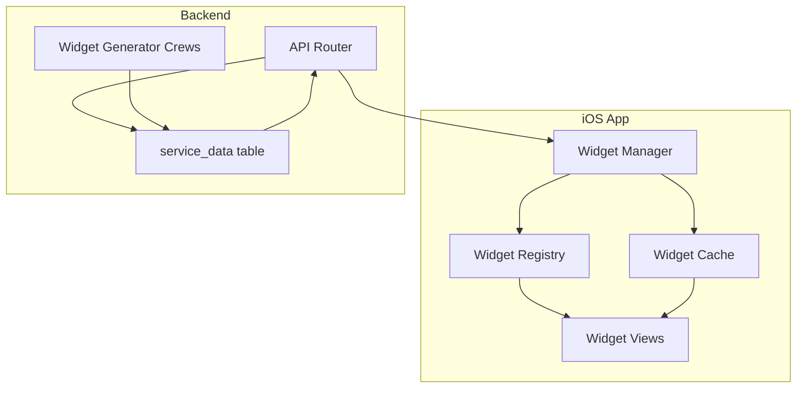

# iOS Widget Integration Guide

## Overview

This guide covers the complete integration of the DormWay widget system in the iOS app, from fetching widget data from the backend to rendering dynamic UI components in SwiftUI.

## Architecture Overview



## Data Flow

### 1. Fetching Widget Data

Widgets are stored in the `service_data` table with `method = 'processed_widget_data'`:

```swift
struct WidgetDataService {
    func fetchWidgets(for page: PageType) async throws -> WidgetResponse {
        let response = try await apiClient.request(
            .get,
            endpoint: "/v1/mobile/widgets",
            queryParams: ["page": page.rawValue],
            authType: .jwt
        )
        
        return try JSONDecoder().decode(WidgetResponse.self, from: response)
    }
}
```

### 2. Widget Data Models

```swift
// Widget response from API
struct WidgetResponse: Codable {
    let widgets: [Widget]
    let widgetSets: [String: [String]]
    let configuration: WidgetConfiguration
}

// Individual widget data
struct Widget: Codable, Identifiable {
    let widgetId: String
    let widgetType: WidgetType
    let variation: String
    let priorityScore: Int
    let timeRelevance: TimeRelevance?
    let content: WidgetContent
    let metadata: WidgetMetadata
    
    var id: String { widgetId }
}

// Widget content is dynamic based on type
struct WidgetContent: Codable {
    // Use a dictionary for flexible content
    private let data: [String: AnyCodable]
    
    // Type-safe accessors
    func getString(_ key: String) -> String? {
        data[key]?.value as? String
    }
    
    func getInt(_ key: String) -> Int? {
        data[key]?.value as? Int
    }
    
    func getArray<T>(_ key: String, type: T.Type) -> [T]? {
        data[key]?.value as? [T]
    }
}
```

### 3. Widget Type Registry

```swift
enum WidgetType: String, Codable, CaseIterable {
    // Home Page Widgets
    case header = "header"
    case priority = "priority"
    case timeline = "timeline"
    case context = "context"
    case guidance = "guidance"
    case weekly = "weekly"
    
    // Me Page Widgets
    case statsOverview = "stats_overview"
    case goalsTracker = "goals_tracker"
    case wellnessInsights = "wellness_insights"
    case academicProgress = "academic_progress"
    case achievements = "achievements"
    case moodTracker = "mood_tracker"
    case productivityPulse = "productivity_pulse"
    case socialConnections = "social_connections"
    case habitTracker = "habit_tracker"
    
    // Campus Page Widgets
    case featuredEvents = "featured_events"
    case announcements = "announcements"
    case diningStatus = "dining_status"
    case transportation = "transportation"
    case communityPulse = "community_pulse"
    case resources = "resources"
    case weatherExtended = "weather_extended"
}
```

## Widget Rendering

### 1. Widget View Factory

```swift
struct WidgetViewFactory {
    @ViewBuilder
    static func createView(for widget: Widget) -> some View {
        switch widget.widgetType {
        case .header:
            HeaderWidgetView(widget: widget)
        case .priority:
            PriorityWidgetView(widget: widget)
        case .timeline:
            TimelineWidgetView(widget: widget)
        case .context:
            ContextWidgetView(widget: widget)
        case .guidance:
            GuidanceWidgetView(widget: widget)
        // ... other widget types
        default:
            UnsupportedWidgetView(widget: widget)
        }
    }
}
```

### 2. Example Widget Implementation

```swift
struct HeaderWidgetView: View {
    let widget: Widget
    
    private var greeting: String {
        widget.content.getString("greeting") ?? "Hello!"
    }
    
    private var message: String {
        widget.content.getString("message") ?? ""
    }
    
    private var location: String? {
        widget.content.getString("location")
    }
    
    private var weatherNote: String? {
        widget.content.getString("weather_note")
    }
    
    var body: some View {
        VStack(alignment: .leading, spacing: 12) {
            Text(greeting)
                .font(.largeTitle)
                .fontWeight(.bold)
            
            Text(message)
                .font(.headline)
                .foregroundColor(.secondary)
            
            HStack(spacing: 16) {
                if let location = location {
                    Label(location, systemImage: "location.fill")
                        .font(.caption)
                }
                
                if let weather = weatherNote {
                    Label(weather, systemImage: "cloud.sun.fill")
                        .font(.caption)
                }
            }
            .foregroundColor(.secondary)
        }
        .padding()
        .frame(maxWidth: .infinity, alignment: .leading)
        .widgetBackground(color: .blue)
    }
}
```

### 3. Widget Container View

```swift
struct WidgetContainerView: View {
    let widgets: [Widget]
    let page: PageType
    
    @State private var visibleWidgets: [Widget] = []
    @AppStorage("hiddenWidgets") private var hiddenWidgetIds: Set<String> = []
    
    var body: some View {
        LazyVStack(spacing: 16) {
            ForEach(visibleWidgets) { widget in
                WidgetViewFactory.createView(for: widget)
                    .transition(.asymmetric(
                        insertion: .scale.combined(with: .opacity),
                        removal: .scale.combined(with: .opacity)
                    ))
            }
        }
        .onAppear {
            updateVisibleWidgets()
        }
        .onChange(of: widgets) { _ in
            updateVisibleWidgets()
        }
    }
    
    private func updateVisibleWidgets() {
        let currentTime = Date()
        
        visibleWidgets = widgets
            .filter { widget in
                // Check if widget is hidden by user
                !hiddenWidgetIds.contains(widget.widgetId)
            }
            .filter { widget in
                // Check time relevance
                guard let timeRelevance = widget.timeRelevance else { return true }
                return isTimeRelevant(timeRelevance, at: currentTime)
            }
            .sorted { $0.priorityScore > $1.priorityScore }
            .prefix(maxWidgetsForPage())
            .map { $0 }
    }
    
    private func isTimeRelevant(_ relevance: TimeRelevance, at time: Date) -> Bool {
        let formatter = DateFormatter()
        formatter.dateFormat = "HH:mm"
        
        guard let start = formatter.date(from: relevance.validStart),
              let end = formatter.date(from: relevance.validEnd) else {
            return true
        }
        
        let calendar = Calendar.current
        let components = calendar.dateComponents([.hour, .minute], from: time)
        guard let currentTime = calendar.date(from: components) else { return true }
        
        if start <= end {
            return currentTime >= start && currentTime <= end
        } else {
            // Handle overnight ranges (e.g., 22:00 - 06:00)
            return currentTime >= start || currentTime <= end
        }
    }
    
    private func maxWidgetsForPage() -> Int {
        switch page {
        case .home: return 6
        case .me: return 8
        case .campus: return 10
        }
    }
}
```

## Widget State Management

### 1. Widget Manager

```swift
@Observable
class WidgetManager {
    private let dataService = WidgetDataService()
    private let cacheManager = WidgetCacheManager()
    
    private(set) var homeWidgets: [Widget] = []
    private(set) var meWidgets: [Widget] = []
    private(set) var campusWidgets: [Widget] = []
    
    private(set) var isLoading = false
    private(set) var error: Error?
    
    func loadWidgets(for page: PageType, forceRefresh: Bool = false) async {
        isLoading = true
        error = nil
        
        do {
            // Check cache first
            if !forceRefresh, let cached = await cacheManager.getCachedWidgets(for: page) {
                updateWidgets(cached, for: page)
                isLoading = false
                return
            }
            
            // Fetch from API
            let response = try await dataService.fetchWidgets(for: page)
            
            // Update cache
            await cacheManager.cacheWidgets(response.widgets, for: page)
            
            // Update state
            updateWidgets(response.widgets, for: page)
        } catch {
            self.error = error
        }
        
        isLoading = false
    }
    
    private func updateWidgets(_ widgets: [Widget], for page: PageType) {
        switch page {
        case .home:
            homeWidgets = widgets
        case .me:
            meWidgets = widgets
        case .campus:
            campusWidgets = widgets
        }
    }
}
```

### 2. Widget Cache Manager

```swift
actor WidgetCacheManager {
    private let cacheExpiration: TimeInterval = 300 // 5 minutes
    private var cache: [PageType: CachedWidgets] = [:]
    
    struct CachedWidgets {
        let widgets: [Widget]
        let timestamp: Date
        
        var isExpired: Bool {
            Date().timeIntervalSince(timestamp) > 300
        }
    }
    
    func getCachedWidgets(for page: PageType) -> [Widget]? {
        guard let cached = cache[page],
              !cached.isExpired else {
            return nil
        }
        return cached.widgets
    }
    
    func cacheWidgets(_ widgets: [Widget], for page: PageType) {
        cache[page] = CachedWidgets(widgets: widgets, timestamp: Date())
    }
    
    func clearCache() {
        cache.removeAll()
    }
}
```

## Widget Updates

### 1. Real-Time Updates via Ably

```swift
extension WidgetManager {
    func subscribeToWidgetUpdates() {
        // Subscribe to widget update channel
        ablyService.subscribe(to: "user:\(userId):widgets") { message in
            guard let data = message.data as? [String: Any],
                  let pageRaw = data["page"] as? String,
                  let page = PageType(rawValue: pageRaw) else {
                return
            }
            
            // Trigger refresh for the specific page
            Task {
                await self.loadWidgets(for: page, forceRefresh: true)
            }
        }
    }
}
```

### 2. Background Refresh

```swift
class WidgetBackgroundRefreshTask {
    static func scheduleRefresh() {
        BGTaskScheduler.shared.register(
            forTaskWithIdentifier: "com.dormway.widget.refresh",
            using: nil
        ) { task in
            handleWidgetRefresh(task: task as! BGAppRefreshTask)
        }
        
        scheduleNextRefresh()
    }
    
    private static func scheduleNextRefresh() {
        let request = BGAppRefreshTaskRequest(identifier: "com.dormway.widget.refresh")
        request.earliestBeginDate = Date(timeIntervalSinceNow: 900) // 15 minutes
        
        try? BGTaskScheduler.shared.submit(request)
    }
    
    private static func handleWidgetRefresh(task: BGAppRefreshTask) {
        let widgetManager = WidgetManager()
        
        Task {
            // Refresh all pages
            await widgetManager.loadWidgets(for: .home, forceRefresh: true)
            await widgetManager.loadWidgets(for: .me, forceRefresh: true)
            await widgetManager.loadWidgets(for: .campus, forceRefresh: true)
            
            task.setTaskCompleted(success: true)
            scheduleNextRefresh()
        }
    }
}
```

## Widget Customization

### 1. User Preferences

```swift
struct WidgetPreferences {
    @AppStorage("preferredWidgetOrder") var preferredOrder: [String] = []
    @AppStorage("hiddenWidgets") var hiddenWidgets: Set<String> = []
    @AppStorage("widgetDensity") var density: WidgetDensity = .normal
    
    enum WidgetDensity: String, CaseIterable {
        case compact = "compact"
        case normal = "normal"
        case comfortable = "comfortable"
    }
    
    func hideWidget(_ widgetId: String) {
        hiddenWidgets.insert(widgetId)
    }
    
    func showWidget(_ widgetId: String) {
        hiddenWidgets.remove(widgetId)
    }
    
    func reorderWidgets(_ widgetIds: [String]) {
        preferredOrder = widgetIds
    }
}
```

### 2. Widget Settings View

```swift
struct WidgetSettingsView: View {
    @State private var preferences = WidgetPreferences()
    @State private var availableWidgets: [WidgetType] = WidgetType.allCases
    
    var body: some View {
        List {
            Section("Widget Visibility") {
                ForEach(availableWidgets, id: \.self) { widgetType in
                    Toggle(widgetType.displayName, isOn: Binding(
                        get: { !preferences.hiddenWidgets.contains(widgetType.rawValue) },
                        set: { isVisible in
                            if isVisible {
                                preferences.showWidget(widgetType.rawValue)
                            } else {
                                preferences.hideWidget(widgetType.rawValue)
                            }
                        }
                    ))
                }
            }
            
            Section("Display Options") {
                Picker("Widget Density", selection: $preferences.density) {
                    ForEach(WidgetPreferences.WidgetDensity.allCases, id: \.self) { density in
                        Text(density.displayName).tag(density)
                    }
                }
            }
        }
        .navigationTitle("Widget Settings")
    }
}
```

## Performance Optimization

### 1. Lazy Loading

```swift
struct LazyWidgetView: View {
    let widget: Widget
    @State private var isLoaded = false
    
    var body: some View {
        Group {
            if isLoaded {
                WidgetViewFactory.createView(for: widget)
            } else {
                WidgetPlaceholderView()
                    .onAppear {
                        withAnimation {
                            isLoaded = true
                        }
                    }
            }
        }
    }
}
```

### 2. Widget Recycling

```swift
class WidgetViewPool {
    private var pool: [WidgetType: [AnyView]] = [:]
    
    func dequeueView(for type: WidgetType) -> AnyView? {
        return pool[type]?.popLast()
    }
    
    func enqueue(_ view: AnyView, for type: WidgetType) {
        if pool[type] == nil {
            pool[type] = []
        }
        pool[type]?.append(view)
    }
}
```

## Error Handling

### 1. Widget Error States

```swift
struct WidgetErrorView: View {
    let widget: Widget
    let error: Error
    let retry: () -> Void
    
    var body: some View {
        VStack(spacing: 16) {
            Image(systemName: "exclamationmark.triangle")
                .font(.largeTitle)
                .foregroundColor(.orange)
            
            Text("Unable to load \(widget.widgetType.displayName)")
                .font(.headline)
            
            Text(error.localizedDescription)
                .font(.caption)
                .foregroundColor(.secondary)
            
            Button("Retry") {
                retry()
            }
            .buttonStyle(.bordered)
        }
        .padding()
        .frame(maxWidth: .infinity)
        .widgetBackground(color: .gray)
    }
}
```

### 2. Fallback Content

```swift
extension Widget {
    static func fallback(for type: WidgetType) -> Widget {
        Widget(
            widgetId: "\(type.rawValue)_fallback",
            widgetType: type,
            variation: "fallback",
            priorityScore: 0,
            timeRelevance: nil,
            content: WidgetContent(data: [
                "title": "Unable to load content",
                "message": "Please check your connection and try again"
            ]),
            metadata: WidgetMetadata(
                cacheTTL: 0,
                requiresAuth: false
            )
        )
    }
}
```

## Testing

### 1. Widget Preview Data

```swift
#if DEBUG
extension Widget {
    static let previewHeader = Widget(
        widgetId: "header_preview",
        widgetType: .header,
        variation: "morning",
        priorityScore: 100,
        timeRelevance: TimeRelevance(
            validStart: "05:00",
            validEnd: "12:00"
        ),
        content: WidgetContent(data: [
            "greeting": "Good morning, Jamie!",
            "message": "Ready for your CS lecture?",
            "location": "North Quad",
            "weather_note": "Sunny, 72°F"
        ]),
        metadata: WidgetMetadata(
            cacheTTL: 300,
            requiresAuth: true
        )
    )
}
#endif
```

### 2. Widget Testing Utilities

```swift
class WidgetTestHelper {
    static func mockWidgetResponse(for page: PageType) -> WidgetResponse {
        // Return mock widget data for testing
    }
    
    static func validateWidgetContent(_ widget: Widget) -> Bool {
        // Validate widget has required fields for its type
    }
}
```

## Best Practices

1. **Always use JWT authentication** for widget requests
2. **Respect cache TTLs** to minimize server load
3. **Handle time zones properly** for time-relevant widgets
4. **Provide meaningful fallbacks** for all widget types
5. **Test with various widget configurations** and edge cases
6. **Monitor widget performance** and user engagement
7. **Allow user customization** while maintaining good defaults

## Related Documentation

- Widget System Architecture
- Widget Conformance Agent
- [iOS Architecture](/docs/engineering/technical/ios/dormway-ios-app-architecture)
- Real-time Updates Strategy
