# iOS App State of Things

> Comprehensive documentation of how the DormWay iPad, iPhone, and Mac Catalyst apps work, including state machines, navigation flows, data pipelines, and architectural patterns.

---

## Executive Summary

- **Entry Point**: `DormWayApp.swift` - SwiftUI `@main` app with two-phase initialization
- **Platforms**: iPhone (TabView), iPad (NavigationSplitView), Mac Catalyst (iPad layout + Mac adaptations)
- **Adaptive Navigation**: iPhone uses TabView (5 tabs), iPad/Mac uses NavigationSplitView (sidebar + detail)
- **Auth Provider**: Clerk (NOT Supabase/Auth0) with multi-state authentication machine
- **State Management**: Observable pattern with DI container, DashboardStore as primary data store
- **Real-time**: Ably channels with HTTP fallback, delta updates for dashboard
- **Mac Catalyst**: Title bar hidden, drag-and-drop enabled, iOS-only features gracefully stubbed

---

## 1. App Lifecycle State Machine

The app goes through a well-defined state machine from cold launch to active use.

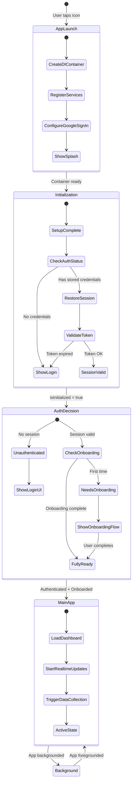
```mermaid
stateDiagram-v2
    [*] --> AppLaunch: User taps icon

    state AppLaunch {
        [*] --> CreateDIContainer
        CreateDIContainer --> RegisterServices
        RegisterServices --> ConfigureGoogleSignIn
        ConfigureGoogleSignIn --> ShowSplash
    }

    AppLaunch --> Initialization: Container ready

    state Initialization {
        [*] --> SetupComplete
        SetupComplete --> CheckAuthStatus
        CheckAuthStatus --> RestoreSession: Has stored credentials
        CheckAuthStatus --> ShowLogin: No credentials
        RestoreSession --> ValidateToken
        ValidateToken --> SessionValid: Token OK
        ValidateToken --> ShowLogin: Token expired
    }

    Initialization --> AuthDecision: isInitialized = true

    state AuthDecision {
        [*] --> Unauthenticated: No session
        [*] --> CheckOnboarding: Session valid
        Unauthenticated --> ShowLoginUI
        CheckOnboarding --> NeedsOnboarding: First time
        CheckOnboarding --> FullyReady: Onboarding complete
        NeedsOnboarding --> ShowOnboardingFlow
        ShowOnboardingFlow --> FullyReady: User completes
    }

    AuthDecision --> MainApp: Authenticated + Onboarded

    state MainApp {
        [*] --> LoadDashboard
        LoadDashboard --> StartRealtimeUpdates
        StartRealtimeUpdates --> TriggerDataCollection
        TriggerDataCollection --> ActiveState
    }

    MainApp --> Background: App backgrounded
    Background --> MainApp: App foregrounded
```

### Key Implementation Files

| Phase | File | Key Function |
|-------|------|--------------|
| Launch | `App/DormWayApp.swift:1-100` | `init()`, `body` |
| Init | `App/DormWayApp.swift:200-350` | `initializeApp()` |
| Auth Check | `Core/Services/AuthService.swift` | `restoreSession()` |
| Routing | `App/ContentView.swift:100-200` | `body` computed property |

---

## 2. Navigation Architecture

### iPhone vs iPad Detection

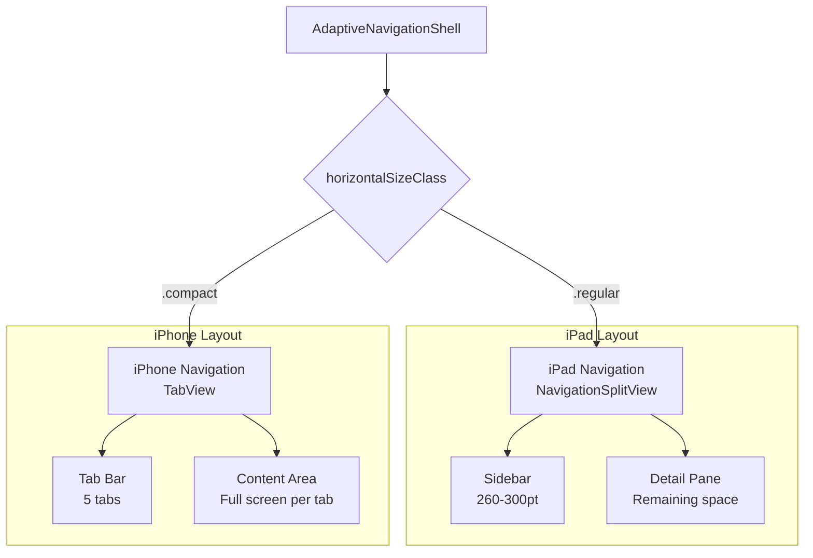
```mermaid
flowchart TD
    A[AdaptiveNavigationShell] --> B{horizontalSizeClass}
    B -->|.regular| C[iPad Navigation<br/>NavigationSplitView]
    B -->|.compact| D[iPhone Navigation<br/>TabView]

    subgraph iPad ["iPad Layout"]
        C --> E[Sidebar<br/>260-300pt]
        C --> F[Detail Pane<br/>Remaining space]
    end

    subgraph iPhone ["iPhone Layout"]
        D --> G[Tab Bar<br/>5 tabs]
        D --> H[Content Area<br/>Full screen per tab]
    end
```

### iPhone Tab Navigation

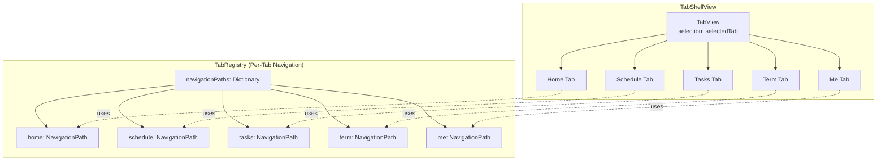
```mermaid
flowchart TB
    subgraph TabShellView
        direction TB
        T[TabView<br/>selection: selectedTab] --> T1[Home Tab]
        T --> T2[Schedule Tab]
        T --> T3[Tasks Tab]
        T --> T4[Term Tab]
        T --> T5[Me Tab]
    end

    subgraph TabRegistry ["TabRegistry (Per-Tab Navigation)"]
        R[navigationPaths: Dictionary]
        R --> P1["home: NavigationPath"]
        R --> P2["schedule: NavigationPath"]
        R --> P3["tasks: NavigationPath"]
        R --> P4["term: NavigationPath"]
        R --> P5["me: NavigationPath"]
    end

    T1 -.->|uses| P1
    T2 -.->|uses| P2
    T3 -.->|uses| P3
    T4 -.->|uses| P4
    T5 -.->|uses| P5
```

**iPhone Tab Structure:**

| Tab | View | Purpose |
|-----|------|---------|
| Home | `HomeTabRootView` | Contextual feed, showcase mode |
| Schedule | `ScheduleTabRootView` | Calendar, week/month views |
| Tasks | `TasksTabRootView` | To-do list, assignments |
| Term | `TermTabRootView` | Course list, term info |
| Me | `MeTabRootView` | Profile, settings |

### iPad Sidebar Navigation

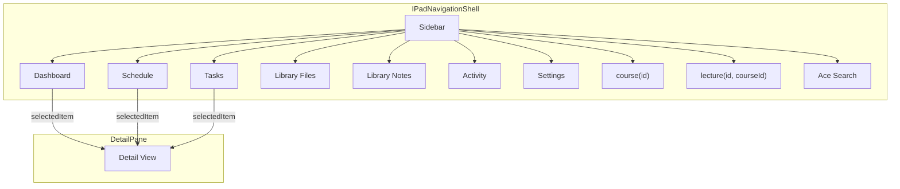
```mermaid
flowchart TB
    subgraph IPadNavigationShell
        S[Sidebar] --> SI1[Dashboard]
        S --> SI2[Schedule]
        S --> SI3[Tasks]
        S --> SI4[Library Files]
        S --> SI5[Library Notes]
        S --> SI6[Activity]
        S --> SI7[Settings]
        S --> SI8["course(id)"]
        S --> SI9["lecture(id, courseId)"]
        S --> SI10[Ace Search]
    end

    subgraph DetailPane
        D[Detail View]
    end

    SI1 -->|selectedItem| D
    SI2 -->|selectedItem| D
    SI3 -->|selectedItem| D
```

**iPad Navigation Items (Enum):**

```swift
enum IPadNavigationItem: Hashable {
    case dashboard
    case schedule
    case tasks
    case libraryFiles    // iPad-only
    case libraryNotes    // iPad-only
    case activity        // iPad-only
    case settings
    case course(String)  // courseId
    case lecture(String, String)  // lectureId, courseId
    case aceSearch       // iPad-only
}
```

---

## 3. Authentication State Machine

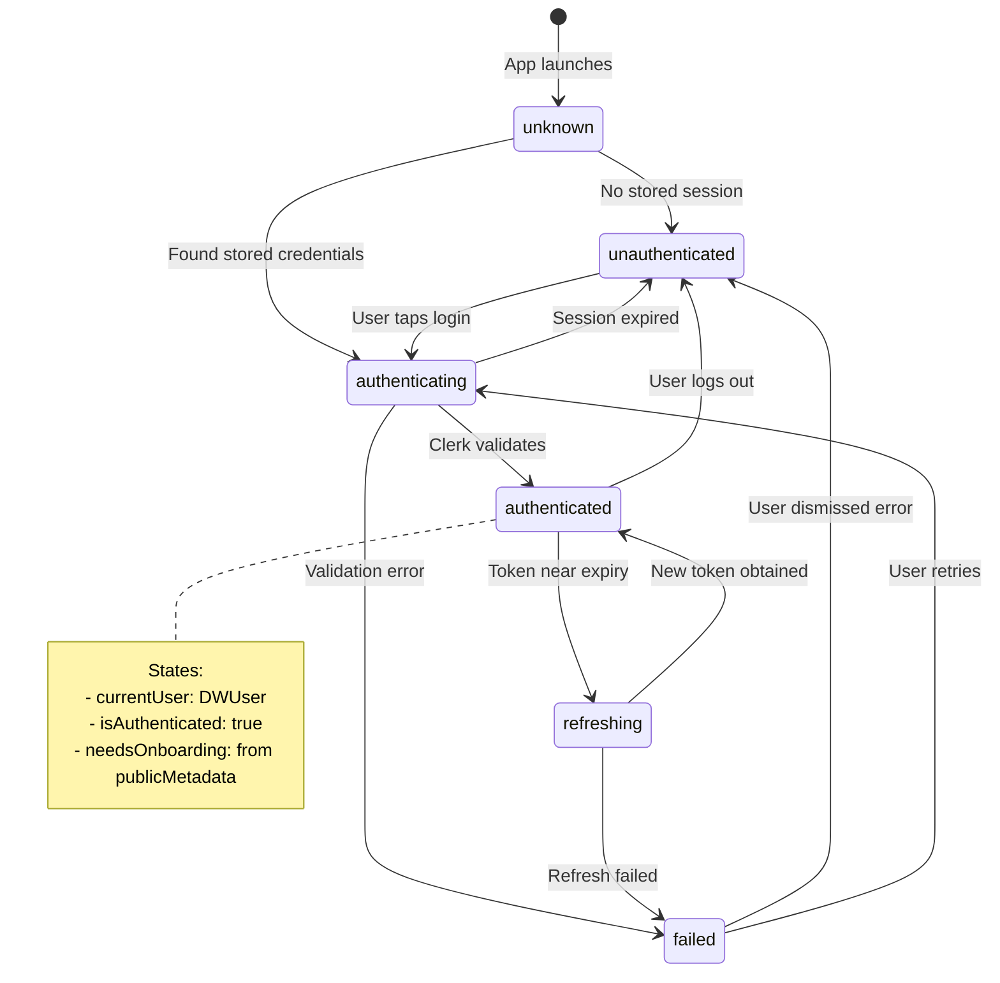
```mermaid
stateDiagram-v2
    [*] --> unknown: App launches

    unknown --> unauthenticated: No stored session
    unknown --> authenticating: Found stored credentials

    authenticating --> authenticated: Clerk validates
    authenticating --> failed: Validation error
    authenticating --> unauthenticated: Session expired

    unauthenticated --> authenticating: User taps login

    authenticated --> refreshing: Token near expiry
    refreshing --> authenticated: New token obtained
    refreshing --> failed: Refresh failed

    authenticated --> unauthenticated: User logs out

    failed --> unauthenticated: User dismissed error
    failed --> authenticating: User retries

    note right of authenticated
        States:
        - currentUser: DWUser
        - isAuthenticated: true
        - needsOnboarding: from publicMetadata
    end note
```

### AuthService State Definition

**File:** `Core/Services/AuthService.swift`

```swift
public enum AuthState: Equatable {
    case unknown                // Initial - checking stored credentials
    case unauthenticated        // No valid credentials
    case authenticating         // Login in progress
    case authenticated          // Valid session
    case refreshing             // Token refresh in progress
    case failed(String)         // Auth failed with error message
}
```

### Login Flow

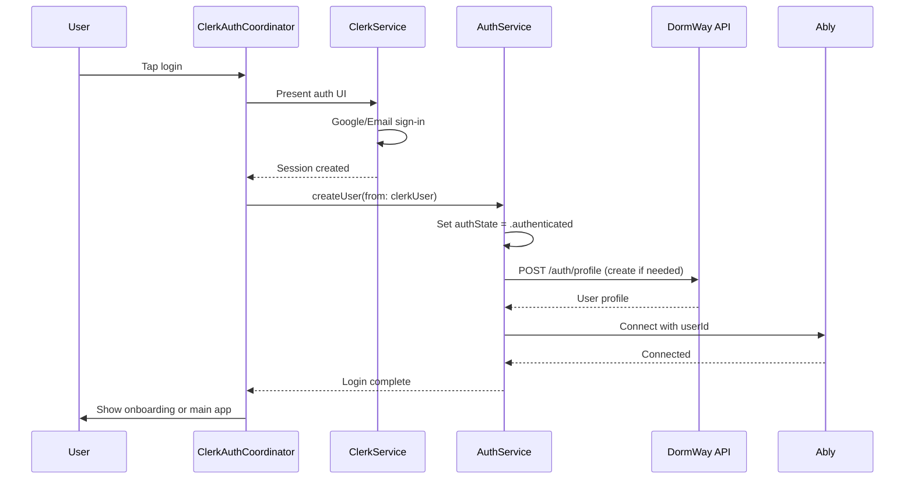
```mermaid
sequenceDiagram
    participant User
    participant ClerkUI as ClerkAuthCoordinator
    participant ClerkSDK as ClerkService
    participant AuthService
    participant Backend as DormWay API
    participant Ably

    User->>ClerkUI: Tap login
    ClerkUI->>ClerkSDK: Present auth UI
    ClerkSDK->>ClerkSDK: Google/Email sign-in
    ClerkSDK-->>ClerkUI: Session created
    ClerkUI->>AuthService: createUser(from: clerkUser)
    AuthService->>AuthService: Set authState = .authenticated
    AuthService->>Backend: POST /auth/profile (create if needed)
    Backend-->>AuthService: User profile
    AuthService->>Ably: Connect with userId
    Ably-->>AuthService: Connected
    AuthService-->>ClerkUI: Login complete
    ClerkUI->>User: Show onboarding or main app
```

### Session Restoration (Cold Start)

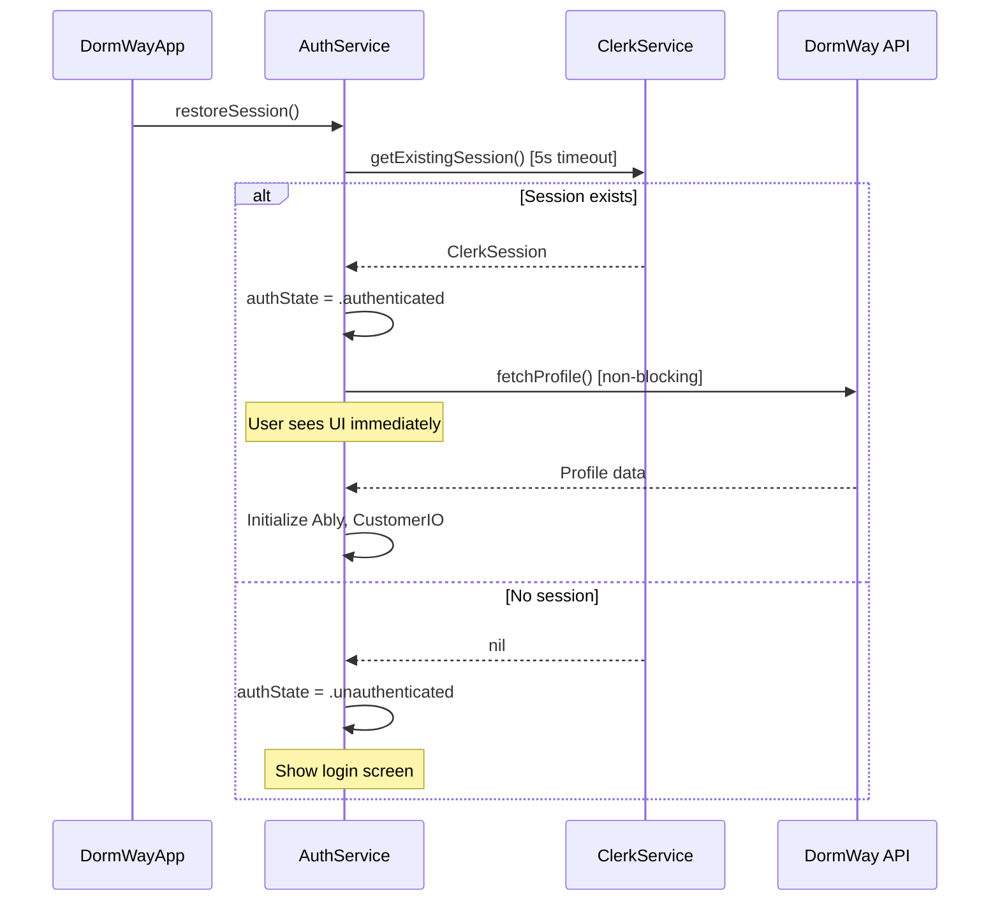
```mermaid
sequenceDiagram
    participant App as DormWayApp
    participant Auth as AuthService
    participant Clerk as ClerkService
    participant API as DormWay API

    App->>Auth: restoreSession()
    Auth->>Clerk: getExistingSession() [5s timeout]

    alt Session exists
        Clerk-->>Auth: ClerkSession
        Auth->>Auth: authState = .authenticated
        Auth->>API: fetchProfile() [non-blocking]
        Note over Auth: User sees UI immediately
        API-->>Auth: Profile data
        Auth->>Auth: Initialize Ably, CustomerIO
    else No session
        Clerk-->>Auth: nil
        Auth->>Auth: authState = .unauthenticated
        Note over Auth: Show login screen
    end
```

---

## 4. Onboarding Flow

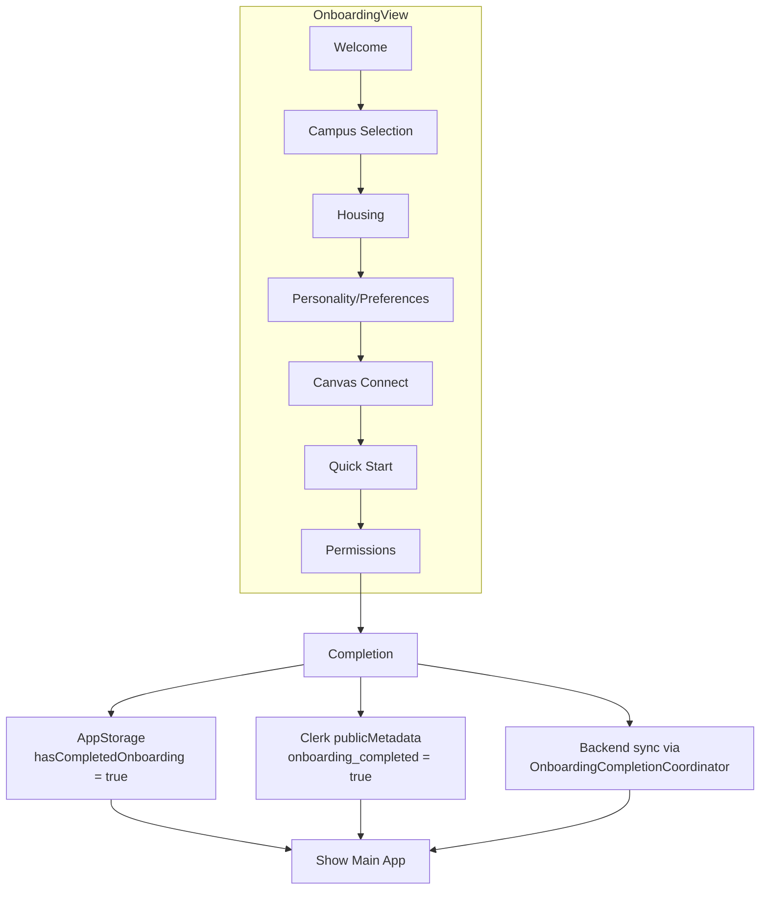
```mermaid
flowchart TB
    subgraph OnboardingView
        O1[Welcome] --> O2[Campus Selection]
        O2 --> O3[Housing]
        O3 --> O4[Personality/Preferences]
        O4 --> O5[Canvas Connect]
        O5 --> O6[Quick Start]
        O6 --> O7[Permissions]
    end

    O7 --> Complete[Completion]

    Complete --> Store1["AppStorage<br/>hasCompletedOnboarding = true"]
    Complete --> Store2["Clerk publicMetadata<br/>onboarding_completed = true"]
    Complete --> Store3["Backend sync via<br/>OnboardingCompletionCoordinator"]

    Store1 & Store2 & Store3 --> MainApp[Show Main App]
```

### Onboarding Completion Tracking

| Storage | Key | Purpose |
|---------|-----|---------|
| AppStorage (local) | `hasCompletedOnboarding` | Immediate local check |
| Clerk Metadata | `publicMetadata.onboarding_completed` | Cross-device sync |
| Backend | Coordinator sync | Backend awareness |

---

## 5. Data Flow Architecture

### Dashboard Data Pipeline

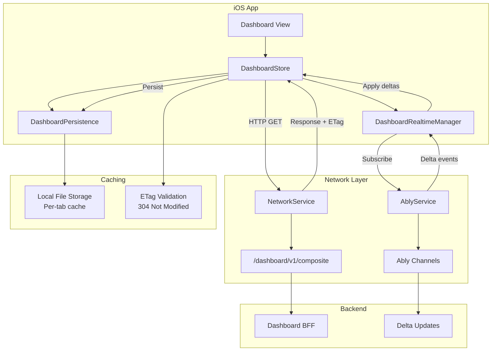
```mermaid
flowchart TB
    subgraph Client ["iOS App"]
        DV[Dashboard View] --> DS[DashboardStore]
        DS --> DRM[DashboardRealtimeManager]
        DS --> DP[DashboardPersistence]
    end

    subgraph Network ["Network Layer"]
        NS[NetworkService] --> API
        AS[AblyService] --> Ably
    end

    subgraph Backend ["Backend"]
        API["/dashboard/v1/composite"] --> BFF[Dashboard BFF]
        Ably["Ably Channels"] --> Delta[Delta Updates]
    end

    DS -->|HTTP GET| NS
    NS -->|Response + ETag| DS
    DRM -->|Subscribe| AS
    AS -->|Delta events| DRM
    DRM -->|Apply deltas| DS
    DS -->|Persist| DP

    subgraph Cache ["Caching"]
        DP --> Local["Local File Storage<br/>Per-tab cache"]
        DS --> ETag["ETag Validation<br/>304 Not Modified"]
    end
```

### DashboardStore State Structure

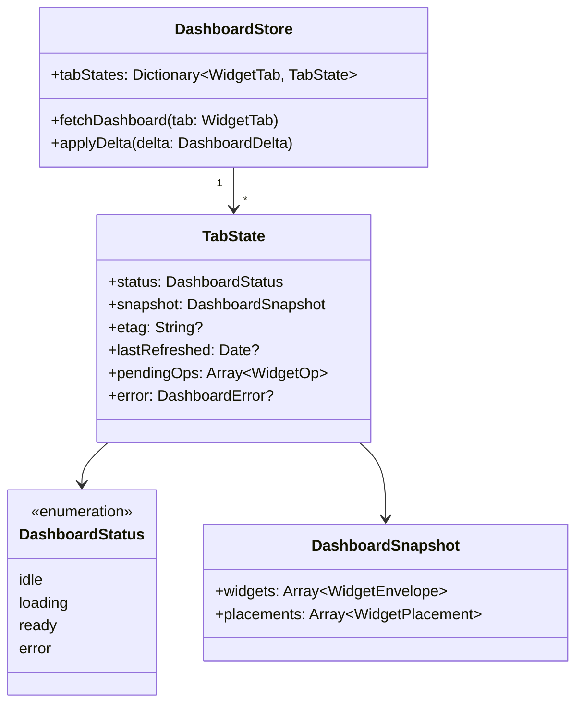
```mermaid
classDiagram
    class DashboardStore {
        +tabStates: Dictionary~WidgetTab, TabState~
        +fetchDashboard(tab: WidgetTab)
        +applyDelta(delta: DashboardDelta)
    }

    class TabState {
        +status: DashboardStatus
        +snapshot: DashboardSnapshot
        +etag: String?
        +lastRefreshed: Date?
        +pendingOps: Array~WidgetOp~
        +error: DashboardError?
    }

    class DashboardStatus {
        <<enumeration>>
        idle
        loading
        ready
        error
    }

    class DashboardSnapshot {
        +widgets: Array~WidgetEnvelope~
        +placements: Array~WidgetPlacement~
    }

    DashboardStore "1" --> "*" TabState
    TabState --> DashboardStatus
    TabState --> DashboardSnapshot
```

### Real-time Update Flow

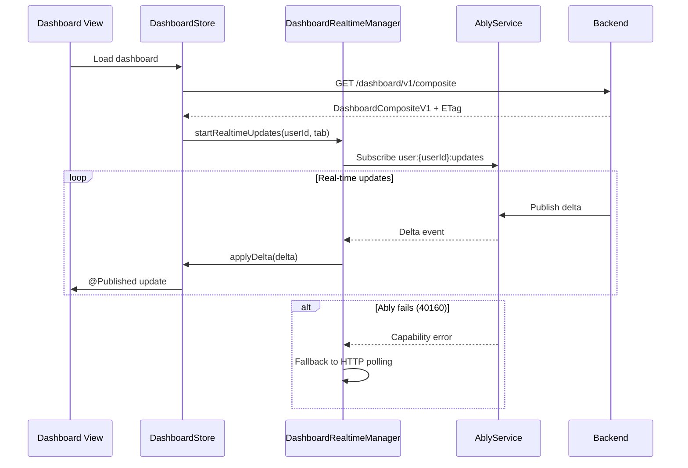
```mermaid
sequenceDiagram
    participant UI as Dashboard View
    participant Store as DashboardStore
    participant RealTime as DashboardRealtimeManager
    participant Ably as AblyService
    participant Backend

    UI->>Store: Load dashboard
    Store->>Backend: GET /dashboard/v1/composite
    Backend-->>Store: DashboardCompositeV1 + ETag

    Store->>RealTime: startRealtimeUpdates(userId, tab)
    RealTime->>Ably: Subscribe user:{userId}:updates

    loop Real-time updates
        Backend->>Ably: Publish delta
        Ably-->>RealTime: Delta event
        RealTime->>Store: applyDelta(delta)
        Store->>UI: @Published update
    end

    alt Ably fails (40160)
        Ably-->>RealTime: Capability error
        RealTime->>RealTime: Fallback to HTTP polling
    end
```

---

## 6. Data Collection Pipeline

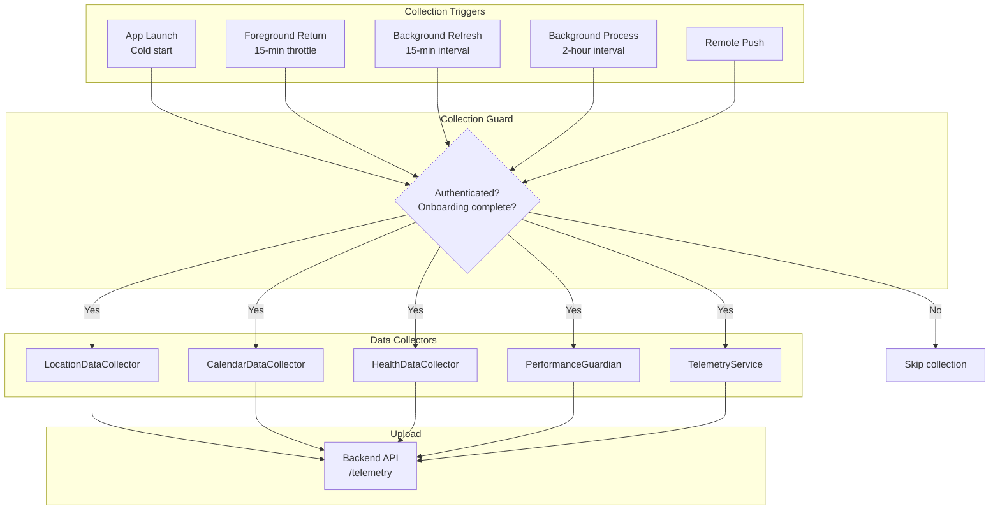
```mermaid
flowchart TB
    subgraph Triggers ["Collection Triggers"]
        T1[App Launch<br/>Cold start]
        T2[Foreground Return<br/>15-min throttle]
        T3[Background Refresh<br/>15-min interval]
        T4[Background Process<br/>2-hour interval]
        T5[Remote Push]
    end

    subgraph Guard ["Collection Guard"]
        G{Authenticated?<br/>Onboarding complete?}
    end

    subgraph Collectors ["Data Collectors"]
        C1[LocationDataCollector]
        C2[CalendarDataCollector]
        C3[HealthDataCollector]
        C4[PerformanceGuardian]
        C5[TelemetryService]
    end

    subgraph Upload ["Upload"]
        U[Backend API<br/>/telemetry]
    end

    T1 & T2 & T3 & T4 & T5 --> G
    G -->|Yes| C1 & C2 & C3 & C4 & C5
    G -->|No| Skip[Skip collection]
    C1 & C2 & C3 & C4 & C5 --> U
```

### Ably Channel Structure

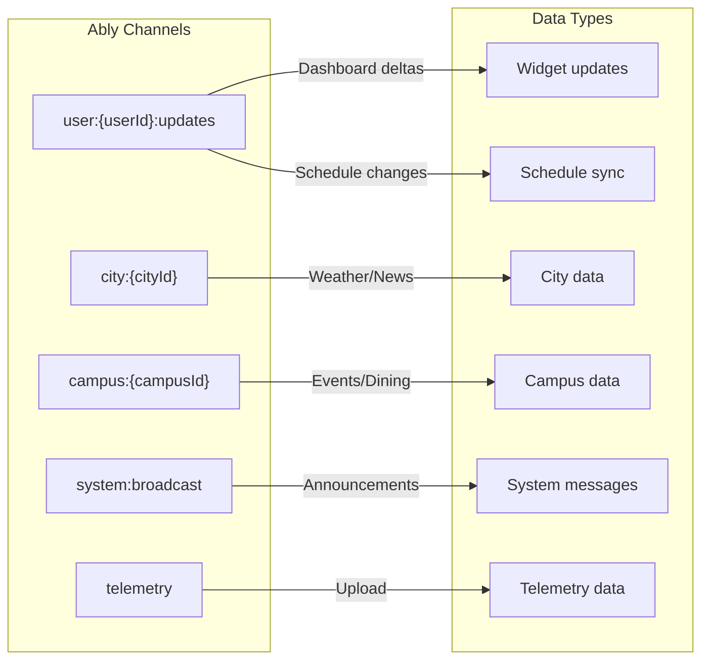
```mermaid
flowchart LR
    subgraph Channels ["Ably Channels"]
        UC["user:{userId}:updates"]
        CC["city:{cityId}"]
        CaC["campus:{campusId}"]
        SC["system:broadcast"]
        TC["telemetry"]
    end

    subgraph Data ["Data Types"]
        UC -->|Dashboard deltas| D1[Widget updates]
        UC -->|Schedule changes| D2[Schedule sync]
        CC -->|Weather/News| D3[City data]
        CaC -->|Events/Dining| D4[Campus data]
        SC -->|Announcements| D5[System messages]
        TC -->|Upload| D6[Telemetry data]
    end
```

---

## 7. Dependency Injection Architecture

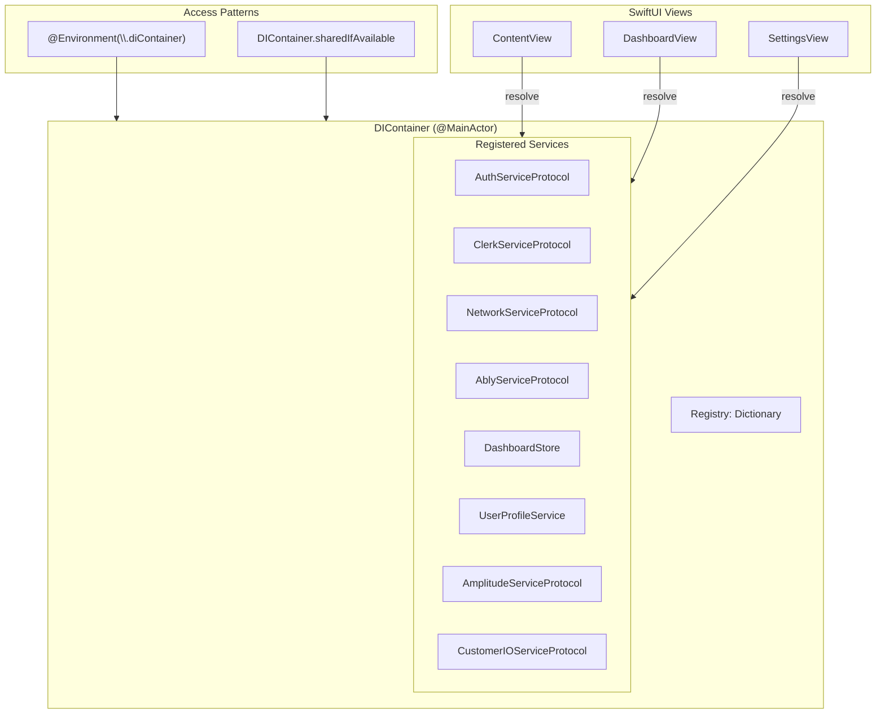
```mermaid
flowchart TB
    subgraph DIContainer ["DIContainer (@MainActor)"]
        direction TB
        R[Registry: Dictionary]

        subgraph Services ["Registered Services"]
            S1[AuthServiceProtocol]
            S2[ClerkServiceProtocol]
            S3[NetworkServiceProtocol]
            S4[AblyServiceProtocol]
            S5[DashboardStore]
            S6[UserProfileService]
            S7[AmplitudeServiceProtocol]
            S8[CustomerIOServiceProtocol]
        end
    end

    subgraph Access ["Access Patterns"]
        A1["@Environment(\\.diContainer)"]
        A2["DIContainer.sharedIfAvailable"]
    end

    subgraph SwiftUI ["SwiftUI Views"]
        V1[ContentView]
        V2[DashboardView]
        V3[SettingsView]
    end

    A1 --> DIContainer
    A2 --> DIContainer
    V1 & V2 & V3 -->|resolve| Services
```

### Service Registration Pattern

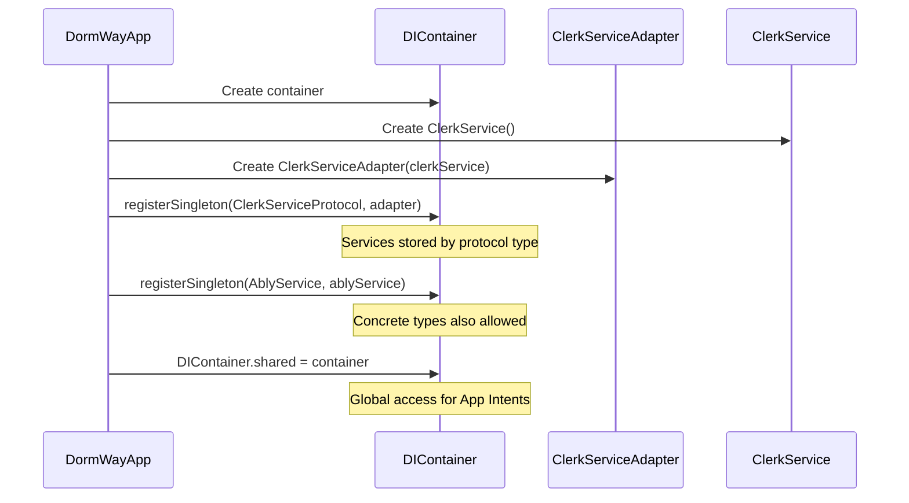
```mermaid
sequenceDiagram
    participant App as DormWayApp
    participant Container as DIContainer
    participant Adapter as ClerkServiceAdapter
    participant Concrete as ClerkService

    App->>Container: Create container
    App->>Concrete: Create ClerkService()
    App->>Adapter: Create ClerkServiceAdapter(clerkService)
    App->>Container: registerSingleton(ClerkServiceProtocol, adapter)

    Note over Container: Services stored by protocol type

    App->>Container: registerSingleton(AblyService, ablyService)
    Note over Container: Concrete types also allowed

    App->>Container: DIContainer.shared = container
    Note over Container: Global access for App Intents
```

---

## 8. Package & Module Architecture

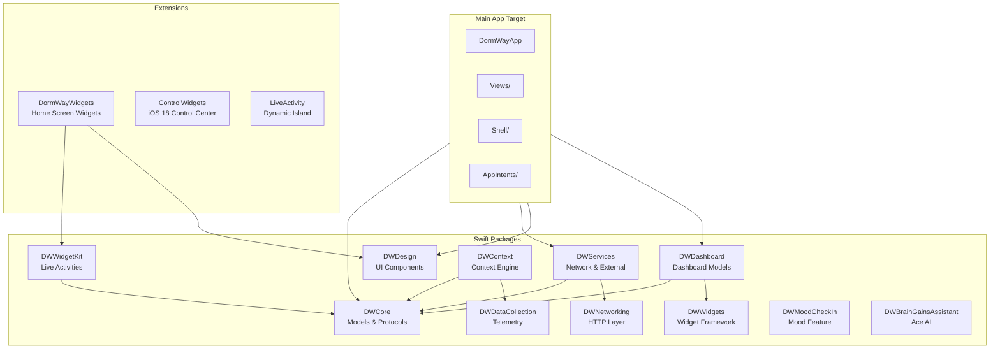
```mermaid
flowchart TB
    subgraph App ["Main App Target"]
        A[DormWayApp]
        Views[Views/]
        Shell[Shell/]
        AppIntents[AppIntents/]
    end

    subgraph Packages ["Swift Packages"]
        DWCore[DWCore<br/>Models & Protocols]
        DWServices[DWServices<br/>Network & External]
        DWNetworking[DWNetworking<br/>HTTP Layer]
        DWDesign[DWDesign<br/>UI Components]
        DWDashboard[DWDashboard<br/>Dashboard Models]
        DWContext[DWContext<br/>Context Engine]
        DWWidgets[DWWidgets<br/>Widget Framework]
        DWWidgetKit[DWWidgetKit<br/>Live Activities]
        DWDataCollection[DWDataCollection<br/>Telemetry]
        DWMoodCheckIn[DWMoodCheckIn<br/>Mood Feature]
        DWBrainGains[DWBrainGainsAssistant<br/>Ace AI]
    end

    subgraph Extensions ["Extensions"]
        WidgetExt[DormWayWidgets<br/>Home Screen Widgets]
        ControlWidgets[ControlWidgets<br/>iOS 18 Control Center]
        LiveActivity[LiveActivity<br/>Dynamic Island]
    end

    App --> DWCore
    App --> DWServices
    App --> DWDesign
    App --> DWDashboard

    DWServices --> DWCore
    DWServices --> DWNetworking
    DWDashboard --> DWCore
    DWDashboard --> DWWidgets
    DWContext --> DWCore
    DWContext --> DWDataCollection
    DWWidgetKit --> DWCore

    WidgetExt --> DWWidgetKit
    WidgetExt --> DWDesign
```

### Package Dependency Matrix

| Package | Depends On | Provides |
|---------|------------|----------|
| DWCore | (none) | Models, Protocols, Base Types |
| DWNetworking | DWCore | APIConfig, NetworkService |
| DWServices | DWCore, DWNetworking | Clerk, Ably, API Services |
| DWDesign | DWCore | Design System, Components |
| DWDashboard | DWCore, DWWidgets | Dashboard Models, Envelopes |
| DWContext | DWCore | Context Engine, User Context |
| DWWidgets | DWCore | Widget Framework |
| DWWidgetKit | DWCore | Live Activities, Widget Intents |
| DWDataCollection | DWCore | Telemetry, Data Collectors |

---

## 9. Scene Phase Handling

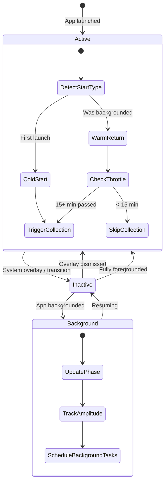
```mermaid
stateDiagram-v2
    [*] --> Active: App launched

    Active --> Inactive: System overlay / transition
    Inactive --> Active: Overlay dismissed
    Inactive --> Background: App backgrounded

    Background --> Inactive: Resuming
    Inactive --> Active: Fully foregrounded

    state Active {
        [*] --> DetectStartType
        DetectStartType --> ColdStart: First launch
        DetectStartType --> WarmReturn: Was backgrounded
        ColdStart --> TriggerCollection
        WarmReturn --> CheckThrottle
        CheckThrottle --> TriggerCollection: 15+ min passed
        CheckThrottle --> SkipCollection: < 15 min
    }

    state Background {
        [*] --> UpdatePhase
        UpdatePhase --> TrackAmplitude
        TrackAmplitude --> ScheduleBackgroundTasks
    }
```

### Background Task Types

| Task | Interval | Purpose |
|------|----------|---------|
| Refresh | 15 minutes | Data collection, sync |
| Processing | 2 hours | Heavy processing, cleanup |

---

## 10. Theme Management

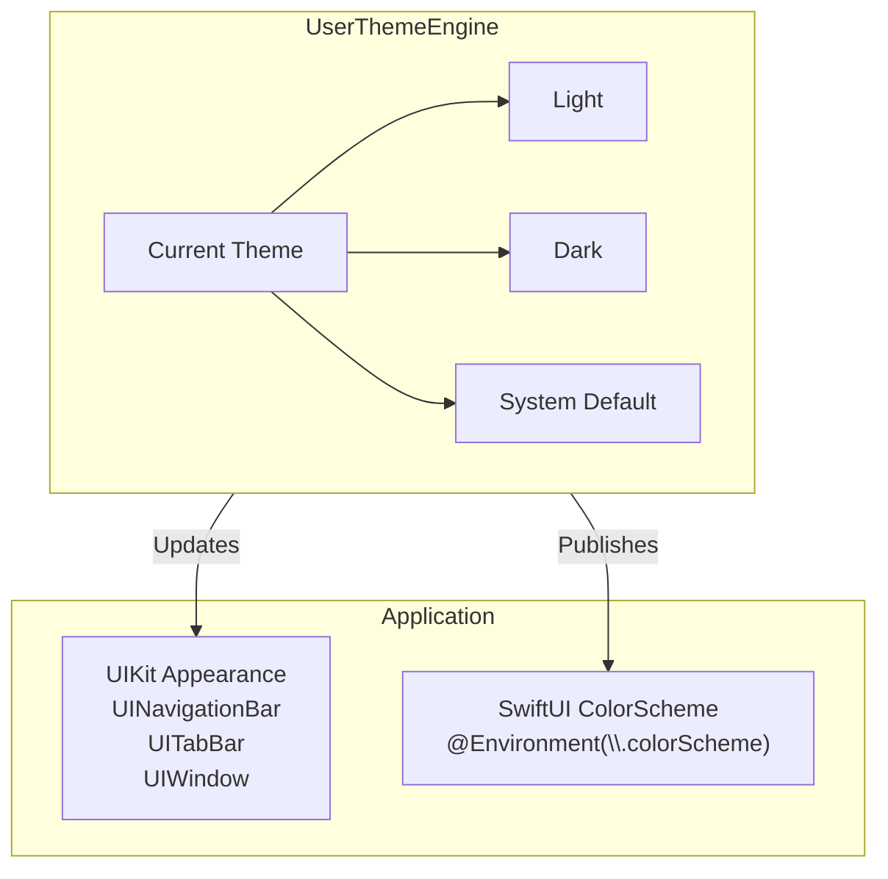
```mermaid
flowchart TB
    subgraph UserThemeEngine
        T[Current Theme]
        T --> Light
        T --> Dark
        T --> System[System Default]
    end

    subgraph Application
        UIKit["UIKit Appearance<br/>UINavigationBar<br/>UITabBar<br/>UIWindow"]
        SwiftUI["SwiftUI ColorScheme<br/>@Environment(\\.colorScheme)"]
    end

    UserThemeEngine -->|Updates| UIKit
    UserThemeEngine -->|Publishes| SwiftUI
```

---

## 11. Key Architecture Decisions

### 1. Two-Phase Initialization
**Decision:** Show UI immediately after DI container ready, complete initialization in background.
**Rationale:** Reduces perceived launch time, prevents splash screen hang.
**Implementation:** `isInitialized = true` set before auth check completes.

### 2. Unified DashboardStore
**Decision:** Single `DashboardStore` as source of truth for all dashboard state.
**Rationale:** Replaces per-component stores, centralizes caching and real-time updates.
**Features:** ETag validation, delta updates, optimistic updates, per-tab state.

### 3. Ably with HTTP Fallback
**Decision:** Gracefully fall back to HTTP when Ably fails.
**Rationale:** Capability errors (40160) shouldn't break the app.
**Implementation:** Catch Ably errors, switch to polling.

### 4. Adaptive Navigation
**Decision:** Use `horizontalSizeClass` to switch between NavigationSplitView and TabView.
**Rationale:** Proper layout for iPad landscape AND landscape iPhone (not just iPad detection).
**Breakpoint:** `.regular` = iPad/landscape, `.compact` = iPhone/portrait.

### 5. No Data Until Onboarded
**Decision:** Don't collect location/health data until auth + onboarding complete.
**Rationale:** Avoid permission prompts on first install, better UX.
**Guard:** All collectors check `isAuthenticated && hasCompletedOnboarding`.

### 6. Protocol-Based DI
**Decision:** Every service abstracted behind a protocol.
**Rationale:** Enables mocking, testing, avoids singleton anti-pattern.
**Pattern:** `registerSingleton(Protocol.self, implementation)`.

### 7. Main Thread Enforcement
**Decision:** Most services marked with `@MainActor`.
**Rationale:** Prevents threading bugs with Observation/ObservableObject.
**Implementation:** `@MainActor` on service classes.

---

## 12. File Reference Index

### Critical Entry Points

| Purpose | File |
|---------|------|
| App Entry | `App/DormWayApp.swift` |
| UIKit Bridge | `App/AppDelegate.swift` |
| Auth/Routing | `App/ContentView.swift` |

### Navigation

| Purpose | File |
|---------|------|
| iPhone/iPad Router | `App/Shell/AdaptiveNavigationShell.swift` |
| iPhone Tabs | `App/Shell/TabShellView.swift` |
| iPad Split | `App/Shell/iPad/IPadNavigationShell.swift` |
| Tab Paths | `Core/Navigation/TabRegistry.swift` |

### Authentication

| Purpose | File |
|---------|------|
| Auth State | `Core/Services/AuthService.swift` |
| Clerk UI | `App/Views/Auth/ClerkAuthCoordinator.swift` |
| Clerk SDK | `Packages/DWServices/Sources/DWServices/ClerkService.swift` |

### State Management

| Purpose | File |
|---------|------|
| DI Container | `Core/DependencyInjection/Container.swift` |
| Dashboard State | `Core/Services/DashboardStore.swift` |
| Realtime | `Core/Services/DashboardRealtimeManager.swift` |

### Tab Views

| Tab | File |
|-----|------|
| Home | `App/Views/HomeTabView.swift` |
| Schedule | `App/Views/Schedule/ScheduleTabView.swift` |
| Tasks | `App/Views/Tasks/TasksTabView.swift` |
| Term | `App/Views/Term/` |
| Me/Settings | `App/Views/Settings/` |

---

## 13. Mac Catalyst Support

The DormWay app runs on Mac via Mac Catalyst with specific adaptations for the desktop environment.

### Platform Detection Flow

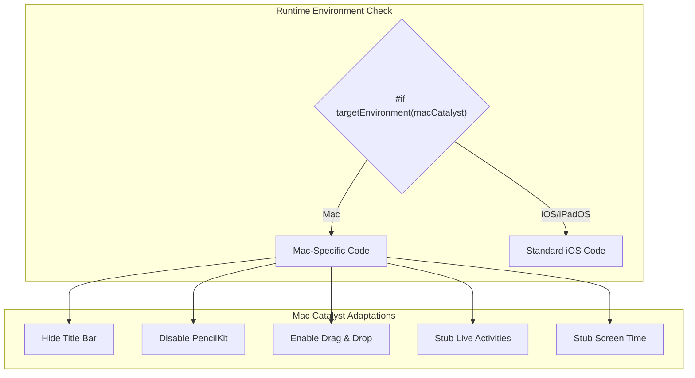
```mermaid
flowchart TB
    subgraph Runtime ["Runtime Environment Check"]
        Check{"#if targetEnvironment(macCatalyst)"}
        Check -->|Mac| MacPath[Mac-Specific Code]
        Check -->|iOS/iPadOS| IOSPath[Standard iOS Code]
    end

    subgraph MacAdaptations ["Mac Catalyst Adaptations"]
        MacPath --> TitleBar[Hide Title Bar]
        MacPath --> DisablePencil[Disable PencilKit]
        MacPath --> EnableDrag[Enable Drag & Drop]
        MacPath --> StubLive[Stub Live Activities]
        MacPath --> StubScreen[Stub Screen Time]
    end
```

### Title Bar Hiding (Multi-Layer Strategy)

The app uses an aggressive multi-layered approach to hide the Mac title bar due to timing issues:

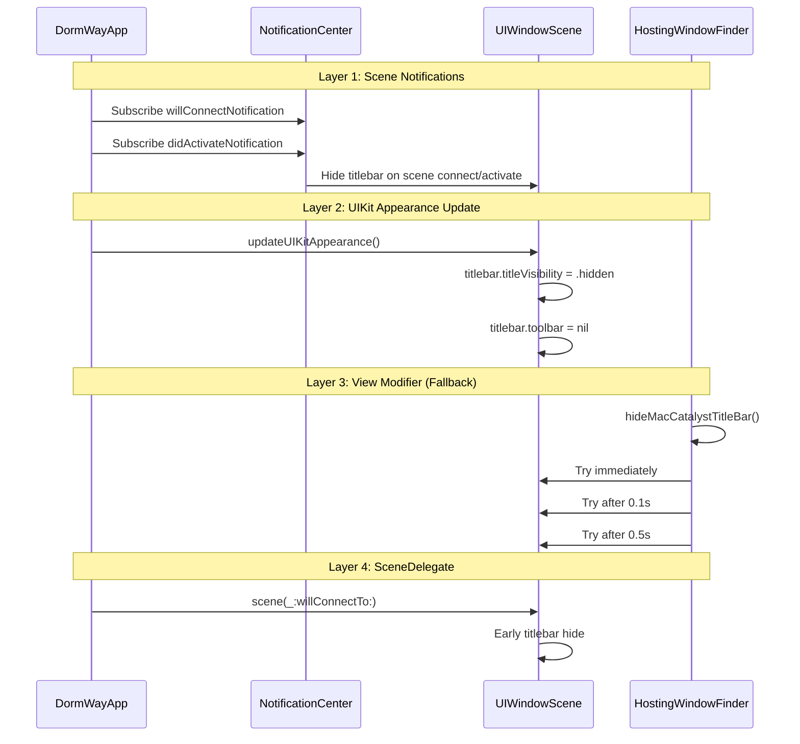
```mermaid
sequenceDiagram
    participant App as DormWayApp
    participant Notif as NotificationCenter
    participant Scene as UIWindowScene
    participant View as HostingWindowFinder

    Note over App,View: Layer 1: Scene Notifications
    App->>Notif: Subscribe willConnectNotification
    App->>Notif: Subscribe didActivateNotification
    Notif->>Scene: Hide titlebar on scene connect/activate

    Note over App,View: Layer 2: UIKit Appearance Update
    App->>Scene: updateUIKitAppearance()
    Scene->>Scene: titlebar.titleVisibility = .hidden
    Scene->>Scene: titlebar.toolbar = nil

    Note over App,View: Layer 3: View Modifier (Fallback)
    View->>View: hideMacCatalystTitleBar()
    View->>Scene: Try immediately
    View->>Scene: Try after 0.1s
    View->>Scene: Try after 0.5s

    Note over App,View: Layer 4: SceneDelegate
    App->>Scene: scene(_:willConnectTo:)
    Scene->>Scene: Early titlebar hide
```

**Implementation Files:**
- `App/DormWayApp.swift:27-55` - Notification listeners
- `App/DormWayApp.swift:380-384` - UIKit appearance update
- `App/DormWayApp.swift:531-557` - View modifier with HostingWindowFinder
- `App/SceneDelegate.swift:9-15` - Scene lifecycle fallback

### Feature Availability Matrix

```mermaid
flowchart LR
    subgraph Available ["Available on Mac Catalyst"]
        A1[Core App Navigation]
        A2[Dashboard & Widgets]
        A3[File Drag & Drop]
        A4[Hover Effects]
        A5[Text-based Notes]
    end

    subgraph Disabled ["Disabled/Stubbed on Mac"]
        D1[Live Activities]
        D2[Dynamic Island]
        D3[Screen Time API]
        D4[PencilKit Canvas]
        D5[Control Center Widgets]
    end

    subgraph NotImplemented ["Not Implemented"]
        N1[Keyboard Shortcuts]
        N2[Menu Bar Customization]
        N3[Multi-Window Support]
        N4[Touch Bar]
        N5[Right-Click Menus]
    end
```

### Mac Catalyst Feature Status

| Feature | Status | Implementation | File |
|---------|--------|----------------|------|
| **Title Bar Hiding** | Fully Implemented | Multi-layer aggressive hiding | `DormWayApp.swift` |
| **Drag & Drop** | Fully Implemented | File upload via drop zone | `IPadFilesView.swift:107-1057` |
| **Adaptive Lecture View** | Fully Implemented | Text-only (no PencilKit) | `AdaptiveLectureView.swift:18-25` |
| **Live Activities** | Stub Only | No-op implementation | `LiveActivityService.swift:88-100` |
| **Screen Time** | Not Available | Returns false with message | `ScreenTimeDataCollector.swift:91-103` |
| **Hover Effects** | Available | `.hoverScale()`, `.hoverGlow()` | `View+MicroInteractions.swift:33-44` |
| **Keyboard Shortcuts** | Not Implemented | - | - |
| **Menu Bar** | Not Implemented | - | - |
| **Multi-Window** | Not Implemented | Single window only | - |
| **Touch Bar** | Not Implemented | - | - |

### Adaptive UI Behavior

```mermaid
flowchart TB
    subgraph LectureView ["Lecture View Selection"]
        LV{Platform Check}
        LV -->|"#if macCatalyst"| Compact[CompactLectureView<br/>Text-based notes]
        LV -->|iPad Regular| Full[LectureView<br/>PencilKit canvas]
        LV -->|iPhone Compact| Compact
    end

    subgraph Rationale
        R1["Mac: No Apple Pencil support"]
        R2["iPad: Full drawing canvas"]
        R3["iPhone: Screen too small"]
    end

    Compact -.-> R1
    Full -.-> R2
    Compact -.-> R3
```

**Code Pattern:**
```swift
#if targetEnvironment(macCatalyst)
// Mac Catalyst always uses compact view (no Apple Pencil)
return false
#else
// Use canvas on iPad (regular size class), compact on iPhone
return horizontalSizeClass == .regular
#endif
```

### Drag and Drop Implementation

```mermaid
flowchart TB
    subgraph DropZone ["IPadFilesView Drop Zone"]
        DZ[".onDrop modifier"]
        DZ --> Types["Accepted Types:<br/>- .fileURL<br/>- .pdf<br/>- .text<br/>- .plainText"]
    end

    subgraph Handler ["handleDroppedFiles()"]
        H1[Validate file type]
        H2[Check compatibility]
        H3[Trigger upload flow]
    end

    subgraph UI ["Visual Feedback"]
        U1[Drop zone overlay]
        U2[Icon + text hint]
        U3[Highlight on hover]
    end

    Types --> H1 --> H2 --> H3
    DZ --> UI
```

### Stubbed Services Pattern

For iOS-only features, Mac Catalyst uses stub implementations that gracefully no-op:

```mermaid
classDiagram
    class LiveActivityServiceProtocol {
        <<protocol>>
        +startClassCountdown()
        +stopAllActivities()
    }

    class LiveActivityService_iOS {
        +startClassCountdown() // Real implementation
        +stopAllActivities() // Uses ActivityKit
    }

    class LiveActivityService_Mac {
        +startClassCountdown() // No-op, returns success
        +stopAllActivities() // No-op, returns success
    }

    LiveActivityServiceProtocol <|.. LiveActivityService_iOS : iOS/iPadOS
    LiveActivityServiceProtocol <|.. LiveActivityService_Mac : macCatalyst

    note for LiveActivityService_Mac "Stub implementation<br/>prevents crashes,<br/>returns success"
```

### Key Architecture Decision: Mac Catalyst

**Decision:** Minimal but functional Mac Catalyst support focused on core experience.

**What's Implemented:**
- Title bar hiding (polish)
- Drag and drop file upload (productivity)
- Graceful feature degradation (stability)

**What's Not Implemented:**
- Keyboard shortcuts (Cmd+key bindings)
- Menu bar customization
- Multi-window support
- Touch Bar integration
- Native right-click context menus

**Rationale:** The app is optimized for iOS/iPad touch-first experience. Mac Catalyst support provides a functional desktop option without full Mac-native features.

---

## 14. Future Mac Catalyst Features

This section outlines Mac-native features that should be considered for future implementation to provide a more polished desktop experience.

### Priority Roadmap

```mermaid
flowchart LR
    subgraph P1 ["Priority 1: High Impact"]
        K[Keyboard Shortcuts]
        M[Menu Bar]
        RC[Right-Click Menus]
    end

    subgraph P2 ["Priority 2: Productivity"]
        MW[Multi-Window]
        TB[Toolbar]
        HO[Handoff]
    end

    subgraph P3 ["Priority 3: Polish"]
        SL[Spotlight]
        DM[Dock Menu]
        FO[Focus Filters]
    end

    subgraph P4 ["Priority 4: Nice-to-Have"]
        NW[Notification Widgets]
        QN[Quick Note]
        AS[AppleScript]
    end

    P1 --> P2 --> P3 --> P4
```

### Priority 1: High Impact Features

#### Keyboard Shortcuts

Essential for power users and accessibility. Students can navigate without leaving the keyboard.

```mermaid
flowchart TB
    subgraph GlobalShortcuts ["Global Shortcuts (Cmd+key)"]
        G1["Cmd+1-5: Switch tabs"]
        G2["Cmd+N: New task"]
        G3["Cmd+F: Search"]
        G4["Cmd+,: Settings"]
        G5["Cmd+R: Refresh"]
    end

    subgraph NavigationShortcuts ["Navigation"]
        N1["Cmd+[: Back"]
        N2["Cmd+]: Forward"]
        N3["Cmd+T: Today"]
        N4["Cmd+Shift+C: Courses"]
    end

    subgraph TaskShortcuts ["Task Management"]
        T1["Cmd+Enter: Complete task"]
        T2["Cmd+D: Set due date"]
        T3["Cmd+P: Set priority"]
        T4["Cmd+Delete: Delete"]
    end
```

**Implementation Approach:**
```swift
// Use SwiftUI keyboardShortcut modifier
Button("New Task") { createTask() }
    .keyboardShortcut("n", modifiers: .command)

// Or UIKit responder chain for complex shortcuts
override var keyCommands: [UIKeyCommand]? {
    return [
        UIKeyCommand(input: "1", modifierFlags: .command,
                     action: #selector(switchToHome))
    ]
}
```

**Files to Modify:**
- `App/DormWayApp.swift` - Global commands
- `App/Shell/TabShellView.swift` - Tab switching
- Individual view files for context-specific shortcuts

#### Menu Bar Customization

Native Mac apps have File, Edit, View menus with app-specific actions.

```mermaid
flowchart TB
    subgraph MenuBar ["Mac Menu Bar"]
        FM[File Menu]
        EM[Edit Menu]
        VM[View Menu]
        GM[Go Menu]
        WM[Window Menu]
        HM[Help Menu]
    end

    subgraph FileMenu ["File Menu Items"]
        FM --> F1["New Task (Cmd+N)"]
        FM --> F2["New Note (Cmd+Shift+N)"]
        FM --> F3["Import Schedule..."]
        FM --> F4["Export..."]
        FM --> F5["Close Window (Cmd+W)"]
    end

    subgraph GoMenu ["Go Menu Items"]
        GM --> G1["Home (Cmd+1)"]
        GM --> G2["Schedule (Cmd+2)"]
        GM --> G3["Tasks (Cmd+3)"]
        GM --> G4["Courses (Cmd+4)"]
        GM --> G5["Settings (Cmd+5)"]
        GM --> G6["Today (Cmd+T)"]
    end

    subgraph ViewMenu ["View Menu Items"]
        VM --> V1["Week View"]
        VM --> V2["Month View"]
        VM --> V3["Show Sidebar"]
        VM --> V4["Enter Full Screen"]
    end
```

**Implementation:**
```swift
// SwiftUI Commands API
@main
struct DormWayApp: App {
    var body: some Scene {
        WindowGroup {
            ContentView()
        }
        .commands {
            CommandGroup(after: .newItem) {
                Button("New Task") { /* action */ }
                    .keyboardShortcut("n", modifiers: .command)
            }
            CommandMenu("Go") {
                Button("Home") { selectTab(.home) }
                    .keyboardShortcut("1", modifiers: .command)
                // ...
            }
        }
    }
}
```

#### Right-Click Context Menus

Proper macOS context menus with keyboard navigation.

```mermaid
flowchart TB
    subgraph TaskContextMenu ["Task Right-Click Menu"]
        TC1["Complete Task"]
        TC2["---"]
        TC3["Edit..."]
        TC4["Set Due Date"]
        TC5["Set Priority →"]
        TC6["---"]
        TC7["Move to Course →"]
        TC8["Duplicate"]
        TC9["Delete"]
    end

    subgraph CourseContextMenu ["Course Right-Click Menu"]
        CC1["Open Course"]
        CC2["View in Canvas"]
        CC3["---"]
        CC4["Add Task"]
        CC5["Add Note"]
        CC6["---"]
        CC7["Copy Zoom Link"]
        CC8["Notifications..."]
    end

    subgraph FileContextMenu ["File Right-Click Menu"]
        FC1["Open"]
        FC2["Open With →"]
        FC3["---"]
        FC4["Quick Look"]
        FC5["Share →"]
        FC6["---"]
        FC7["Rename"]
        FC8["Move to Trash"]
    end
```

**Current State:** Basic SwiftUI `.contextMenu` used in some places
**Enhancement:** Use `UIContextMenuConfiguration` for richer menus with submenus

### Priority 2: Productivity Features

#### Multi-Window Support

Allow students to have multiple windows open (e.g., course notes + task list side by side).

```mermaid
flowchart TB
    subgraph WindowTypes ["Supported Window Types"]
        MW[Main Window<br/>Full app]
        CW[Course Window<br/>Single course focus]
        TW[Task Window<br/>Task list only]
        NW[Note Window<br/>Single note editor]
        SW[Schedule Window<br/>Calendar view]
    end

    subgraph SceneManagement ["Scene Management"]
        SM1["WindowGroup for main"]
        SM2["Window for auxiliary"]
        SM3["DocumentGroup for notes"]
    end

    MW --> SM1
    CW & TW & NW --> SM2
```

**Implementation:**
```swift
@main
struct DormWayApp: App {
    var body: some Scene {
        WindowGroup {
            ContentView()
        }

        #if targetEnvironment(macCatalyst)
        WindowGroup("Course", for: Course.ID.self) { $courseId in
            CourseDetailWindow(courseId: courseId)
        }

        Window("Quick Task", id: "quick-task") {
            QuickTaskView()
        }
        .keyboardShortcut("n", modifiers: [.command, .shift])
        #endif
    }
}
```

#### Customizable Toolbar

Mac-style toolbar with customizable items.

```mermaid
flowchart LR
    subgraph Toolbar ["Toolbar Items"]
        Back["← Back"]
        Forward["→ Forward"]
        Sep1["|"]
        Today["📅 Today"]
        NewTask["+ Task"]
        Sep2["|"]
        Search["🔍 Search"]
        Sep3["|"]
        ViewMode["View ▼"]
        Sidebar["☰ Sidebar"]
    end

    subgraph Customization ["User Customizable"]
        C1["Drag to reorder"]
        C2["Remove items"]
        C3["Add from palette"]
        C4["Icon/Text/Both"]
    end
```

**Implementation:**
```swift
// UIKit toolbar customization
#if targetEnvironment(macCatalyst)
if let titlebar = windowScene.titlebar {
    let toolbar = NSToolbar(identifier: "MainToolbar")
    toolbar.delegate = self
    toolbar.allowsUserCustomization = true
    toolbar.displayMode = .iconAndLabel
    titlebar.toolbar = toolbar
}
#endif
```

#### Handoff Support

Continue tasks between Mac and iPhone/iPad seamlessly.

```mermaid
sequenceDiagram
    participant iPhone
    participant iCloud as iCloud
    participant Mac

    Note over iPhone: User viewing Course X
    iPhone->>iCloud: Advertise activity<br/>type: "course-view"<br/>id: "course-123"

    Note over Mac: Dock icon shows Handoff badge
    Mac->>iCloud: Accept handoff
    iCloud-->>Mac: Activity payload
    Mac->>Mac: Open Course X in new window

    Note over Mac: User editing Task Y
    Mac->>iCloud: Advertise activity<br/>type: "task-edit"<br/>id: "task-456"

    Note over iPhone: Lock screen shows Handoff
    iPhone->>iCloud: Accept handoff
    iCloud-->>iPhone: Activity payload
    iPhone->>iPhone: Open Task Y editor
```

**Implementation:**
```swift
// Advertise activity
let activity = NSUserActivity(activityType: "com.dormway.view-course")
activity.title = "Viewing \(course.name)"
activity.userInfo = ["courseId": course.id]
activity.isEligibleForHandoff = true
view.userActivity = activity
activity.becomeCurrent()

// Receive handoff
func application(_ application: UIApplication,
                 continue userActivity: NSUserActivity,
                 restorationHandler: @escaping ([UIUserActivityRestoring]?) -> Void) -> Bool {
    if userActivity.activityType == "com.dormway.view-course",
       let courseId = userActivity.userInfo?["courseId"] as? String {
        navigateToCourse(courseId)
        return true
    }
    return false
}
```

### Priority 3: Polish Features

#### Spotlight Integration

Search course content, tasks, and notes from macOS Spotlight.

```mermaid
flowchart TB
    subgraph Spotlight ["Spotlight Search"]
        SQ["User types: 'calculus homework'"]
    end

    subgraph CoreSpotlight ["Core Spotlight Index"]
        CS1["CSSearchableItem"]
        CS2["Indexed on content change"]
        CS3["Updated in background"]
    end

    subgraph Results ["Search Results"]
        R1["📚 MATH 101 - Calculus"]
        R2["✅ Homework 3 - Due Tomorrow"]
        R3["📝 Lecture Notes: Derivatives"]
    end

    Spotlight --> CoreSpotlight --> Results
    Results -->|Click| App[Open in DormWay]
```

**Indexable Content:**
- Courses (name, code, instructor)
- Tasks (title, description, due date)
- Notes (title, content)
- Files (name, course association)

#### Dock Menu

Quick actions from right-clicking the dock icon.

```mermaid
flowchart TB
    subgraph DockMenu ["Dock Right-Click Menu"]
        DM1["New Task"]
        DM2["New Note"]
        DM3["---"]
        DM4["Open Schedule"]
        DM5["Today's Tasks (3)"]
        DM6["---"]
        DM7["Recent Courses →"]
        DM8["---"]
        DM9["Options →"]
        DM10["Quit DormWay"]
    end
```

**Implementation:**
```swift
// In AppDelegate
override func buildMenu(with builder: UIMenuBuilder) {
    super.buildMenu(with: builder)

    // Dock menu
    if builder.system == .context {
        let newTask = UIAction(title: "New Task") { _ in /* */ }
        let newNote = UIAction(title: "New Note") { _ in /* */ }
        builder.insertChild(UIMenu(title: "", options: .displayInline,
                                   children: [newTask, newNote]),
                           atStartOfMenu: .root)
    }
}
```

#### Focus Filters

Integrate with macOS Focus modes to filter content.

```mermaid
flowchart TB
    subgraph FocusModes ["macOS Focus Modes"]
        FM1["🎓 Studying"]
        FM2["💼 Work"]
        FM3["😴 Sleep"]
        FM4["🏠 Personal"]
    end

    subgraph Filtering ["DormWay Focus Filters"]
        F1["Studying: Show all courses"]
        F2["Work: Hide social features"]
        F3["Sleep: Silence notifications"]
        F4["Personal: Show personal tasks only"]
    end

    FM1 --> F1
    FM2 --> F2
    FM3 --> F3
    FM4 --> F4
```

### Priority 4: Nice-to-Have Features

#### macOS Notification Center Widgets

```mermaid
flowchart TB
    subgraph NCWidgets ["Notification Center Widgets"]
        W1["📅 Next Class<br/>MATH 101 in 25 min<br/>Room 203"]
        W2["✅ Due Today (3)<br/>Essay Draft<br/>Problem Set 4<br/>Quiz Review"]
        W3["📊 Week Progress<br/>■■■■□□□ 57%"]
    end
```

**Implementation:** Use WidgetKit with `#if os(macOS)` for Mac-specific widgets

#### Quick Note Integration

Deep link into Apple Notes or support Quick Note floating window.

#### AppleScript Support

Allow automation and integration with other Mac apps.

```applescript
tell application "DormWay"
    set taskList to get tasks where due date is today
    repeat with t in taskList
        log title of t
    end repeat

    make new task with properties {title: "Review notes", course: "MATH 101"}
end tell
```

### Implementation Phases

```mermaid
gantt
    title Mac Catalyst Enhancement Roadmap
    dateFormat  YYYY-Q
    section Priority 1
    Keyboard Shortcuts      :p1a, 2025-Q1, 1q
    Menu Bar               :p1b, 2025-Q1, 1q
    Right-Click Menus      :p1c, 2025-Q1, 1q
    section Priority 2
    Multi-Window           :p2a, 2025-Q2, 1q
    Toolbar               :p2b, 2025-Q2, 1q
    Handoff               :p2c, 2025-Q2, 1q
    section Priority 3
    Spotlight             :p3a, 2025-Q3, 1q
    Dock Menu             :p3b, 2025-Q3, 1q
    Focus Filters         :p3c, 2025-Q3, 1q
    section Priority 4
    NC Widgets            :p4a, 2025-Q4, 1q
    Quick Note            :p4b, 2025-Q4, 1q
    AppleScript           :p4c, 2025-Q4, 1q
```

### File Impact Analysis

| Feature | Files to Create/Modify | Complexity |
|---------|------------------------|------------|
| Keyboard Shortcuts | `DormWayApp.swift`, all major views | Medium |
| Menu Bar | `DormWayApp.swift` (Commands API) | Low |
| Right-Click Menus | All list views, context menu configs | Medium |
| Multi-Window | New scene definitions, navigation updates | High |
| Toolbar | `DormWayApp.swift`, new toolbar delegate | Medium |
| Handoff | `AppDelegate.swift`, activity advertisers | Medium |
| Spotlight | New `SpotlightIndexer` service | High |
| Dock Menu | `AppDelegate.swift` | Low |
| Focus Filters | New Focus Filter extension target | Medium |
| NC Widgets | New Widget extension target (macOS) | High |

### Quick Wins (Can Implement Today)

1. **Basic Keyboard Shortcuts** - Add `.keyboardShortcut()` to existing buttons
2. **Dock Menu** - Simple `buildMenu(with:)` override
3. **Menu Bar Go Menu** - SwiftUI Commands API
4. **Enhanced Context Menus** - Expand existing `.contextMenu` modifiers

---

## Related Documentation

- [DormWay iOS App Architecture](/docs/engineering/technical/ios/dormway-ios-app-architecture) - Detailed architecture guide
- iOS App Architecture - Current Implementation - Implementation specifics
- iOS Dashboard BFF Integration - Backend integration
- iOS Authentication System - Auth details
- [iOS Onboarding Flow](/docs/engineering/technical/ios/ios-onboarding-flow) - Onboarding specifics
- [iOS Widget Integration Guide](/docs/engineering/technical/ios/ios-widget-integration-guide) - Widget system
- [iOS Context System](/docs/engineering/technical/ios/ios-context-system) - Context engine

---

## Changelog

| Date | Author | Changes |
|------|--------|---------|
| 2025-01-02 | Claude | Added Future Mac Catalyst Features roadmap with implementation guides |
| 2025-01-02 | Claude | Added Mac Catalyst section with platform-specific diagrams |
| 2025-01-02 | Claude | Initial comprehensive State of Things document |

---

**Last Updated**: 2025-01-02
