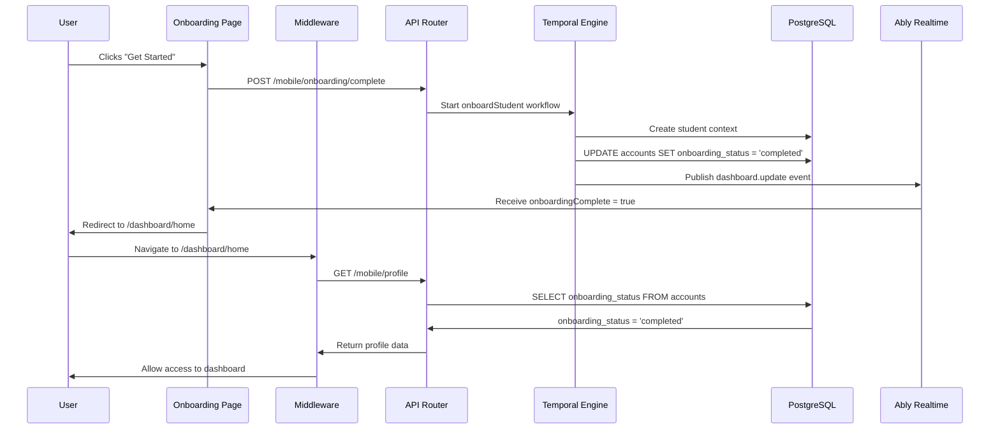

# Web Onboarding Redirect Flow

## Overview

This document describes the implementation of the web onboarding flow redirect system in the LockedIn Next.js application, ensuring users complete onboarding exactly once and are properly redirected to the dashboard upon completion.

## Problem Statement

The web onboarding flow had multiple redirect issues:
1. Users could access dashboard before completing onboarding
2. After clicking "Get Started", users were redirected back to onboarding instead of dashboard
3. Multiple redirect logic in different places caused conflicts
4. No real-time coordination with backend workflow completion

## Solution Architecture

### Middleware-Based Access Control

All redirect logic is centralized in Next.js middleware (`services/dormway-lockedin/src/middleware.ts`):

```typescript
// Check onboarding status from database (canonical source)
const response = await fetch(`${baseUrl}/api/proxy/mobile/profile`, {
  cache: 'no-store',
  headers: {
    'Cookie': request.headers.get('cookie') || ''
  }
});

if (response.ok) {
  const userData = await response.json();
  const isOnboarded = userData.onboarding_status === 'completed';

  // RULE 1: Not onboarded → can ONLY access /onboarding
  if (!isOnboarded && pathname.startsWith('/dashboard')) {
    return NextResponse.redirect(new URL('/onboarding', request.url));
  }

  // RULE 2: Onboarded → can ONLY access /dashboard
  if (isOnboarded && pathname.startsWith('/onboarding')) {
    return NextResponse.redirect(new URL('/dashboard/home', request.url));
  }
}
```

**Key Points:**
- Middleware runs on EVERY protected route (`/dashboard/*` and `/onboarding`)
- Checks database via `/mobile/profile` endpoint (not Auth0 JWT which can be stale)
- Forwards session cookies to authenticate the proxy request
- API routes excluded from middleware matcher to prevent infinite loops

### Middleware Matcher Configuration

```typescript
export const config = {
  matcher: ['/((?!api|_next/static|_next/image|favicon.ico|sitemap.xml|robots.txt).*)'],
};
```

Critical exclusions:
- `/api/*` - Prevents middleware from running on API proxy calls
- Next.js internals (`_next/*`)
- Static assets

### Onboarding Completion Flow

**File:** `services/dormway-lockedin/src/app/onboarding/page.tsx`

When user clicks "Get Started" on the last step:

1. **Button calls `handleNext` function** (not a direct link)
   - Triggers onboarding workflow via `POST /api/proxy/mobile/onboarding/complete`
   - Workflow creates student context and marks `onboarding_status = 'completed'`

2. **Listen for Ably real-time event** from workflow completion:
```typescript
const handleOnboardingComplete = (event: Event) => {
  const customEvent = event as CustomEvent;
  const { name, data } = customEvent.detail || {};

  if (name === 'dashboard.update' && data?.data?.onboardingComplete === true) {
    console.log('[Onboarding] Received onboarding complete event');
    window.removeEventListener('realtime:event', handleOnboardingComplete);
    window.location.href = '/dashboard/home';
  }
};

window.addEventListener('realtime:event', handleOnboardingComplete);
```

3. **Fallback timeout** (10 seconds) in case Ably event doesn't arrive

### Backend Workflow Integration

**File:** `services/engine/src/workflows/studentProcessor.workflow.ts` 
- Ably channel: `user:${userId}:updates` (matches schedule workflows). 
- Event name: `dashboard.update`. 
- Payload: `{ type: 'full' | 'partial' | 'context' | 'cards', data, timestamp }` — keep aligned with api-router/UI expectations.

The `onboardStudent` workflow publishes an Ably event after marking onboarding complete:

```typescript
// Mark onboarding as complete in database
await studentActivities.markOnboardingComplete(user_id);

// Publish onboarding complete event via Ably
await ablyActivities.publishDashboardUpdate(user_id, 'full', {
  onboardingComplete: true,
  firstName,
  contextId,
  timestamp: new Date().toISOString()
});
```

**Event Structure:**
- Channel: `user:${userId}:updates`
- Event Name: `dashboard.update`
- Payload:
  ```json
  {
    "type": "full",
    "timestamp": "2025-10-19T...",
    "data": {
      "onboardingComplete": true,
      "firstName": "John",
      "contextId": "uuid...",
      "timestamp": "2025-10-19T..."
    }
  }
  ```

### Ably Real-Time Integration

**File:** `services/dormway-lockedin/src/components/RealtimeProvider.tsx`

The RealtimeProvider dispatches window events for all Ably messages:

```typescript
window.dispatchEvent(new CustomEvent('realtime:event', {
  detail: { channel: evt.channel, name: evt.name, data: evt.data }
}));
```

Onboarding page listens for these events to detect workflow completion.

## Data Flow Diagram



## Navigation Control During Onboarding

**File:** `services/dormway-lockedin/src/app/onboarding/layout.tsx`

The onboarding layout hides the global navigation bar:

```typescript
export default function OnboardingLayout({ children }: { children: React.ReactNode }) {
  return (
    <>
      <style dangerouslySetInnerHTML={{
        __html: `nav { display: none !important; }`
      }} />
      {children}
    </>
  );
}
```

This prevents users from navigating away from onboarding before completion.

## Key Design Decisions

### 1. Database as Source of Truth
- **Decision:** Check `accounts.onboarding_status` column in database, not Auth0 JWT claims
- **Rationale:** JWT claims can be stale; database is always current
- **Implementation:** Middleware calls `/mobile/profile` which queries database

### 2. Centralized Redirect Logic
- **Decision:** All redirect logic in middleware, not in individual pages
- **Rationale:** Single source of truth prevents conflicts and redirect loops
- **Implementation:** Removed all client-side onboarding checks from dashboard/onboarding pages

### 3. Real-Time Event Coordination
- **Decision:** Wait for Ably `dashboard.update` event before redirecting
- **Rationale:** Ensures database transaction is committed before redirect
- **Implementation:** Onboarding page listens for `realtime:event` window event

### 4. Cookie Forwarding in Middleware
- **Decision:** Forward session cookies when middleware calls API
- **Rationale:** Middleware fetch needs authentication to access user profile
- **Implementation:** Pass `Cookie` header from incoming request to proxy call

## Common Pitfalls Avoided

### ❌ Using Auth0 JWT Claims
```typescript
// WRONG - JWT can be stale
const session = await auth0.getSession();
const isOnboarded = session.user['app_metadata']?.onboarded;
```

### ✅ Checking Database
```typescript
// CORRECT - Database is canonical
const response = await fetch('/api/proxy/mobile/profile');
const userData = await response.json();
const isOnboarded = userData.onboarding_status === 'completed';
```

### ❌ Timeout-Based Redirect
```typescript
// WRONG - Race condition
setTimeout(() => {
  window.location.href = '/dashboard/home';
}, 1000);
```

### ✅ Event-Based Redirect
```typescript
// CORRECT - Wait for workflow completion
window.addEventListener('realtime:event', handleOnboardingComplete);
```

### ❌ Multiple Redirect Checks
```typescript
// WRONG - Conflicts with middleware
useEffect(() => {
  if (userProfile.onboarding_status === 'completed') {
    router.push('/dashboard');
  }
}, []);
```

### ✅ Single Middleware Check
```typescript
// CORRECT - Only middleware handles redirects
// Pages have no client-side redirect logic
```

## Testing the Flow

### Test Scenario 1: First-Time Onboarding
1. Create new user account
2. Verify redirect to `/onboarding` when accessing `/dashboard`
3. Complete onboarding steps
4. Click "Get Started"
5. Verify redirect to `/dashboard/home` after Ably event
6. Verify subsequent access to `/dashboard` is allowed
7. Verify access to `/onboarding` is blocked (redirects to dashboard)

### Test Scenario 2: Already Onboarded User
1. Use account with `onboarding_status = 'completed'`
2. Navigate to `/onboarding`
3. Verify immediate redirect to `/dashboard/home`

### Test Scenario 3: Unonboarded User
1. Use account with `onboarding_status = 'pending'`
2. Navigate to `/dashboard/home`
3. Verify immediate redirect to `/onboarding`

## Database Schema Reference

**accounts table:**
```sql
CREATE TABLE accounts (
  id UUID PRIMARY KEY,
  email TEXT NOT NULL,
  onboarding_status TEXT DEFAULT 'pending', -- 'pending' | 'completed'
  ...
);
```

**contexts table:**
```sql
CREATE TABLE contexts (
  id UUID PRIMARY KEY,
  user_id UUID REFERENCES accounts(id),
  type TEXT, -- 'student' for onboarding
  parent_id UUID REFERENCES contexts(id), -- campus context
  ...
);
```

## Related Documentation

- Onboarding Workflows - Backend workflow implementation
- Ably Real-Time Updates Implementation Strategy - Ably integration
- Next.js Middleware Guide - Middleware patterns
- [Authentication System](/docs/engineering/technical/authentication/readme) - Auth0 integration

## Troubleshooting

### Redirect Loop
**Symptom:** Page keeps redirecting between `/onboarding` and `/dashboard`

**Cause:** Middleware matcher includes `/api/*` routes

**Fix:** Ensure matcher excludes API routes:
```typescript
matcher: ['/((?!api|_next/static|_next/image|favicon.ico|sitemap.xml|robots.txt).*)']
```

### 401 Unauthorized on Profile Fetch
**Symptom:** Middleware logs show 401 error when fetching `/mobile/profile`

**Cause:** Session cookies not forwarded to proxy request

**Fix:** Add cookie header:
```typescript
headers: {
  'Cookie': request.headers.get('cookie') || ''
}
```

### User Not Redirected After "Get Started"
**Symptom:** User stays on onboarding page after clicking button

**Cause:** Ably event not received or handler not registered

**Debug:**
1. Check browser console for `[Onboarding] Received onboarding complete event`
2. Check Ably connection status in RealtimeProvider debug panel
3. Check engine logs for `Published onboarding complete event to Ably`
4. Verify 10-second fallback timeout eventually redirects

## Maintenance Notes

### When Modifying Redirect Logic
1. Test with both pending and completed onboarding status
2. Test direct navigation to both `/onboarding` and `/dashboard`
3. Verify middleware logs show correct redirect decisions
4. Check that Ably events are received in browser console

### When Updating Onboarding Workflow
1. Ensure `markOnboardingComplete` activity updates database
2. Ensure `publishDashboardUpdate` activity sends Ably event
3. Verify event payload includes `onboardingComplete: true`
4. Test end-to-end flow with real user account

---

*Last Updated: 2025-10-19*
*Related Issue: DORM-359*
