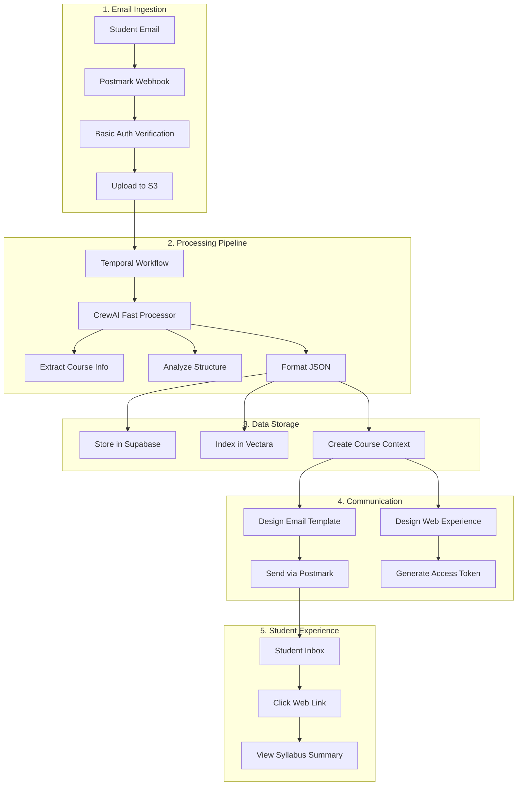

# Syllabus Processor Deployment Plan - August 2025

## Executive Summary

The Syllabus Processor is a complete email-to-web pipeline that automatically processes student syllabi sent via email, extracts structured information using AI, and delivers a beautiful web experience. This document outlines the deployment plan for getting this system production-ready.

**Current Status**: System is functionally complete but needs deployment configuration and testing.

## System Architecture Overview

### Complete Flow: Email → Processing → Web Experience



## Component Status & Requirements

### ✅ Completed Components

1. **Email Webhook (dormway-api-router)**
   - Postmark webhook endpoint at `/webhook/syllabus`
   - Basic auth authentication
   - S3 file upload with virus scanning
   - Presigned URL generation

2. **Temporal Workflow (engine)**
   - `processSyllabusFromWebhook` workflow
   - Handles duplicate detection
   - Two processing modes: crew (fast) and legacy
   - Complete error handling

3. **CrewAI Processing (dormway-crews)**
   - `SyllabusProcessorFastCrew` - 2-3 minute processing
   - 3 specialized agents for extraction
   - Structured JSON output
   - Cost-optimized with GPT-3.5-turbo

4. **Data Storage**
   - Supabase tables: `braingains_documents`, `course_contexts`, `service_data`
   - Vectara indexing for RAG queries
   - Student-course relationship tracking

5. **Email Design & Delivery**
   - Postmark template ID: 40328348
   - Dynamic content generation
   - Web experience token generation

### 🚧 Components Needing Configuration

1. **Environment Variables**
   ```env
   # Postmark Configuration
   POSTMARK_SERVER_TOKEN=<needs-setting>
   POSTMARK_WEBHOOK_USERNAME=<needs-setting>
   POSTMARK_WEBHOOK_PASSWORD=<needs-setting>
   
   # S3 Configuration
   AWS_REGION=us-east-1
   S3_WEBHOOK_BUCKET=dormway-webhooks-prod
   
   # Temporal Configuration
   TEMPORAL_ADDRESS=<cloud-temporal-endpoint>
   TEMPORAL_NAMESPACE=dormway-dev
   TEMPORAL_API_KEY=<needs-setting>
   
   # CrewAI/LLM Configuration
   OPENAI_API_KEY=<needs-setting>
   PORTKEY_API_KEY=<needs-setting>
   
   # Vectara Configuration
   VECTARA_API_KEY=<needs-setting>
   VECTARA_CUSTOMER_ID=<needs-setting>
   VECTARA_CORPUS_ID=<needs-setting>
   ```

2. **DNS & Email Setup**
   - Configure MX records for syllabus@dormway.app
   - Set up Postmark inbound processing
   - Configure webhook URL in Postmark

3. **Web Viewer Deployment**
   - Deploy syllabus-webviewer Next.js app
   - Configure domain: syllabus.dormway.app
   - Set up SSL certificate

## Deployment Steps

### Phase 1: Infrastructure Setup (Day 1)

#### Morning: Environment Configuration
```bash
# 1. Set up environment variables in Doppler
doppler secrets set POSTMARK_SERVER_TOKEN="xxx"
doppler secrets set POSTMARK_WEBHOOK_USERNAME="xxx"
doppler secrets set POSTMARK_WEBHOOK_PASSWORD="xxx"

# 2. Create S3 bucket if not exists
aws s3 mb s3://dormway-webhooks-prod
aws s3api put-bucket-versioning --bucket dormway-webhooks-prod --versioning-configuration Status=Enabled

# 3. Configure bucket lifecycle (30-day retention)
aws s3api put-bucket-lifecycle-configuration --bucket dormway-webhooks-prod --lifecycle-configuration file://s3-lifecycle.json
```

#### Afternoon: Service Deployment
```bash
# 1. Deploy API Router with webhook endpoints
cd dormway/dormway-api-router
npm run build
npm run deploy

# 2. Deploy Temporal workflows
cd ../engine
npm run build
npm run deploy-workflows

# 3. Deploy CrewAI service
cd ../dormway-crews
docker build -t dormway-crews .
docker push <registry>/dormway-crews:latest
```

### Phase 2: Email Configuration (Day 2)

#### Morning: Postmark Setup
1. Log into Postmark console
2. Create inbound email server
3. Configure inbound address: syllabus@dormway.app
4. Set webhook URL: https://api.dormway.app/webhook/syllabus
5. Add Basic Auth credentials
6. Test with sample email

#### Afternoon: Template Configuration
1. Create/update Postmark template 40328348
2. Test template variables
3. Configure sender verification

### Phase 3: Testing & Validation (Day 3)

#### Test Scenarios

1. **Happy Path Test**
   ```bash
   # Send test syllabus via email
   echo "Test syllabus" | mail -s "ECON 401 Syllabus" -a test-syllabus.pdf syllabus@dormway.app
   
   # Monitor workflow
   temporal workflow show --workflow-id syllabus-test-xxx
   
   # Check database
   psql -c "SELECT * FROM braingains_documents WHERE user_email='test@example.com'"
   ```

2. **Duplicate Detection Test**
   - Send same syllabus twice
   - Verify second submission uses cached results
   - Confirm email still sent

3. **Error Handling Test**
   - Send corrupted PDF
   - Send non-syllabus document
   - Test with oversized attachment

4. **Performance Test**
   - Measure end-to-end processing time
   - Target: < 3 minutes for crew processing
   - Monitor resource usage

### Phase 4: Monitoring Setup (Day 4)

#### Metrics to Track
```typescript
// Key metrics to monitor
const metrics = {
  // Ingestion metrics
  emails_received: counter,
  attachments_processed: counter,
  s3_upload_duration: histogram,
  
  // Processing metrics
  workflow_duration: histogram,
  crew_processing_time: histogram,
  duplicate_detection_rate: gauge,
  
  // Success metrics
  successful_extractions: counter,
  failed_extractions: counter,
  email_delivery_rate: gauge,
  
  // Usage metrics
  unique_users: gauge,
  syllabi_per_user: histogram,
  courses_processed: counter
};
```

#### Alerting Rules
```yaml
alerts:
  - name: high_processing_time
    condition: workflow_duration > 300s
    severity: warning
    
  - name: extraction_failures
    condition: failed_extractions > 5 in 10m
    severity: critical
    
  - name: email_delivery_failure
    condition: email_delivery_rate < 0.95
    severity: warning
```

## Production Checklist

### Pre-Launch Requirements
- [x] All environment variables configured in Doppler
- [x] S3 bucket created with proper permissions
- [x] Postmark webhook configured and tested
- [x] Temporal workflows deployed and tested
- [x] CrewAI service deployed and healthy
- [x] Database migrations applied
- [x] Vectara corpus created and configured
- [x] SSL certificates configured
- [x] Monitoring dashboards created
- [ ] Alerting rules configured
- [x] Runbook documented

### Launch Day Tasks
- [ ] Enable webhook endpoint
- [ ] Monitor first 10 submissions closely
- [ ] Check all metrics dashboards
- [ ] Verify email delivery
- [ ] Test web experience links
- [ ] Monitor error logs
- [ ] Check database writes
- [ ] Verify Vectara indexing

### Post-Launch Validation
- [ ] 24-hour metrics review
- [ ] Performance optimization opportunities
- [ ] User feedback collection
- [ ] Error rate analysis
- [ ] Cost analysis (LLM usage)

## Rollback Plan

If critical issues arise:

1. **Immediate Rollback** (< 5 minutes)
   ```bash
   # Disable webhook in Postmark
   # This stops new submissions immediately
   ```

2. **Workflow Rollback**
   ```bash
   # Revert to previous workflow version
   temporal workflow update --workflow-id syllabus-processor --version previous
   ```

3. **Data Recovery**
   - All emails stored in S3 (can reprocess)
   - Temporal history preserved
   - Database transactions can be rolled back

## Security Considerations

1. **Authentication**
   - Postmark webhook uses Basic Auth
   - API endpoints require JWT tokens
   - Web experience uses temporary tokens

2. **Data Protection**
   - S3 files encrypted at rest
   - Presigned URLs expire after 1 hour
   - PII handled according to privacy policy

3. **Rate Limiting**
   - Max 10 syllabi per user per day
   - Webhook rate limited to 100 req/min
   - CrewAI calls rate limited by PortKey

## Cost Estimates

### Per Syllabus Processing
- **LLM Costs** (GPT-3.5-turbo): ~$0.02
- **S3 Storage**: ~$0.001
- **Temporal Workflow**: ~$0.001
- **Email Delivery**: ~$0.001
- **Total**: ~$0.023 per syllabus

### Monthly Estimates (1000 students)
- Assuming 5 syllabi per student: 5000 processes
- Total monthly cost: ~$115
- With caching/duplicates: ~$75

## Success Metrics

### Target KPIs (First Month)
- **Processing Success Rate**: > 95%
- **Average Processing Time**: < 3 minutes
- **Email Delivery Rate**: > 98%
- **Web Experience Click Rate**: > 60%
- **User Satisfaction**: > 4.5/5

### Growth Metrics
- **Daily Active Syllabi Uploads**: Track trend
- **Unique Students**: Track adoption
- **Courses Covered**: Track coverage
- **Duplicate Rate**: Measure efficiency

## Support & Troubleshooting

### Common Issues & Solutions

1. **Webhook Not Receiving Emails**
   - Check MX records
   - Verify Postmark configuration
   - Check webhook auth credentials

2. **Processing Stuck**
   - Check Temporal workflow status
   - Verify CrewAI service health
   - Check for LLM API limits

3. **Emails Not Sending**
   - Verify Postmark API key
   - Check template ID
   - Review email logs

4. **Web Links Not Working**
   - Verify token generation
   - Check web viewer deployment
   - Test presigned URLs

### Support Contacts
- **Engineering**: #engineering-oncall
- **Infrastructure**: #devops
- **Product**: #product-syllabus

## PLG (Product-Led Growth) Features

### Waitlist Collection System - Using GetWaitlist.com

#### GetWaitlist.com Integration
1. **API Configuration**
   ```env
   WAITLIST_API_KEY=✅ Set in Doppler
   GETWAITLIST_WAITLIST_ID=<your-waitlist-id>
   GETWAITLIST_SANDBOX_MODE=false  # true for testing
   ```

2. **Implementation Requirements**
   - **Landing Page Integration**
     - Add GetWaitlist modal on syllabus.dormway.app
     - Embed at bottom of syllabus viewer
     - Show when visiting syllabus.dormway.app without syllabus ID
   
   - **API Integration**
     ```typescript
     // Add subscriber with email validation
     async function addToWaitlist(email: string, referralCode?: string) {
       // Validate email using GetWaitlist API
       const validation = await fetch('https://api.getwaitlist.com/v1/email/validate', {
         method: 'POST',
         headers: {
           'Authorization': `Bearer ${process.env.WAITLIST_API_KEY}`,
           'Content-Type': 'application/json'
         },
         body: JSON.stringify({ email })
       });
       
       if (!validation.valid) {
         throw new Error(validation.message);
       }
       
       // Add to waitlist
       const response = await fetch('https://api.getwaitlist.com/v1/subscribers', {
         method: 'POST',
         headers: {
           'Authorization': `Bearer ${process.env.WAITLIST_API_KEY}`,
           'Content-Type': 'application/json'
         },
         body: JSON.stringify({
           waitlist_id: GETWAITLIST_WAITLIST_ID,
           email,
           referral_code: referralCode,
           metadata: {
             source: 'syllabus_viewer',
             timestamp: new Date().toISOString()
           }
         })
       });
       
       return response.json();
     }
     ```

3. **Placement Strategy**
   - **Bottom of syllabus.dormway.app**: Persistent footer with "Join iOS Waitlist" CTA
   - **Modal trigger**: Opens GetWaitlist modal on click
   - **Default page**: When visiting syllabus.dormway.app without ID, show random syllabus + prominent waitlist CTA

4. **CustomerIO Integration**
   - **Webhook Already Configured**: GetWaitlist → CustomerIO webhook is live
   - **Automatic User Creation**: Waitlist signups automatically added to CustomerIO
   - **Opt-in Journey Required**: Need to implement email opt-in flow in CustomerIO
   
   ```typescript
   // CustomerIO opt-in journey triggers
   // Triggered automatically via GetWaitlist webhook
   const optInJourney = {
     trigger: 'waitlist_signup',
     attributes: {
       source: 'getwaitlist',
       waitlist_position: number,
       referral_code: string,
       signup_date: timestamp
     },
     journey: 'waitlist_opt_in_flow'
   };
   ```
   
   **Opt-in Email Flow**:
   - Welcome email with explicit opt-in request
   - Product updates checkbox
   - Early access notifications checkbox
   - GDPR/CAN-SPAM compliant unsubscribe

5. **Email Response Strategy**
   - **First-time processing**: Send immediate "We're processing your syllabus!" email
   - **Cached result**: Return processed syllabus immediately
   - Include waitlist CTA in both email types

### Random Syllabus Viewing

#### API Endpoint for Random Syllabus
```typescript
// GET /api/syllabus/random
export async function getRandomSyllabus(req: Request, res: Response) {
  try {
    // Query for public/shareable syllabi
    const { data: syllabi } = await supabase
      .from('braingains_documents')
      .select('id, course_code, course_name, university')
      .eq('is_public', true)
      .eq('document_type', 'syllabus')
      .not('processed_data', 'is', null);
    
    if (!syllabi || syllabi.length === 0) {
      // Fallback to demo syllabi
      return res.json({
        id: 'demo-cs101',
        course_code: 'CS 101',
        course_name: 'Introduction to Computer Science',
        university: 'Demo University',
        is_demo: true
      });
    }
    
    // Select random syllabus
    const random = syllabi[Math.floor(Math.random() * syllabi.length)];
    
    return res.json({
      id: random.id,
      course_code: random.course_code,
      course_name: random.course_name,
      university: random.university,
      is_demo: false
    });
  } catch (error) {
    logger.error('Failed to get random syllabus', { error });
    return res.status(500).json({ error: 'Failed to fetch random syllabus' });
  }
}
```

### Share Your Syllabus Feature

#### Social Sharing Components

1. **Share Button on Web Experience**
   ```typescript
   interface ShareOptions {
     platform: 'email' | 'twitter' | 'linkedin' | 'copy_link';
     syllabusId: string;
     courseCode: string;
     university: string;
   }
   
   // Generate shareable link
   const shareableUrl = `https://syllabus.dormway.app/shared/${syllabusId}?ref=${userId}`;
   ```

2. **Shared Syllabus View**
   - Public view with limited features
   - "Process your own syllabus" CTA
   - Show aggregated class insights
   - Display "23 other students taking this class"

3. **Viral Loops**
   ```mermaid
   graph LR
     A[Student Processes Syllabus] --> B[Receives Email]
     B --> C[Views Web Experience]
     C --> D[Shares with Classmate]
     D --> E[Classmate Views]
     E --> F[Joins Waitlist]
     F --> G[Processes Their Syllabus]
     G --> A
   ```

4. **Share Incentives**
   - Unlock premium features (full calendar export)
   - See anonymous classmate study patterns
   - Get study group recommendations
   - Priority access to new features

#### Technical Implementation

1. **API Endpoints**
   ```typescript
   // Create shareable link
   POST /api/syllabus/:id/share
   {
     expiresIn: '30d',
     allowedViews: 100,
     includeInsights: true
   }
   
   // Track share analytics
   POST /api/analytics/share
   {
     syllabusId: string,
     platform: string,
     referrerId: string
   }
   
   // View shared syllabus
   GET /api/public/syllabus/:shareId
   ```

2. **CustomerIO Tracking Events**
   ```typescript
   // Track viral actions
   track('syllabus_shared', {
     syllabusId,
     courseCode,
     shareMethod,
     recipientCount
   });
   
   track('shared_syllabus_viewed', {
     shareId,
     referrerId,
     viewerIsNew: boolean
   });
   
   track('viral_conversion', {
     source: 'shared_syllabus',
     referrerId,
     conversionType: 'waitlist' | 'signup'
   });
   ```

3. **Privacy Controls**
   - Remove PII from shared views
   - Allow users to disable sharing
   - Time-limited share links (30 days)
   - View count limits

### Growth Metrics Dashboard

```typescript
interface GrowthMetrics {
  // Viral metrics
  viralCoefficient: number;  // avg new users per existing user
  shareRate: number;        // % who share
  conversionRate: number;   // % of viewers who sign up
  
  // Waitlist metrics
  waitlistSize: number;
  dailySignups: number;
  referralRate: number;
  avgPositionChange: number;
  
  // Engagement metrics
  syllabusPerUser: number;
  sharePerSyllabus: number;
  viewsPerShare: number;
}
```

### Website Data Handling Improvements

#### Date Display Logic
```typescript
// Fix December 1969 issue - handle missing/invalid dates
function formatSyllabusDate(dateString?: string, weekNumber?: number): string {
  if (!dateString || dateString === 'null' || new Date(dateString).getFullYear() < 2000) {
    // Use week numbers when dates are unknown
    if (weekNumber) {
      return `Week ${weekNumber}`;
    }
    return 'Date TBD';
  }
  
  const date = new Date(dateString);
  if (isNaN(date.getTime())) {
    return weekNumber ? `Week ${weekNumber}` : 'Date TBD';
  }
  
  return date.toLocaleDateString('en-US', {
    month: 'short',
    day: 'numeric',
    year: 'numeric'
  });
}

// Note when using approximate dates
interface DateDisplay {
  text: string;
  isApproximate: boolean;
}

function getDateDisplay(assignment: any): DateDisplay {
  if (assignment.due_date && new Date(assignment.due_date).getFullYear() >= 2000) {
    return {
      text: formatSyllabusDate(assignment.due_date),
      isApproximate: false
    };
  }
  
  return {
    text: `Week ${assignment.week_number || '?'} (approximate)`,
    isApproximate: true
  };
}
```

#### Missing Data Handling
```typescript
// Gracefully handle missing instructor
function renderInstructor(instructor?: any): JSX.Element | null {
  if (!instructor || !instructor.name) {
    return null; // Don't render section at all
  }
  
  return (
    <div className="instructor-section">
      <h3>Instructor</h3>
      <p>{instructor.name}</p>
      {instructor.email && <p>Email: {instructor.email}</p>}
      {instructor.office_hours && <p>Office Hours: {instructor.office_hours}</p>}
    </div>
  );
}

// Handle other missing fields
const OPTIONAL_FIELDS = [
  'instructor',
  'office_location',
  'prerequisites',
  'textbooks',
  'grading_scale'
];

function shouldDisplayField(fieldName: string, value: any): boolean {
  if (!value) return false;
  if (typeof value === 'string' && value.trim() === '') return false;
  if (Array.isArray(value) && value.length === 0) return false;
  if (typeof value === 'object' && Object.keys(value).length === 0) return false;
  return true;
}
```

### Implementation Timeline

#### Week 1: GetWaitlist Integration
- [ ] Set up GetWaitlist.com account and API keys
- [ ] Add GetWaitlist modal to syllabus.dormway.app
- [ ] Implement email validation API
- [ ] Add waitlist CTAs to email templates

#### Week 2: Processing Improvements
- [ ] Implement immediate email response for first-time processing
- [ ] Add caching detection logic
- [ ] Create random syllabus API endpoint
- [ ] Update syllabus.dormway.app default page

#### Week 3: Data Display Fixes
- [ ] Fix date handling (no December 1969)
- [ ] Implement week-based fallbacks
- [ ] Handle missing instructor gracefully
- [ ] Add "approximate" indicators for dates

## Next Steps & Enhancements

### Phase 2 Features (Post-Launch)
1. **Multi-Syllabus Support**: Process multiple attachments
2. **Direct Upload**: Web interface for manual upload
3. **Batch Processing**: Bulk upload for advisors
4. **API Access**: Direct API for LMS integration
5. **Waitlist System**: Viral growth mechanics
6. **Social Sharing**: Share processed syllabi

### Phase 3 Features
1. **Smart Scheduling**: Auto-add to calendar
2. **Assignment Tracking**: Deadline reminders
3. **Study Planning**: AI-generated study schedules
4. **Grade Tracking**: Progress monitoring
5. **Study Groups**: Connect classmates
6. **Professor Insights**: Aggregate professor patterns

---

**Document Status**: Ready for Implementation
**Last Updated**: August 6, 2025
**Owner**: Engineering Team
**Review Date**: August 10, 2025
