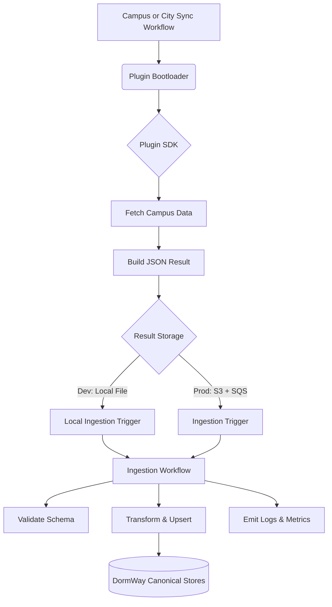
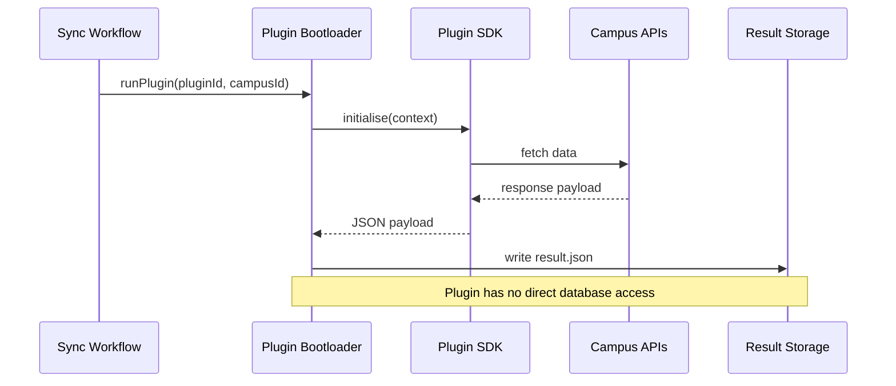
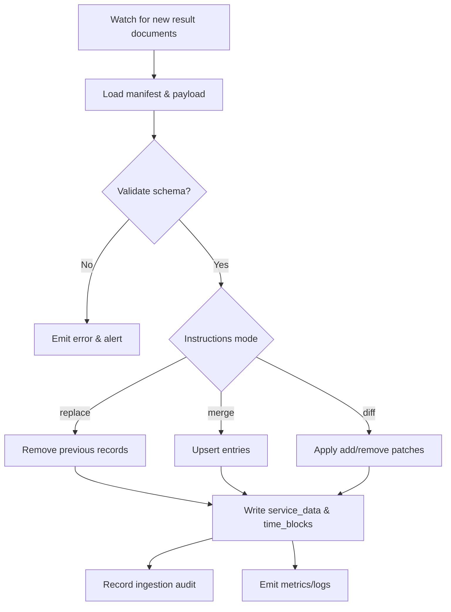
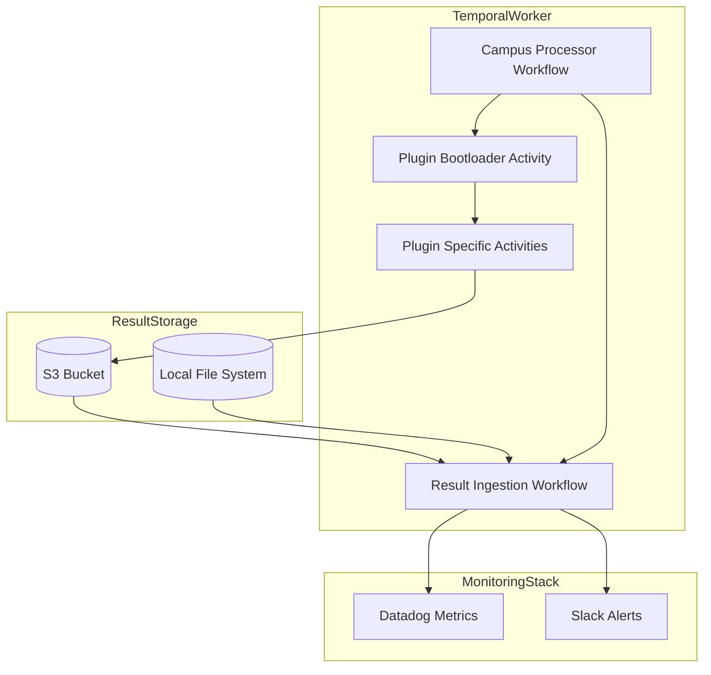
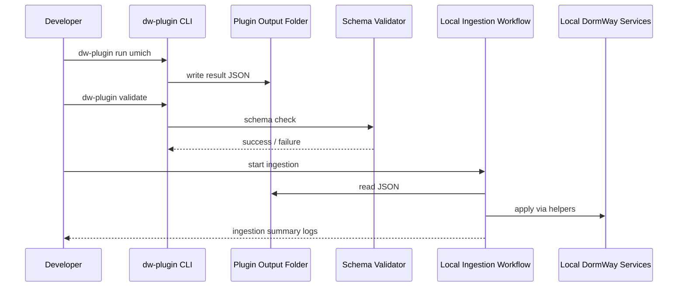

# Plugin Architecture Diagrams

The following Mermaid diagrams expand on the architecture described in DORM-332, showing plugin execution, result handling, and DormWay ingestion.

## 1. High-level Data Flow

## 2. Plugin Execution Sequence

## 3. Ingestion Workflow Logic

## 4. Component Deployment Diagram

## 5. Local Development Workflow

- In production, JSON artifacts live in S3; ingestion is triggered by SQS/EventBridge.
- Local dev uses file-system watchers or manual triggers.

## Next Steps
- Align diagrams with final schema fields (if we add new payload types).
- Add diagram showing versioned plugin rollout and rollback.
- Document how ingestion audit records link back to plugin run IDs.
