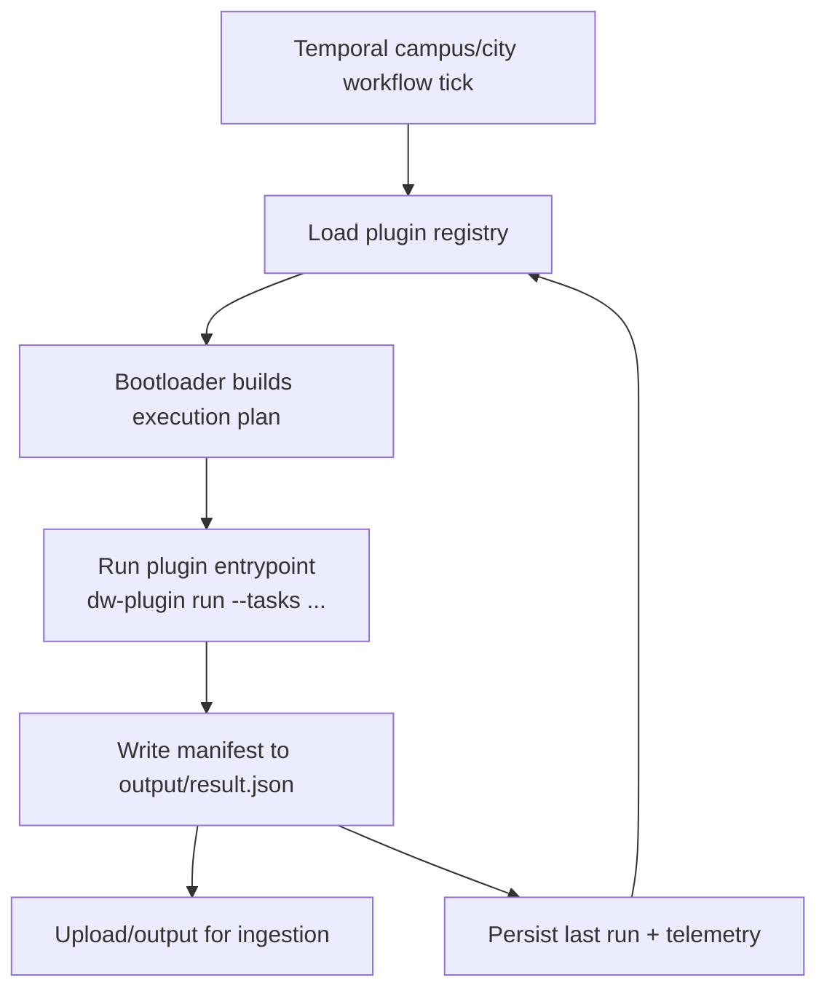

This document explains how Campus Connect plugins are registered and executed inside the Temporal worker. It complements [DORM-332](https://linear.app/dormwayllc/issue/DORM-332) and the JSON result schema documentation.

## High-Level Flow



* The Temporal workflow (e.g., `campusProcessor.workflow.ts`) iterates through all active plugins on each cadence tick (5-15 minutes).
* For each plugin, the bootloader retrieves configuration from the registry, resolves assets/secrets, and decides which internal tasks should run.
* Execution happens inside a dedicated plugin runner microservice (ECS task). The Temporal worker only orchestrates and monitors; plugin code never co-resides with the workflow process.
* A plugin is unaware of the workflow cadence beyond what the bootloader passes in; it simply executes the requested tasks and emits a JSON manifest.

## Registry Anatomy

Metadata lives in Postgres (`plugin_registry` table, subject to rename). Each row describes:

| Field | Description |
| --- | --- |
| `plugin_id` | Unique identifier referenced by manifests (`pluginId`). |
| `scope` | `campus`, `city`, or future `global`. Drives Temporal routing. |
| `target_id` | Campus slug (`umich`) or city id (`ann-arbor`). |
| `version` | Semantic version of the plugin bundle. Updated on deploy. |
| `status` | `active`, `paused`, `deprecated`. Paused entries are skipped. |
| `tasks` | JSON array describing named tasks, cadences, and modules. |
| `assets_uri` | S3 key or local path containing the plugin build. |
| `secrets_ref` | Vault key or secret bundle used during execution. |
| `overrides` | Optional JSON for environment-specific settings. |

Updates to the registry are hot-reloaded: the bootloader fetches metadata for every run, so changing cadence or status takes effect without redeploying the worker.

## Bootloader Responsibilities

1. **Resolve configuration**  
   Fetch the registry entry, merge environment overrides, and compute the effective task list (`tasks[]`).

2. **Schedule tasks**  
   Read plugin state (`state/<pluginId>.json` in S3/local). Determine which tasks are due based on their declared cadence and last run timestamps. Mark others as `skipped`.

3. **Prepare runtime sandbox**  
   - Create a working directory under `tmp/plugin-run/<pluginId>/<runId>`.  
   - Download/unpack assets if the version changed.  
   - Materialize secrets as environment variables or files.  
   - Provide helper configuration (`dw-plugin.config.json`) describing the execution target and resolved storage paths.

4. **Execute plugin entrypoint**  
   Invoke `dw-plugin run --plugin <pluginId> --tasks <taskIds...>` (Node.js or WASM runtime). Capture stdout/stderr for logs. The plugin should write its manifest to `output/result.json`.

5. **Validate output**  
   - Ensure the manifest exists.  
   - Validate against the JSON schema (including `executedTasks` and payload modules).  
   - Attach execution metadata (duration, tasks run/skipped).

6. **Persist artifacts**  
   - Upload the manifest to S3 (`plugin-results/<pluginId>/<runId>.json`).  
   - Update the state file with new `lastRunAt` per task.  
   - Optionally push incremental metrics to Datadog/OTel (`plugin.run.duration`, `records.emitted`).

7. **Notify ingest workflow**  
   Emit an event (SQS/SNS/Temporal signal) indicating the manifest is ready. In dev, the ingestion worker may poll the local filesystem.

8. **Return to Temporal**  
   The activity returns a summary object (`{ runId, executedTasks, outputUri, durationMs }`). The workflow records this in its run log and moves to the next plugin.

Errors are surfaced as Temporal activity failures. The manifest, logs, and state snapshots remain available for replay unless explicitly cleaned up.

## Task Cadence & State

- `tasks` are identified by slug (e.g., `events-maizepages`). Each entry includes:
  ```json
  {
    "taskId": "events-maizepages",
    "modules": ["events"],
    "cadence": "PT30M",
    "timeout": "PT2M"
  }
  ```
- The bootloader compares the cadence to `state.lastRunAt[taskId]`. When the cadence has not elapsed, the task is marked `skipped` but the previous manifest may still be reused if the plugin supports caching.
- State is written atomically after successful runs to avoid partial updates. On failure, state is not mutated.
- `executedTasks` in the manifest mirrors bootloader decisions, so downstream systems can reconcile what actually happened versus what was planned.

## Automation & Scheduling

- Engine operates a dedicated Temporal task queue (`plugin-runner`) that hosts lightweight dispatch activities. It is separate from the primary campus/city queues so plugin dispatch does not interfere with other workflows.
- A new Temporal schedule (`plugin-runner-5m`) runs every five minutes, listing active registry entries and invoking the runner API. The schedule lives alongside the sync orchestrator schedules and shares the same provisioning tooling.
- Scheduling is gated by `PLUGIN_RUNNER_SCHEDULE_ENABLED`. Set it to `true` to auto-provision/refresh the schedule during worker startup; unset/false keeps the admin-trigger path available without the cadence firing.
- Override `PLUGIN_RUNNER_TASK_QUEUE` if the queue name needs to diverge between environments (e.g., prefixing with stage).
- DormWay Admin → **Sync Automation** now surfaces the plugin runner schedule so operators can provision, trigger, pause, or resume dispatch directly from the UI.

## Registry Hot Reload Workflow

1. Ops updates the registry row (SQL or admin UI).  
2. Temporal scheduler notices on the next run (no restart required).  
3. Bootloader sees new config, downloads new assets/version if necessary, and executes with the updated settings.  
4. If the registry sets `status = paused`, the bootloader returns early with `status: skipped` and no manifest.

## Failure & Retry Strategy

- **Transient upstream errors** → rely on Temporal retry policy (e.g., exponential backoff across three attempts).  
- **Schema validation failure** → manifest rejected; bootloader records the failure and leaves state untouched. Manual intervention required.  
- **Plugin runtime crash** → captured in logs; bootloader marks tasks as `error` via `executedTasks` and returns an activity failure so Temporal can trigger alerts.

## Developer Ergonomics

- Local dev uses a `file://` registry stub (`config/plugins.local.json`). The CLI bootloader (`dw-plugin dev-run`) emulates Temporal behavior by invoking tasks on demand.
- Use `dw-plugin state inspect <pluginId>` to view the stored cadence data.
- For hot swaps, update the registry and upload a new asset bundle to S3. The next Temporal tick will pick it up automatically.

## Implementation Status (October 2025)

- `services/plugin-runner/` houses the dedicated runner microservice. It exposes `POST /plugin-runs` and `GET /healthz` for Temporal activities and health checks.
- Registry integration, state persistence, and manifest uploads are hooked up end-to-end (Postgres -> planner -> S3 state snapshot -> S3 manifest).
- Schema support lives in `infrastructure/database/migrations/20251012_create_plugin_registry.sql` (also referenced by `scripts/database/apply-post-prod-migrations.sh`).
- Runtime execution currently uses a placeholder invoker that emits stub manifests. This keeps schema validation and ingestion development unblocked while we wire the container-based executor.
- Configuration (`DATABASE_URL`, `STATE_BUCKET`, `MANIFEST_BUCKET`, `SDK_GATEWAY_URL`, etc.) is centrally loaded via `src/server/config.ts` for parity across dev/ECS environments.
- Next milestones: replace the placeholder runtime with container invocation, implement secrets retrieval via AWS Secrets Manager, and expand automated test coverage before Temporal integration in production.

## Related Documents

- [`Plugin SDK Overview`](README.md)
- [`Plugin Output Schema (Draft)`](../Plugins/Plugin_Output_Schema_draft.md)
- `services/engine/src/workflows/campusProcessor.workflow.ts` (runtime reference)
