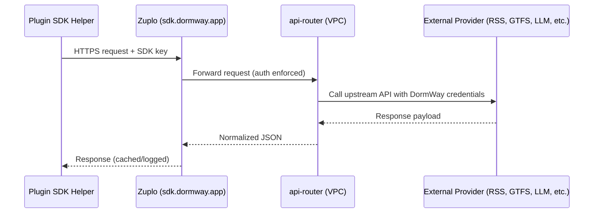

This document describes how plugin authors call third-party data providers without managing their own credentials. Traffic flows through `sdk.dormway.app`, a Zuplo-managed gateway that fronts the DormWay proxy services. Parsers that do not require external APIs (RSS, ICS, GTFS static) ship directly in the SDK and do not traverse this gateway.

## Architecture Overview

Key properties:

- **Zuplo-managed** domain (`sdk.dormway.app`) provides documentation, API key issuance, usage analytics, and rate limiting.
- Plugin runner ECS tasks and local developers use the same base URL; the bootloader injects credentials for the runner, while developers obtain personal keys.
- All proxy logic (scraping, ICS parsing, GTFS normalization, LLM calls via Portkey) lives in `api-router`. Zuplo simply forwards requests after enforcing policies.

## Authentication & Key Management

- **Service runtime**: The plugin runner microservice mounts a static SDK key from Secrets Manager (e.g., `SDK_PROXY_TOKEN`). Bootloader passes it to the SDK helpers via environment or config file.
- **Developer access**: Engineers request personal keys via Zuplo’s developer portal. Keys can be rotated or revoked without redeploying code.
- **Header format**: `Authorization: Bearer <sdk-key>`. SDK helpers inject this automatically.
- **Rate limiting**: Zuplo enforces per-key quotas (e.g., 60 requests/minute) and provides analytics dashboards for monitoring consumption.
- **IP restrictions**: Gateway restricts traffic to the DormWay VPC CIDR ranges plus approved VPN egress IPs for local testing.

## Built-in SDK Parsers (No Gateway Required)

- `sdk/rss` uses a bundled parser for RSS/Atom feeds (xml2js + sanitizer).
- `sdk/ics` parses ICS calendars locally via `ical.js`.
- `sdk/gtfs` provides helpers for GTFS static files (routes, stops, trips) using `gtfs-ts`.
  - Realtime feeds that require authenticated endpoints can optionally proxy through the gateway (see below), but offline GTFS consumes raw `.zip` files directly.

## Gateway Endpoint Catalog

| Endpoint | Purpose | Upstream |
| --- | --- | --- |
| `POST /v1/llm` | LLM completion routed through Portkey (OpenAI, Claude). | Portkey |
| `POST /v1/search/web` | Search aggregator (Exa, SerpAPI, etc.). | Search providers |
| `POST /v1/scrape/html` | Headless scrape via BrowserBase/ZenRows/Firecrawl. | Browser automation provider |
| `POST /v1/crawl/job` | Structured crawl for multi-page extraction. | Firecrawl/BrowserBase |
| `POST /v1/extract/structured` | Semantic extraction (LLM + schema). | Portkey |
| `POST /v1/ocr/image` | OCR for images/PDFs via AWS Textract or GCP Vision. | OCR providers |
| `GET /v1/geocode` | Forward geocoding (address -> lat/lng). | Geolocation provider |
| `GET /v1/reverse-geocode` | Reverse geocoding (lat/lng -> address). | Geolocation provider |
| `POST /v1/directions` | Transit/drive directions with travel times. | Maps/Transit API |
| `POST /v1/translate` | Text translation (multi-language). | Translation provider |
| `POST /v1/sentiment` | Optional sentiment/intent classification. | ML provider |
| `POST /v1/gtfs/realtime` | Credentialed GTFS-RT fetch for agencies requiring API keys. | GTFS RT provider |
| `GET /v1/fixtures/:family/:name` | Access canned fixtures for offline dev/tests. | Stored JSON |

All responses follow DormWay-defined schemas (documented in Zuplo). Errors include provider-specific metadata and a correlation id for log lookup.

## SDK Helper Mapping

| Helper | Endpoint | Notes |
| --- | --- | --- |
| `sdk/scrape.getHtml(request)` | `POST /v1/scrape/html` | Accepts `render=true` to trigger BrowserBase. |
| `sdk/search.runQuery(query)` | `POST /v1/search/web` | Returns normalized results with source scoring. |
| `sdk/llm.complete(prompt, options)` | `POST /v1/llm` | Portkey-proxied; exposes model aliases from DormWay policy. |
| `sdk/ocr.recognize(buffer, options)` | `POST /v1/ocr/image` | Handles PDF splitting and rate limits. |
| `sdk/geocode.lookup(address)` | `GET /v1/geocode` | Returns `{ latitude, longitude, precision }`. |
| `sdk/geocode.reverse(latlng)` | `GET /v1/reverse-geocode` | Normalized addresses. |
| `sdk/translate.text(input, targetLang)` | `POST /v1/translate` | Supports batch translation. |
| `sdk/gtfs.fetchRealtime(feedId)` | `POST /v1/gtfs/realtime` | Merges auth tokens, caches responses. |

Helpers automatically log usage (including Zuplo `x-zuplo-request-id`) and obey retry/backoff strategies defined by the proxy.

## Fixtures & Offline Development

- Set `DW_PLUGIN_USE_FIXTURES=true` to force helpers to load canned responses from `/v1/*/fixtures` endpoints or local JSON files.
- Fixture names align with examples (`rss/maizepages.json`, `ics/wolverine-lineup.json`, etc.) stored in the SDK package. Use `sdk/rss.useFixture("maizepages")` during unit tests.
- Bootloader respects the fixture flag during CI to avoid unnecessary external calls.

## Configuration Matrix

| Environment | Base URL | Key Source | Notes |
| --- | --- | --- | --- |
| Local dev | `https://sdk.dormway.app` | Developer-issued key (`~/.dormway/sdk-key`) | Optional fixtures toggle. |
| ECS runner | `https://sdk.dormway.app` | Secrets Manager (`SDK_PROXY_TOKEN`) | Injected into plugin env. |
| CI | `https://sdk.dormway.app` | Temporary key scoped to CI role | Prefer fixtures for repeatability. |

## Logging & Observability

- Zuplo logs all requests with key id, path, status code, latency.
- `api-router` emits structured logs including upstream provider latency and result counts.
- SDK helpers attach `x-plugin-id`, `x-target-id`, and `x-run-id` headers so backend logs can tie requests to manifest executions.

## TODO

- [ ] Publish OpenAPI spec through Zuplo developer portal.
- [ ] Implement automated key rotation reminders.
- [ ] Add rate limit headers (`X-RateLimit-Remaining`) to SDK responses.
- [ ] Provide example Jest mocks for each helper module.
