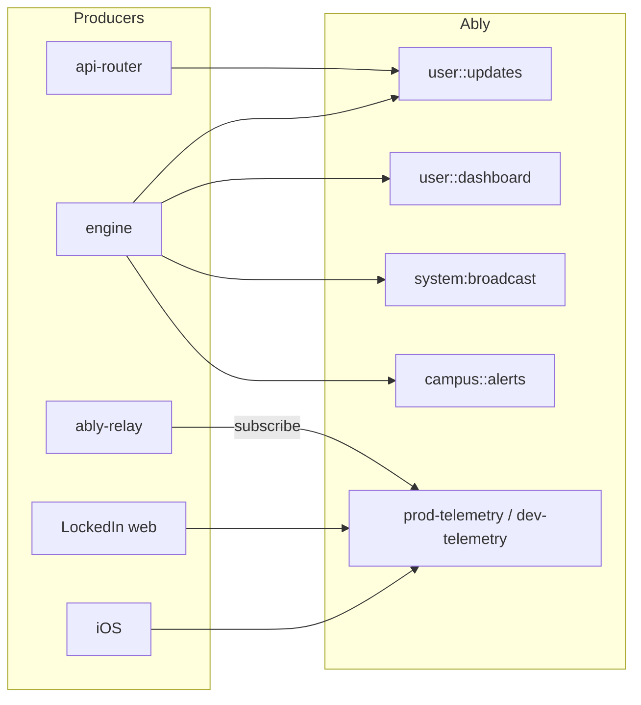
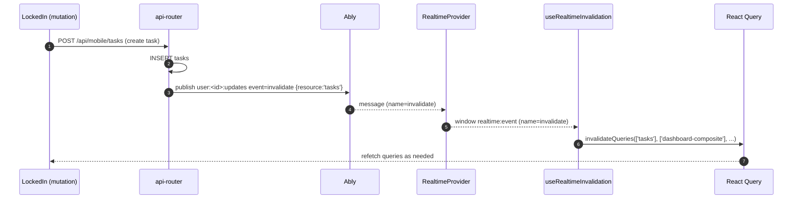
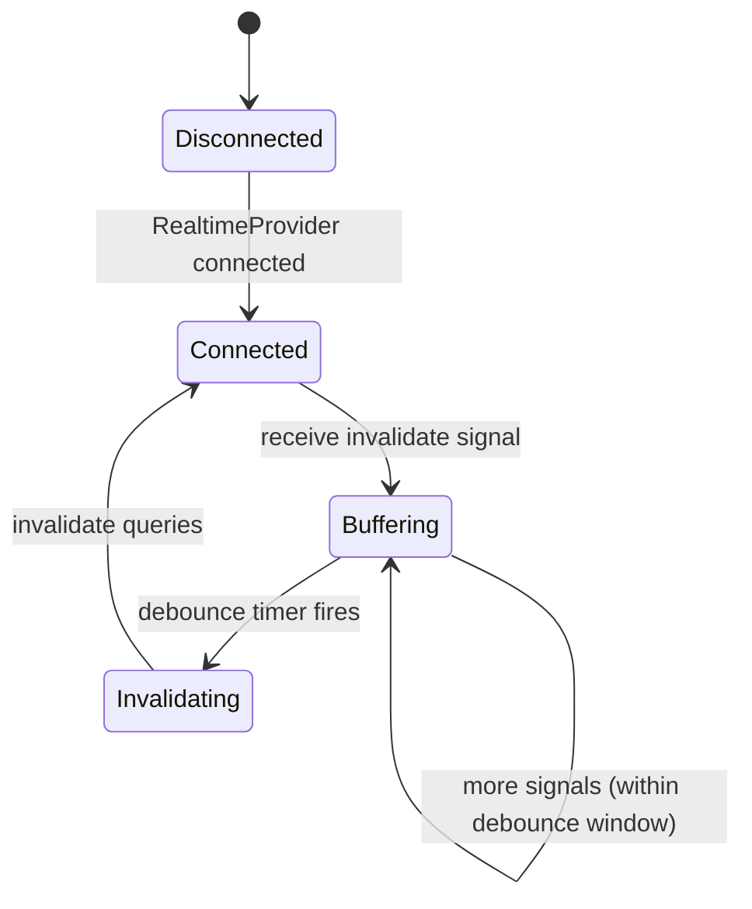
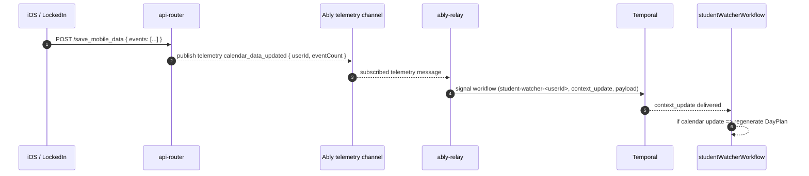

# Realtime Invalidation & Update Propagation Deep Dive (Current)

This doc explains how DormWay currently moves “something changed” signals from backend → clients, and when we use Ably for:

- **cache invalidation** (React Query refresh on LockedIn)
- **progress/toasts** (processing + dashboard updates)
- **telemetry ingestion** (client → Ably → Ably Relay → Temporal signals)

Related:

- [How DormWay Works](/docs/engineering/architecture/how-dormway-works)
- [Sharp Edges Tracker (Current)](/docs/engineering/architecture/sharp-edges-tracker-current)
- [DayPlan & Semester Summary Generation Deep Dive (Current)](/docs/engineering/technical/engine/dayplan-semester-summary-generation-deep-dive-current)
- `obsidian-vault/DormWay/Engineering/Technical/Realtime/Real-time Signal and Update Flows.md` (legacy/iOS-focused; some details drift)

Primary code references (current):

- Server invalidation publisher: `.repos/dormway-platform/services/api-router/src/services/ably-service.ts` (`publishInvalidation`, `publishInvalidationBatch`)
- Core channel naming: `.repos/dormway-platform/services/shared/dormway-core/src/adapters/realtime/ably.adapter.ts`
- LockedIn realtime bridge: `.repos/dormway-platform/services/dormway-lockedin/src/components/RealtimeProvider.tsx`
- LockedIn invalidation consumer: `.repos/dormway-platform/services/dormway-lockedin/src/hooks/useRealtimeInvalidation.ts`
- Ably Relay telemetry ingest: `.repos/dormway-platform/services/ably-relay/README.md`, `.repos/dormway-platform/services/ably-relay/src/services/relay-orchestrator.ts`

---

## 1) Mental model: two different realtime patterns

DormWay currently uses Ably in two primary patterns:

1) **Signal-based invalidation** (preferred for “data changed”)
   - Server publishes `invalidate` events to `user:<userId>:updates`
   - LockedIn listens and invalidates React Query keys → refetch
   - Payloads are intentionally tiny (no deltas)

2) **Informational events** (toasts / UX feedback)
   - Engine + API Router publish events like `dashboard.update`, `processing.*`, `dayplan.update`
   - LockedIn shows toast messages + logs to realtime debug UI
   - These do **not** automatically refetch unless also accompanied by an invalidation signal

---

## 2) Canonical channels and event names

Channel naming is centralized in `@dormway/core`’s Ably adapter:

- User channel (most events): `user:<userId>:updates`
- Dashboard delta channel (legacy): `user:<userId>:dashboard`
- Campus alerts: `campus:<campusId>:alerts`
- System broadcast: `system:broadcast`
- Telemetry: typically `prod-telemetry` / `dev-telemetry` (or `telemetry` in older deployments)

---

## 3) Backend → LockedIn: invalidation pipeline (the “Linear model”)

### 3.1 Server publish

Any server action that wants the frontend to refetch emits an invalidation signal:

- API Router: `publishInvalidation({ userId, resource, entityId? })`
  - publishes `event='invalidate'` on `user:<userId>:updates`
  - payload: `{ type: 'invalidate', resource, entityId?, context?, ts }`

### 3.2 LockedIn receive + refetch

LockedIn has a two-step bridge:

1) `RealtimeProvider` subscribes to `user:<userId>:updates` and dispatches each Ably message as a browser event:
   - `window.dispatchEvent(new CustomEvent('realtime:event', { detail: { channel, name, data } }))`
2) `useRealtimeInvalidation` listens for `realtime:event`, filters `name === 'invalidate'`, then invalidates React Query keys.

### 3.3 Debounce + dedupe (client-side)

`useRealtimeInvalidation` batches rapid signals (default ~100ms) and deduplicates by `(resource, entityId, ts)`.

---

## 4) Telemetry → Engine: “ingest and react” pipeline

This is a different pattern: the client publishes telemetry events to a telemetry channel; **Ably Relay** subscribes and routes them into Temporal signals / DB writes.

Example: mobile calendar upload via API Router triggers a telemetry event (`calendar_data_updated`) on the telemetry channel, which downstream systems can interpret as “calendar changed”.

---

## 5) Where invalidations exist today (and where they don’t)

### 5.1 Confirmed invalidations emitted (API Router)

Current concrete publishers:

- Task CRUD emits invalidations:
  - `resource='tasks'` (and sometimes `resource='schedule'`)
  - `.repos/dormway-platform/services/api-router/src/routes/task-routes.ts`
- Dashboard notify endpoint emits:
  - `resource='dashboard'` (when etag changed)
  - `.repos/dormway-platform/services/api-router/src/routes/dashboard-routes.ts` (`POST /dashboard/v1/notify/dayplan`)

### 5.2 Invalidation coverage (resolved)

~~Several backend processes publish *informational* events (`dashboard.update`, etc.) but do not publish invalidation signals, so LockedIn won't refetch automatically.~~

**Resolved (2025-12-26):** All major backend processes now emit proper invalidation signals:

- Schedule reconciliation (`scheduleProcessor`) now emits `invalidate(schedule|dashboard)` alongside `dashboard.update`.
- Canvas ICS sync now emits invalidations when `student_time_blocks` change.
- Invalidation mapping between server resources and LockedIn consumers has been unified (SE-010/DORM-785 resolved).
- Canvas realtime channels now use a consistent naming pattern (DORM-793 resolved).
- Background sync operations now properly trigger plan regeneration when underlying data changes (SE-018/DORM-792 resolved).

---

## 6) Resolved sharp edges (for historical reference)

The following issues have been resolved as of 2025-12-26:

- ~~Invalidation mapping drift between server resources and LockedIn consumers~~: **Resolved** (SE-010/DORM-785)
- ~~Canvas realtime channel drift~~: **Resolved** (DORM-793)
- ~~Background sync updates underlying data without forcing plan regeneration~~: **Resolved** (SE-018/DORM-792)

---

## 7) Debugging checklist (fast path)

- In LockedIn, open the realtime debug view to confirm messages are arriving (and which channel/event name they use).
- If the UI isn’t updating, check whether you received an `invalidate` event or only an informational `dashboard.update` toast.
- For telemetry-driven behavior, confirm the message is on the configured telemetry channel (`prod-telemetry` vs `dev-telemetry` vs `telemetry`) and that Ably Relay is running/subscribed.
