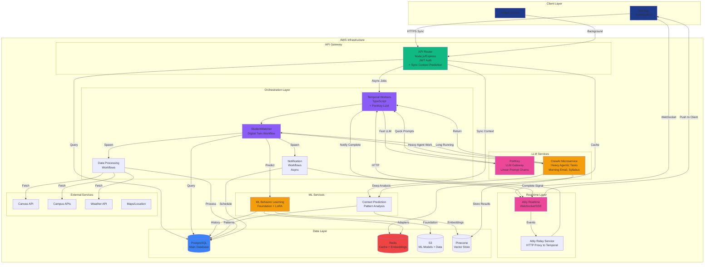
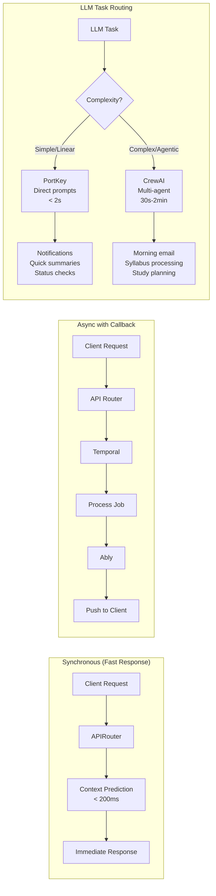
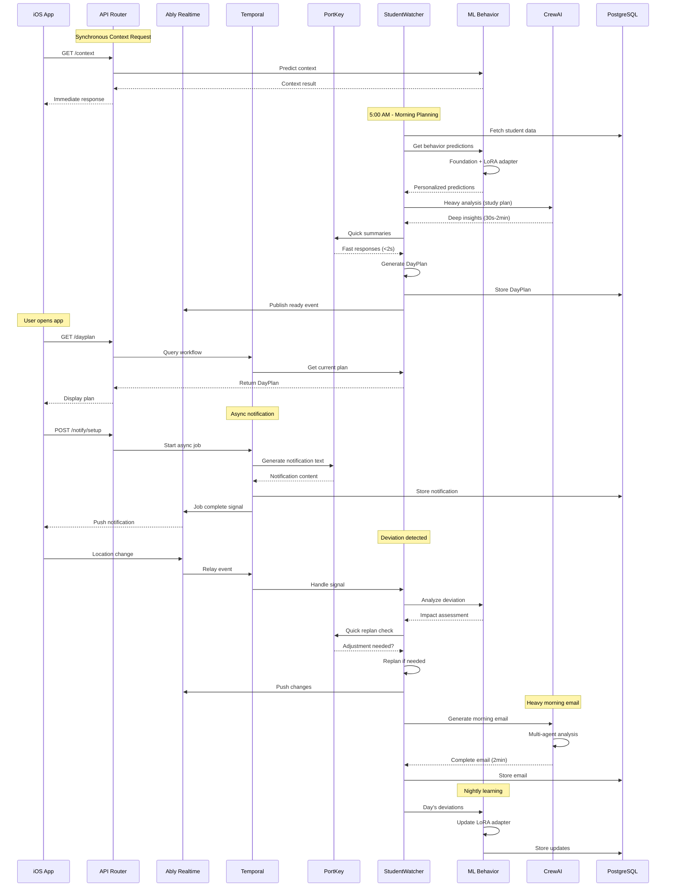
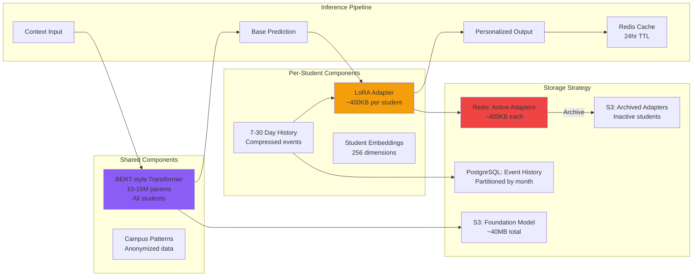

# StudentWatcher Digital Twin - Complete Implementation Guide

## Current Status

**Infrastructure Migration Status**: ✅ COMPLETE (August 13, 2025)
- Auth0 authentication fully operational
- AWS Aurora database migration complete
- S3 storage and CloudFront CDN configured
- All services connected and verified

**StudentWatcher Implementation**: 🚀 READY TO BEGIN
- Infrastructure prerequisites complete
- Development focus now shifts to Digital Twin implementation
- Estimated timeline: 3-week sprint

## Executive Summary

The StudentWatcher represents a paradigm shift from reactive management to a proactive "digital twin" that continuously mirrors the student's daily life. This production-ready implementation creates a comprehensive system that provides compelling experiences for both new students (with zero data) and established users (with rich historical data).

**Key Innovation**: Rather than simply reacting to events, the StudentWatcher proactively plans entire days during morning planning at 5am, creating intelligent timelines that merge time blocks, calendar events, context predictions, and campus opportunities.

**Production Advantage**: Since we have no existing users to migrate, this represents a clean-slate implementation using optimal architecture patterns from day one.

## Core Concept: Digital Twin Architecture

The StudentWatcher acts as a server-side mirror of the student, maintaining continuous awareness of their daily patterns, preferences, and context. Rather than simply reacting to events, it proactively plans and anticipates needs throughout the day.

### Key Principles
- **Proactive Planning**: Plans the entire day during morning planning
- **State Awareness**: Maintains current activity context for intelligent responses
- **Progressive Learning**: Builds understanding over time while providing immediate value
- **Graceful Degradation**: Delivers compelling experiences even with minimal data
- **Clean Implementation**: No legacy baggage - optimal patterns from the start

## Architecture Overview

### Complete System Architecture



### Processing Patterns



### Data Flow Architecture



### ML Behavior Learning Integration



### LLM Service Patterns

#### PortKey (Fast, Linear Prompts)
**Use Cases**: Quick, deterministic tasks requiring simple prompt chains
- **Response Time**: < 2 seconds
- **Execution**: Direct in Temporal workers
- **Examples**:
  - Notification text generation
  - Quick status summaries
  - Simple decision logic
  - Template-based responses
  - Entity extraction

#### CrewAI (Heavy Agentic Work)
**Use Cases**: Complex, multi-step analysis requiring agent collaboration
- **Response Time**: 30 seconds - 2 minutes
- **Execution**: Separate microservice
- **Examples**:
  - Morning email composition (multiple data sources)
  - Syllabus processing (document analysis)
  - Study plan generation (complex reasoning)
  - Weekly reviews (data aggregation)
  - Academic advising (multi-factor analysis)

#### Context Prediction (Synchronous ML)
**Use Cases**: Real-time context awareness
- **Response Time**: < 200ms
- **Execution**: Direct in API Router
- **Examples**:
  - Current activity detection
  - Location-based context
  - Time-based patterns
  - User state inference

### LLM Service Patterns

#### PortKey (Fast, Linear Prompts)
**Use Cases**: Quick, deterministic tasks requiring simple prompt chains
- **Response Time**: < 2 seconds
- **Execution**: Direct in Temporal workers
- **Examples**:
  - Notification text generation
  - Quick status summaries
  - Simple decision logic
  - Template-based responses
  - Entity extraction

#### CrewAI (Heavy Agentic Work)
**Use Cases**: Complex, multi-step analysis requiring agent collaboration
- **Response Time**: 30 seconds - 2 minutes
- **Execution**: Separate microservice
- **Examples**:
  - Morning email composition (multiple data sources)
  - Syllabus processing (document analysis)
  - Study plan generation (complex reasoning)
  - Weekly reviews (data aggregation)
  - Academic advising (multi-factor analysis)

#### Context Prediction (Synchronous ML)
**Use Cases**: Real-time context awareness
- **Response Time**: < 200ms
- **Execution**: Direct in API Router
- **Examples**:
  - Current activity detection
  - Location-based context
  - Time-based patterns
  - User state inference
### System Layers (Clear Separation of Concerns)

#### 1. Data Aggregation Layer
**Purpose**: "What is happening?"
- **TelemetryService**: Raw signal collection from iOS app
- **DataCollectionCoordinator**: Manages all data collectors
- **Temporal Activities**: Database queries and external API fetches
- **Data Sources**: HealthKit, Location, Calendar, Screen Time, Campus APIs

#### 2. Data Analysis Layer  
**Purpose**: "What does it mean?"
- **Context Prediction ML**: Pattern analysis and behavioral predictions
- **CrewAI Agents**: Deep analysis for study planning and wellness
- **Schedule Processor**: Converts calendar events to time blocks
- **Campus Data Processor**: Enriches events with location and relevance data

#### 3. AI Planning Layer (StudentWatcher)
**Purpose**: "What should we do about it?"
- **Morning Planning**: Daily scoring workflow
- **Signal Handlers**: Real-time event response
- **State Management**: Current activity tracking and adjustments
- **Child Workflow Spawning**: Delegates specific tasks to specialized workflows

#### 4. Presentation Layer
**Purpose**: "How do we help the student?"
- **iOS App**: Displays planned content and recommendations
- **Widget System**: Shows current state and upcoming activities
- **Notification Engine**: Delivers scheduled messages at optimal times

## The DayPlan - Daily Planning Format

The DayPlan represents a comprehensive plan for the student's day - containing all activities, priorities, and scheduled actions that the StudentWatcher manages throughout the day.

### Core Structure

#### Current JSON Schema (October 2025)

```typescript
interface DayPlan {
  // Metadata
  planId: string;
  studentId: string;
  date: string;          // YYYY-MM-DD
  timezone: string;      // IANA tz (e.g. "America/Detroit")
  version: number;
  generatedAt: string;   // ISO timestamp with offset
  lastUpdated: string;   // ISO timestamp with offset

  // Primary content
  events: TimelineEvent[];
  actions: ScheduledAction[];
  dayFlow: DayFlow;
  metrics: PlanMetrics;

  // Live workflow state
  currentState: {
    currentEventId?: string;
    lastDeviationCheck?: string;
    activeDeviations: Deviation[];
  };

  // Optional enrichments
  weather?: any;
  notificationContent?: NotificationCopy;

  // Semester + Canvas enrichments (present only when data exists)
  semester_milestones?: SemesterMilestoneCard[];
  peak_week_alerts?: PeakWeekAlert[];
  cross_course_synergies?: CrossCourseSynergyCard[];
  early_warnings?: EarlyWarningCard[];
  schedule_conflicts?: ScheduleConflictCard[];
  canvas_recommendations?: CanvasRecommendationCard[];
  canvas_summary_intro?: string;
}

interface TimelineEvent {
  id: string;
  startTime: string;
  endTime: string;
  type: 'class' | 'study' | 'meal' | 'transit' | 'social' | 'work' | 'exercise' | 'rest' | 'free';
  priority: 1 | 2 | 3 | 4; // LOW → CRITICAL
  source: 'calendar' | 'prediction' | 'campus' | 'default' | 'user';
  confidence: number; // 0-1
  metadata: {
    title?: string;
    location?: string;
    courseName?: string;
    description?: string;
    isRecurring?: boolean;
    suggestions?: string[];
  };
}

interface ScheduledAction {
  id: string;
  actionTime: string;
  actionType: 'notification' | 'widget_update' | 'data_refresh' | 'context_check';
  delivery: 'subtle' | 'normal' | 'prominent';
  payload: any;
  executed?: boolean;
  executedAt?: string;
}

interface DayFlow {
  overallPace: 'slow' | 'moderate' | 'busy' | 'intense';
  energyCurve: Array<{ time: string; energy: number }>;
  stressPoints: Array<{ time: string; reason: string; intensity: number }>;
}

interface PlanMetrics {
  completeness: number;
  confidence: number;
  dataQuality: {
    hasSchedule: boolean;
    hasCalendar: boolean;
    hasPredictions: boolean;
    hasPreferences: boolean;
  };
}

interface Deviation {
  id: string;
  detectedAt: string;
  type: 'schedule_change' | 'location_anomaly' | 'weather' | 'campus_event' | 'user_action';
  description: string;
  severity?: 'low' | 'medium' | 'high' | 'critical';
  metadata?: any;
  handled: boolean;
  adjustment?: string;
}

interface NotificationCopy {
  pushNotification: {
    title: string;
    body: string;
    emoji?: string;
  };
  emailContent?: {
    subjectLine: string;
    preheader: string;
    greeting: string;
    openingLine: string;
    daySummary: string;
    keyMoments: string[];
    personalInsight: string;
    closingNote: string;
  };
  highlights?: string[];
  motivationalNote?: string;
}
```

*Extended enrichment objects*: the Temporal activity `enrichPlanWithSemesterInsights` appends the Canvas and semester arrays shown above. Each card is sanitized against the enrolled-course key set, so only real course IDs propagate to Customer.io or dormway-admin. The canonical shapes live alongside the TypeScript types:

- `CanvasRecommendationCard` → `title`, `course`, `due_display`, `due_iso`, `estimated_minutes`, `urgency_label`, `segments[]`, optional `focus`/`canvas_url`.
- `SemesterMilestoneCard` → `title`, `formatted_date`, `success_criteria[]`.
- `PeakWeekAlert` → `formatted_start`, `intensity_score`, `focus_summary`, `mitigation_strategies[]`.
- `CrossCourseSynergyCard` → `courses[]`, `description`, optional `actionableStrategy` / `timingRecommendation`.
- `EarlyWarningCard` → `message`, `recommended_actions[]`.
- `ScheduleConflictCard` → `description`, optional `start` / `end` / `impact`.

The enrichments are optional; API clients should treat them as nullable arrays.

#### Legacy Reference (pre-August 2025 schema)

```typescript
interface DayPlanLegacy {
  studentId: string;
  date: string;
  timezone: string;
  version: number;
  composedAt: string;
  segments: DaySegment[];
  events: TimelineEvent[];
  actions: ScheduledAction[];
  dayFlow: DayFlowLegacy;
  patterns: DayPatterns;
  planMetrics: PlanMetricsLegacy;
}

interface DaySegment {
  name: 'morning' | 'afternoon' | 'evening' | 'night';
  startTime: string;
  endTime: string;
  pace: 'slow' | 'moderate' | 'busy' | 'intense';
  focus: 'academic' | 'social' | 'personal' | 'rest';
}

interface DayFlowLegacy {
  overallPace: 'relaxed' | 'moderate' | 'busy' | 'hectic';
  energyCurve: Array<{ time: string; energy: number }>;
  stressPoints: Array<{ time: string; reason: string; intensity: number }>;
  restPoints: Array<{ time: string; duration: number }>;
}

interface PlanMetricsLegacy {
  completeness: number;
  confidence: number;
  coverage: number;
  complexity: number;
  dataQuality: {
    hasSchedule: boolean;
    hasCalendar: boolean;
    hasPredictions: boolean;
    hasPreferences: boolean;
    lastUpdated: string;
  };
}
```

*Historical note*: legacy plans included `segments`, `patterns`, and additional metrics fields. The current implementation dropped these in favor of streamlined storage plus derived presentation layers.

### Example Day Plans

#### Sample DayPlan (October 2025)
```json
{
  "planId": "7779217b-e440-4a90-87fb-39b9f7d76610",
  "studentId": "06ea6226-c327-483b-9bc6-e554af6a22a1",
  "date": "2025-10-07",
  "timezone": "America/Detroit",
  "version": 1,
  "generatedAt": "2025-10-07T20:09:01.262Z",
  "lastUpdated": "2025-10-07T20:09:01.262Z",
  "events": [
    {
      "id": "83f1371e-f1af-4cef-8f82-70363335d882",
      "startTime": "2025-10-07T07:00:00-04:00",
      "endTime": "2025-10-07T08:00:00-04:00",
      "type": "rest",
      "priority": 1,
      "source": "prediction",
      "confidence": 0.9,
      "metadata": {
        "title": "Wake up and get ready"
      }
    },
    {
      "id": "3c79f210-27fc-4eb6-a874-54258969106c",
      "startTime": "2025-10-07T11:30:00-04:00",
      "endTime": "2025-10-07T13:00:00-04:00",
      "type": "class",
      "priority": 3,
      "source": "calendar",
      "confidence": 1,
      "metadata": {
        "title": "DIGITAL 202 – Digital Culture",
        "location": "BSB1060",
        "courseName": "DIGITAL 202"
      }
    }
  ],
  "actions": [
    {
      "id": "b1a218bd-bc97-4d6e-a9fb-a94d4de7197b",
      "actionTime": "2025-10-07T11:15:00-04:00",
      "actionType": "notification",
      "delivery": "prominent",
      "payload": {
        "title": "Class Reminder",
        "message": "Your DIGITAL 202 class starts in 15 minutes.",
        "originalType": "class_reminder",
        "relatedEventId": "event-id-for-digital-202"
      }
    }
  ],
  "dayFlow": {
    "overallPace": "moderate",
    "energyCurve": [
      { "time": "07:00AM", "energy": 40 },
      { "time": "10:00AM", "energy": 90 },
      { "time": "02:00PM", "energy": 60 },
      { "time": "06:00PM", "energy": 70 },
      { "time": "10:00PM", "energy": 30 }
    ],
    "stressPoints": [
      {
        "time": "8:00AM - 11:30AM",
        "reason": "Back-to-back study sessions for COMM 230 worksheets before the first class. This requires sustained focus.",
        "intensity": 6
      }
    ]
  },
  "metrics": {
    "completeness": 1,
    "confidence": 0.8,
    "dataQuality": {
      "hasSchedule": true,
      "hasCalendar": true,
      "hasPredictions": false,
      "hasPreferences": true
    }
  },
  "currentState": {
    "activeDeviations": []
  },
  "weather": {
    "current": {
      "temperature": 60.42,
      "conditions": "overcast clouds"
    },
    "forecast": {
      "temp_max": 59.54,
      "temp_min": 59.54,
      "main": "light rain"
    }
  },
  "notificationContent": {
    "pushNotification": {
      "title": "📚 Focused Study Day & Digital Culture Exploration!",
      "body": "Good morning! Today you have two classes and dedicated study blocks for your COMM 230 worksheets.",
      "emoji": "📚"
    },
    "emailContent": {
      "subjectLine": "Your Tuesday: Classes, Study Sessions & Digital Culture Insights 💡",
      "preheader": "A productive day with focused work on your COMM 230 assignments.",
      "greeting": "Good morning!",
      "openingLine": "Today shapes up to be a productive day with a good balance of classes and focused study time.",
      "daySummary": "You have two classes today: DIGITAL 202 at 11:30 AM and ENTR 490 at 3:30 PM. You'll also dedicate significant time to your COMM 230 worksheets.",
      "keyMoments": [
        "11:30 AM - DIGITAL 202 – Digital Culture in BSB1060",
        "3:30 PM - ENTR 490 – Spec Topics Entr (Lecture) in DOW1206"
      ],
      "personalInsight": "You have a solid block of study time in the afternoon."
    },
    "highlights": [
      "Dedicated study blocks for COMM 230 worksheets",
      "Two classes: DIGITAL 202 and ENTR 490"
    ],
    "motivationalNote": "You've got this! Use those study blocks effectively to get ahead on your COMM 230 work."
  },
  "canvas_summary_intro": "Canvas shows 2 assignments due soon. Let's split the work across today and tomorrow.",
  "canvas_recommendations": [
    {
      "title": "Product Selection Worksheet",
      "course": "COMM 404 — COMM 230 — COMM 230 — 230 — 001",
      "due_display": "Oct 9, 8:00 PM",
      "due_iso": "2025-10-10T00:00:00.000Z",
      "estimated_minutes": 90,
      "urgency_label": "due in 3 days",
      "segments": [
        { "timing": "today afternoon", "minutes": 60 },
        { "timing": "tomorrow afternoon", "minutes": 30 }
      ],
      "focus": "Use the suggested blocks to move this deliverable forward."
    }
  ],
  "cross_course_synergies": [
    {
      "courses": ["DIGITAL-202/AMCULT-202", "COMM 230-001"],
      "description": "Gain a holistic understanding of how advertising shapes and is shaped by digital culture.",
      "actionableStrategy": "Use COMM 230 media strategy concepts when drafting your DIGITAL 202 final paper."
    }
  ]
}
```

The example above captures the persisted record **after** enrichment and guardrail passes. Treat enrichment arrays as optional and reference `metrics.dataQuality` when tailoring client behavior.

### DayPlan Operations

The simplified StudentWatcher workflow treats the DayPlan as the single source of truth. Key runtime behaviours:

- **Daily regeneration (05:00 local)** – At the top of the morning loop StudentWatcher always regenerates the plan, re-running `scheduleProcessor`, `processSemester`, and `generateDayPlan`. If preferences permit, the Customer.io email is sent immediately after persistence (`generateMorningPlan`).
- **Sequential refresh cadence (hourly)** – Every hour the workflow first reconciles calendars (`scheduleProcessor`) when the previous sync is older than six hours, then immediately triggers an on-demand Canvas sync under the same freshness guard. Both timestamps (`lastCalendarSyncAt`, `lastCanvasSyncAt`) are saved alongside the plan so subsequent runs respect the cooldown.
- **Signal-driven updates** – Calendar, preference, and manual “generate plan” signals all call the same `generateMorningPlan` helper. Mutex guards prevent overlapping regenerations, and the helper enforces a two-minute cooldown unless `forceRegenerate` is set.
- **Notification scheduling** – After each successful regeneration we recompute scheduled actions and persist metadata in `workflow_state`, ensuring downstream workers (push/email) have the correct context.
- **State persistence** – `workflowStateData` tracks the current plan id, sync timestamps, deviation context, and notification history. Any regeneration or sync updates these fields before the workflow resumes its 5‑minute sleep loop.

### Benefits of the DayPlan Approach

1. **Comprehensive Planning**: Complete view of the day's activities and priorities
2. **Flexible Structure**: Can represent both fixed schedules (high confidence) and flexible suggestions (low confidence)
3. **Progressive Enhancement**: Plan quality improves as more data becomes available
4. **Performance Tracking**: Easy to measure how well the plan matched reality
5. **Version Control**: Plans can be updated throughout the day as new information arrives

This DayPlan format becomes the canonical representation of a day's plan, stored in the database, passed between workflows, and consumed by the iOS app for display.

## LLM-Powered Day Plan Generation

### How Day Plans Are Created

The Day Plan creation happens during the **5am Morning Planning workflow**, using a sophisticated multi-stage approach that combines data aggregation with LLM reasoning:

#### Data Collection Phase (Parallel Fetching)
```typescript
const [profile, timeBlocks, calendar, predictions, campus, city] = 
  await Promise.all([
    activities.getStudentProfile(studentId),
    activities.getTimeBlocks(studentId),      // Class schedule
    activities.getCalendarEvents(studentId),   // Personal events
    activities.getContextPredictions(studentId), // ML predictions
    activities.getCampusEvents(studentId),     // Campus activities
    activities.getCityContext(studentId)       // Weather, local events
  ]);
```

#### LLM Planning Process

The LLM (via CrewAI agents) takes comprehensive inputs to create an intelligent day plan:

**Inputs to the LLM:**
- **Historical Patterns**: Past behavior, study habits, meal times, sleep cycles
- **Fixed Commitments**: Classes (TimeBlocks), calendar events, deadlines
- **ML Predictions**: Activity predictions based on behavioral patterns
- **Environmental Context**: Weather, campus events, local happenings
- **User Preferences**: Study preferences, social interests, wellness goals
- **Energy Models**: Expected energy levels and optimal productivity windows
- **Academic Load**: Assignment due dates, exam schedules, project milestones

```typescript
async function generateDayPlanWithLLM(inputs: PlanningInputs): Promise<DayPlan> {
  const prompt = `
    Create a comprehensive day plan for student ${inputs.studentId}
    Date: ${inputs.date}
    
    Fixed Commitments:
    - Classes: ${JSON.stringify(inputs.timeBlocks)}
    - Calendar: ${JSON.stringify(inputs.calendarEvents)}
    - Deadlines: ${JSON.stringify(inputs.deadlines)}
    
    Context:
    - Weather: ${inputs.weather.conditions}, ${inputs.weather.temperature}°F
    - Campus Events: ${inputs.campusEvents.length} events available
    - Energy Prediction: ${inputs.energyModel.peakHours}
    
    Historical Patterns:
    - Usual wake time: ${inputs.patterns.wakeTime}
    - Preferred study times: ${inputs.patterns.studyTimes}
    - Meal preferences: ${inputs.patterns.mealTimes}
    - Social activity level: ${inputs.patterns.socialScore}/10
    
    Today's Goals:
    - Academic: ${inputs.goals.academic}
    - Wellness: ${inputs.goals.wellness}
    - Social: ${inputs.goals.social}
    
    Generate a timeline that:
    1. Respects all fixed commitments with appropriate buffer time
    2. Optimizes activities for predicted energy levels
    3. Includes realistic transition times between locations
    4. Suggests study blocks aligned with upcoming deadlines
    5. Incorporates wellness activities (meals, exercise, breaks)
    6. Leaves flexibility for spontaneous activities (30% unscheduled)
    7. Considers weather impact on outdoor activities
    8. Balances academic, social, and personal time
    
    Output format: Structured DayPlan JSON
  `;
  
  const llmResponse = await crewAI.dayPlanningCrew.execute({
    prompt,
    agents: ['scheduling_agent', 'wellness_agent', 'academic_agent'],
    temperature: 0.7  // Some creativity but mostly deterministic
  });
  
  return validateAndEnhancePlan(llmResponse);
}
```

### Handling Deviations During the Day

The system responds intelligently when users deviate from the planned schedule:

#### Real-time Deviation Detection
```typescript
setHandler(contextUpdateSignal, async (update: ContextUpdate) => {
  const plannedActivity = getCurrentPlannedActivity(state.dayPlan);
  const actualActivity = detectActivityFromContext(update);
  
  const deviation = analyzeDeviation(plannedActivity, actualActivity);
  
  if (deviation.significance > 0.3) {
    await handleDeviation(state, deviation);
  }
});
```

#### Deviation Response (Current)

- **Minor adjustments** (location/timing drift) – we simply log the event and rely on the next morning’s `deviationContext` to nudge the LLM.
- **Calendar changes** – handled via the calendar signal path; regeneration flows through `generateMorningPlan` so the same guardrails apply.
- **Critical events** – the product currently prefers manual intervention; no emergency crew workflows remain.

The long-term plan is to reintroduce lightweight heuristics for repeated deviations, but that work is still pending.

## Clean Implementation Architecture

## Clean Implementation Architecture

- **StudentWatcher workflow** – Long-running Temporal workflow that regenerates the DayPlan at 05:00 local time, consumes signals, and runs hourly calendar/Canvas refreshes with six-hour freshness guards.
- **Supporting activities** – `scheduleProcessor`, `processSemester`, and `generateDayPlan` form the deterministic pipeline before each plan is persisted. `enrichPlanWithSemesterInsights` attaches sanitized semester data and schedules Canvas reminders.
- **State persistence** – `workflow_state` stores the current plan id, sync timestamps, deviation context, and notification history; `service_data.dayplan` stores the full JSON payload per day.
- **Downstream fan-out** – Ably pushes realtime updates; Customer.io email and push content are rendered from the persisted plan via `prepareDayPlanEmailData` and the `actions` array.
