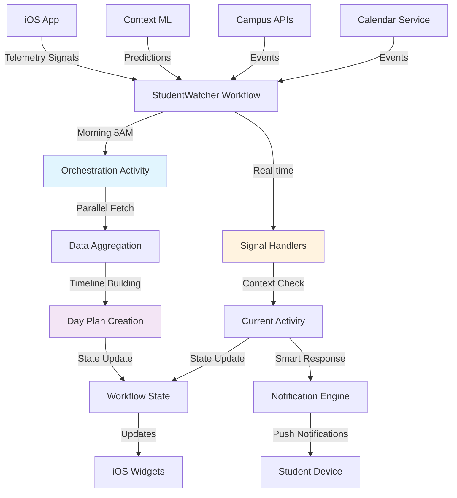

# StudentWatcher Morning Orchestration - Implementation Guide

## Executive Summary

The StudentWatcher evolves from a reactive orchestrator to a proactive "digital twin" that mirrors the student's day. This system implements morning orchestration that runs daily at approximately 5am to plan the entire day ahead, creating a comprehensive timeline that merges time blocks, calendar events, context predictions, and campus events.

The key innovation is providing a compelling experience even for new students with no historical data, using intelligent defaults and progressive discovery to build engagement from day one.

## Core Concept: Digital Twin Architecture

The StudentWatcher acts as a server-side mirror of the student, maintaining continuous awareness of their daily patterns, preferences, and context. Rather than simply reacting to events, it proactively plans and anticipates needs throughout the day.

### Key Principles
- **Proactive Planning**: Plans the entire day during morning orchestration
- **State Awareness**: Maintains current activity context for intelligent responses
- **Progressive Learning**: Builds understanding over time while providing immediate value
- **Graceful Degradation**: Delivers compelling experiences even with minimal data

## Architecture Overview

### System Layers (Clear Separation of Concerns)

#### 1. Data Aggregation Layer
**Purpose**: "What is happening?"
- **TelemetryService**: Raw signal collection from iOS app
- **DataCollectionCoordinator**: Manages all data collectors
- **Temporal Activities**: Database queries and external API fetches
- **Data Sources**: HealthKit, Location, Calendar, Screen Time, Campus APIs

#### 2. Data Analysis Layer  
**Purpose**: "What does it mean?"
- **Context Prediction ML**: Pattern analysis and behavioral predictions
- **CrewAI Agents**: Deep analysis for study planning and wellness
- **Schedule Processor**: Converts calendar events to time blocks
- **Campus Data Processor**: Enriches events with location and relevance data

#### 3. AI Orchestration Layer (StudentWatcher)
**Purpose**: "What should we do about it?"
- **Morning Orchestration**: Daily planning workflow
- **Signal Handlers**: Real-time event response
- **State Management**: Current activity tracking and adjustments
- **Child Workflow Spawning**: Delegates specific tasks to specialized workflows

#### 4. Presentation Layer
**Purpose**: "How do we help the student?"
- **iOS App**: Displays orchestrated content and recommendations
- **Widget System**: Shows current state and upcoming activities
- **Notification Engine**: Delivers orchestrated messages at optimal times

## Morning Orchestration Implementation

### Data Model

```typescript
interface DayPlan {
  studentId: string;
  date: string; // ISO date string
  timezone: string;
  timeline: TimelineEvent[];
  contextTransitions: ContextTransition[];
  scheduledActions: ScheduledAction[];
  currentState: StudentState;
  confidence: TimeConfidence[];
  metadata: {
    dataSourcesUsed: string[];
    orchestrationDuration: number;
    confidenceScore: number;
  };
}

interface TimelineEvent {
  id: string;
  startTime: Date;
  endTime: Date;
  type: 'class' | 'study' | 'meal' | 'transit' | 'free' | 'sleep' | 'work' | 'social' | 'exercise';
  source: 'calendar' | 'timeblock' | 'prediction' | 'campus_event' | 'default' | 'historical';
  confidence: number; // 0.0 to 1.0
  priority: number; // 1-10, higher = more important
  metadata: {
    location?: string;
    courseName?: string;
    eventId?: string;
    isRecurring?: boolean;
    optional?: boolean;
    description?: string;
    preparationTime?: number; // minutes needed before event
  };
}

interface ContextTransition {
  time: Date;
  fromContext: string;
  toContext: string;
  confidence: number;
  triggerEvents: string[];
}

interface ScheduledAction {
  id: string;
  scheduledTime: Date;
  type: 'notification' | 'data_collection' | 'analysis' | 'reminder';
  payload: any;
  conditions?: string[]; // conditions that must be met
}

interface StudentState {
  currentActivity: string;
  location?: string;
  confidence: number;
  lastUpdated: Date;
  nextTransition?: Date;
}

interface TimeConfidence {
  timeRange: { start: Date; end: Date };
  confidence: number;
  reason: string;
}
```

### Morning Orchestration Activity

```typescript
export async function performMorningOrchestration(
  studentId: string,
  date: string,
  timezone: string
): Promise<DayPlan> {
  const startTime = Date.now();
  
  try {
    // 1. Gather all data sources in parallel
    const [
      timeBlocks,
      calendarEvents,
      contextPredictions,
      campusEvents,
      historicalPatterns,
      studentProfile
    ] = await Promise.all([
      fetchTimeBlocks(studentId, date),
      fetchCalendarEvents(studentId, date),
      fetchContextPredictions(studentId, date),
      fetchCampusEvents(studentId, date), 
      fetchHistoricalPatterns(studentId, date),
      fetchStudentProfile(studentId)
    ]);

    // 2. Build comprehensive timeline with precedence rules
    const timeline = buildTimeline({
      timeBlocks,
      calendarEvents, 
      contextPredictions,
      campusEvents,
      historicalPatterns,
      date,
      timezone
    });

    // 3. Identify context transitions and free time
    const contextTransitions = identifyContextTransitions(timeline);
    const freeTimeSlots = identifyFreeTime(timeline);

    // 4. Schedule proactive actions
    const scheduledActions = scheduleProactiveActions(
      timeline,
      contextTransitions,
      studentProfile
    );

    // 5. Create day plan
    const dayPlan: DayPlan = {
      studentId,
      date,
      timezone,
      timeline,
      contextTransitions,
      scheduledActions,
      currentState: {
        currentActivity: 'sleep',
        confidence: 0.9,
        lastUpdated: new Date(),
        nextTransition: timeline[0]?.startTime
      },
      confidence: calculateTimeConfidence(timeline),
      metadata: {
        dataSourcesUsed: [
          timeBlocks.length > 0 ? 'timeblocks' : null,
          calendarEvents.length > 0 ? 'calendar' : null,
          contextPredictions.length > 0 ? 'predictions' : null,
          campusEvents.length > 0 ? 'campus' : null,
          historicalPatterns.length > 0 ? 'historical' : null
        ].filter(Boolean),
        orchestrationDuration: Date.now() - startTime,
        confidenceScore: calculateOverallConfidence(timeline)
      }
    };

    // 6. Handle cold-start scenarios
    if (isNewStudent(studentProfile)) {
      dayPlan = enhanceForColdStart(dayPlan, campusEvents);
    }

    return dayPlan;

  } catch (error) {
    // Graceful degradation with default schedule
    return createDefaultDayPlan(studentId, date, timezone);
  }
}
```

### Timeline Building Logic

The timeline builder merges multiple data sources with clear precedence rules:

1. **Time Blocks** (0.95 confidence) - Highest priority, student-defined schedule
2. **Calendar Events** (0.85 confidence) - Can override predictions but not time blocks  
3. **Context Predictions** (0.60-0.80 confidence) - Fill gaps between known events
4. **Campus Events** (0.50 confidence) - Optional activities based on interests
5. **Historical Patterns** (0.40 confidence) - Fallback based on past behavior
6. **Default Activities** (0.30 confidence) - Meal times, sleep, basic structure

```typescript
function buildTimeline(sources: DataSources): TimelineEvent[] {
  const events: TimelineEvent[] = [];
  
  // Start with time blocks (highest priority)
  events.push(...sources.timeBlocks.map(tb => ({
    ...tb,
    source: 'timeblock',
    confidence: 0.95,
    priority: 9
  })));

  // Add calendar events that don't conflict
  for (const calEvent of sources.calendarEvents) {
    if (!hasConflict(events, calEvent)) {
      events.push({
        ...calEvent,
        source: 'calendar', 
        confidence: 0.85,
        priority: 8
      });
    }
  }

  // Fill gaps with context predictions
  const gaps = findTimeGaps(events);
  for (const gap of gaps) {
    const relevantPredictions = sources.contextPredictions.filter(p => 
      isTimeInRange(p.time, gap.start, gap.end)
    );
    
    if (relevantPredictions.length > 0) {
      const aggregatedPredictions = aggregateContextPredictions(relevantPredictions);
      events.push(...aggregatedPredictions);
    }
  }

  // Add optional campus events
  const remainingGaps = findTimeGaps(events);
  for (const campusEvent of sources.campusEvents) {
    if (remainingGaps.some(gap => isTimeInRange(campusEvent.startTime, gap.start, gap.end))) {
      events.push({
        ...campusEvent,
        source: 'campus_event',
        confidence: 0.50,
        priority: 4,
        metadata: { ...campusEvent.metadata, optional: true }
      });
    }
  }

  // Fill remaining gaps with historical patterns or defaults
  const finalGaps = findTimeGaps(events);
  for (const gap of finalGaps) {
    const defaultEvents = createDefaultActivities(gap, sources.historicalPatterns);
    events.push(...defaultEvents);
  }

  return events.sort((a, b) => a.startTime.getTime() - b.startTime.getTime());
}
```

### Context Prediction Aggregation

Context predictions from ML models are aggregated into meaningful timeline events:

```typescript
function aggregateContextPredictions(predictions: ContextPrediction[]): TimelineEvent[] {
  const grouped = groupPredictionsByProximity(predictions, 15); // 15-minute threshold
  
  return grouped.map(group => {
    const avgConfidence = group.reduce((sum, p) => sum + p.confidence, 0) / group.length;
    const dominantContext = findDominantContext(group);
    
    return {
      id: `prediction-${group[0].id}`,
      startTime: new Date(Math.min(...group.map(p => p.time.getTime()))),
      endTime: new Date(Math.max(...group.map(p => p.time.getTime())) + 30 * 60 * 1000), // +30 min
      type: mapContextToEventType(dominantContext),
      source: 'prediction',
      confidence: avgConfidence,
      priority: calculatePriorityFromContext(dominantContext),
      metadata: {
        originalPredictions: group.map(p => p.id),
        context: dominantContext
      }
    };
  });
}
```

## State-Aware Response System

### Enhanced Signal Handlers

The StudentWatcher now considers current activity context when responding to signals:

```typescript
export async function handleAppLaunchSignal(
  signal: AppLaunchSignal,
  dayPlan: DayPlan
): Promise<void> {
  const currentActivity = getCurrentActivity(dayPlan, new Date());
  
  switch (currentActivity?.type) {
    case 'class':
      // During class: minimal, non-disruptive updates
      await sendSubtleUpdate(signal.studentId, {
        type: 'background_sync',
        showNotification: false
      });
      break;
      
    case 'free':
      // During free time: full engagement opportunity
      await sendEngagementUpdate(signal.studentId, {
        type: 'full_dashboard',
        recommendations: await generateRecommendations(currentActivity),
        showNotification: true
      });
      break;
      
    case 'transit':
      // During transit: content consumption focus
      await sendTransitUpdate(signal.studentId, {
        type: 'content_digest',
        articles: await getRelevantArticles(signal.studentId),
        podcasts: await getRecommendedPodcasts(signal.studentId)
      });
      break;
      
    default:
      // Standard response for unknown contexts
      await sendStandardUpdate(signal.studentId);
  }
  
  // Update day plan state
  await updateStudentState(dayPlan, {
    currentActivity: currentActivity?.type || 'unknown',
    lastAppLaunch: new Date(),
    confidence: currentActivity?.confidence || 0.5
  });
}
```

### Notification Intelligence

Smart notification filtering based on current context:

```typescript
async function shouldSendNotification(
  notificationType: string,
  priority: number,
  dayPlan: DayPlan
): Promise<boolean> {
  const currentActivity = getCurrentActivity(dayPlan, new Date());
  
  // Never interrupt class unless critical
  if (currentActivity?.type === 'class' && priority < 8) {
    return false;
  }
  
  // Batch low-priority notifications during study time  
  if (currentActivity?.type === 'study' && priority < 5) {
    await queueForBatchDelivery(notificationType, priority);
    return false;
  }
  
  // Optimal times for notifications
  const optimalTimes = ['transit', 'free', 'meal'];
  if (optimalTimes.includes(currentActivity?.type)) {
    return priority >= 3; // Lower threshold during optimal times
  }
  
  // Default threshold
  return priority >= 6;
}
```

## Cold-Start Experience

### New Student Onboarding

For students with minimal data, create a compelling discovery-focused experience:

```typescript
function enhanceForColdStart(dayPlan: DayPlan, campusEvents: CampusEvent[]): DayPlan {
  const enhancedTimeline = [...dayPlan.timeline];
  
  // Add default morning routine
  enhancedTimeline.push({
    id: 'default-morning',
    startTime: new Date(`${dayPlan.date}T07:00:00`),
    endTime: new Date(`${dayPlan.date}T09:00:00`),
    type: 'free',
    source: 'default',
    confidence: 0.6,
    priority: 5,
    metadata: {
      description: 'Morning routine - breakfast and preparation',
      suggestions: ['Explore dining halls', 'Review today\'s weather', 'Plan your route']
    }
  });
  
  // Highlight 3 most interesting campus events
  const topEvents = campusEvents
    .sort((a, b) => b.relevanceScore - a.relevanceScore)
    .slice(0, 3)
    .map(event => ({
      ...event,
      source: 'campus_event',
      confidence: 0.7,
      priority: 6,
      metadata: {
        ...event.metadata,
        highlighted: true,
        newStudentRecommended: true
      }
    }));
  
  enhancedTimeline.push(...topEvents);
  
  // Add progressive onboarding actions
  const onboardingActions: ScheduledAction[] = [
    {
      id: 'onboarding-schedule',
      scheduledTime: new Date(`${dayPlan.date}T10:00:00`),
      type: 'notification',
      payload: {
        title: 'Import Your Schedule',
        body: 'Add your class schedule to get personalized recommendations',
        action: 'open_schedule_import'
      }
    },
    {
      id: 'onboarding-campus',
      scheduledTime: new Date(`${dayPlan.date}T14:00:00`),
      type: 'notification', 
      payload: {
        title: 'Discover Campus',
        body: 'Find study spots, dining, and activities near you',
        action: 'open_campus_explorer'
      }
    },
    {
      id: 'onboarding-social',
      scheduledTime: new Date(`${dayPlan.date}T18:00:00`),
      type: 'notification',
      payload: {
        title: 'Tonight\'s Events',
        body: 'Check out social events happening on campus',
        action: 'show_evening_events'
      }
    }
  ];
  
  return {
    ...dayPlan,
    timeline: enhancedTimeline.sort((a, b) => a.startTime.getTime() - b.startTime.getTime()),
    scheduledActions: [...dayPlan.scheduledActions, ...onboardingActions],
    metadata: {
      ...dayPlan.metadata,
      coldStartEnhanced: true,
      onboardingStage: 'discovery'
    }
  };
}
```

### Progressive Data Collection

Build engagement through discovery while collecting data:

- **10am**: Request schedule import with benefit explanation
- **2pm**: Suggest campus location check-ins based on movement patterns  
- **6pm**: Show social events with RSVP tracking
- **Gradual**: Build preference profile through interaction patterns

## Temporal Schedule API Implementation (Alternative Approach)

Based on the actual Temporal TypeScript SDK, the Schedule API provides a cleaner alternative to managing sleep/wake cycles manually. However, there are important constraints to understand:

### Key Constraint: Schedules are Client-Side Only

**Important**: The ScheduleClient can only be used from client code (outside workflows), not from within workflows. This means we need a hybrid approach:

1. **Client-side schedules** for predictable, recurring events
2. **Workflow-based orchestration** for dynamic, context-aware scheduling

### Creating a ScheduleClient

```typescript
// In a client script (not in a workflow)
import { Connection, Client } from '@temporalio/client';

async function setupSchedules() {
  // Use existing connection pattern from engine/src/client.ts
  const connection = await Connection.connect({
    address: config.temporal.address,
    tls: true,
    apiKey: config.temporal.apiKey,
    namespace: config.temporal.namespace,
  });

  const client = new Client({
    connection,
    namespace: config.temporal.namespace,
  });

  // Now access the schedule namespace
  const schedule = client.schedule;
  
  // Create a schedule
  const handle = await schedule.create({
    scheduleId: `morning-orchestration-${studentId}`,
    spec: {
      calendars: [{
        hour: 5,
        minute: 0,
        second: 0
      }],
      timezone: 'America/New_York'
    },
    action: {
      type: 'startWorkflow',
      workflowType: morningOrchestrationWorkflow,
      taskQueue: config.taskQueues.orchestration,
      args: [studentId]
    }
  });
}
```

### Hybrid Architecture

Since schedules can't be created from within workflows, we use a hybrid approach:

#### 1. Static Schedules (Created at User Onboarding)

```typescript
// When a user enables notifications or changes preferences
// This runs in the API layer, not in a workflow
export async function updateUserNotificationSchedules(
  userId: string,
  preferences: NotificationPreferences
) {
  const client = await getTemporalClient();
  
  if (preferences.morning?.enabled) {
    const scheduleId = `morning-notification-${userId}`;
    
    try {
      await client.schedule.create({
        scheduleId,
        spec: {
          calendars: [{
            dayOfWeek: preferences.morning.daysOfWeek,
            hour: preferences.morning.hour,
            minute: preferences.morning.minute
          }],
          timezone: preferences.timezone
        },
        action: {
          type: 'startWorkflow',
          workflowType: 'morningNotificationWorkflow',
          taskQueue: 'morning-notifications',
          args: [{ userId }]
        },
        policies: {
          overlap: 'SKIP', // Don't run if previous is still running
          catchupWindow: 60 * 60 * 1000 // 1 hour catch-up window
        }
      });
    } catch (error) {
      if (error.code === 'ALREADY_EXISTS') {
        // Update existing schedule
        const handle = client.schedule.getHandle(scheduleId);
        await handle.update((prev) => ({
          ...prev,
          spec: {
            calendars: [{
              dayOfWeek: preferences.morning.daysOfWeek,
              hour: preferences.morning.hour,
              minute: preferences.morning.minute
            }]
          }
        }));
      }
    }
  }
}
```

#### 2. Dynamic Scheduling (Within Workflows)

For dynamic, context-aware scheduling that needs to happen within the StudentWatcher workflow, we continue using the child workflow approach:

```typescript
// Inside studentWatcher.workflow.ts
export async function watchStudentData(studentId: string): Promise<void> {
  // Morning orchestration creates dynamic schedule for the day
  const dayPlan = await performMorningOrchestration(studentId);
  
  // Since we're in a workflow, we can't use ScheduleClient
  // Instead, spawn child workflows with calculated delays
  for (const action of dayPlan.scheduledActions) {
    const delayMs = action.time.getTime() - Date.now();
    
    if (delayMs > 0) {
      // Spawn child workflow that will sleep then execute
      executeChild('scheduledActionWorkflow', {
        workflowId: `${action.type}-${studentId}-${action.time.getTime()}`,
        taskQueue: taskQueues.notifications,
        args: [{
          studentId,
          action,
          delayMs
        }]
      }).then(
        () => logger.info(`Scheduled action ${action.id} completed`),
        (err) => logger.error(`Scheduled action ${action.id} failed:`, err)
      );
    }
  }
}
```

### Schedule Management API Endpoints

Since schedule management must happen client-side, expose API endpoints:

```typescript
// In dormway-api-router
app.post('/api/schedules/notifications', async (req, res) => {
  const { userId, preferences } = req.body;
  
  try {
    const client = await getTemporalClient();
    
    // Update morning notification schedule
    if (preferences.morning) {
      const scheduleId = `morning-notification-${userId}`;
      const handle = client.schedule.getHandle(scheduleId);
      
      if (preferences.morning.enabled) {
        // Create or update
        await createOrUpdateSchedule(client, scheduleId, preferences.morning);
      } else {
        // Pause the schedule
        await handle.pause();
      }
    }
    
    res.json({ success: true });
  } catch (error) {
    res.status(500).json({ error: error.message });
  }
});
```

### Best Practices for Schedule API

1. **Schedule IDs**: Use consistent naming: `{type}-{frequency}-{userId}`
2. **Idempotency**: Always handle `ALREADY_EXISTS` errors gracefully
3. **Cleanup**: Delete schedules when users are deactivated
4. **Monitoring**: Use `schedule.list()` to monitor active schedules
5. **Time Zones**: Always specify timezone in the spec

### Limitations and Considerations

1. **Cannot create schedules from workflows** - Must use client API
2. **Schedule updates are async** - Changes may not take effect immediately  
3. **No dynamic scheduling** - Schedules are for recurring patterns only
4. **Cleanup required** - Schedules persist even if user is inactive

### Recommended Approach

Given these constraints, the recommended architecture is:

1. **Use Schedules for**:
   - Daily morning orchestration (5am)
   - User-configured notification times (morning/midday/evening)
   - Weekly summaries
   - Recurring maintenance tasks

2. **Use Workflow Sleep/Child Workflows for**:
   - Dynamic, context-based notifications
   - One-time reminders (assignment due, class starting)
   - Adaptive scheduling based on real-time data
   - Temporary schedule adjustments

3. **Management Layer**:
   - API endpoints to manage schedules
   - Admin UI to view/modify schedules
   - Cleanup job for orphaned schedules
   - Migration scripts for bulk updates

This hybrid approach leverages the reliability of Temporal Schedules for predictable events while maintaining the flexibility of workflow-based orchestration for dynamic, context-aware scheduling.

### Architecture Diagrams

#### Known User Flow (Full Data)

```mermaid
graph TB
    subgraph "Day 0: User Setup"
        U1[User Onboarding] --> API1[API: Create User]
        API1 --> SW1[Start StudentWatcher Workflow]
        API1 --> SC1[Create Schedule: Daily Orchestration 5am]
        API1 --> SC2[Create Schedule: Morning Notification 8am]
        API1 --> SC3[Create Schedule: Evening Review 9pm]
    end

    subgraph "Day 1: 5:00 AM - Morning Orchestration"
        SC1 --> MO[Morning Orchestration Workflow]
        MO --> D1[Fetch: Time Blocks]
        MO --> D2[Fetch: Calendar Events]
        MO --> D3[Fetch: Context Predictions]
        MO --> D4[Fetch: Campus Events]
        
        D1 & D2 & D3 & D4 --> TP[Build Timeline Plan]
        TP --> DP[Day Plan Created]
        DP --> SIG1[Signal: StudentWatcher with DayPlan]
    end

    subgraph "Day 1: Throughout Day - StudentWatcher Active"
        SW1 --> ST[Maintain State:<br/>- Current Activity<br/>- Day Plan<br/>- Scheduled Actions]
        
        ST --> H1[Handle: App Launch Signal]
        ST --> H2[Handle: Location Change Signal]
        ST --> H3[Handle: Calendar Sync Signal]
        
        H1 --> CH1{During Class?}
        CH1 -->|Yes| R1[Subtle Update Only]
        CH1 -->|No| R2[Full Engagement]
        
        H2 --> CH2{Significant Change?}
        CH2 -->|Yes| CW1[executeChild: Travel Advisory]
        CH2 -->|Yes| CW2[executeChild: Context Notification]
        
        DP --> SA[Scheduled Actions Queue]
        SA --> T1[2:00 PM: Class Reminder]
        SA --> T2[4:30 PM: Study Suggestion]
        SA --> T3[6:00 PM: Dinner Break]
        
        T1 & T2 & T3 --> CW3[executeChild: Action Workflows]
    end

    subgraph "Day 1: 8:00 AM - Morning Notification"
        SC2 --> MN[Morning Notification Workflow]
        SIG1 --> MN
        MN --> AI1[CrewAI: Morning Briefing]
        AI1 --> PN1[Push Notification:<br/>"Good morning! 2 classes today..."]
    end

    subgraph "Day 1: 9:00 PM - Evening Review"
        SC3 --> EN[Evening Notification Workflow]
        ST --> EN
        EN --> AI2[CrewAI: Evening Review]
        AI2 --> PN2[Push Notification:<br/>"Great day! Tomorrow: Chem exam..."]
    end

    style U1 fill:#e1f5fe
    style MO fill:#fff3e0
    style SW1 fill:#f3e5f5
    style AI1 fill:#e8f5e9
    style AI2 fill:#e8f5e9
```

#### Zero State User Flow (No Data)

```mermaid
graph TB
    subgraph "Day 0: New User Setup"
        U1[User Signs Up] --> API1[API: Create User]
        API1 --> SW1[Start StudentWatcher Workflow]
        API1 --> SC1[Create Schedule: Daily Orchestration 5am]
        API1 -.- SC2[No Notification Schedules Yet]
    end

    subgraph "Day 1: 5:00 AM - Default Orchestration"
        SC1 --> MO[Morning Orchestration Workflow]
        MO --> D1[Fetch: No Time Blocks ❌]
        MO --> D2[Fetch: No Calendar ❌]
        MO --> D3[Fetch: No Predictions ❌]
        MO --> D4[Fetch: Campus Events ✅]
        MO --> D5[Fetch: City Weather ✅]
        
        D4 & D5 --> TP[Build Discovery Plan]
        TP --> DP[Default Day Plan:<br/>- Campus Events<br/>- Meal Times<br/>- Discovery Prompts]
        DP --> SIG1[Signal: StudentWatcher with DayPlan]
    end

    subgraph "Day 1: Progressive Onboarding"
        SW1 --> ST[Maintain State:<br/>- Onboarding Mode<br/>- Discovery Plan<br/>- Engagement Tracking]
        
        DP --> SA[Scheduled Prompts]
        SA --> T1[10:00 AM: Schedule Import]
        SA --> T2[2:00 PM: Campus Discovery]
        SA --> T3[6:00 PM: Social Events]
        
        T1 --> CW1[executeChild: Onboarding Prompt 1]
        CW1 --> PN1[Push: "Import your class schedule?"]
        
        T2 --> CW2[executeChild: Onboarding Prompt 2]
        CW2 --> PN2[Push: "Top 3 study spots nearby 📚"]
        
        T3 --> CW3[executeChild: Onboarding Prompt 3]
        CW3 --> PN3[Push: "2 events tonight on campus!"]
        
        ST --> H1[Handle: App Launch]
        H1 --> R1[Show: Welcome Screen]
        H1 --> R2[Prompt: Enable Notifications?]
        
        R2 -->|User Enables| API2[API: Update Preferences]
        API2 --> SC3[Create Schedule: Morning Notification]
        API2 --> SC4[Create Schedule: Evening Review]
        
        ST --> H2[Handle: Calendar Import]
        H2 --> P1[Process: Extract Classes]
        P1 --> UP1[Update: Time Blocks Created]
        UP1 --> TR[Trigger: Re-orchestration]
    end

    subgraph "Day 2: Transition to Known User"
        TR --> MO2[Morning Orchestration]
        MO2 --> D6[Fetch: Time Blocks ✅]
        MO2 --> D7[Fetch: Calendar ✅]
        MO2 --> TP2[Build Personalized Plan]
        TP2 --> DP2[Full Day Plan]
    end

    style U1 fill:#e1f5fe
    style MO fill:#fff3e0
    style SW1 fill:#f3e5f5
    style DP fill:#ffebee
    style T1 fill:#f1f8e9
    style T2 fill:#f1f8e9
    style T3 fill:#f1f8e9
    style TR fill:#c8e6c9
```

#### Refactored Minimal StudentWatcher Core

```mermaid
graph LR
    subgraph "Minimal Core Watcher"
        SW[StudentWatcher<br/>Long-Running Workflow]
        SW --> S1[State Management]
        SW --> S2[Signal Handlers]
        SW --> S3[Child Workflow Spawner]
        
        S1 --> ST1[Current Day Plan]
        S1 --> ST2[User Mode: Known/Zero]
        S1 --> ST3[Action Queue]
        
        S2 --> SH1[dayPlanReady]
        S2 --> SH2[contextUpdate]
        S2 --> SH3[userAction]
        
        S3 --> CW[executeChild()]
    end

    subgraph "External Orchestrators"
        SCH1[Schedule: Morning Orchestration]
        SCH2[Schedule: Notifications]
        SCH1 --> MO[Morning Orchestration WF]
        SCH2 --> NW[Notification WFs]
        
        MO --> SH1
        NW --> SH3
    end

    subgraph "Reactive Components"
        IOS[iOS App] --> SH2
        IOS --> SH3
        RT[Real-time Events] --> SH2
    end

    style SW fill:#f3e5f5
    style S1 fill:#e3f2fd
    style S2 fill:#e3f2fd
    style S3 fill:#e3f2fd
```

### Refactoring Strategy

Based on these diagrams, here's the recommended refactoring approach:

#### Phase 1: Minimal Core (Week 1)
```typescript
// Simplified StudentWatcher - just state and routing
export async function watchStudentData(studentId: string): Promise<void> {
  // Core state
  let dayPlan: DayPlan | null = null;
  let userMode: 'known' | 'zero' = 'zero';
  
  // Signal handlers - just receive and route
  setHandler(dayPlanReadySignal, async (plan: DayPlan) => {
    dayPlan = plan;
    userMode = plan.dataCompleteness > 0.3 ? 'known' : 'zero';
    logger.info(`Day plan received, mode: ${userMode}`);
  });
  
  setHandler(contextUpdateSignal, async (context: any) => {
    if (!dayPlan) return;
    
    const currentActivity = getCurrentActivity(dayPlan);
    const response = determineResponse(currentActivity, context);
    
    if (response.shouldAct) {
      await executeChild(response.workflowType, {
        workflowId: `${response.type}-${studentId}-${Date.now()}`,
        args: [response.data]
      });
    }
  });
  
  // Simple sleep loop - no complex scheduling
  while (true) {
    await sleep('1 hour');
    // Watcher just maintains state, doesn't orchestrate
  }
}
```

#### Phase 2: Schedule-Based Orchestration (Week 2)
```typescript
// All scheduling moves to client-side
export async function setupUserSchedules(userId: string) {
  const client = await getTemporalClient();
  
  // Always create morning orchestration
  await client.schedule.create({
    scheduleId: `orchestration-${userId}`,
    spec: { calendars: [{ hour: 5, minute: 0 }] },
    action: {
      type: 'startWorkflow',
      workflowType: 'morningOrchestrationWorkflow',
      args: [userId]
    }
  });
  
  // Conditional schedules based on user state
  if (userHasData) {
    await createNotificationSchedules(client, userId);
  } else {
    await createOnboardingSchedules(client, userId);
  }
}
```

#### Phase 3: Progressive Enhancement (Week 3)
- Add intelligence to response determination
- Implement learning from user interactions
- Add predictive scheduling based on patterns
- Enhance zero-state experience with more discovery

### Benefits of This Architecture

1. **Separation of Concerns**
   - Watcher: State management and routing
   - Schedules: Predictable, recurring events
   - Child Workflows: Complex operations
   - Activities: External interactions

2. **Scalability**
   - Minimal long-running workflow footprint
   - Schedules managed by Temporal infrastructure
   - Child workflows for resource-intensive operations

3. **Flexibility**
   - Easy to add new schedule types
   - Simple to modify orchestration logic
   - Clear upgrade path from zero to known state

4. **Observability**
   - Each component visible in Temporal UI
   - Clear flow from schedules → orchestration → actions
   - Traceable decision path

This refactored architecture makes the StudentWatcher a lightweight state manager and router, while moving the heavy orchestration logic to scheduled workflows and child workflows.

## Implementation Steps

### Phase 1: Core Morning Orchestration (Week 1)

**Day 1-2: Workflow Foundation**
- Add `performMorningOrchestration` activity to `studentWatcher.workflow.ts`
- Implement data fetching activities for all sources
- Create basic timeline building without intelligence

**Day 3-4: Timeline Intelligence** 
- Implement precedence-based timeline merging
- Add context prediction aggregation
- Create conflict resolution logic

**Day 5-7: State Management**
- Add `DayPlan` state to workflow
- Implement state persistence and updates
- Add confidence scoring system

### Phase 2: State-Aware Responses (Week 2)

**Day 1-3: Signal Enhancement**
- Modify existing signal handlers to check current state
- Add activity-based response logic
- Implement notification intelligence

**Day 4-5: Context Transitions**
- Add context transition detection
- Implement proactive state updates
- Create transition-based triggers

**Day 6-7: Testing & Refinement**
- Test different activity scenarios
- Validate notification timing
- Optimize response performance

### Phase 3: Cold-Start & Optimization (Week 3)

**Day 1-3: New User Experience**
- Implement cold-start detection
- Build compelling default schedules
- Add progressive onboarding flow

**Day 4-5: Campus Integration**
- Integrate campus events API
- Add location-based recommendations
- Implement interest profiling

**Day 6-7: Performance & Launch**
- Optimize orchestration performance
- Add comprehensive error handling
- Deploy with gradual rollout

## Technical Considerations

### Temporal Patterns

#### Schedule API vs Workflow Sleep
- **Schedule API**: Best for recurring, predictable events (morning notifications, daily orchestration)
- **Workflow Sleep**: Best for dynamic, one-time events (assignment reminders, contextual notifications)
- **Child Workflows**: Best for complex operations that need isolation (notification generation with AI)
- **Signals**: Best for real-time updates (location changes, app lifecycle)

Reference: https://docs.temporal.io/develop/typescript/schedules

### Temporal Workflow Patterns

```typescript
// Long-running workflow with continueAsNew
export async function studentWatcherWorkflow(
  studentId: string
): Promise<void> {
  const signals = new Map();
  let dayPlan: DayPlan | null = null;
  let dayCount = 0;
  
  // Set up signal handlers
  setHandler(appLaunchSignal, (signal) => {
    signals.set('appLaunch', signal);
  });
  
  // Daily orchestration loop
  while (dayCount < 7) { // Weekly renewal
    // Morning orchestration at 5am
    await sleep(getMsUntil5AM());
    
    dayPlan = await performMorningOrchestration(
      studentId,
      new Date().toISOString().split('T')[0],
      await getStudentTimezone(studentId)
    );
    
    // Process signals throughout the day
    while (isToday(dayPlan.date)) {
      await Promise.race([
        sleep('30 seconds'), // Check every 30 seconds
        waitForSignal(signals)
      ]);
      
      await processSignals(signals, dayPlan);
      signals.clear();
    }
    
    dayCount++;
  }
  
  // Continue as new workflow to prevent history buildup
  await continueAsNew<typeof studentWatcherWorkflow>(studentId);
}
```

### Performance Optimization

**Parallel Data Fetching**
```typescript
// Fetch all data sources simultaneously
const dataPromises = [
  fetchTimeBlocks(studentId, date),
  fetchCalendarEvents(studentId, date), 
  fetchContextPredictions(studentId, date),
  fetchCampusEvents(studentId, date),
  fetchHistoricalPatterns(studentId, date)
];

const results = await Promise.allSettled(dataPromises);
// Handle failed promises gracefully
```

**Debounced Signal Processing**
```typescript
// Batch signals within 30-second windows
const signalBuffer: Signal[] = [];
let processingTimer: any;

function bufferSignal(signal: Signal) {
  signalBuffer.push(signal);
  
  clearTimeout(processingTimer);
  processingTimer = setTimeout(async () => {
    await processSignalBatch(signalBuffer);
    signalBuffer.length = 0;
  }, 30000);
}
```

**Efficient Timeline Merging**
```typescript
// Use interval trees for O(log n) conflict detection
class TimelineBuilder {
  private intervalTree = new IntervalTree();
  
  addEvent(event: TimelineEvent): boolean {
    const conflicts = this.intervalTree.search(event.startTime, event.endTime);
    
    if (conflicts.length === 0 || event.priority > conflicts[0].priority) {
      this.intervalTree.insert(event.startTime, event.endTime, event);
      return true;
    }
    
    return false;
  }
}
```

### Error Handling

```typescript
async function performMorningOrchestration(
  studentId: string,
  date: string,
  timezone: string
): Promise<DayPlan> {
  try {
    // Primary orchestration logic
    return await fullOrchestration(studentId, date, timezone);
  } catch (error) {
    log.error('Morning orchestration failed', { studentId, error });
    
    try {
      // Secondary attempt with reduced data sources
      return await reducedOrchestration(studentId, date, timezone);
    } catch (fallbackError) {
      log.error('Fallback orchestration failed', { studentId, fallbackError });
      
      // Ultimate fallback with default schedule
      return createDefaultDayPlan(studentId, date, timezone);
    }
  }
}
```

## Success Metrics

### Engagement Metrics
- **Daily Active Rate**: Target > 40% (students using app daily)
- **Session Frequency**: Target 3+ sessions per day average
- **Notification Interaction Rate**: Target > 50% click-through
- **Feature Discovery Rate**: Target > 60% try new suggested features

### Orchestration Quality  
- **Timeline Accuracy**: Target > 70% of predicted activities occur
- **Context Prediction Hit Rate**: Target > 60% accurate context predictions
- **Cold-Start Retention**: Target > 30% of new users active after 7 days
- **Data Source Utilization**: Target > 80% of available data sources used

### System Performance
- **Morning Orchestration Speed**: Target < 5 seconds end-to-end
- **Signal Response Time**: Target < 1 second for state updates
- **Day Plan Cache Hit Rate**: Target > 90% to reduce recomputation
- **Error Rate**: Target < 1% orchestration failures

## Migration Path

### Phase 1: Enable Existing Features (Week 1)
- Re-enable `processSingleStudent` calls in existing workflows
- Activate notification scheduling with current logic
- Test existing signal handlers with enhanced logging
- Validate data collection pipeline performance

### Phase 2: Add Morning Orchestration (Week 2)  
- Implement morning orchestration as new activity
- Run in parallel with existing system for comparison
- A/B test with 10% of student population
- Monitor performance and quality metrics

### Phase 3: Enhanced Intelligence (Week 3)
- Deploy state-aware response logic
- Implement smart notification filtering  
- Roll out cold-start experience to new users
- Scale to 50% of student population

### Phase 4: Full Migration (Week 4)
- Migrate all students to new orchestration
- Deprecate old reactive-only logic
- Monitor success metrics and optimize
- Document lessons learned and performance characteristics

## Future Enhancements

### Machine Learning Integration
- **Pattern Recognition**: Automatically identify recurring patterns in student behavior
- **Anomaly Detection**: Flag unusual patterns that might indicate stress or health issues
- **Preference Learning**: Build detailed preference profiles from interaction patterns
- **Collaborative Filtering**: Recommend events based on similar students' activities

### Advanced Context Understanding
- **Stress Detection**: Use multiple signals to identify high-stress periods
- **Wellness Interventions**: Proactively suggest breaks, exercise, or social activities
- **Academic Performance Correlation**: Track relationship between activities and grades
- **Social Graph Integration**: Factor in friend activities and social dynamics

### Expanded Data Sources
- **Wearable Integration**: Heart rate, sleep quality, activity levels
- **Campus IoT**: Real-time dining wait times, library occupancy, parking availability
- **Weather Intelligence**: Factor weather into activity recommendations
- **Transportation Data**: Real-time bus/transit schedules and delays

## Appendix

### Example Day Plan for Established Student

```typescript
{
  "studentId": "student_123",
  "date": "2025-08-06",
  "timezone": "America/Detroit",
  "timeline": [
    {
      "startTime": "2025-08-06T07:00:00Z",
      "endTime": "2025-08-06T08:00:00Z", 
      "type": "meal",
      "source": "timeblock",
      "confidence": 0.95,
      "metadata": {
        "location": "South Quad Dining",
        "description": "Breakfast"
      }
    },
    {
      "startTime": "2025-08-06T08:30:00Z",
      "endTime": "2025-08-06T10:00:00Z",
      "type": "class", 
      "source": "calendar",
      "confidence": 0.85,
      "metadata": {
        "courseName": "EECS 281 - Data Structures",
        "location": "1800 Chemistry",
        "preparationTime": 10
      }
    },
    {
      "startTime": "2025-08-06T10:15:00Z", 
      "endTime": "2025-08-06T11:45:00Z",
      "type": "study",
      "source": "prediction",
      "confidence": 0.75,
      "metadata": {
        "context": "post_class_review",
        "suggestedLocation": "Shapiro Library"
      }
    },
    // ... rest of day
  ],
  "confidence": [
    {
      "timeRange": { "start": "07:00", "end": "12:00" },
      "confidence": 0.85,
      "reason": "Strong calendar and timeblock data"
    },
    {
      "timeRange": { "start": "12:00", "end": "18:00" },
      "confidence": 0.65, 
      "reason": "Predictions with historical validation"
    }
  ]
}
```

### Example Day Plan for New Student

```typescript
{
  "studentId": "student_new_456",
  "date": "2025-08-06", 
  "timezone": "America/Detroit",
  "timeline": [
    {
      "startTime": "2025-08-06T07:30:00Z",
      "endTime": "2025-08-06T09:00:00Z",
      "type": "meal",
      "source": "default",
      "confidence": 0.6,
      "metadata": {
        "description": "Morning routine and breakfast",
        "suggestions": [
          "Try the Mason Hall dining room",
          "Check today's weather forecast",
          "Review your orientation schedule"
        ]
      }
    },
    {
      "startTime": "2025-08-06T10:00:00Z",
      "endTime": "2025-08-06T11:30:00Z", 
      "type": "social",
      "source": "campus_event",
      "confidence": 0.7,
      "metadata": {
        "eventName": "New Student Coffee Hour",
        "location": "Michigan Union",
        "highlighted": true,
        "newStudentRecommended": true
      }
    },
    {
      "startTime": "2025-08-06T14:00:00Z",
      "endTime": "2025-08-06T15:30:00Z",
      "type": "social", 
      "source": "campus_event",
      "confidence": 0.7,
      "metadata": {
        "eventName": "Campus Tour for New Students",
        "location": "Angell Hall Steps",
        "highlighted": true
      }
    }
  ],
  "scheduledActions": [
    {
      "scheduledTime": "2025-08-06T10:00:00Z",
      "type": "notification",
      "payload": {
        "title": "Import Your Schedule",
        "body": "Add your classes to get personalized study recommendations"
      }
    }
  ],
  "metadata": {
    "coldStartEnhanced": true,
    "onboardingStage": "discovery"
  }
}
```

### Signal Flow Diagram



---

*Document created: August 5, 2025*  
*Status: Ready for implementation*  
*Next step: Phase 1 development - Core Morning Orchestration*
