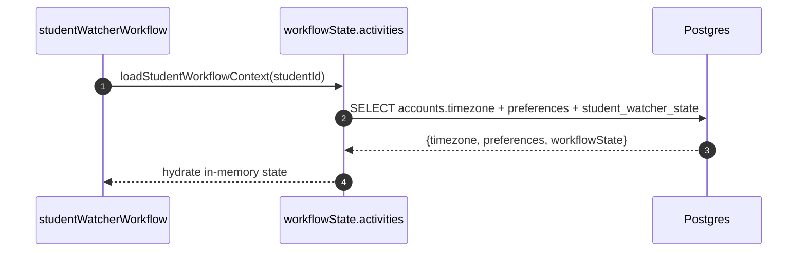
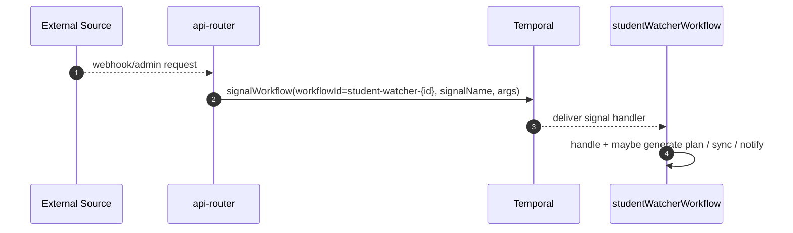
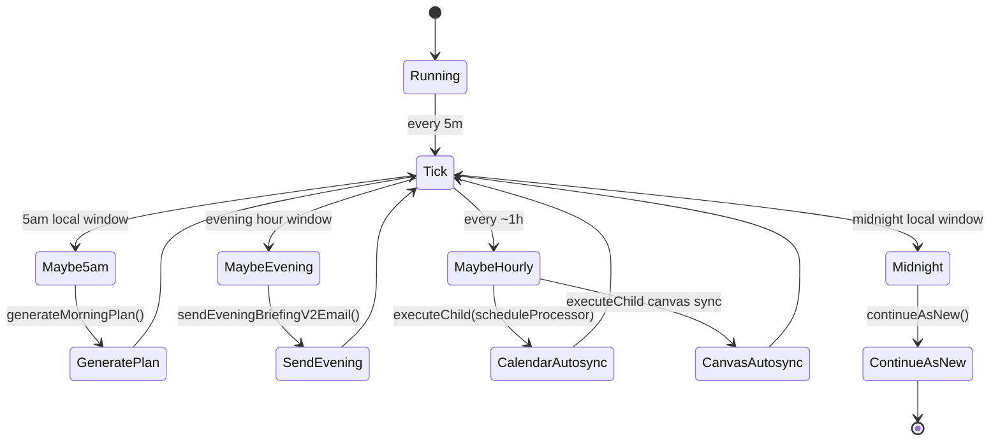
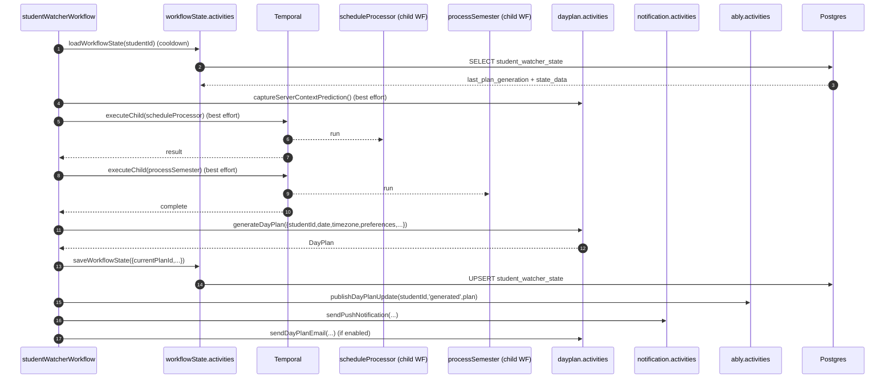

# StudentWatcher Workflow Deep Dive (Current)

This document “double clicks” on the current `studentWatcherWorkflow` implementation in the engine.

Primary code reference:

- `.repos/dormway-platform/services/engine/src/workflows/studentWatcher.simplified.workflow.ts`

For the broader system trace, see [How DormWay Works](/docs/engineering/architecture/how-dormway-works).

---

## 1) What StudentWatcher *is*

StudentWatcher is a **long-running Temporal workflow per student** that:

- generates a DayPlan at **5:00 AM user time**
- reacts to **signals** (calendar changes, syllabus changes, preference changes, admin actions)
- triggers **child workflows** to keep schedule + Canvas + semester overlays fresh
- sends **push/email** (based on preferences + time-of-day rules)
- persists minimal state in Postgres so it survives restarts and uses cooldowns safely
- `continueAsNew()` nightly at **midnight user time** (Temporal best practice)

---

## 2) Workflow identity + lifecycle

### Workflow ID convention

`student-watcher-${studentId}`

This is referenced in the API Router when signaling and in the engine when starting workflows (see [How DormWay Works](/docs/engineering/architecture/how-dormway-works)).

### Startup: what’s loaded

At workflow start it loads a consolidated context object (DORM-632), which merges:

- timezone (from `accounts.public_data->>'timezone'`)
- preferences (`user_preferences.key = 'preferences'`)
- watcher state (`student_watcher_state`)

Code:

- `.repos/dormway-platform/services/engine/src/activities/workflowState.activities.ts` (`loadStudentWorkflowContext`)



---

## 3) Durable state (Postgres)

`student_watcher_state` stores:

- `last_email_sent_date` (yyyy-mm-dd)
- `last_push_sent_date` (yyyy-mm-dd)
- `last_plan_generation` (timestamp)
- `state_data` (JSON blob for extra fields like last sync timestamps)
- `workflow_version` (currently `'v2.0'`)

Code:

- `.repos/dormway-platform/services/engine/src/activities/workflowState.activities.ts` (`loadWorkflowState`, `saveWorkflowState`, `updateNotificationDates`)

Key safety behavior:

- `saveWorkflowState` first checks `accounts` exists; if the account is gone, it **skips saving** to avoid noisy failures for “ghost” workflows.

---

## 4) Signals + queries (the public API of the workflow)

Signals currently defined in the workflow file:

- `context_update` — the main “something changed” signal; can trigger prediction + plan regen + deviation handling
- `generate_plan` — force plan generation (optionally force regen)
- `preferences_update` — update prefs in-memory, sync traits, possibly regen plan
- `trigger_calendar_sync` — run `scheduleProcessor` as a child workflow
- `trigger_canvas_sync` — run Canvas sync (PAT or ICS) as a child workflow
- `send_evening_briefing` — send evening briefing email (admin-trigger)
- `generate_feed_cards` — regenerate feed cards (admin-trigger)
- `daily_plan` — internal path for setting a new DayPlan object

Query:

- `getStatus` — returns basic status fields (`currentPlanId`, `lastPlanGeneration`, etc)

Signal delivery examples:

- Ragie webhook → `context_update`: `.repos/dormway-platform/services/api-router/src/routes/webhook-routes-s3.ts`
- Admin dayplan actions: `.repos/dormway-platform/services/api-router/src/routes/admin/dayplan-admin-actions.ts`
- Temporal generic signaling endpoint: `.repos/dormway-platform/services/api-router/src/routes/temporal-routes.ts`



---

## 5) Main loop (“tick engine”)

The workflow sleeps 5 minutes per tick and drives user-time scheduling using:

```ts
new Date().toLocaleString("en-US", { timeZone: timezone })
```

Major periodic actions:

- **5:00 AM user time**: generate today’s DayPlan (attempt notifications)
- **Evening briefing hour** (default 20:00): send evening briefing (if enabled, not already sent)
- **Hourly (every ~12 ticks)**: evaluate stale syncs and run:
  - calendar reconciliation via `scheduleProcessor`
  - Canvas sync (PAT or ICS), if Canvas is connected
- **Midnight user time**: `continueAsNew()`



---

## 6) Plan generation pipeline (`generateMorningPlan`)

`generateMorningPlan(...)` is the orchestration “subroutine” used by:

- 5:00 AM daily generation
- calendar updates (context_update)
- syllabus updates (context_update)
- preference changes (preferences_update)
- admin-triggered plan generation (generate_plan)

It does, in order:

1) Determine “today” in user timezone (string `yyyy-mm-dd`)
2) Load watcher state for cooldown gating (`loadWorkflowState`)
3) (Best effort) capture “server-mode context prediction”
4) Run `scheduleProcessor` child workflow (best effort)
5) Run `processSemester` child workflow (best effort)
6) Generate DayPlan via `dayPlanActivities.generateDayPlan`
7) Persist watcher state (`saveWorkflowState` with `currentPlanId`, last sync timestamps, etc)
8) Publish to Ably (`publishDayPlanUpdate`)
9) If `sendNotifications` is true: send push and (optionally) email based on preferences



### 6.1 Cooldown semantics

`generateMorningPlan` uses `student_watcher_state.last_plan_generation` as a cooldown guard. If the last generation is “recent” and not forced, it tries to return the existing plan via `getCurrentDayPlan(studentId)`.

This is why the workflow persists `lastPlanGeneration` aggressively after generation.

### 6.2 “Mutex” for concurrent generation

In the outer workflow, `isPlanGenerationInProgress` guards signal-triggered generation to avoid concurrent runs inside a single workflow execution.

---

## 7) `context_update` handling (what causes regen vs deviation detection)

`context_update` is effectively a router:

- Certain calendar events trigger immediate plan regeneration (with mutex protection)
- Syllabus changes trigger plan regeneration
- Course enrollment changes trigger plan regeneration and record metadata
- Otherwise, if there is a DayPlan:
  - compute deviations against the plan
  - potentially handle “critical” deviations
  - update the DayPlan via `updateDayPlan`

Additionally, for “high signal” updates it:

- publishes a “context event bus” message (Campus Connect monetization path)
- triggers server-mode context prediction, throttled (default 30s)

---

## 8) Calendar + Canvas sync (manual + automatic)

Calendar:

- Manual: signal `trigger_calendar_sync` → `executeChild('scheduleProcessor')`
- Automatic: hourly check; if stale (>= 6h), run `scheduleProcessor` and persist `lastCalendarSyncAt`

Canvas:

- Manual: signal `trigger_canvas_sync` and route based on connection type:
  - ICS: `executeChild('canvasICSSync')`
  - PAT: `executeChild('canvasOnDemandSyncWorkflow')`
- Automatic: hourly check, only if Canvas is connected (PAT or ICS); if stale (>= 6h), run appropriate child workflow and persist `lastCanvasSyncAt` + method

Key reference points:

- `.repos/dormway-platform/services/engine/src/workflows/studentWatcher.simplified.workflow.ts` (signal handlers + hourly autosync)
- Deep dive: [processSemester Workflow Deep Dive (Current)](/docs/engineering/technical/engine/processsemester-workflow-deep-dive-current)

---

## 9) Continue-as-new (user-midnight reset)

At **00:00** in the user timezone (minute < 5), the workflow runs:

```ts
continueAsNew({ studentId, timezone })
```

This prevents long histories and is part of the steady-state design.

---

## 10) “What to check next” (common debugging entry points)

- Workflow logs: `.repos/dormway-platform/services/engine/src/workflows/studentWatcher.simplified.workflow.ts`
- State persistence: `.repos/dormway-platform/services/engine/src/activities/workflowState.activities.ts`
- Admin signals: `.repos/dormway-platform/services/api-router/src/routes/admin/dayplan-admin-actions.ts`
- Ragie webhook signals: `.repos/dormway-platform/services/api-router/src/routes/webhook-routes-s3.ts`
- Calendar reconciliation: `.repos/dormway-platform/services/engine/src/workflows/studentProcessor.workflow.ts` (`scheduleProcessor`)
