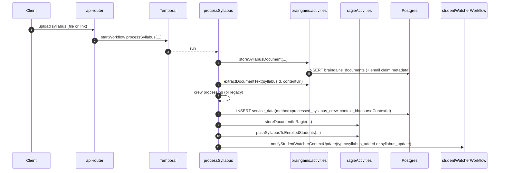
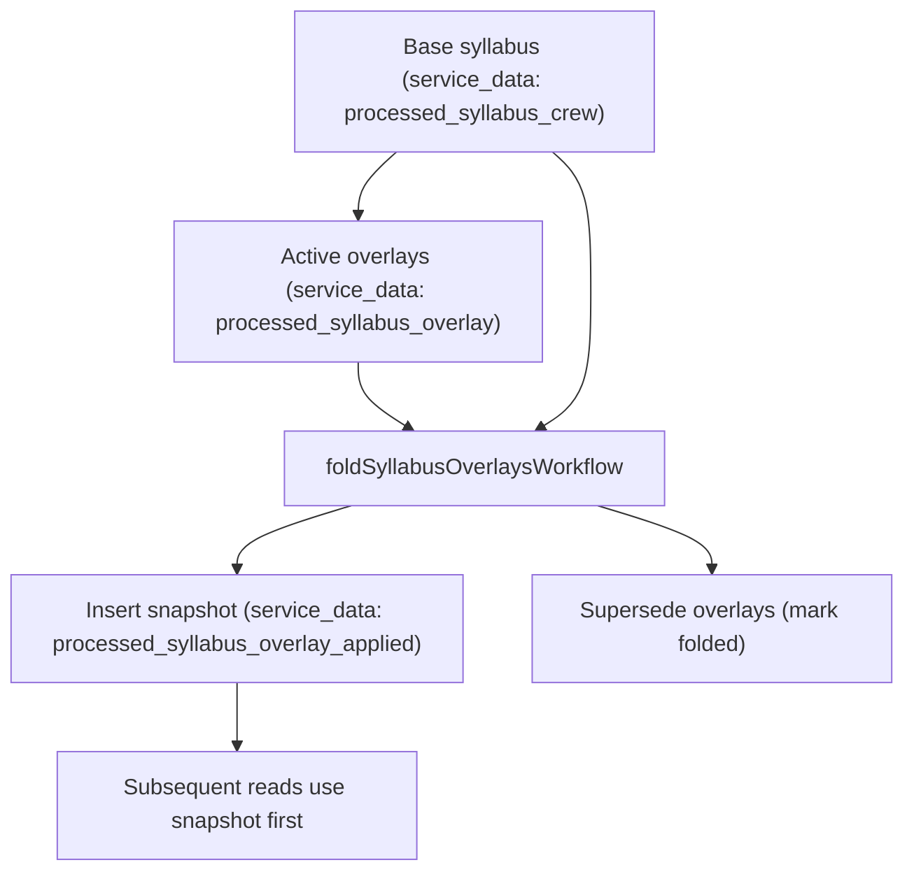

# Syllabus Processing & Overlays Deep Dive (Current)

This doc “double clicks” on how syllabi are processed *today* (Crew + legacy paths), how results are stored, how personalization overlays work, and how syllabus-derived dates affect schedule and tasks.

Related docs:

- [How DormWay Works](/docs/engineering/architecture/how-dormway-works)
- [Course Lifecycle (Add-Drop-Swap) Deep Dive (Current)](/docs/engineering/technical/engine/course-lifecycle-add-drop-swap-deep-dive-current)
- [Context Model: Hierarchy vs Graph (Current)](/docs/engineering/technical/ai/context/context-model-hierarchy-vs-graph)
- [Schedules, Time Blocks, and Reconciliation](/docs/engineering/technical/calendar/schedules-time-blocks-and-reconciliation)

Primary code references:

- Workflow: `.repos/dormway-platform/services/engine/src/workflows/syllabusProcessor.workflow.ts` (`processSyllabus`)
- Storage activities: `.repos/dormway-platform/services/engine/src/activities/braingains.activities.ts` (`storeSyllabusDocument`, `extractDocumentText`)
- Overlay merge service (API Router): `.repos/dormway-platform/services/api-router/src/services/syllabus-overlay.service.ts`
- Overlay fold workflow: `.repos/dormway-platform/services/engine/src/workflows/syllabusOverlayFold.workflow.ts`
- Overlay fold service: `.repos/dormway-platform/services/engine/src/services/syllabusOverlayFold.service.ts`

---

## 1) Big picture: what happens when a syllabus is “processed”

At a high level:

1) The raw syllabus PDF is persisted as a document record.
2) Text is extracted.
3) The syllabus is structured (Crew path; legacy path still exists).
4) A canonical course context is created/selected and the user is enrolled.
5) The canonical syllabus record is saved to `service_data` under the course context.
6) The structured output is pushed into Ragie for RAG queries (Ace + classmates).
7) Enrolled students are notified and StudentWatcher is signaled so plans can regenerate.

---

## 2) Entry points (who starts `processSyllabus`)

The same workflow is used across multiple entry points:

- In-app uploads (dashboard / admin routes).
- Email onboarding / PLG uploads (syllabus can be processed before the user has a real account).
- Canvas auto-sync (optional): Canvas course files can be downloaded and then routed into the same processing pipeline.

References:

- Admin reprocess starts workflow: `.repos/dormway-platform/services/api-router/src/routes/admin/syllabus-routes.ts`
- Canvas auto fetch triggers processing: `.repos/dormway-platform/services/engine/src/activities/canvas.activities.ts` (`fetchAndProcessCanvasSyllabus`)

---

## 3) Storage model (tables and methods)

### 3.1 Document records

Raw uploads are stored as BrainGains documents:

- Table: `braingains_documents`
- Key fields used by the workflow:
  - `id` (the “syllabusId” used throughout the pipeline)
  - `user_id` (nullable for PLG uploads)
  - `email_address` (used to claim if no user exists yet)
  - `content_url` (presigned S3 URL)
  - `processing_status`
  - `metadata` (includes provenance: S3 bucket/key, ingestion id, source)

Reference: `.repos/dormway-platform/services/engine/src/activities/braingains.activities.ts` (`storeSyllabusDocument`)

### 3.2 Canonical processed syllabus record (course-level)

The primary canonical result is written to:

- Table: `service_data`
- `method = 'processed_syllabus_crew'`
- `context_id = <courseContextId>`
- `user_id = <varies>`:
  - typically the uploader’s `userId` for in-app uploads and Canvas auto-sync
  - `null` for email-onboarding/PLG uploads (or in some safeguard paths)

Practical implication: consumers usually treat `processed_syllabus_crew` as “course canonical” and select the latest row by `fetched_at` regardless of `user_id` (see `fetchLatestProcessedSyllabus` in `syllabus-overlay.service.ts`). This means the “canonical” syllabus can effectively be the most recently processed version for that course context.

The workflow may also write legacy companions (depending on mode):

- `method = 'braingains_syllabus_structure'` (legacy)
- `method = 'braingains_syllabus_insights'` (legacy)

Reference: `.repos/dormway-platform/services/engine/src/workflows/syllabusProcessor.workflow.ts`

---

## 4) Processing modes and control flags

The workflow supports `processingMode`:

- `email-onboarding`
- `in-app`

And key metadata flags:

- `forceReprocess`: bypasses duplicate checks and re-runs processing
- `useLegacyProcessing`: forces the legacy pipeline when true

Reference: `.repos/dormway-platform/services/engine/src/workflows/syllabusProcessor.workflow.ts`

---

## 5) Deduping: cache hits vs “duplicate syllabus” checks

There are two complementary dedupe mechanisms:

### 5.1 Content hash cache (same PDF, different filenames)

Early in the pipeline, it computes/looks up a content hash by URL and can return instantly if a cached analysis exists.

On cache hit:

- it still ensures course context + enrollment exists (so PLG users still get wired)
- it links the user to the cache entry

Reference: `.repos/dormway-platform/services/engine/src/workflows/syllabusProcessor.workflow.ts` (Step “1.25”)

### 5.2 Duplicate processing check (course already processed)

After extracting a basic course code, it checks whether an equivalent syllabus has already been processed.

If duplicate:

- it reuses the existing course context id
- for email-onboarding, it can resend the latest email design without recomputing

Reference: `.repos/dormway-platform/services/engine/src/workflows/syllabusProcessor.workflow.ts`

---

## 6) Course context creation + enrollment

Syllabus processing ultimately needs:

- a canonical `course` context under the student’s campus (tree)
- an `enrolled_in` edge from student context → course context (graph), typically with term metadata

This is conceptually the same “context + enrollment” pattern used by schedule import and Canvas sync.

References:

- Course matching guidelines live in the course activities (shared across sources): `.repos/dormway-platform/services/engine/src/activities/course.activities.ts`
- Graph model: [Context Model: Hierarchy vs Graph (Current)](/docs/engineering/technical/ai/context/context-model-hierarchy-vs-graph)

---

## 7) Overlay model (personalization on top of the canonical syllabus)

Overlays allow user-specific adjustments to the canonical syllabus without rewriting the base record.

### 7.1 Where overlays live

Overlays are stored as `service_data` rows:

- `method = 'processed_syllabus_overlay'`
- `context_id = <courseContextId>`
- `user_id = <student user id>`
- `data` contains:
  - `baseServiceDataId` (links to the base canonical service_data row id)
  - `operations[]` (patch-like “update term” actions)
  - `hash` (dedupe key)
  - optional `status` (active, archived, folded)

Reference: `.repos/dormway-platform/services/api-router/src/services/syllabus-overlay.service.ts`

### 7.2 How overlays are created (“Update My Term”)

The typical user flow:

1) user provides natural language update (e.g. “exam moved to Friday”, “assignment due date changed”)
2) LLM classifies into `operations`
3) the overlay is inserted (deduped by hash)
4) the merged syllabus is returned to the client

Reference: `.repos/dormway-platform/services/api-router/src/routes/braingains-routes.ts` (update term endpoint)

### 7.3 Merge behavior

Merge is computed either:

- at request time (base + active overlays), or
- from a pre-folded snapshot (see next section)

Reference: `.repos/dormway-platform/services/api-router/src/services/syllabus-overlay.service.ts` (`fetchMergedSyllabusForUser`)

---

## 8) Overlay folding (turn many overlays into a per-user snapshot)

When a course accrues many overlays, the system can “fold” them into a single snapshot for each user:

- inserts `service_data(method='processed_syllabus_overlay_applied')` with the merged syllabus + audit trail
- marks the contributing overlay rows as “superseded”/folded (so future reads can use the snapshot)

References:

- Trigger: `.repos/dormway-platform/services/api-router/src/routes/admin/syllabus-routes.ts` (`POST /fold-overlays`)
- Workflow: `.repos/dormway-platform/services/engine/src/workflows/syllabusOverlayFold.workflow.ts`
- Service: `.repos/dormway-platform/services/engine/src/services/syllabusOverlayFold.service.ts`

---

## 9) How syllabus content affects schedule + tasks

### 9.1 Syllabus dates → schedule inputs

The engine can translate syllabus-derived dates into calendar-like “events” (assignments + dates + meetings) using `CalendarNormalizationService.normalizeSyllabusData(...)`.

Today, the primary persisted artifact for these “events” is:

- `service_data(method='fetch_syllabus_events', context_id=<studentContextId>, user_id=<studentId>)`

These syllabus events are used mainly as *LLM/academic context inputs* (and as a fallback “LMS proxy” in some pipelines), rather than being written into `student_time_blocks` for the schedule UI.

References:

- Normalizer: `.repos/dormway-platform/services/engine/src/services/calendarNormalization.service.ts`
- Fetch + persist “syllabus events”: `.repos/dormway-platform/services/engine/src/activities/student.activities.ts`

### 9.2 Syllabus assignments → tasks and deadlines endpoints

The Student entity derives:

- “syllabus tasks” (virtual task items) from `processed_syllabus_crew` / `braingains_syllabus_structure`
- “deadlines” from the same syllabus assignment lists
- completion state via `assignment_completion` rows

Reference: `.repos/dormway-platform/services/shared/dormway-core/src/entities/student/student.entity.ts`

---

## 10) Notifications and StudentWatcher integration

When a syllabus is processed/updated:

- enrolled students receive a push notification
- StudentWatcher is signaled with `syllabus_added` (uploader) or `syllabus_update` (classmates)
- StudentWatcher can regenerate the DayPlan in response

Reference: `.repos/dormway-platform/services/engine/src/workflows/syllabusProcessor.workflow.ts`
