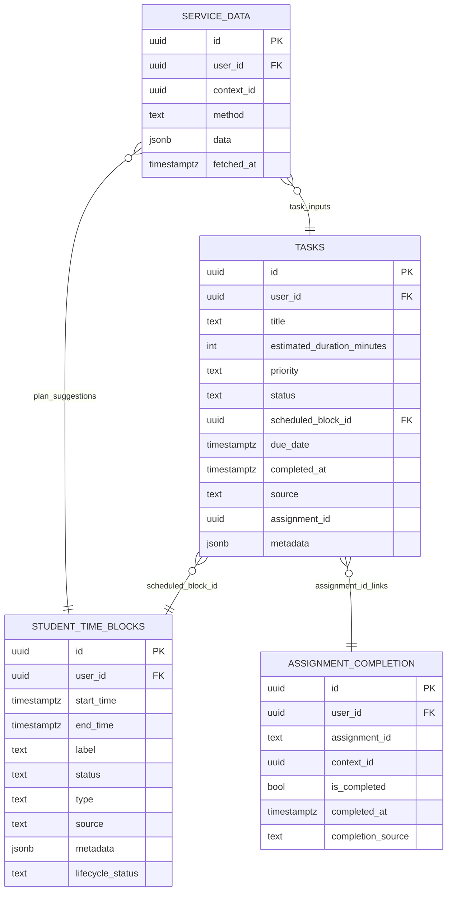
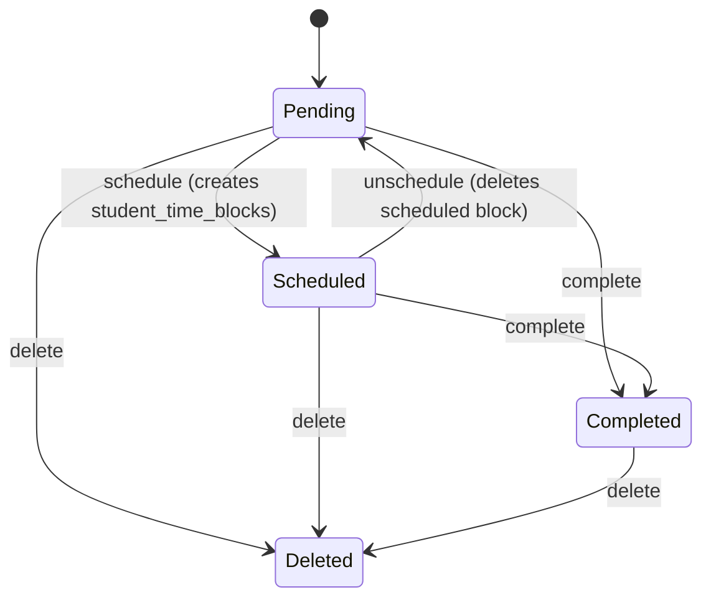
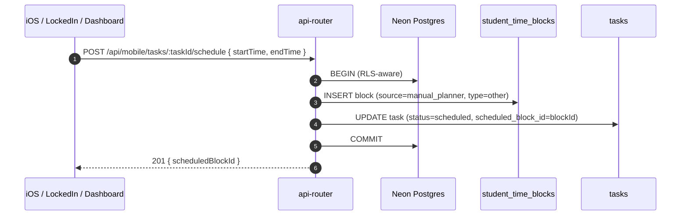

# Tasks, Task Bank, and Planner Block Scheduling Deep Dive (Current)

This document explains how DormWay currently represents **work to do** and how it moves between:

- **Unscheduled** (Task Bank)
- **Scheduled** (timeline blocks)
- **Completed** (tasks + assignment completion)

Related:

- [Dashboard v2 & Widget Strategy (Current)](/docs/engineering/architecture/dashboard-v2-widget-strategy-current)
- [StudentWatcher Workflow Deep Dive (Current)](/docs/engineering/technical/studentwatcher/studentwatcher-workflow-deep-dive-current)
- [Schedule Sources & Precedence (Current)](/docs/engineering/technical/calendar/schedule-sources-precedence-current)
- [Schedules, Time Blocks, and Reconciliation](/docs/engineering/technical/calendar/schedules-time-blocks-and-reconciliation)

Code entry points (current):

- Task CRUD + scheduling: `.repos/dormway-platform/services/api-router/src/routes/task-routes.ts` (`/api/mobile/tasks/*`)
- Unified planner blocks CRUD: `.repos/dormway-platform/services/api-router/src/routes/mobile-routes.ts` (`/api/mobile/planner/blocks/*`)
- Task Bank aggregation: `.repos/dormway-platform/services/api-router/src/routes/mobile-routes.ts` (`GET /api/mobile/planner/task-bank`)
- Student “tasks” API (includes synthetic syllabus tasks): `.repos/dormway-platform/services/api-router/src/routes/v2/students.routes.ts` (`/students/me/tasks`)
- Canonical task retrieval in core: `.repos/dormway-platform/services/shared/dormway-core/src/entities/student/student.entity.ts` (`student.getTasks`, `completeSyllabusTask`)
- Dashboard “pending tasks” source: `.repos/dormway-platform/services/api-router/src/services/dashboard-aurora-service.ts` (queries `tasks` for pending items)

---

## 1) Key data model (what is stored where)

DormWay currently has **three “task-ish” buckets**:

1) **Persistent tasks** in `tasks` (the real Task Bank)
2) **Scheduled blocks** in `student_time_blocks` (timeline is the source of truth for scheduled time)
3) **Ephemeral suggestions** in `service_data.method='dayplan'` (AI plan output), plus quick captures in `service_data.method='quick_capture'`

---

## 2) The “Task Bank” is actually multiple sources

There are two patterns in production right now:

### 2.1 Persistent Task Bank (tasks table)

The “real” task bank is `tasks` with `status='pending'`.

Ways tasks get created:

- Manual create:
  - `POST /api/mobile/tasks` (or quick-capture variant)
  - `POST /students/me/tasks`
- Engine-created suggestions (onboarding):
  - `.repos/dormway-platform/services/engine/src/activities/student.activities.ts` (`createDefaultOnboardingTask`)
- Email / generic content ingestion:
  - `.repos/dormway-platform/services/engine/src/activities/genericContent.activities.ts` (`createTask`, `createAssignment`)

### 2.2 “Aggregated Task Bank” (legacy + convenience)

`GET /api/mobile/planner/task-bank` merges:

- DayPlan unscheduled study events (from `service_data.method='dayplan'`)
- Canvas assignments (from `canvas_assignments` + `canvas_submissions`)
- Quick captures (from `service_data.method='quick_capture'`)
- Pending persistent tasks (from `tasks`)

It also has a “converted” mechanism:

- persistent tasks may store `metadata.originalId`
- if `metadata.originalId` matches an ephemeral task ID, the ephemeral task is filtered out during aggregation

Implementation:

- `.repos/dormway-platform/services/api-router/src/routes/mobile-routes.ts` (`GET /planner/task-bank`)

---

## 3) Scheduling lifecycle (pending task → scheduled block → completed)

### 3.1 Task lifecycle states (persistent)

### 3.2 Scheduling a task creates a planner block

Scheduling is implemented as a small “two-write” operation:

1) Insert a `student_time_blocks` row (timeline block)
2) Update `tasks` status to `scheduled` and attach `scheduled_block_id`

Implementation:

- `.repos/dormway-platform/services/api-router/src/routes/task-routes.ts` (`POST /:taskId/schedule`)

Notable details:

- the scheduled block uses `source='manual_planner'`, `type='other'`, `status='busy'`
- metadata includes both `taskId` and `task_id` for compatibility

### 3.3 Unscheduling deletes the scheduled block

Unschedule does:

1) `DELETE FROM student_time_blocks WHERE id = scheduled_block_id`
2) update task back to `pending` with `scheduled_block_id=NULL`

Implementation:

- `.repos/dormway-platform/services/api-router/src/routes/task-routes.ts` (`POST /:taskId/unschedule`)

### 3.4 Completing a task (and assignment completion prompts)

Completing a task updates:

- `tasks.status='completed'`
- `tasks.completed_at=NOW()`

If the task is tied to an assignment (`assignment_id` is set), the route can return a follow-up prompt (“Did you submit?”) based on `assignment_completion`.

Implementation:

- `.repos/dormway-platform/services/api-router/src/routes/task-routes.ts` (`POST /:taskId/complete`)
- `.repos/dormway-platform/services/api-router/src/routes/assignment-completion-routes.ts` (assignment completion source of truth)

---

## 4) Syllabus “tasks” are synthetic (not rows in tasks table)

The core student entity currently derives syllabus assignments directly from processed syllabus data:

- `.repos/dormway-platform/services/shared/dormway-core/src/entities/student/student.entity.ts`
  - `getTasks()` merges:
    - real rows from `tasks`
    - synthetic “syllabus assignments” extracted from `service_data.method='processed_syllabus_crew'`

Synthetic syllabus task IDs are constructed like:

- `syllabus-<courseContextId>-<index>`

Completion is stored in `assignment_completion` using:

- `assignment_id = syllabus-...`
- `context_id = courseContextId`

This is why:

- a syllabus task can be completed even though it is not present in `tasks`
- completion persists across dayplans because `assignment_completion` is durable

---

## 5) Planner blocks CRUD (separate from tasks)

Planner blocks are “manual schedule blocks” stored directly in `student_time_blocks`:

- create/list/update/delete:
  - `.repos/dormway-platform/services/api-router/src/routes/mobile-routes.ts` (`/api/mobile/planner/blocks`)

These blocks also use:

- `source='manual_planner'`
- `type='other'`

So, in practice:

- “scheduled task blocks” and “manual planner blocks” share the same underlying storage and source label.

---

## 6) Sharp edges to keep in mind

- Two “task list” surfaces exist (`/api/mobile/tasks` vs `/api/mobile/planner/task-bank` vs `/students/me/tasks`) and they do not return identical shapes or sources.
- Unschedule hard-deletes from `student_time_blocks`, while planner-block delete may be implemented as a soft delete (`lifecycle_status`); this can produce mismatched expectations when debugging history.
- Course scoping is inconsistent across sources:
  - tasks table uses `course_code`
  - scheduled blocks may use `metadata.courseCode` or `metadata.course_code`
  - syllabus synthetic tasks have `courseContextId` but no `tasks.course_context_id` field
