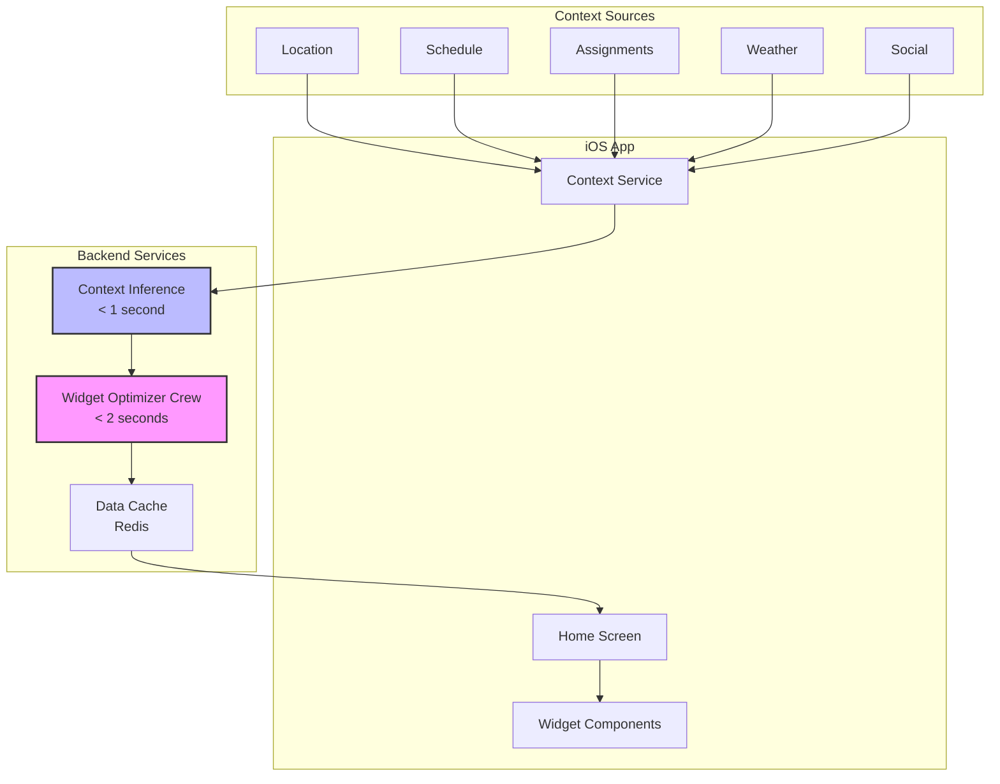
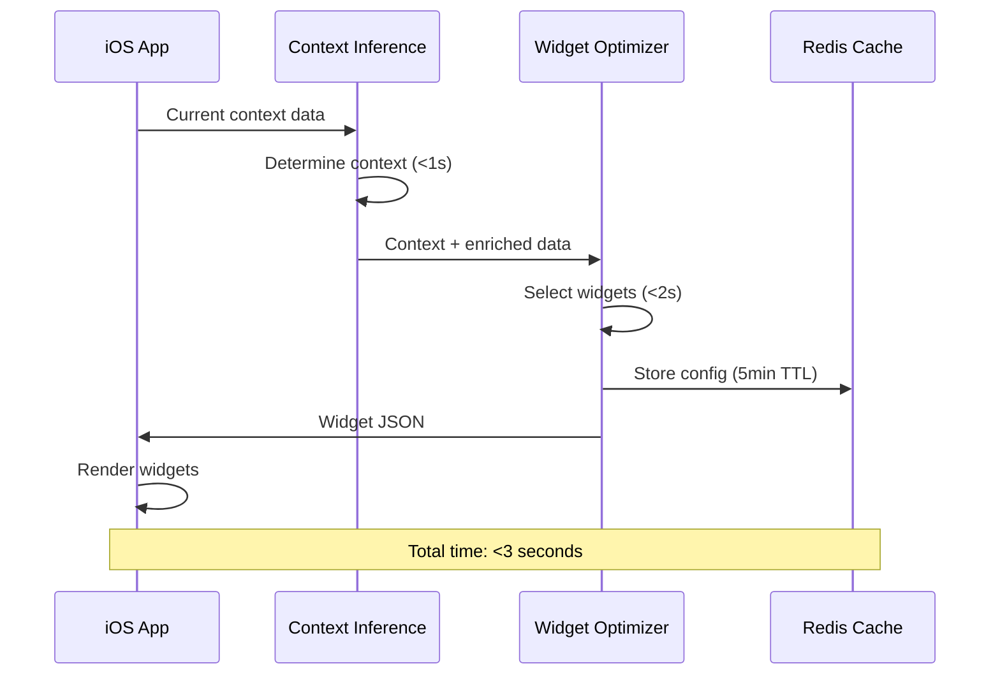
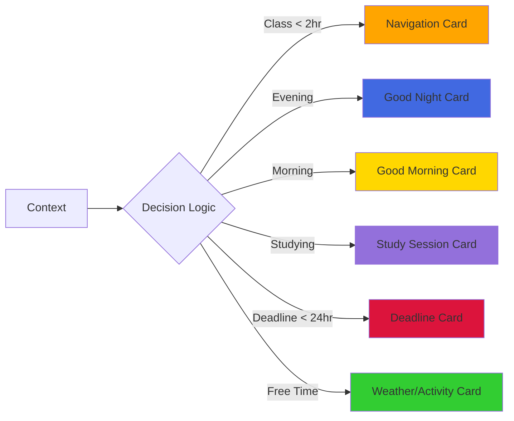
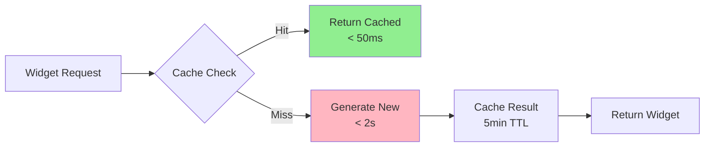

# Widget Optimizer Architecture

## Overview

The Widget Optimizer is a lightweight, fast crew that transforms context data into widget configurations for the dynamic home screen. It's designed to execute in under 2 seconds to maintain responsive UI updates.

## System Architecture



## Widget Configuration Flow



## Widget Types and Selection Logic

### Primary Card Types



### Quick Actions Priority

1. **Navigation** - If class/event within 2 hours
2. **Class Prep** - If class within 1-4 hours
3. **Communication** - If unread messages
4. **Study Tools** - If in study context
5. **Social** - If free time available
6. **Health** - If workout scheduled

## Input Data Structure

```typescript
interface WidgetOptimizerInput {
  current_context: string;        // From context-inference
  time_context: {
    current_time: string;
    day_of_week: string;
    part_of_day: string;
  };
  academic_context: {
    next_class?: ClassInfo;
    assignments_due_soon: Assignment[];
    current_activity?: string;
  };
  location_context: {
    current_location: string;
    distance_to_next_class?: RouteInfo;
  };
  weather_context: WeatherInfo;
  social_context: {
    unread_messages?: MessageCounts;
    study_group_active?: boolean;
  };
  active_tasks: Task[];
}
```

## Output Widget Configuration

```typescript
interface WidgetConfig {
  primary_card: {
    type: "navigation" | "greeting" | "study" | "deadline" | "weather";
    header: string;
    subheader: string;
    main_content: CardContent;
    accent_color: string;
    icon: string;
  };
  
  whats_next: {
    title: string;
    content: string;
    time_context: string;
  };
  
  quick_actions: QuickAction[];  // Max 4
  
  tasks: TaskWidget[];           // 2-3 visible
  
  metadata: {
    context: string;
    generated_at: string;
    ttl_seconds: number;        // Cache duration
  };
}
```

## Performance Optimization

### Speed Techniques

1. **Single Agent** - No multi-agent coordination overhead
2. **Minimal Search** - No external tool calls
3. **Pre-processed Data** - Context already determined
4. **Simple Rules** - Clear decision tree
5. **JSON Templates** - Pre-structured outputs

### Caching Strategy



## Context-Specific Examples

### Morning Class Context

- **Primary**: Navigation card with route info
- **What's Next**: Post-class break planning
- **Actions**: Turn-by-turn, Class prep, Study partner call
- **Tasks**: Upcoming assignments

### Evening Study Context

- **Primary**: Study session tracker
- **What's Next**: Dinner timing reminder
- **Actions**: Focus timer, Note sharing, Break reminder
- **Tasks**: Current assignment progress

### Night Time Context

- **Primary**: Good night summary
- **What's Next**: Tomorrow's first commitment
- **Actions**: Alarm check, Sleep tracker, Morning prep
- **Tasks**: Tomorrow's priorities

### Free Time Context

- **Primary**: Weather/activity suggestions
- **What's Next**: Time until next commitment
- **Actions**: Social invites, Gym, Food, Explore
- **Tasks**: Optional/low-priority items

## Integration Points

### 1. Context Inference Output

Receives enriched context classification in under 1 second

### 2. Student Context Crews

Can pull additional data if needed (but aim to avoid for speed)

### 3. iOS Widget Renderer

Provides JSON that maps directly to SwiftUI components

### 4. Real-time Updates

- Location changes trigger updates
- Time-based refresh (every 5 minutes)
- Event transitions (class start/end)
- User actions (task completion)

## Future Enhancements

1. **Widget Learning**

   - Track which widgets get tapped
   - Adjust priorities based on usage
   - Personalize action ordering

2. **Predictive Widgets**

   - Pre-generate next likely context
   - Smooth transitions between contexts
   - Anticipate user needs

3. **Custom Widget Types**

   - User-defined widget templates
   - Third-party integrations
   - Special event widgets

4. **A/B Testing Framework**

   - Test different widget layouts
   - Measure engagement rates
   - Optimize for user success

## Related Documentation

- [Widget System](/docs/engineering/architecture/dormway-widget-system)
- iOS Widget Integration Guide
- Context System
- Real-time Updates Strategy
