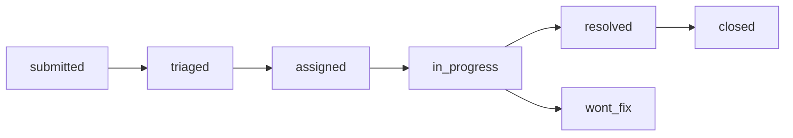

## Overview

The **Bug Reports System** enables students to report issues directly from the mobile app (iOS/Android) or web application. All reports flow into the admin dashboard for triage, assignment, and resolution tracking.

<Card title="Key Features" icon="star">
  - **Student Submissions**: One-tap bug reporting with screenshots
  - **Severity Classification**: Critical, High, Medium, Low
  - **Status Workflow**: Submitted → Triaged → Assigned → In Progress → Resolved → Closed
  - **Linear Integration**: Forward bugs to engineering via Linear API
  - **Anonymous Reports**: Optional for unauthenticated users
  - **Platform Tracking**: iOS, Web, Android, API
</Card>

---

## Database Schema

### `growth_bug_reports` Table

| Field | Type | Description |
|-------|------|-------------|
| `id` | UUID | Primary key |
| `reporter_account_id` | UUID | Reporter (nullable for anonymous) |
| `labs_task_id` | UUID | Optional: Link to Labs task if bug found during QA |
| `title` | TEXT | Bug title (required) |
| `description` | TEXT | Detailed description (required) |
| `platform` | TEXT | `ios`, `web`, `android`, `api`, `other` |
| `severity` | TEXT | `critical`, `high`, `medium`, `low` |
| `status` | TEXT | Current status (see workflow below) |
| `screenshot_url` | TEXT | S3 URL for uploaded screenshot |
| `assigned_to` | UUID | Developer assigned to fix |
| `resolved_at` | TIMESTAMPTZ | When bug was resolved |
| `linear_issue_id` | TEXT | Linear issue ID if forwarded |
| `notes` | TEXT | Admin notes (internal) |
| `metadata` | JSONB | Additional context (device info, app version, etc.) |
| `created_at` | TIMESTAMPTZ | Report submission time |
| `updated_at` | TIMESTAMPTZ | Last update time |

### Status Workflow



<AccordionGroup>
  <Accordion title="submitted" icon="inbox">
    **Initial state** - Bug just reported by student, awaiting admin review
  </Accordion>

  <Accordion title="triaged" icon="filter">
    Admin has reviewed and categorized severity, ready for assignment
  </Accordion>

  <Accordion title="assigned" icon="user-check">
    Assigned to a specific developer for investigation
  </Accordion>

  <Accordion title="in_progress" icon="spinner">
    Developer actively working on fix
  </Accordion>

  <Accordion title="resolved" icon="circle-check">
    Fix deployed to production, awaiting user confirmation
  </Accordion>

  <Accordion title="closed" icon="lock">
    User confirmed fix or issue auto-closed after resolution period
  </Accordion>

  <Accordion title="wont_fix" icon="ban">
    Determined not to be a bug, or intentional behavior (e.g., feature request)
  </Accordion>
</AccordionGroup>

---

## Severity Levels

<CardGroup cols={2}>
  <Card title="Critical" icon="circle-exclamation" color="#d32f2f">
    **Blocks core functionality** - App crash, data loss, security vulnerability

    **Response Time**: Same day

    **Examples**:
    - App crashes on launch
    - Unable to login
    - Student data exposed
  </Card>

  <Card title="High" icon="triangle-exclamation" color="#f57c00">
    **Major feature broken** - Key workflows unusable, significant UX degradation

    **Response Time**: 1-2 days

    **Examples**:
    - Calendar not syncing
    - Syllabus upload fails
    - Dashboard shows wrong data
  </Card>

  <Card title="Medium" icon="circle-info" color="#fbc02d">
    **Feature partially broken** - Workarounds exist, minor UX issues

    **Response Time**: 3-5 days

    **Examples**:
    - UI rendering glitch
    - Slow performance on specific action
    - Missing validation message
  </Card>

  <Card title="Low" icon="circle" color="#388e3c">
    **Cosmetic or edge case** - Visual inconsistencies, rare scenarios

    **Response Time**: Backlog

    **Examples**:
    - Typo in UI text
    - Color mismatch in dark mode
    - Minor spacing issue
  </Card>
</CardGroup>

---

## Admin Workflow

### 1. Bug Triage Process

<Steps>
  <Step title="View New Bugs">
    Navigate to **Growth → Bug Reports** in admin dashboard. Filter by `status: submitted`.
  </Step>

  <Step title="Classify Severity">
    Review bug description and screenshot. Assign appropriate severity level.
  </Step>

  <Step title="Update Status to Triaged">
    Change status to `triaged`. Add admin notes if needed.
  </Step>

  <Step title="Optional: Forward to Linear">
    Click **"Send to Linear"** to create engineering ticket. Linear issue ID will be saved.
  </Step>
</Steps>

### 2. Assignment and Tracking

```bash
# API example: Assign bug to developer
curl -X PATCH http://localhost:3001/api/admin/growth/bug-reports/{id} \
  -H "Content-Type: application/json" \
  -H "X-User-Role: admin" \
  -d '{
    "assigned_to": "developer-uuid",
    "status": "assigned",
    "notes": "Assigned to mobile team for investigation"
  }'
```

### 3. Resolution Workflow

<AccordionGroup>
  <Accordion title="Mark as Resolved" icon="check">
    When fix is deployed:
    - Update `status` to `resolved`
    - Set `resolved_at` timestamp
    - Add resolution notes explaining fix
  </Accordion>

  <Accordion title="Close Bug" icon="lock">
    After user confirmation or auto-close period (7 days):
    - Update `status` to `closed`
    - Bug removed from active queue
  </Accordion>

  <Accordion title="Mark as Won't Fix" icon="ban">
    If not a bug or intentional behavior:
    - Update `status` to `wont_fix`
    - Add explanation in notes
    - Optionally notify reporter
  </Accordion>
</AccordionGroup>

---

## Linear Integration

### How it Works

<Steps>
  <Step title="Configure Linear API Key">
    Set `LINEAR_API_KEY` in Doppler secrets (production) or `.env` (local dev)
  </Step>

  <Step title="Forward Bug from Admin UI">
    Click **"Send to Linear"** button on bug details page
  </Step>

  <Step title="Linear Issue Created">
    System creates Linear issue with:
    - Title: `[Bug Report] {bug.title}`
    - Description: Bug details + reporter info + screenshot link
    - Team: DormWayLLC
    - Labels: `bug`, platform label (e.g., `ios`)
    - Priority: Mapped from severity (Critical → Urgent, High → High, etc.)
  </Step>

  <Step title="Linear ID Saved">
    Linear issue ID saved in `growth_bug_reports.linear_issue_id`
  </Step>
</Steps>

### Severity to Priority Mapping

| Bug Severity | Linear Priority | Linear Label |
|--------------|----------------|--------------|
| Critical | Urgent (1) | `critical-bug` |
| High | High (2) | `high-priority` |
| Medium | Normal (3) | `bug` |
| Low | Low (4) | `low-priority` |

<Tip>
  **Two-way Sync (Future)**: Planned feature to sync Linear issue status back to `growth_bug_reports` table via webhooks.
</Tip>

---

## Mobile App Integration

### Student Bug Reporting Flow

<Tabs>
  <Tab title="iOS">
    **Location**: AceFAB menu → "Report a Bug"

    **Capture**:
    - Automatic screenshot (last screen before menu opened)
    - Device info (iOS version, app version, device model)
    - Current screen/route

    **Submission**:
    ```swift
    POST /api/mobile/bug-reports
    {
      "title": "Calendar won't sync",
      "description": "Tried refreshing 3 times...",
      "platform": "ios",
      "screenshot": <file upload>,
      "metadata": {
        "app_version": "1.2.3",
        "ios_version": "17.2",
        "device_model": "iPhone 14 Pro"
      }
    }
    ```
  </Tab>

  <Tab title="Web">
    **Location**: AceChatBubble menu → "Share Feedback" → "Report Bug"

    **Capture**:
    - Manual screenshot upload (optional)
    - Browser info (Chrome, Safari, etc.)
    - Current URL/route

    **Submission**:
    ```typescript
    POST /api/mobile/bug-reports
    {
      "title": "Dashboard shows wrong GPA",
      "description": "My GPA is 3.8 but shows 3.5",
      "platform": "web",
      "metadata": {
        "browser": "Chrome 120.0",
        "url": "/dashboard/home"
      }
    }
    ```
  </Tab>
</Tabs>

---

## Analytics & Metrics

### Key Metrics (Planned)

<Info>
  **Coming Soon**: Analytics dashboard with these metrics. See [GROWTH_OPS_ANALYTICS_PLAN.md](https://github.com/DormWay/dormway-platform/blob/main/GROWTH_OPS_ANALYTICS_PLAN.md) for implementation details.
</Info>

| Metric | Description | Calculation |
|--------|-------------|-------------|
| **Total Bugs** | All-time bug reports | `COUNT(*)` |
| **Open Bugs** | Bugs not yet resolved | `COUNT(*) WHERE status IN ('submitted', 'triaged', 'assigned', 'in_progress')` |
| **Avg Resolution Time** | Hours from submission to resolution | `AVG(resolved_at - created_at)` for resolved bugs |
| **Bugs by Severity** | Distribution of severity levels | `COUNT(*) GROUP BY severity` |
| **Bugs by Platform** | iOS vs Web vs Android | `COUNT(*) GROUP BY platform` |
| **Top Reporters** | Most active bug reporters | `COUNT(*) GROUP BY reporter_account_id` |

### Queries

```sql
-- Recent bugs awaiting triage
SELECT id, title, severity, platform, created_at
FROM growth_bug_reports
WHERE status = 'submitted'
ORDER BY severity, created_at DESC
LIMIT 20;

-- Average resolution time by severity (last 30 days)
SELECT
  severity,
  AVG(EXTRACT(EPOCH FROM (resolved_at - created_at)) / 3600) as avg_hours
FROM growth_bug_reports
WHERE resolved_at IS NOT NULL
  AND created_at >= NOW() - INTERVAL '30 days'
GROUP BY severity;

-- Bug volume by week
SELECT
  DATE_TRUNC('week', created_at) as week_start,
  COUNT(*) as total_bugs,
  COUNT(*) FILTER (WHERE severity = 'critical') as critical_bugs
FROM growth_bug_reports
WHERE created_at >= NOW() - INTERVAL '90 days'
GROUP BY week_start
ORDER BY week_start DESC;
```

---

## API Reference

See full API documentation: [Growth Ops API Reference](/docs/growth-ops/api#bug-reports)

**Quick Links**:
- `POST /api/mobile/bug-reports` - Submit bug report (mobile/web)
- `GET /api/admin/growth/bug-reports` - List all bugs (admin)
- `GET /api/admin/growth/bug-reports/:id` - Get bug details
- `PATCH /api/admin/growth/bug-reports/:id` - Update bug status
- `POST /api/admin/growth/bug-reports/:id/forward-to-linear` - Send to Linear

---

## Best Practices

<AccordionGroup>
  <Accordion title="Triage Daily" icon="calendar-check">
    Review new bugs every morning. Classify severity and assign critical bugs immediately.
  </Accordion>

  <Accordion title="Use Admin Notes" icon="note-sticky">
    Document investigation steps, workarounds, and resolution details for future reference.
  </Accordion>

  <Accordion title="Forward to Linear Early" icon="arrow-right">
    Don't wait - create Linear issues for any bug requiring engineering work. Engineers prefer GitHub/Linear over admin dashboard.
  </Accordion>

  <Accordion title="Close Resolved Bugs" icon="check-double">
    After 7 days, auto-close resolved bugs. Keep queue clean and focused on active issues.
  </Accordion>

  <Accordion title="Thank Reporters" icon="heart">
    (Future) Send in-app notification thanking students for bug reports. Builds engagement.
  </Accordion>
</AccordionGroup>
