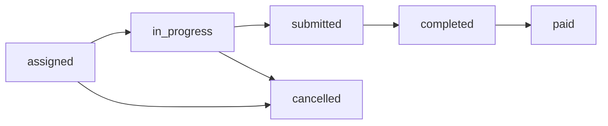

## Overview

The **DormWay Labs Program** enables students to contribute to product development through structured tasks like bug hunting, syllabus gathering, QA testing, and user interviews. The system tracks task assignments, deliverables, completion status, and payouts.

<CardGroup cols={2}>
  <Card title="Labs Members" icon="id-card">
    Student contributors enrolled in the Labs program with active/inactive status tracking
  </Card>
  <Card title="Labs Tasks" icon="list-check">
    Assigned work items with deliverables, deadlines, and payout amounts
  </Card>
  <Card title="Deliverable Tracking" icon="file-arrow-up">
    Upload links for completed work (Google Drive, Notion, etc.)
  </Card>
  <Card title="Payout Management" icon="dollar-sign">
    Track task payouts in cents, mark as paid when processed
  </Card>
</CardGroup>

---

## Database Schema

### `growth_labs_members` Table

| Field | Type | Description |
|-------|------|-------------|
| `id` | UUID | Primary key |
| `account_id` | UUID | Links to `accounts` table |
| `role` | TEXT | `qa_tester`, `content_creator`, `researcher`, `developer` |
| `status` | TEXT | `active`, `inactive`, `probation`, `alumni` |
| `hourly_rate_cents` | INTEGER | Standard hourly rate (e.g., 1500 = $15/hour) |
| `total_earnings_cents` | INTEGER | Cumulative earnings (updated on task completion) |
| `bio` | TEXT | Member bio/skills |
| `portfolio_url` | TEXT | Optional portfolio link |
| `onboarded_at` | TIMESTAMPTZ | When member joined Labs |
| `offboarded_at` | TIMESTAMPTZ | When member left Labs (if applicable) |
| `metadata` | JSONB | Additional info (skills, interests, availability) |
| `created_at` | TIMESTAMPTZ | Record creation time |
| `updated_at` | TIMESTAMPTZ | Last update time |

### `growth_labs_tasks` Table

| Field | Type | Description |
|-------|------|-------------|
| `id` | UUID | Primary key |
| `labs_member_id` | UUID | Assigned Labs member |
| `task_type` | TEXT | Task category (see below) |
| `title` | TEXT | Task title |
| `description` | TEXT | Detailed instructions |
| `status` | TEXT | Workflow status (see below) |
| `assigned_by` | UUID | Admin who created task |
| `payout_cents` | INTEGER | Task payment amount (e.g., 2500 = $25) |
| `deliverable_url` | TEXT | Link to completed work |
| `deliverable_submitted_at` | TIMESTAMPTZ | When member submitted work |
| `completed_at` | TIMESTAMPTZ | When admin marked complete |
| `paid_at` | TIMESTAMPTZ | When payout was processed |
| `week_start` | DATE | Week assignment (for weekly reporting) |
| `notes` | TEXT | Admin notes (internal) |
| `metadata` | JSONB | Additional context |
| `created_at` | TIMESTAMPTZ | Task creation time |
| `updated_at` | TIMESTAMPTZ | Last update time |

---

## Task Types

<Tabs>
  <Tab title="bug_report">
    **Bug Hunting**

    Find and document bugs in iOS/web app. Often linked to `growth_bug_reports` table.

    **Typical Payout**: $5-$15 per bug (severity-based)

    **Deliverable**: Bug report with screenshots and reproduction steps
  </Tab>

  <Tab title="syllabus_gathering">
    **Syllabus Collection**

    Gather course syllabi from specific campuses or departments.

    **Typical Payout**: $2-$5 per syllabus

    **Deliverable**: Google Drive folder with PDFs, CSV with metadata (course name, professor, term)
  </Tab>

  <Tab title="qa_testing">
    **Quality Assurance**

    Test new features before release. Follow test scripts and report issues.

    **Typical Payout**: $20-$50 per session (hourly)

    **Deliverable**: Test results spreadsheet, recorded bugs
  </Tab>

  <Tab title="user_interview">
    **User Research**

    Conduct interviews with students about app features and pain points.

    **Typical Payout**: $25-$40 per interview (30-60 minutes)

    **Deliverable**: Interview notes, key findings summary
  </Tab>

  <Tab title="content_creation">
    **Content Creation**

    Write blog posts, create social media content, or produce video tutorials.

    **Typical Payout**: $30-$100 per piece (varies by complexity)

    **Deliverable**: Published content link or draft for review
  </Tab>

  <Tab title="other">
    **Custom Tasks**

    Ad-hoc tasks like data entry, research, or special projects.

    **Typical Payout**: Varies

    **Deliverable**: Per task requirements
  </Tab>
</Tabs>

---

## Task Workflow



<Steps>
  <Step title="Assigned">
    Admin creates task and assigns to Labs member. Member receives notification.
  </Step>

  <Step title="In Progress">
    Member marks task as `in_progress` when they start working.
  </Step>

  <Step title="Submitted">
    Member uploads deliverable URL and marks task `submitted`.
  </Step>

  <Step title="Completed">
    Admin reviews deliverable and marks task `completed`. Updates `completed_at` timestamp.
  </Step>

  <Step title="Paid">
    After payment is processed (Venmo, Zelle, etc.), admin marks task `paid` with `paid_at` timestamp.
  </Step>

  <Step title="Cancelled (Optional)">
    Admin can cancel task if no longer needed or member unable to complete.
  </Step>
</Steps>

---

## Admin Workflows

### 1. Enroll New Labs Member

<CodeGroup>

```bash cURL
curl -X POST http://localhost:3001/api/admin/growth/labs/members \
  -H "Content-Type: application/json" \
  -H "X-User-Role: admin" \
  -d '{
    "account_id": "student-uuid",
    "role": "qa_tester",
    "status": "active",
    "hourly_rate_cents": 1500,
    "bio": "CS major, interested in mobile testing"
  }'
```

```sql SQL
INSERT INTO growth_labs_members (
  account_id, role, status, hourly_rate_cents, bio, onboarded_at
) VALUES (
  'student-uuid',
  'qa_tester',
  'active',
  1500,
  'CS major, interested in mobile testing',
  NOW()
);
```

</CodeGroup>

### 2. Create and Assign Task

<CodeGroup>

```bash cURL
curl -X POST http://localhost:3001/api/admin/growth/labs/tasks \
  -H "Content-Type: application/json" \
  -H "X-User-Role: admin" \
  -d '{
    "labs_member_id": "member-uuid",
    "task_type": "syllabus_gathering",
    "title": "Gather 10 STEM syllabi from UMich",
    "description": "Focus on Engineering and Computer Science courses for Winter 2026",
    "payout_cents": 3000,
    "week_start": "2026-01-13",
    "assigned_by": "admin-uuid"
  }'
```

```sql SQL
INSERT INTO growth_labs_tasks (
  labs_member_id, task_type, title, description,
  payout_cents, week_start, assigned_by, status
) VALUES (
  'member-uuid',
  'syllabus_gathering',
  'Gather 10 STEM syllabi from UMich',
  'Focus on Engineering and Computer Science courses for Winter 2026',
  3000,
  '2026-01-13',
  'admin-uuid',
  'assigned'
);
```

</CodeGroup>

### 3. Review and Approve Deliverable

<Steps>
  <Step title="Check Submitted Tasks">
    Navigate to **Growth → Labs Dashboard**. Filter by `status: submitted`.
  </Step>

  <Step title="Review Deliverable">
    Click deliverable URL to review work quality. Check against task requirements.
  </Step>

  <Step title="Mark Complete or Request Revisions">
    If acceptable: Update status to `completed` and set `completed_at`.

    If needs work: Add notes and keep status as `submitted` (or move back to `in_progress`).
  </Step>

  <Step title="Process Payment">
    After sending payment (Venmo/Zelle), update status to `paid` and set `paid_at`.
  </Step>
</Steps>

<Tip>
  **Batch Payments**: Use weekly payment runs. Filter tasks by `status: completed AND paid_at IS NULL` to see pending payouts.
</Tip>

---

## Labs Member Dashboard (Student View)

### View Assigned Tasks

```bash
# Labs member sees their own tasks
curl http://localhost:3001/api/mobile/labs/my-tasks \
  -H "X-User-Id: student-uuid"
```

**Response**:
```json
{
  "tasks": [
    {
      "id": "task-uuid",
      "title": "Gather 10 STEM syllabi from UMich",
      "description": "Focus on Engineering and CS...",
      "status": "assigned",
      "payout_cents": 3000,
      "payout_display": "$30.00",
      "due_date": "2026-01-20",
      "created_at": "2026-01-13T10:00:00Z"
    }
  ]
}
```

### Submit Deliverable

```bash
curl -X PATCH http://localhost:3001/api/mobile/labs/tasks/{id} \
  -H "Content-Type: application/json" \
  -H "X-User-Id: student-uuid" \
  -d '{
    "status": "submitted",
    "deliverable_url": "https://drive.google.com/folder/xyz",
    "deliverable_submitted_at": "2026-01-20T14:30:00Z"
  }'
```

---

## Analytics & Reporting

### Weekly Performance Metrics

<Info>
  **Coming Soon**: Analytics dashboard with charts and leaderboards. See [GROWTH_OPS_ANALYTICS_PLAN.md](https://github.com/DormWay/dormway-platform/blob/main/GROWTH_OPS_ANALYTICS_PLAN.md).
</Info>

| Metric | Description | Query |
|--------|-------------|-------|
| **Tasks Completed** | Tasks marked complete this week | `COUNT(*) WHERE completed_at >= week_start` |
| **Total Payouts** | Sum of completed task payouts | `SUM(payout_cents) WHERE status IN ('completed', 'paid')` |
| **Avg Completion Time** | Hours from assignment to completion | `AVG(completed_at - created_at)` |
| **Active Members** | Members with tasks this week | `COUNT(DISTINCT labs_member_id) WHERE week_start = current_week` |

### Member Performance Leaderboard

```sql
SELECT
  glm.id,
  a.given_name || ' ' || a.family_name as name,
  COUNT(glt.id) as tasks_completed,
  SUM(glt.payout_cents) / 100.0 as total_earnings,
  AVG(EXTRACT(EPOCH FROM (glt.completed_at - glt.created_at)) / 3600) as avg_hours_per_task
FROM growth_labs_members glm
LEFT JOIN accounts a ON a.id = glm.account_id
LEFT JOIN growth_labs_tasks glt ON glt.labs_member_id = glm.id AND glt.status IN ('completed', 'paid')
WHERE glm.status = 'active'
GROUP BY glm.id, a.given_name, a.family_name
ORDER BY tasks_completed DESC
LIMIT 10;
```

**Example Output**:
| Rank | Name | Tasks Completed | Total Earnings | Avg Hours/Task |
|------|------|-----------------|----------------|----------------|
| 🥇 | Sarah Chen | 45 | $675.00 | 2.3 |
| 🥈 | Miguel Rodriguez | 38 | $570.00 | 2.8 |
| 🥉 | Emily Park | 32 | $480.00 | 2.1 |

---

## Payout Management

### Payment Workflow

<Steps>
  <Step title="Weekly Payout Report">
    Generate report of all completed tasks awaiting payment.

    ```sql
    SELECT
      glm.id as member_id,
      a.given_name || ' ' || a.family_name as member_name,
      a.email,
      COUNT(glt.id) as tasks,
      SUM(glt.payout_cents) / 100.0 as total_owed
    FROM growth_labs_tasks glt
    JOIN growth_labs_members glm ON glm.id = glt.labs_member_id
    JOIN accounts a ON a.id = glm.account_id
    WHERE glt.status = 'completed' AND glt.paid_at IS NULL
    GROUP BY glm.id, a.given_name, a.family_name, a.email
    ORDER BY total_owed DESC;
    ```
  </Step>

  <Step title="Process Payments">
    Send payments via Venmo, Zelle, or PayPal. Record transaction IDs in metadata.
  </Step>

  <Step title="Mark as Paid">
    Update tasks to `paid` status with `paid_at` timestamp.

    ```sql
    UPDATE growth_labs_tasks
    SET
      status = 'paid',
      paid_at = NOW(),
      metadata = metadata || '{"payment_method": "venmo", "transaction_id": "xyz123"}'::jsonb
    WHERE status = 'completed'
      AND paid_at IS NULL
      AND labs_member_id = 'member-uuid';
    ```
  </Step>

  <Step title="Update Member Total Earnings">
    Recalculate `total_earnings_cents` for each member.

    ```sql
    UPDATE growth_labs_members
    SET total_earnings_cents = (
      SELECT SUM(payout_cents)
      FROM growth_labs_tasks
      WHERE labs_member_id = growth_labs_members.id
        AND status = 'paid'
    )
    WHERE id = 'member-uuid';
    ```
  </Step>
</Steps>

### Payment Methods

| Method | Pros | Cons |
|--------|------|------|
| **Venmo** | Instant, no fees, student-friendly | $299/week limit |
| **Zelle** | No fees, bank-to-bank | Not all banks supported |
| **PayPal** | International support | 2.9% + $0.30 fee |
| **Direct Deposit** | Most reliable | Requires bank info |

<Warning>
  **Tax Reporting**: Track total earnings per member. Issue 1099-MISC if member earns > $600/year.
</Warning>

---

## Best Practices

<AccordionGroup>
  <Accordion title="Set Clear Expectations" icon="bullseye">
    Include detailed task descriptions with examples, deadlines, and quality criteria.
  </Accordion>

  <Accordion title="Use Weekly Batches" icon="calendar-week">
    Assign tasks at the start of each week. Track progress mid-week. Complete payouts by Friday.
  </Accordion>

  <Accordion title="Provide Feedback" icon="comment">
    Leave constructive notes on completed tasks. Help members improve quality.
  </Accordion>

  <Accordion title="Track Performance" icon="chart-line">
    Monitor completion rates and quality. Move low performers to probation or inactive status.
  </Accordion>

  <Accordion title="Celebrate Top Contributors" icon="trophy">
    Recognize high-performing members with bonuses, shoutouts, or advancement opportunities.
  </Accordion>
</AccordionGroup>

---

## API Reference

See full API documentation: [Growth Ops API Reference](/docs/growth-ops/api#labs-program)

**Quick Links**:
- `GET /api/admin/growth/labs/members` - List all Labs members
- `POST /api/admin/growth/labs/members` - Enroll new member
- `GET /api/admin/growth/labs/tasks` - List all tasks
- `POST /api/admin/growth/labs/tasks` - Create new task
- `PATCH /api/admin/growth/labs/tasks/:id` - Update task status
- `GET /api/mobile/labs/my-tasks` - Student view of own tasks
